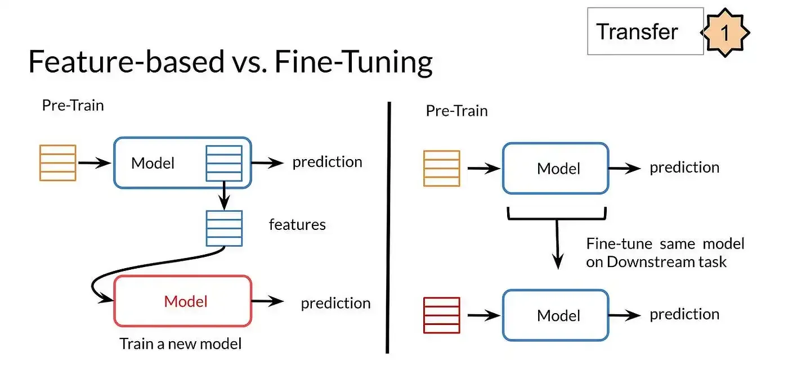

## Table of Contents

## What is fine-tuning in machine learning?

Fine-tuning in machine learning is a process where a pre-trained model is further trained on a new, usually smaller dataset to adapt it for a specific task. Imagine you have a model that's already good at understanding language because it was trained on a huge amount of text. Now, you want this model to be really good at understanding medical texts. You would take this general language model and train it some more, but this time only on medical texts. This way, the model gets better at understanding the specific language used in medicine.

The key idea behind fine-tuning is to leverage the knowledge the model has already learned from a large dataset and then refine it for a more specific use. This approach saves time and resources because starting from scratch to train a model on a smaller, specialized dataset might not be as effective. By fine-tuning, the model can quickly adapt to new tasks without forgetting what it has learned before, a concept known as transfer learning. This makes fine-tuning a powerful technique in many areas of machine learning, from natural language processing to computer vision.

## Why is fine-tuning important in machine learning models?

Fine-tuning is important in machine learning because it helps make a model better at a specific job without starting from scratch. Imagine you have a big model that's good at understanding lots of different texts. If you want it to be really good at understanding legal documents, you can fine-tune it. This means you take the big model and train it a little more, but only on legal documents. This way, the model doesn't forget what it already knows, but it gets better at understanding legal language. It's like taking a smart person and teaching them to be even smarter about one specific thing.

This process saves a lot of time and effort. Training a new model from the beginning on a smaller, specialized dataset can be hard and might not work as well. Fine-tuning uses what the model already knows and just adds a bit more training to make it perfect for the new task. This is called transfer learning, and it's really useful because it makes models more flexible and efficient. Whether it's understanding pictures better or getting better at a specific language task, fine-tuning helps models do their jobs better and faster.

## How does fine-tuning differ from training a model from scratch?

Fine-tuning and training a model from scratch are two different ways to teach a [machine learning](/wiki/machine-learning) model. When you train a model from scratch, you start with a blank slate. You gather a lot of data, set up the model's architecture, and then let it learn everything from the ground up. This can take a long time and needs a lot of data because the model has to learn everything by itself. It's like teaching a baby to understand the world - it starts knowing nothing and learns everything slowly.

On the other hand, fine-tuning starts with a model that's already been trained on a large dataset. This model already knows a lot about the world, but you want it to be even better at a specific task. So, you take this pre-trained model and train it a bit more, but only on data related to your specific task. It's like taking a smart person and teaching them to be even smarter about one thing. This way, the model doesn't forget what it already knows, but it gets better at the new task quickly. Fine-tuning saves time and effort because the model doesn't have to learn everything from the beginning.

## What are the typical steps involved in the fine-tuning process?

Fine-tuning a model starts with choosing a pre-trained model that's good at a general task. This model has already learned a lot from a big dataset. You then get a smaller dataset that's all about the specific task you want the model to be good at. For example, if you want the model to understand medical texts, you'd use a dataset of medical documents. You then set up the model so that most of its layers stay the same, but you allow some parts at the end to change more. This way, the model keeps what it already knows but can learn new things about your specific task.

Next, you train the model on your new dataset, but you use a smaller learning rate. This means the model changes slowly so it doesn't forget what it already knows. You keep training until the model gets really good at your specific task. Sometimes, you might need to try different settings or even use a bit of the original data to help the model remember what it learned before. Once the model is good enough, you stop training and now you have a model that's great at your specific task, like understanding medical texts, without starting from scratch.

## What types of models can be fine-tuned?

Many different types of models can be fine-tuned, but the most common ones are in the areas of natural language processing (NLP) and computer vision. In NLP, models like BERT, RoBERTa, and GPT are often fine-tuned. These models start off understanding a lot about language in general, but you can make them better at specific tasks like answering questions or understanding medical texts by fine-tuning them on the right data. In computer vision, models like ResNet or EfficientNet, which are good at recognizing objects in pictures, can be fine-tuned to be even better at recognizing specific types of objects or working in specific situations.

The process of fine-tuning works because these models have a lot of layers that learn different things. When you fine-tune, you usually let the last few layers change more, while keeping the earlier layers mostly the same. This way, the model keeps what it learned before but gets better at your new task. For example, if you have a model that's good at recognizing animals in pictures, you can fine-tune it to be really good at recognizing different breeds of dogs. This makes the model more useful for specific jobs without having to start all over again.

## What are the common challenges faced during fine-tuning?

One common challenge during fine-tuning is overfitting. This happens when the model becomes too good at understanding the training data but doesn't do well with new data it hasn't seen before. Imagine teaching a student to be really good at a few practice tests, but then they struggle on the real exam because it's different. To avoid this, you might need to use less data or adjust how the model learns, like using a smaller learning rate or adding more examples that are different from the training data.

Another challenge is catastrophic forgetting, where the model forgets what it learned before while trying to learn the new task. It's like trying to learn a new language and forgetting your first language in the process. To help with this, you can mix in some of the old data with the new data during fine-tuning, so the model remembers what it learned before. This way, the model can keep its old knowledge while getting better at the new task.

Choosing the right layers to fine-tune can also be tricky. If you change too many layers, the model might forget too much. If you don't change enough, it might not learn the new task well. It's a bit like deciding how much of a house to renovate. You want to update it enough to meet your needs but not so much that you lose what made it special in the first place. Finding the right balance often involves trying different settings and seeing what works best.

## How do you choose the right dataset for fine-tuning?

Choosing the right dataset for fine-tuning is important because it helps the model learn the specific task you want it to be good at. You need to find a dataset that has a lot of examples related to your task. For example, if you want the model to understand legal texts, you should use a dataset full of legal documents. The dataset should be big enough so the model can learn well, but not so big that it takes too long to train. Also, the data should be clean and well-organized, so the model can learn from it easily.

Another thing to think about is how similar the new dataset is to the one the model was originally trained on. If the new data is too different, the model might have a hard time learning and could even forget what it learned before. So, it's a good idea to choose a dataset that's related to the original one but focused on your specific task. This way, the model can use what it already knows to learn the new task faster and better.

## What are the best practices for fine-tuning a pre-trained model?

When fine-tuning a pre-trained model, it's important to start with a good dataset that's related to your specific task. You want the dataset to be big enough so the model can learn well, but not so big that it takes too long to train. Make sure the data is clean and well-organized, so the model can learn from it easily. Also, think about how similar the new dataset is to the one the model was originally trained on. If the new data is too different, the model might have a hard time learning and could even forget what it learned before. So, it's best to choose a dataset that's related to the original one but focused on your specific task.

Another important thing is to adjust the learning rate carefully. You should use a smaller learning rate than when you trained the model from scratch. This way, the model changes slowly and doesn't forget what it already knows. You can also try different settings, like changing how many layers of the model you let change during fine-tuning. Sometimes, you might need to mix in some of the old data with the new data to help the model remember what it learned before. This way, the model can keep its old knowledge while getting better at the new task. By following these best practices, you can make sure your model learns the new task well without losing what it already knows.

## How can fine-tuning impact the performance of a model on new tasks?

Fine-tuning can make a model much better at new tasks by using what it already knows. When you fine-tune a model, you take a big model that's already learned a lot from a large dataset and train it a bit more on a smaller dataset related to your new task. This way, the model doesn't have to start from scratch and can quickly learn the new task. For example, if you have a model that's good at understanding general language and you want it to be good at understanding medical texts, you can fine-tune it on medical documents. The model will use what it already knows about language to quickly get better at understanding medical terms and concepts.

However, fine-tuning can also have some challenges. One big challenge is that the model might forget what it learned before, a problem called catastrophic forgetting. To avoid this, you can mix in some of the old data with the new data during fine-tuning. Another challenge is overfitting, where the model becomes too good at the training data but not good at new data. To prevent this, you can use a smaller learning rate or add more varied examples to the training data. By carefully choosing the right dataset and adjusting the fine-tuning process, you can make sure the model performs well on the new task without losing its old knowledge.

## What are the ethical considerations when fine-tuning models?

When fine-tuning models, it's important to think about ethical issues. One big concern is bias. If the new dataset you use for fine-tuning has biases, like not including enough examples from certain groups of people, the model might learn these biases and make unfair decisions. For example, if a model is fine-tuned on medical data that mostly comes from one group of people, it might not work well for other groups. This can cause harm and make the model less fair. So, it's important to check the data carefully and make sure it represents different kinds of people.

Another ethical issue is privacy. When you fine-tune a model, you might use data that has personal information. It's important to make sure this data is used in a way that respects people's privacy. You should get permission to use the data and make sure it's kept safe. Also, think about how the fine-tuned model might be used. If it's used in ways that could harm people or invade their privacy, you need to think carefully about whether it's right to use it that way. By considering these ethical issues, you can help make sure that fine-tuning models is done in a responsible and fair way.

## How does transfer learning relate to fine-tuning?

Transfer learning and fine-tuning are closely related ideas in machine learning. Transfer learning is when you take a model that's already been trained on one task and use it to help with a new task. It's like using what you learned in one class to help you in another class. Fine-tuning is a specific way to do transfer learning. When you fine-tune a model, you take a pre-trained model and train it a bit more on a new, smaller dataset that's related to your specific task. This way, the model keeps what it already knows but gets better at the new task.

The key difference is that transfer learning is a broader concept, while fine-tuning is a specific technique within transfer learning. With fine-tuning, you're not just using the pre-trained model as a starting point; you're actually changing the model a bit more to make it better at your new task. This can be really helpful because it saves time and effort compared to training a new model from scratch. By using fine-tuning, you can make a model that's already smart even smarter about one specific thing.

## What advanced techniques can be used to optimize the fine-tuning process?

One advanced technique to optimize fine-tuning is called "layer-wise learning rate decay." This means you use different learning rates for different parts of the model. The parts of the model that were trained first on the big dataset get a smaller learning rate, so they don't change too much. The parts at the end of the model, which are more focused on your specific task, get a bigger learning rate, so they can learn the new task quickly. This helps the model keep what it learned before while getting better at the new task.

Another technique is "gradual unfreezing." When you start fine-tuning, you might only let the last few layers of the model change. After a while, you can start letting more layers change, one at a time. This way, the model can slowly adjust to the new task without forgetting too much. It's like slowly teaching a student new things without overwhelming them. By using these advanced techniques, you can make sure the model learns the new task well without losing its old knowledge.