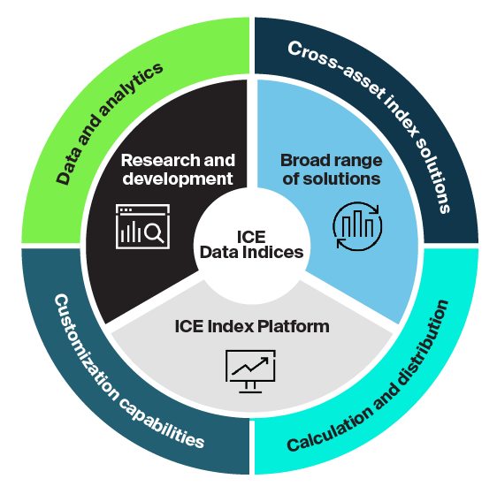

## Table of Contents

## What is Finex?

Finex is a type of financial technology, or fintech, that helps people and businesses manage their money better. It uses computer programs and the internet to make things like paying bills, saving money, and investing easier and faster. Finex can be things like apps on your phone, websites, or special software that banks and other financial companies use.

One example of Finex is a mobile app that lets you pay for things without using cash or a credit card. You just use your phone to make payments. Another example is a website that helps you keep track of your spending and make a budget. Finex can also include tools that help businesses manage their money, like software for keeping track of sales and expenses.

## What is the Intercontinental Exchange (ICE)?

The Intercontinental Exchange, or ICE, is a big company that helps people buy and sell things like stocks, energy, and other stuff. It's like a marketplace where people from all over the world can trade. ICE started in 2000 and has grown a lot since then. It owns the New York Stock Exchange, which is a famous place where people trade stocks.

ICE also does other things to help with trading. It makes sure that trading is fair and safe by setting rules and watching over the market. They use computers and technology to make trading faster and easier. This helps people and businesses all over the world to trade things they need quickly and safely.

## How do Finex and ICE relate to each other?

Finex and the Intercontinental Exchange (ICE) are both involved in the world of finance, but they work in different ways. Finex is all about using technology to help people and businesses manage their money better. This can include things like mobile apps for paying bills or websites for tracking spending. Finex makes everyday financial tasks easier and more convenient for everyone.

On the other hand, ICE is a big company that runs a marketplace where people can buy and sell things like stocks and energy. It owns the New York Stock Exchange and uses technology to make sure trading is fair and safe. While Finex focuses on helping individuals and small businesses with their daily money management, ICE is more about providing a platform for big trading activities that happen all over the world.

Even though Finex and ICE serve different purposes, they both use technology to improve how financial activities are done. Finex helps with personal and small business finance, while ICE helps with large-scale trading. Together, they show how technology is changing the way we handle money, making it easier and more efficient for everyone involved.

## What are the main products and services offered by Finex?

Finex offers many products and services that help people and businesses manage their money better. One of the main products is mobile payment apps. These apps let you pay for things without using cash or a credit card. You just use your phone to make payments, which is easy and fast. Another important service is online budgeting tools. These tools help you keep track of your spending and make a budget. They can show you where your money is going and help you save more.

Finex also provides services for businesses. One example is accounting software that helps businesses keep track of their sales and expenses. This makes it easier for them to manage their money and see how their business is doing. Another service is investment tools that help people invest their money wisely. These tools can give advice on what to invest in and help you make smart choices about your money.

Overall, Finex uses technology to make managing money easier for everyone. Whether it's paying bills, saving money, or investing, Finex has products and services that can help you do it better and faster.

## What are the key functionalities of the Intercontinental Exchange?

The Intercontinental Exchange, or ICE, is a big company that helps people buy and sell things like stocks, energy, and other stuff. It runs the New York Stock Exchange, which is a famous place where people trade stocks. ICE makes sure that trading is fair and safe by setting rules and watching over the market. They use computers and technology to make trading faster and easier. This helps people and businesses all over the world to trade things they need quickly and safely.

ICE also offers other services to help with trading. They provide data and information that traders need to make good decisions. This includes things like price information and market trends. ICE also helps with clearing and settling trades, which means they make sure that when someone buys something, they get it, and when someone sells something, they get paid. All of these services help make the trading process smooth and reliable for everyone involved.

## How does Finex facilitate trading and investment?

Finex helps people with trading and investment by using technology to make it easier and faster. It offers tools like investment apps that let you buy and sell stocks right from your phone. These apps often give you advice on what to invest in and help you keep track of how your investments are doing. This makes it simpler for people who might not know a lot about investing to start and manage their investments.

Finex also provides online platforms where you can learn about different investment options. These platforms might have tutorials and guides that explain things like stocks, bonds, and mutual funds in a way that's easy to understand. By using these tools, people can make smarter choices about where to put their money. Finex makes the whole process of trading and investing more accessible and less scary for everyone.

## What role does ICE play in global financial markets?

The Intercontinental Exchange, or ICE, is a big company that helps people all over the world buy and sell things like stocks and energy. It owns the New York Stock Exchange, which is a famous place where people trade stocks. ICE makes sure that trading is fair and safe by setting rules and watching over the market. They use computers and technology to make trading faster and easier. This helps people and businesses from different countries to trade things they need quickly and safely.

ICE also offers other services that help with trading. They give traders important information like prices and market trends, which helps them make good decisions. ICE also helps with clearing and settling trades, which means they make sure that when someone buys something, they get it, and when someone sells something, they get paid. All of these services help make the trading process smooth and reliable for everyone involved. By doing all these things, ICE plays a big role in keeping global financial markets running smoothly and fairly.

## What are the technological platforms used by Finex and ICE?

Finex uses different technological platforms to help people and businesses manage their money better. One main platform is mobile payment apps, which let you pay for things using your phone instead of cash or a credit card. Another platform is online budgeting tools, which help you track your spending and make a budget. Finex also uses accounting software for businesses to keep track of sales and expenses, and investment apps that give advice on where to invest your money. All these platforms make everyday financial tasks easier and more convenient.

ICE uses technology to help people buy and sell things like stocks and energy. They run the New York Stock Exchange, where people trade stocks, and they use computers to make sure trading is fair and safe. ICE also provides data and information, like prices and market trends, which helps traders make good decisions. Another important platform is their clearing and settlement system, which makes sure that when someone buys something, they get it, and when someone sells something, they get paid. All of these technological platforms help make global trading smooth and reliable.

## How do Finex and ICE ensure compliance with regulatory standards?

Finex makes sure it follows the rules by using special computer programs and checks. These programs watch over the money moving in and out of the apps and tools they offer. If something looks wrong, like someone trying to do something they shouldn't, the program can stop it and tell the people in charge. Finex also works with banks and other big money companies that have to follow strict rules. By doing this, Finex can make sure it's doing everything right and keeping people's money safe.

ICE also has to follow a lot of rules because it runs big markets like the New York Stock Exchange. They use technology to keep an eye on all the trading that happens. If someone tries to cheat or do something against the rules, ICE's systems can catch it and stop it. ICE also has people who check everything to make sure it's all fair and safe. They work with government groups that make the rules to make sure they're doing everything right and helping keep the big money markets running smoothly.

## What are the recent developments or innovations introduced by Finex and ICE?

Finex has been working on new ways to make managing money easier. They recently added features to their mobile payment apps that let you send money to friends and family even faster. They also made their budgeting tools smarter, so they can now give you tips on how to save money based on your spending habits. Finex is also trying to use [artificial intelligence](/wiki/ai-artificial-intelligence) to help people make better investment choices. These new tools can look at a lot of information and suggest the best places to put your money.

ICE has been busy too, making their trading platforms better. They recently added new technology that makes trading even faster and more reliable. This helps people from all over the world trade things like stocks and energy without waiting. ICE also started using more data to help traders make good decisions. They give traders more information about what's happening in the market, so they can buy and sell at the best times. These changes help make sure that trading on ICE's markets is fair and safe for everyone.

## How do Finex and ICE compare to their competitors in terms of market position and offerings?

Finex stands out in the fintech industry because it focuses on making everyday money tasks easy for people and small businesses. They have mobile payment apps that let you pay without cash or cards, and online tools to help you budget and save. Compared to big fintech companies like PayPal or Square, Finex tries to be more user-friendly and offer more help with things like investing. They use new technology like AI to give advice on where to put your money. This makes Finex different because it's not just about paying for things, but also about helping you make smart money choices.

ICE is a big player in the global trading world, and it's known for running the New York Stock Exchange. They use technology to make sure trading is fast, fair, and safe. When you compare ICE to other big trading platforms like the NASDAQ or the London Stock Exchange, ICE has a strong position because it offers a lot of different things to trade, from stocks to energy. They also give traders a lot of information to help them make good decisions. This makes ICE different because it's not just a place to trade, but also a place where you can get the data and tools you need to trade well.

## What future trends might impact the operations and strategies of Finex and ICE?

Finex might see a lot of changes in the future because of new technology and the way people use money. One big trend is more people using their phones for everything, including paying for things and managing their money. Finex will need to keep making their apps better and easier to use. Another trend is using artificial intelligence, or AI, to help people make smarter choices about their money. Finex is already doing this, but they will need to keep improving their AI tools to stay ahead. Also, as more people care about things like the environment, Finex might start offering ways to invest in green companies or projects.

ICE will also face new trends that could change how they do things. One big trend is using more data to help traders make better decisions. ICE will need to keep finding new ways to collect and share this data with their users. Another trend is making trading even faster and more reliable with new technology. This means ICE will need to keep updating their systems to stay competitive. Also, as more countries want to trade with each other, ICE might need to offer more ways for people from different parts of the world to trade with each other easily and safely.

## References & Further Reading

[1]: Lopez de Prado, M. (2018). ["Advances in Financial Machine Learning."](https://www.amazon.com/Advances-Financial-Machine-Learning-Marcos/dp/1119482089) Wiley.

[2]: Chan, E. P. (2008). ["Quantitative Trading: How to Build Your Own Algorithmic Trading Business."](https://github.com/ftvision/quant_trading_echan_book) Wiley.

[3]: Aronson, D. R. (2006). ["Evidence-Based Technical Analysis: Applying the Scientific Method and Statistical Inference to Trading Signals."](https://www.amazon.com/Evidence-Based-Technical-Analysis-Scientific-Statistical/dp/0470008741) Wiley.

[4]: Jansen, S. (2020). ["Machine Learning for Algorithmic Trading."](https://github.com/stefan-jansen/machine-learning-for-trading) Packt Publishing.

[5]: Bergstra, J., Bardenet, R., Bengio, Y., & Kégl, B. (2011). ["Algorithms for Hyper-Parameter Optimization."](https://dl.acm.org/doi/10.5555/2986459.2986743) Advances in Neural Information Processing Systems 24.