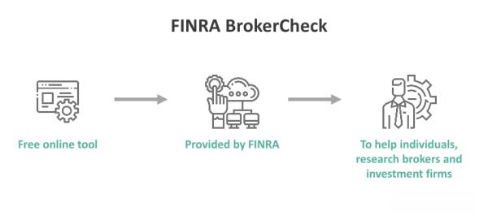

## Table of Contents

## What is FINRA BrokerCheck?

FINRA BrokerCheck is a tool that helps people check the background of people who sell investments, like stocks and bonds. It's run by FINRA, which is a group that makes sure these investment sellers follow the rules. You can use BrokerCheck to see if someone has any problems in their past, like being in trouble with the law or getting complaints from customers.

When you use BrokerCheck, you can find out about a person's work history, what licenses they have, and if they've been in any legal trouble. This can help you decide if you want to work with them or not. It's a good idea to use BrokerCheck before you start working with someone who sells investments, so you can feel more sure about your choice.

## How can I access FINRA BrokerCheck?

You can access FINRA BrokerCheck easily by going to their website. Just type "FINRA BrokerCheck" into your internet search bar, and you'll find the official site. Once you're there, you can search for a broker or a firm by typing in their name. The website is user-friendly, so you shouldn't have any trouble finding what you need.

After you enter the name, the website will show you a report. This report will tell you about the person's or firm's background, including their work history, any licenses they have, and if they've had any problems in the past. You can read through this information to help you decide if you want to work with them. It's a good idea to take your time and look at everything carefully.

## What kind of information does FINRA BrokerCheck provide about brokers?

FINRA BrokerCheck gives you a lot of information about brokers. You can find out about their work history, which tells you where they have worked before and for how long. It also shows you what kinds of licenses they have, which means you can see if they are allowed to sell certain types of investments. This helps you know if they are qualified to help you with your money.

The report from BrokerCheck also tells you if the broker has been in any trouble. This could be things like being in trouble with the law or getting complaints from customers. Knowing about any past problems can help you decide if you trust the broker enough to work with them. It's a good idea to look at all this information carefully before you make up your mind.

## Why is it important to use FINRA BrokerCheck before investing?

Using FINRA BrokerCheck before investing is important because it helps you learn about the person who will be handling your money. When you invest, you want to make sure the broker is trustworthy and has a good history. BrokerCheck shows you if the broker has ever been in trouble or if customers have complained about them. This information can help you decide if you feel safe working with them.

It's also good to know about a broker's work history and what licenses they have. This tells you if they are experienced and allowed to sell the types of investments you are interested in. By checking all this before you invest, you can feel more confident that you are making a smart choice. Taking the time to use BrokerCheck can protect your money and help you avoid working with someone who might not be the best fit for you.

## How often is the information on FINRA BrokerCheck updated?

The information on FINRA BrokerCheck is updated regularly to make sure it stays accurate. FINRA gets new information from different places like the brokers themselves, firms, and other groups that watch over the investment world. They usually update the information every few months, but if something important happens, like a broker getting in trouble, they might update it sooner.

It's a good idea to check BrokerCheck often if you are thinking about working with a broker or if you already are. This way, you can see if anything new has come up that might change your mind about them. Keeping up with the updates helps you stay informed and make the best choices for your money.

## Can I see a broker's employment history on FINRA BrokerCheck?

Yes, you can see a broker's employment history on FINRA BrokerCheck. When you look up a broker on the website, the report will show you where they have worked before and for how long. This helps you understand their experience and see if they have stayed in one place for a long time or moved around a lot.

Knowing a broker's employment history is important because it can tell you if they are experienced and stable in their job. If a broker has worked at many different places in a short time, it might make you wonder why they keep changing jobs. On the other hand, if they have been at the same firm for a long time, it might show that they are reliable and good at what they do.

## What do the different types of disclosures on FINRA BrokerCheck mean?

When you look at a broker's report on FINRA BrokerCheck, you might see different types of disclosures. These disclosures are like notes that tell you if the broker has ever been in trouble. There are three main types of disclosures: regulatory, customer, and criminal. Regulatory disclosures mean the broker might have broken rules set by groups like FINRA or the SEC. Customer disclosures happen when someone who worked with the broker made a complaint. Criminal disclosures are about if the broker was ever charged with a crime.

Each type of disclosure gives you important information about the broker's past. If you see a regulatory disclosure, it means the broker might have done something wrong according to the rules of their job. A customer disclosure shows that someone who used the broker's services was unhappy and made a formal complaint. And a criminal disclosure tells you if the broker has been in legal trouble, which could be very serious. Looking at these disclosures helps you understand if you want to trust the broker with your money.

## How can I interpret the data provided by FINRA BrokerCheck?

When you use FINRA BrokerCheck, you'll see a lot of information about a broker. This includes their work history, which shows where they've worked and for how long. It's good to look at this to see if they have a lot of experience and if they've stayed at their jobs for a while or moved around a lot. You'll also see what licenses they have, which tells you what types of investments they can sell. This helps you know if they are allowed to help you with the kind of investing you want to do.

The report also has disclosures, which are important notes about the broker's past. There are three kinds: regulatory, customer, and criminal. Regulatory disclosures mean the broker might have broken rules set by groups like FINRA or the SEC. Customer disclosures happen when someone who worked with the broker made a complaint. Criminal disclosures are about if the broker was ever charged with a crime. These disclosures help you understand if the broker has been in trouble before, which can help you decide if you trust them with your money.

## Are there any limitations to the information available on FINRA BrokerCheck?

While FINRA BrokerCheck is a very helpful tool, it does have some limits on the information it gives you. It only shows you information that is reported to FINRA, so if something hasn't been reported, you won't see it. Also, the information might not be completely up-to-date because it can take some time for new information to be added. This means you might miss out on the very latest news about a broker.

Another thing to keep in mind is that BrokerCheck doesn't tell you everything about a broker's personal life or their skills at investing. It focuses more on their work history, licenses, and any trouble they've been in. So, while it's a good place to start, you might need to do more research or talk to the broker directly to get a full picture of who they are and how good they are at their job.

## How does FINRA BrokerCheck help in maintaining transparency in the financial industry?

FINRA BrokerCheck helps keep things clear and open in the financial world by letting people check the background of brokers. When you use BrokerCheck, you can see where a broker has worked, what licenses they have, and if they have ever been in trouble. This helps people feel more sure about who they are working with because they can see if the broker has a good history or if there have been any problems.

By giving everyone access to this information, FINRA makes it easier for people to make smart choices about their money. If a broker has been in trouble before, people can see that and decide if they still want to work with them. This openness helps keep brokers honest and makes the whole financial industry more trustworthy.

## What steps should I take if I find concerning information on a broker's FINRA BrokerCheck report?

If you find something worrying on a broker's FINRA BrokerCheck report, the first thing you should do is take a closer look at the details. Read the whole report carefully to understand what the problem is. For example, if it's a regulatory disclosure, see what rule the broker broke. If it's a customer disclosure, read the complaint to see why the customer was unhappy. If it's a criminal disclosure, check what the crime was and what happened. This will help you decide how serious the issue is.

After you understand the details, think about whether you still want to work with this broker. If the problem seems very serious or if there are a lot of issues, it might be a good idea to find a different broker. You can also talk to the broker about what you found. They might be able to explain what happened and help you feel better about working with them. But if you still feel unsure, it's okay to look for someone else to help you with your money.

## How can financial advisors use FINRA BrokerCheck to enhance their professional reputation?

Financial advisors can use FINRA BrokerCheck to show their clients that they are trustworthy and have a good history. By having a clean record on BrokerCheck, advisors can prove that they have not been in trouble with the law or had many customer complaints. This can make clients feel more comfortable working with them because they can see that the advisor is reliable and follows the rules. It's like having a good report card that clients can check anytime.

Also, financial advisors can use BrokerCheck to keep an eye on their own records and make sure everything is up-to-date and correct. If there are any mistakes or old issues, they can work to fix them or explain them to clients. This shows that they care about being honest and open, which can help build a strong, trusting relationship with their clients. By using BrokerCheck in this way, advisors can show that they are serious about maintaining a good professional reputation.

## References & Further Reading

[1]: ["FINRA BrokerCheck"](https://brokercheck.finra.org/) - Financial Industry Regulatory Authority (FINRA) official website.

[2]: ["Algorithmic Trading and DMA: An Introduction to Direct Access Trading Strategies"](https://www.amazon.com/Algorithmic-Trading-DMA-introduction-strategies/dp/0956399207) by Barry Johnson

[3]: ["Quantitative Finance: Algorithmic Trading"](https://www.udemy.com/course/quantitative-finance-algorithmic-trading-in-python/) - Article in Encyclopedia of Quantitative Finance by Rama Cont and Peter Tankov

[4]: FINRA. (2016). ["Regulatory Notice 15-09: Equity Trading Initiatives: Supervision and Control Practices for Algorithmic Trading Strategies"](https://www.finra.org/rules-guidance/notices/15-09).

[5]: ["Securities and Exchange Commission (SEC): The Investor's Advocate"](https://www.sec.gov/about/divisions-offices/office-investor-advocate) - Official website of the U.S. Securities and Exchange Commission.
