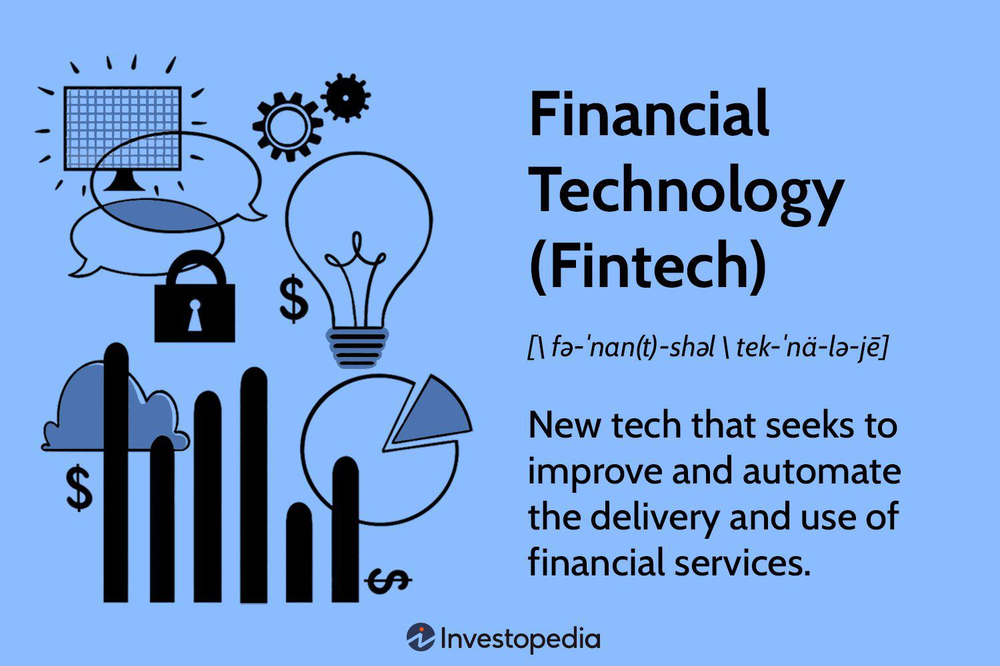

In today's rapidly evolving financial landscape, the intersection of real estate and fintech through innovative algorithmic trading solutions marks a new frontier. Traditionally, the real estate industry has been slow to adapt to technological changes; however, the integration of fintech is transforming this sector. Processes are becoming streamlined and more accessible, with technology reducing inefficiencies and opening new opportunities for investors and consumers alike.

Central to this transformation is algorithmic trading, a strategy that harnesses the power of artificial intelligence (AI) and machine learning (ML) to conduct financial transactions. Algorithmic trading uses sophisticated algorithms that can process large volumes of data at high speeds, making quick decisions based on market trends and patterns. This technology-driven approach enhances the efficiency and precision of transactions, particularly advantageous in the volatile real estate market.



Algorithmic trading is reshaping the way financial transactions are conducted in real estate by automating and optimizing decision-making processes. This technology helps assess property values, predict market fluctuations, and identify investment opportunities, thus transforming traditional methods of buying, selling, and investing in real estate. By leveraging big data and predictive analytics, these algorithms deliver insights that are pivotal for informed decision-making, thus fostering transparency and trust in real estate transactions.

This article explores how the integration of fintech innovations, particularly algorithmic trading, is reshaping the real estate industry. It examines the benefits, such as improved market efficiency and reduced human error, alongside challenges like data privacy concerns and the risk of over-reliance on AI models. Additionally, the article looks at the future potential of these technologies, emphasizing the need for regulatory oversight and ethical practices to ensure positive and sustainable impacts on the real estate market.

## Table of Contents

## The Rise of Real Estate Fintech Innovations

Fintech innovations have significantly impacted the real estate sector by simplifying access to investments and transactions. This transformation is primarily driven by technological advancements that facilitate efficient processes, cost reduction, and enhanced opportunities for investors and consumers.

Algorithmic trading is a pivotal fintech innovation reshaping real estate investment strategies. By employing big data analytics and artificial intelligence (AI), algorithmic trading systems can process vast amounts of information to make rapid, informed decisions. This approach is particularly beneficial for real estate markets characterized by varying degrees of volatility and complexity.

The key advantage of [algorithmic trading](/wiki/algorithmic-trading) in real estate lies in its capacity to analyze historical and real-time data, identifying patterns and trends that might not be apparent through traditional analysis methods. This capability allows investors to optimize their trading strategies, ensuring they capitalize on favorable market conditions while mitigating risks associated with timing and pricing discrepancies.

Moreover, the integration of AI-driven tools enhances the accuracy and speed of investment decisions. By continuously learning from market data, [machine learning](/wiki/machine-learning) algorithms can adapt to new developments, improving decision-making quality over time. This dynamic adaptability ensures that investors can respond promptly to market shifts, maintaining a competitive edge.

In summary, the rise of fintech innovations, particularly algorithmic trading, has ushered in a new era for real estate investment. It empowers participants to navigate the market with greater agility and precision, fostering a more inclusive and efficient investment environment.

## Algorithmic Trading: A Game Changer in Real Estate

Algorithmic trading, an innovation rooted in the application of [artificial intelligence](/wiki/ai-artificial-intelligence) and machine learning, is transforming how transactions are conducted in the real estate market. This type of trading is particularly advantageous in markets characterized by high [volatility](/wiki/volatility-trading-strategies), such as real estate, where rapid and dynamic changes can significantly impact investment outcomes. 

At its core, algorithmic trading involves the use of complex algorithms that can process large volumes of data and derive actionable insights with remarkable speed and precision. These systems are capable of analyzing historical data to identify patterns and trends that inform trading decisions. The ability to recognize these patterns allows for the automatic execution of trades, potentially optimizing timing and pricing beyond human capability. For instance, an algorithm might be designed to buy properties when specific conditions in the data are met, such as a drop in price below a certain historical average or an upward trajectory in neighborhood development metrics.

The deployment of algorithmic trading within real estate enhances market efficiency in several ways. It significantly reduces human error, which often arises from emotional biases or delayed reaction times. Furthermore, by facilitating quicker transactions and enabling more entities to participate in the market, algorithmic trading can increase market [liquidity](/wiki/liquidity-risk-premium). Enhanced liquidity not only makes it easier to buy and sell properties but also stabilizes prices by narrowing the bid-ask spread.

Moreover, the transparent nature of algorithmic trading contributes to a more efficient trading environment. Automation ensures that trades are executed based on pre-defined parameters and data-driven insights, which can be audited and verified. This transparency builds trust among market participants, as actions within the marketplace become more predictable and consistent with the data signals.

In conclusion, algorithmic trading stands as a revolutionary force in the real estate industry, offering an array of benefits from reduced human error to increased liquidity. By employing AI and machine learning, this trading strategy is poised to make real estate markets more transparent and efficient, fundamentally altering the landscape of real estate investment.

## Real-World Applications and Success Stories

Several fintech companies have successfully integrated algorithmic trading within the real estate industry, driving significant improvements in performance and accessibility. Opendoor Technologies and Zillow Group exemplify the transformative impact of technology on property transactions. Opendoor employs advanced algorithms to provide instant offers to sellers, enabling a seamless transaction process. By analyzing extensive datasets, Opendoor's algorithms determine fair market prices swiftly, enhancing the attractiveness and efficiency of real estate transactions (Opendoor, 2023).

Similarly, Zillow Group has revolutionized property pricing through its dynamic pricing models, which leverage machine learning to forecast market trends and property values accurately. These models enable Zillow to provide instant pricing updates, ensuring that buyers and sellers have access to real-time information, thus facilitating informed decision-making (Zillow Group, 2023).

Additionally, Crowdstreet showcases the application of algorithmic trading in crowdfunding investments for commercial real estate. Utilizing sophisticated algorithmic tools, Crowdstreet enables investors to diversify their portfolios by accessing a wide array of real estate assets. The platform's algorithms analyze market data to identify potential investment opportunities, allowing users to make data-driven investment decisions while mitigating risk through diversification (Crowdstreet, 2023).

The success of these companies highlights the significant potential of algorithmic trading to revolutionize the real estate market by enhancing transaction efficiency, accuracy, and investment opportunities. Through innovative technological solutions, these companies have made the real estate market more accessible and transparent, demonstrating the profound impact of fintech in this traditionally slow-to-evolve industry.

## Challenges and Risks of Algorithmic Trading

Algorithmic trading, while revolutionizing the real estate sector, also introduces several challenges that warrant careful consideration. One primary concern is the risk of over-reliance on AI models. These models, though highly sophisticated, can struggle to predict market anomalies or black swan events that deviate from historical patterns. Such anomalies can result in significant financial losses if not anticipated by the algorithms designed predominantly to interpret historical data trends and patterns. 

Data privacy and cybersecurity also present substantial challenges in the context of algorithmic trading. The sheer [volume](/wiki/volume-trading-strategy) of data processed requires robust protection measures to safeguard sensitive information from breaches. The implementation of effective cybersecurity protocols is crucial to protect against data theft and unauthorized access, which can compromise both individual privacy and the integrity of the financial systems.

Moreover, ethical concerns surrounding market manipulation are increasingly pertinent. The speed and efficiency of algorithmic trading can inadvertently facilitate practices that disrupt market fairness. Algorithms may amplify rapid trading strategies that exploit market movements, potentially leading to artificial price fluctuations. As such, there is a pressing need for stringent regulatory compliance to ensure that trading practices remain fair and open. Regulatory bodies worldwide are tasked with updating and enforcing rules that address these emerging technological landscapes, balancing innovation with ethical responsibility.

The intersection of algorithmic trading and regulatory frameworks must evolve to accommodate these advancements, safeguarding market integrity while fostering innovation. Without adequate regulatory oversight, there's a tangible risk of exacerbating issues such as unequal market access and unfair trading advantages. Therefore, continuous monitoring and adaptation of regulatory measures are essential in mitigating these risks and ensuring that algorithmic trading sustainably benefits the real estate market.

## Future Prospects of Real Estate Fintech and Algo Trading

The continued evolution of artificial intelligence (AI) and machine learning (ML) is poised to drive significant advancements in algorithmic trading, increasingly integrating it into the real estate industry. As these technologies mature, they offer the potential to revolutionize how investments are managed, making them more personalized and responsive to individual investment goals and risk profiles.

Algorithmic trading in real estate can leverage AI to analyze vast datasets, providing insights into optimal investment strategies. This approach not only enhances the precision of trading decisions but also enables the customization of investment portfolios through sophisticated risk assessment models. By tailoring strategies to meet specific investor needs, fintech solutions can significantly enhance portfolio performance while managing risk effectively.

Moreover, the emergence of quantum computing holds promise for further enhancing algorithmic trading capabilities. Quantum computing can process complex computations far faster than classical computers, potentially reducing the time required for data analysis and decision-making. This technology can facilitate real-time market analysis and enable the execution of more sophisticated trading strategies that were previously computationally prohibitive.

Consider the application of quantum algorithms, such as Grover's algorithm, which can search unsorted databases with remarkable efficiency. In the context of real estate trading, such advancements could enable quicker pattern recognition in market trends, improving the accuracy of predictive models. The integration of quantum computing could thus lead to more robust and adaptive trading systems, underpinning a new era of financial innovation.

Here is a simple Python example that illustrates the basic idea of using AI for enhancing investment strategies:

```python
import numpy as np
from sklearn.linear_model import LinearRegression

# Simulate some data
np.random.seed(0)
X = np.random.rand(100, 1)
y = 3 * X.squeeze() + 2 + np.random.randn(100)

# Train a linear regression model
model = LinearRegression()
model.fit(X, y)

# Predict future real estate market prices
future_trend = np.array([[0.5], [0.6], [0.7]])
predicted_prices = model.predict(future_trend)

predicted_prices
```

This code snippet demonstrates a fundamental machine learning model that can be expanded with more complex AI systems to analyze large datasets, which is crucial for understanding and predicting market behavior in real estate.

As the landscape of fintech continues to evolve, regulatory frameworks and ethical considerations will play crucial roles in ensuring these technologies are leveraged responsibly. With appropriate guidelines, the integration of advanced technologies like AI, ML, and quantum computing could lead to unprecedented efficiency and transparency in real estate algorithmic trading, making it an indispensable component of the industry.

## Conclusion

The integration of fintech innovations, particularly algorithmic trading, is significantly reshaping the real estate industry. This technological advancement contributes to making real estate transactions more efficient, transparent, and accessible to a broader audience. By leveraging artificial intelligence (AI) and machine learning (ML), algorithmic trading enhances the ability to process large data sets rapidly and make informed decisions, thus streamlining traditionally cumbersome processes.

Despite these advancements, challenges persist. Over-reliance on AI models poses risks, as unforeseen market anomalies can undermine their predictive accuracy. Additionally, data privacy and cybersecurity are paramount concerns, necessitating robust protection measures to safeguard sensitive information. Nonetheless, the potential benefits—such as reduced operational costs, increased market access, and improved trading efficiency—highlight the critical importance of integrating these technologies into real estate practices.

Regulatory oversight will be essential in steering the future development of fintech in real estate. Comprehensive regulations will help mitigate risks associated with market manipulation and ensure that algorithmic trading practices remain ethical and transparent. Ethical considerations must also address the socio-economic implications of these technologies, promoting equitable access and fairness in real estate transactions. 

In summary, as fintech continues to revolutionize the real estate sector, embracing regulatory frameworks and ethical guidelines will be key to maximizing the positive impact of these technologies, ensuring they contribute to a more equitable and efficient market landscape.

## References & Further Reading

[1]: Bergstra, J., Bardenet, R., Bengio, Y., & Kégl, B. (2011). ["Algorithms for Hyper-Parameter Optimization."](https://dl.acm.org/doi/10.5555/2986459.2986743) Advances in Neural Information Processing Systems 24.

[2]: ["Advances in Financial Machine Learning"](https://www.amazon.com/Advances-Financial-Machine-Learning-Marcos/dp/1119482089) by Marcos Lopez de Prado

[3]: ["Evidence-Based Technical Analysis: Applying the Scientific Method and Statistical Inference to Trading Signals"](https://www.amazon.com/Evidence-Based-Technical-Analysis-Scientific-Statistical/dp/0470008741) by David Aronson

[4]: ["Machine Learning for Algorithmic Trading"](https://github.com/PacktPublishing/Machine-Learning-for-Algorithmic-Trading-Second-Edition) by Stefan Jansen

[5]: ["Quantitative Trading: How to Build Your Own Algorithmic Trading Business"](https://books.google.com/books/about/Quantitative_Trading.html?id=j70yEAAAQBAJ) by Ernest P. Chan