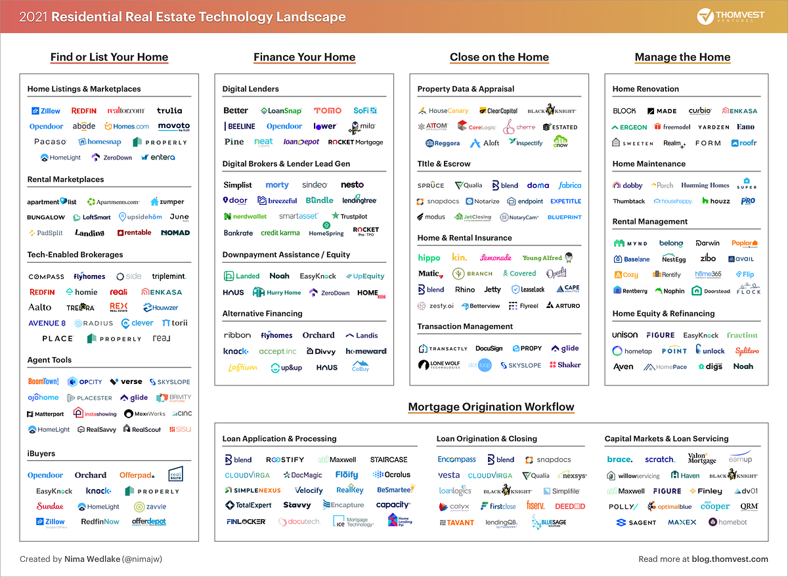

## Table of Contents

## What is fintech and how does it relate to real estate?

Fintech, short for financial technology, is the use of technology to make financial services easier and better. It includes things like online banking, mobile payment apps, and tools that help people invest or manage their money. Fintech makes it simpler and faster for people to do things with their money without going to a bank or meeting someone in person.

In real estate, fintech is changing how people buy, sell, and manage properties. For example, there are apps and websites that let you look at houses and even buy them without leaving your home. Also, fintech companies are creating tools that help real estate agents and property managers do their jobs better. They use technology to make things like renting, getting a mortgage, or keeping track of property easier and quicker. This means that buying a house or managing properties can be less stressful and more convenient for everyone involved.

## Can you name some leading fintech companies in the real estate sector?

Some leading fintech companies in the real estate sector are Zillow, Redfin, and Opendoor. Zillow is well-known for its website and app that let you look at homes for sale or rent. They also have tools that help you figure out how much a home might be worth or how much you can afford to spend. Redfin is another big name. They not only let you search for homes but also connect you with real estate agents who work for them, which can save you money on commissions. Opendoor is different because they buy homes directly from sellers and then sell those homes to other buyers, making the process quicker and simpler.

These companies are changing how people buy and sell homes. They use technology to make things easier and faster. For example, with Zillow, you can see pictures and details of homes without leaving your house. Redfin's agents use technology to help you find the right home and handle the buying process. Opendoor's model means you can sell your home quickly without the usual hassle of showing it to lots of people. All these fintech companies are making real estate more convenient and less stressful for everyone involved.

## How do fintech companies facilitate real estate transactions?

Fintech companies make buying and selling homes easier by using technology. They have websites and apps where you can look at homes, see pictures, and get all the details without leaving your house. For example, Zillow lets you search for homes and even gives you an idea of how much a home might be worth. Redfin connects you with their agents who use technology to help you find the right home and handle the buying process. This means you can do a lot of the work from your computer or phone, which saves time and makes things less stressful.

Some fintech companies, like Opendoor, buy homes directly from sellers. This makes selling a home quicker and simpler because you don't have to show it to lots of people. Once Opendoor buys your home, they fix it up and sell it to someone else. This can be a faster way to sell your home without the usual hassle. Overall, fintech companies use technology to make real estate transactions easier, faster, and more convenient for everyone involved.

## What are the benefits of using fintech solutions in real estate?

Using fintech solutions in real estate makes buying and selling homes much easier. You can use apps and websites to look at homes, see pictures, and get all the details without leaving your house. This saves you a lot of time and effort. For example, with Zillow, you can search for homes and even get an idea of how much a home might be worth. This means you can do a lot of the work from your computer or phone, which makes the whole process less stressful and more convenient.

Fintech companies also help make transactions quicker and simpler. Some companies, like Opendoor, buy homes directly from sellers. This means you can sell your home fast without showing it to lots of people. Once they buy your home, they fix it up and sell it to someone else. This can be a faster way to sell your home without the usual hassle. Overall, fintech solutions use technology to make real estate transactions easier, faster, and more convenient for everyone involved.

## How has fintech impacted traditional real estate business models?

Fintech has changed the way traditional real estate businesses work. Before fintech, buying or selling a home usually meant meeting with agents, going to see homes, and dealing with a lot of paperwork. Now, with fintech, you can do a lot of this from your computer or phone. Companies like Zillow and Redfin let you look at homes online and even connect with agents who can help you buy or sell without all the usual hassle. This means traditional real estate agents need to use technology to stay competitive.

Another big change is how fintech companies like Opendoor are buying homes directly from sellers. This is different from the traditional way where you would list your home and wait for a buyer. With Opendoor, you can sell your home quickly and easily without showing it to lots of people. This is making traditional real estate businesses rethink their models. They need to find new ways to make the process faster and easier, or they might lose customers to fintech companies that offer these services.

## What role does blockchain play in fintech real estate solutions?

Blockchain is a special kind of technology that fintech companies use to make real estate transactions safer and easier. It's like a digital notebook that keeps a record of everything that happens in a way that can't be changed or cheated. In real estate, blockchain helps keep track of who owns a property and makes sure that when someone buys or sells a home, everything is done the right way. This means less chance of mistakes or fraud, which is a big deal in buying and selling homes.

Another way blockchain helps is by making the whole process faster and cheaper. Usually, buying a home involves a lot of paperwork and waiting for different people to check everything. With blockchain, you can do a lot of this work online, and it gets done quicker. This saves time and money, which is good for everyone involved. So, blockchain is a big part of how fintech is changing the real estate world, making it easier and safer for people to buy and sell homes.

## How are fintech companies using AI and machine learning in real estate?

Fintech companies are using AI and machine learning to make buying and selling homes easier. They use these technologies to look at a lot of data and find patterns that help them guess how much a home might be worth. For example, Zillow uses AI to come up with a "Zestimate," which is their guess on a home's value. This helps people get a quick idea of what a home might cost without having to do a lot of research themselves. AI also helps fintech companies understand what people are looking for in a home, so they can show them the right properties.

Another way AI and machine learning help is by making the whole process smoother. For example, some fintech companies use AI to help with the paperwork and legal stuff that comes with buying a home. This makes things faster and less confusing. AI can also help predict when someone might want to buy or sell a home, so fintech companies can reach out to them at the right time. Overall, AI and machine learning are making real estate easier and more personalized for everyone involved.

## What are the challenges and risks associated with fintech in real estate?

Using fintech in real estate can be tricky because it's new and involves a lot of technology. One big challenge is making sure that the technology works well and is safe. Since fintech companies handle a lot of personal and financial information, there's a risk of data breaches or fraud. People need to trust that their information is safe when they use these apps and websites. Also, not everyone is comfortable using technology for something as important as buying or selling a home. Some people might prefer the old way of doing things, like meeting with a real estate agent in person.

Another challenge is that fintech companies need to follow a lot of rules and laws. Real estate is a complicated business with many regulations, and fintech companies have to make sure they are doing everything correctly. If they don't, they could get in trouble and lose people's trust. There's also the risk that fintech companies might not be around for a long time. Some of these companies are new and might not make it if they don't have enough customers or if they run out of money. This could be a problem for people who are in the middle of buying or selling a home and relying on these companies.

## How do fintech platforms enhance real estate investment opportunities?

Fintech platforms make it easier for people to invest in real estate by using technology to find and manage investment opportunities. These platforms can show you different properties and help you understand which ones might be good investments. They use data and tools to guess how much a property might be worth and how much money it could make. This means you can make smarter choices about where to put your money without having to do a lot of research yourself. Some fintech platforms even let you invest in real estate with just a little bit of money, so more people can get started with investing.

Another way fintech platforms help is by making the whole process of buying and managing real estate investments easier and faster. They can handle a lot of the paperwork and legal stuff online, which saves time and money. This is important because buying and managing properties can be complicated and take a long time. With fintech, you can keep track of your investments and see how they're doing right from your computer or phone. This makes it easier to manage your money and make changes if you need to. Overall, fintech platforms are opening up new ways for people to invest in real estate and making it simpler to do so.

## What regulatory considerations must fintech companies in real estate be aware of?

Fintech companies in real estate need to follow a lot of rules and laws. These rules are there to make sure that buying and selling homes is done fairly and safely. For example, they have to follow laws about how they handle people's personal information to keep it safe from hackers. They also need to make sure they are not breaking any rules about how they advertise properties or how they handle money. If they don't follow these rules, they could get in trouble with the government and lose people's trust.

Another important thing fintech companies need to think about is working with different states and countries. Real estate laws can be different depending on where you are, so fintech companies have to make sure they know and follow all the right rules for each place they work in. This can be hard because the rules can change, and they need to keep up with them. If they don't, they might not be able to do business in certain places, which could hurt their company.

## How are fintech innovations changing real estate financing and mortgage processes?

Fintech innovations are making it easier and faster to get a mortgage or finance a home. Before, you had to go to a bank and fill out a lot of paperwork. Now, fintech companies have apps and websites where you can apply for a mortgage online. They use technology to check your information quickly and give you an answer faster than a bank might. Some fintech companies even use AI to look at your data and guess if you're a good person to lend money to. This means you can find out if you can get a mortgage without waiting a long time.

Another way fintech is changing things is by making the whole process simpler. For example, some fintech companies let you see different mortgage options and compare them easily. They also help you understand all the terms and conditions so you know what you're getting into. This can save you time and help you make a better choice about which mortgage is right for you. Overall, fintech is making it easier for people to get the money they need to buy a home, and it's making the whole process less stressful and more convenient.

## What future trends can we expect in the intersection of fintech and real estate?

In the future, we can expect fintech to keep changing the way people buy, sell, and manage homes. More and more, people will use apps and websites to do everything from looking at homes to signing the final papers. This will make buying a home even easier and faster. Also, fintech companies will use more advanced technology like AI and blockchain to make sure everything is safe and fair. For example, AI might help guess how much a home will be worth in the future, and blockchain could make sure that all the records of who owns what are correct and can't be changed.

Another trend we might see is more people using fintech to invest in real estate. Right now, some fintech platforms let you invest in properties with just a little bit of money. In the future, this could become even more common, making it easier for more people to get started with real estate investing. Also, fintech might help create new ways to pay for homes, like using cryptocurrencies or other new types of money. This could make it easier for people to buy homes even if they don't have a lot of traditional money saved up. Overall, fintech is going to keep making real estate more accessible and easier to manage for everyone.

## References & Further Reading

[1]: Bergstra, J., Bardenet, R., Bengio, Y., & Kégl, B. (2011). ["Algorithms for Hyper-Parameter Optimization."](https://dl.acm.org/doi/10.5555/2986459.2986743) Advances in Neural Information Processing Systems 24.

[2]: ["Advances in Financial Machine Learning"](https://www.amazon.com/Advances-Financial-Machine-Learning-Marcos/dp/1119482089) by Marcos Lopez de Prado

[3]: ["Evidence-Based Technical Analysis: Applying the Scientific Method and Statistical Inference to Trading Signals"](https://www.amazon.com/Evidence-Based-Technical-Analysis-Scientific-Statistical/dp/0470008741) by David Aronson

[4]: ["Machine Learning for Algorithmic Trading"](https://github.com/PacktPublishing/Machine-Learning-for-Algorithmic-Trading-Second-Edition) by Stefan Jansen

[5]: ["Quantitative Trading: How to Build Your Own Algorithmic Trading Business"](https://books.google.com/books/about/Quantitative_Trading.html?id=j70yEAAAQBAJ) by Ernest P. Chan