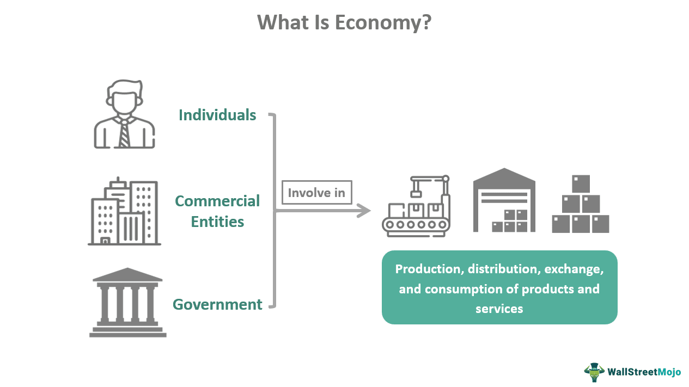

The modern financial ecosystem is an intricate web of interrelated sectors and cutting-edge technologies that collectively shape global economies. This complex system significantly influences economic stability and growth across nations. As traditional boundaries between financial sectors blur due to technological advancements, understanding the various components of this ecosystem becomes increasingly vital.

The financial ecosystem encompasses a diverse array of entities, including traditional banks, insurance companies, and real estate firms. Each of these sectors plays a crucial role in the broader economic landscape by influencing monetary policies and providing essential services that facilitate economic transactions. Their operations are foundational to establishing financial stability and fostering economic growth worldwide.



An integral part of the financial ecosystem is the FIRE economy, which stands for Finance, Insurance, and Real Estate. The FIRE sectors have emerged as pivotal drivers within both the U.S. and global economies. Financialization has amplified their influence, thus commanding a substantial portion of the Gross Domestic Product (GDP) and shaping policy decisions that affect economic policies at various levels.

Moreover, the advent of algorithmic trading has revolutionized modern financial markets. By leveraging computer algorithms to execute trades at high speeds and volumes, algorithmic trading has enhanced market efficiency and reduced transaction costs. However, it has also introduced new risks and challenges that stakeholders must navigate.

In this exploration of the financial ecosystem, we will examine the components that influence economic structures, analyze the impact of the FIRE economy, and discuss the transformational role of algorithmic trading. By comprehensively understanding these elements, we can better appreciate the dynamic and ever-evolving nature of the global financial landscape.

## Table of Contents

## Understanding the Financial Ecosystem

The financial ecosystem is an intricate network consisting of various entities, including banks, insurance companies, and real estate firms, that collectively play a pivotal role in shaping economic policies and maintaining financial stability and growth. Each of these sectors contributes distinct yet interrelated functions essential for the comprehensive operation of the global economy.

Banks are central institutions in the financial ecosystem, serving as intermediaries that facilitate the flow of capital and credit within an economy. They provide a variety of services, including deposit acceptance, loan issuance, and payment processing, which are crucial for both individual consumers and businesses. By managing savings and extending credit, banks create opportunities for investment and consumption, thereby driving economic activity. Central banks, such as the Federal Reserve in the United States, also perform critical functions by regulating monetary policy to control inflation and stabilize currency.

Insurance companies add another layer of complexity to the financial ecosystem. They offer risk management products and services that protect individuals and businesses from potential financial losses. By pooling risk, insurance companies help stabilize the economy by allowing firms to undertake ventures and investments with reduced uncertainty about unforeseen events. This risk mitigation fosters economic growth by encouraging enterprise and innovation.

The real estate sector is a tangible component of the financial ecosystem with significant economic impact. Real estate firms not only deal with the buying, selling, and management of properties but also significantly influence investment patterns and wealth creation. The construction, sale, and rental of real estate contribute substantially to GDP, while real estate investment trusts (REITs) provide a mechanism for investors to gain exposure to property markets without direct ownership. Fluctuations in the real estate market can have broad consequences, affecting housing affordability, consumer wealth, and even triggering economic downturns as seen during the 2008 financial crisis.

The interaction between these sectors creates a dynamic financial ecosystem where economic policies are formulated and adjusted to promote stability and growth. For instance, during periods of economic instability, governments and central banks might implement fiscal and monetary measures to stimulate growth, support financial institutions, and restore public confidence. This interconnectedness ensures that changes within one sector can have cascading effects throughout the economy, thus requiring coordinated efforts between policymakers and financial entities to maintain balance.

In summary, understanding the structure and interplay of banks, insurance companies, and real estate firms within the financial ecosystem is vital for examining how economic policies are crafted and adjusted. These sectors collectively underpin financial stability and promote sustained economic growth, making their proper functioning and regulation a priority for policymakers worldwide.

## Economic Structures and the FIRE Economy

The FIRE acronym stands for Finance, Insurance, and Real Estate, which are critical sectors in both U.S. and global economies. As global economic structures have evolved, these sectors have increasingly influenced not only GDP but also policy decisions, a phenomenon often referred to as "financialization."

Financialization describes the shift in economies where financial services constitute a greater share of economic output. This rise has turned the FIRE sectors into pivotal players, generating significant economic activities and impacts. Finance has expanded beyond traditional banking, encompassing capital markets, investment management, and recently, fintech innovations which optimize financial service delivery worldwide. According to the Bureau of Economic Analysis, the finance sector alone accounted for about 7.4% of the U.S. GDP in 2020, underscoring its substantial contribution to national income.[^1]

Insurance, another pillar of the FIRE economy, plays a crucial role in risk management, providing protection against potential financial losses. The industry's economic significance is evident in its facilitation of market stability and consumer confidence. Global insurance premiums reached an estimated $6.3 trillion in 2020, reflecting its extensive reach and influence in global markets.[^2]

Real estate, the third component of the FIRE economy, acts as both an economic indicator and a driver. Property markets significantly impact financial stability through housing market dynamics and real estate investments, which influence wealth distribution and economic security. The U.S. real estate market alone contributes about $3.7 trillion annually to economic activities, forming a substantial part of national prosperity and development.[^3]

The integrative impact of these three sectors highlights their importance within economic structures. As financialization continues, the effects are profound and multifaceted. With assets increasingly being managed through various financial instruments, the responsiveness of these sectors to economic shifts aids in shaping fiscal policies and investment strategies across borders. Stakeholders must carefully monitor and adapt to these trends, ensuring that they leverage the benefits of the FIRE economy while managing the associated risks.

[^1]: Bureau of Economic Analysis. (2020). Finance and insurance contributions to U.S. GDP.
[^2]: Swiss Re Institute. (2021). Global insurance premiums.
[^3]: National Association of Realtors. (2021). Economic impact of real estate in the U.S.

## Algorithmic Trading in Modern Markets

Algorithmic trading uses complex algorithms to execute trades at speeds and volumes beyond human capability, fundamentally altering the landscape of modern financial markets. This strategy leverages computational power to analyze data and make swift trading decisions without direct human intervention, enhancing market efficiency and reducing transaction costs. Machine learning and [artificial intelligence](/wiki/ai-artificial-intelligence) further empower these algorithms to adapt and refine trading strategies in real-time.

A typical [algorithmic trading](/wiki/algorithmic-trading) system analyzes large datasets, identifying trading opportunities based on predefined criteria such as price movement, timing, or [volume](/wiki/volume-trading-strategy). This process involves technical analysis where patterns and market trends are detected using mathematical models and statistical methods. The algorithms operate on strategies ranging from [arbitrage](/wiki/arbitrage) to trend-following, each tailored to exploit specific market conditions.

A simple example of an algorithmic trading strategy could involve a moving average crossover, where an algorithm buys stock when a short-term moving average crosses above a long-term moving average and sells when the opposite occurs. The Python code implementation for such a strategy could look like this:

```python
import numpy as np
import pandas as pd

def moving_average_strategy(prices, short_window=40, long_window=100):
    signals = pd.DataFrame(index=prices.index)
    signals['signal'] = 0.0

    signals['short_mavg'] = prices.rolling(window=short_window, min_periods=1, center=False).mean()
    signals['long_mavg'] = prices.rolling(window=long_window, min_periods=1, center=False).mean()

    signals['signal'][short_window:] = np.where(signals['short_mavg'][short_window:] > signals['long_mavg'][short_window:], 1.0, 0.0)

    signals['positions'] = signals['signal'].diff()

    return signals
```

Through such strategies, algorithmic trading reduces reliance on human emotion and error, ensuring decisions are grounded in quantitative data analysis. However, the rapid execution and large transaction volume inherent to algorithmic trading introduce new operational and systemic risks. These include potential market manipulations and errors that can precipitate significant market disruptions, exemplified by occurrences like the "Flash Crash" of 2010.

Regulatory bodies worldwide are continuously evolving to address these challenges, seeking to balance market innovation with stability and investor protection. The continuous advancement of technology and integration of data analytics in trading demonstrates the pivotal role of algorithmic trading in shaping the efficient and dynamic financial markets of today.

## The Impact of High-Frequency Trading

High-frequency trading ([HFT](/wiki/high-frequency-trading-strategies)) is a specialized form of algorithmic trading that uses sophisticated algorithms and powerful computing technology to execute large numbers of trades at extremely high speeds, often in fractions of a second. This approach to trading has transformed modern financial markets, offering both advantages and drawbacks.

One of the primary benefits of HFT is the increase in market [liquidity](/wiki/liquidity-risk-premium). By executing numerous trades in short time spans, HFT firms contribute to the depth of financial markets, facilitating smoother transactions and potentially reducing bid-ask spreads. This increased liquidity can benefit traditional traders by allowing them to buy or sell assets more easily without large price impacts.

However, the rapid execution characteristic of HFT also introduces several challenges. Market [volatility](/wiki/volatility-trading-strategies) is a significant concern, as the sheer volume and speed of trades can lead to sudden and drastic price swings. These fluctuations might destabilize markets, potentially disadvantaging traditional investors who cannot react as quickly.

Moreover, HFT has been linked to phenomena known as flash crashes. A flash crash occurs when the automated trading systems trigger a rapid sell-off, causing prices to plummet briefly before recovering. One notable example occurred on May 6, 2010, when the U.S. stock market experienced a dramatic, temporary plunge.

The balance HFT strikes between liquidity provision and potential market disruptions has sparked widespread debate among regulators, market participants, and academics. While some argue that HFT enhances market efficiency, others emphasize the necessity for stringent regulations to prevent excessive volatility and ensure market integrity.

To address these issues, regulatory bodies are focusing on developing frameworks to monitor and mitigate the risks associated with HFT. These include implementing circuit breakers to pause trading during extreme volatility and mandating increased transparency to ensure fair trading practices. As the financial ecosystem continues to evolve, the role of HFT remains pivotal, necessitating ongoing scrutiny and adaptation of regulatory measures.

## Risks and Challenges in the Financial Ecosystem

The reliance on technology in the financial ecosystem introduces numerous systemic risks, prominently including market manipulations and technological failures. With increasing dependency on algorithmic and high-frequency trading, markets are vulnerable to manipulative strategies that exploit speed and computational power. Traders can use strategies such as spoofing, where orders are placed with the intention to cancel them before execution, to artificially influence supply and demand dynamics. This creates false market signals that can mislead other traders and distort market prices.

Technological failures also pose significant risks. The complex infrastructures supporting modern financial markets are susceptible to software glitches, hardware malfunctions, and cyber-attacks. A notable example is the 2010 "Flash Crash," when the U.S. stock market experienced a rapid and deep plunge caused partly by an algorithmic trading error. Such events highlight the fragility that accompanies technological dependencies and the potential for large-scale financial disruptions.

Regulatory bodies face significant challenges in adapting to these rapid technological advancements to maintain equitable and stable markets. The speed at which financial technology (FinTech) evolves often outpaces regulatory frameworks, leading to gaps in oversight. Regulators must continuously update methodologies to monitor and manage risks effectively. This includes implementing stronger surveillance systems, enforcing compliance, and fostering collaboration between national and international regulatory entities.

Moreover, the complexity inherent in these systems necessitates sophisticated data analysis tools and expertise. For instance, regulators can deploy [machine learning](/wiki/machine-learning) algorithms to detect anomalous trading patterns associated with market manipulation. Here's a simple example of a Python snippet that could be used to identify unusual trading volumes using a machine learning algorithm:

```python
from sklearn.ensemble import IsolationForest
import numpy as np
import pandas as pd

# Sample feature: trading volume
data = {'trading_volume': [1000, 1500, 2000, 3000, 100000, 2500, 1800]}
df = pd.DataFrame(data)

# Initialize the Isolation Forest model
model = IsolationForest(contamination=0.1)

# Fit the model
model.fit(df[['trading_volume']])

# Predict anomalies
df['anomaly'] = model.predict(df[['trading_volume']])

print(df)
```

This code identifies trading volumes that deviate significantly from the norm, helping detect potential manipulations or malfunctions.

Ultimately, balancing the rapid advancements in financial technologies with robust regulatory measures is essential to mitigate these systemic risks. The adoption of proactive strategies and collaborative approaches among stakeholders is crucial for sustaining market integrity and protecting investors.

## Future Trends and Innovations

The financial ecosystem is witnessing transformative advancements, particularly through technologies such as blockchain and artificial intelligence (AI). These innovations promise significant enhancements in transparency and efficiency across various financial operations.

Blockchain technology, fundamentally a decentralized digital ledger, offers a transparent and secure framework for recording transactions. This system's immutability ensures data accuracy, significantly reducing opportunities for fraud. Its application in smart contracts, which automate transaction execution without intermediaries, is redefining operational efficiency in financial transactions. For instance, in scenarios involving multi-party agreements, blockchain can streamline processes, reducing both time and cost. An example of this is the use of blockchain in supply chain finance, where documentation processes can become automated, thereby enhancing reliability and speed.

AI is another pivotal innovation reshaping the financial landscape. With its ability to process vast amounts of data swiftly and identify patterns beyond human capability, AI enhances decision-making in various financial services. For instance, AI-driven algorithms in trading can analyze real-time market data and execute trades at optimal times, maximizing returns. Moreover, AI-powered financial advisory services use machine learning to offer personalized investment advice, tailored to individual risk profiles and financial goals.

However, the integration of these technologies demands careful oversight. The decentralized nature of blockchain, while advantageous for security and transparency, poses regulatory challenges. Financial regulators must develop frameworks that balance innovation with consumer protection and market integrity. Similarly, the deployment of AI in finance necessitates clear ethical guidelines to prevent biases in algorithmic decision-making and ensure data privacy.

The application of these technologies holds significant potential for the future of finance. As blockchain fosters a more transparent ecosystem and AI augments decision-making capabilities, the financial sector can expect to see improvements in both cost-effectiveness and client satisfaction. Nonetheless, realizing these benefits requires a collaborative effort among industry leaders, technologists, and regulators to ensure safe and equitable integration.

## Conclusion

The interplay between financial ecosystems, economic structures, and technological advancements is fundamental for ensuring future economic stability. As the modern financial system continues to evolve, integrating complex sectors such as finance, insurance, and real estate with cutting-edge technologies like algorithmic trading and blockchain, the challenges and opportunities ahead are significant. Understanding these dynamics is essential for stakeholders, including policymakers, investors, and financial institutions, to effectively navigate the rapidly changing landscape.

Innovation in technology offers transformative potential by enhancing transparency, efficiency, and accessibility within financial markets. Algorithmic trading, for example, has revolutionized how trades are executed, offering speed and reducing costs, but it also necessitates robust risk management to address issues like market volatility and systemic risks. Similarly, advancements in AI and machine learning provide invaluable tools for data analysis and decision-making, yet they demand careful oversight to prevent misuse and ensure ethical applications.

The future of the financial ecosystem will depend heavily on the ability of stakeholders to balance these innovations with adequate regulation. This balance is crucial for maintaining fair and stable markets while fostering economic growth. Regulatory frameworks need to be agile and forward-looking, capable of adapting to emerging technologies and their associated risks. Ensuring that regulations are not overly restrictive will allow for continued innovation, economic expansion, and enhancement of the financial services sector.

In conclusion, the ongoing shift in the financial landscape requires a nuanced approach, blending technological advancement with holistic policy measures. Embracing innovation while maintaining rigorous oversight will be key to achieving a resilient, dynamic financial ecosystem that supports long-term economic stability.

## References & Further Reading

[1]: Bureau of Economic Analysis. (2020). ["Finance and insurance contributions to U.S. GDP."](https://www.bea.gov/) U.S. Department of Commerce.

[2]: Swiss Re Institute. (2021). ["Global insurance premiums."](https://www.swissre.com/institute/research/sigma-research/sigma-2021-05/sigma-5-in-5-charts.html) Swiss Re.

[3]: National Association of Realtors. (2021). ["Economic impact of real estate in the U.S."](https://www.nar.realtor/reports/state-by-state-economic-impact-of-real-estate-activity) National Association of Realtors.

[4]: Aldridge, I., & Krawciw, S. (2017). ["Real-Time Risk: What Investors Should Know About FinTech, High-Frequency Trading, and Flash Crashes."](https://www.academia.edu/126545503/_Es_un_cliente_confiable_Miner%C3%ADa_de_datos_tradicional_y_Fintech_para_el_c%C3%A1lculo_de_la_rentabilidad) Wiley.

[5]: ["Flash Boys: A Wall Street Revolt"](https://en.wikipedia.org/wiki/Flash_Boys) by Michael Lewis

[6]: Narang, R. K. (2013). ["Inside the Black Box: The Simple Truth About Quantitative Trading."](https://www.amazon.com/Inside-Black-Box-Quantitative-Trading/dp/0470432063) Wiley.

[7]: Cartea, Á., Jaimungal, S., & Penalva, J. (2015). ["Algorithmic and High-Frequency Trading."](https://assets.cambridge.org/97811070/91146/frontmatter/9781107091146_frontmatter.pdf) Cambridge University Press.

[8]: Hasbrouck, J. (2013). ["High Frequency Trading and Price Discovery."](https://www.jstor.org/stable/24465658) The Journal of Finance, 68(6), 2221–2259.