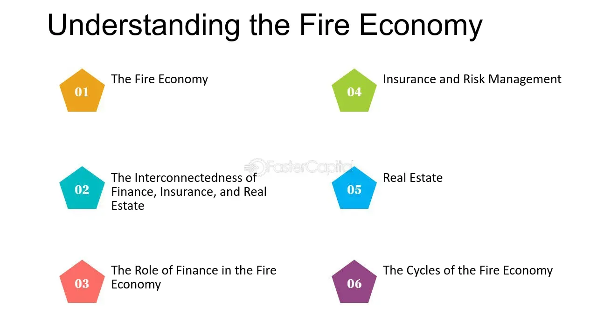

## Table of Contents

## What is the basic definition of a fire economy?

A fire economy is a type of economy that depends a lot on industries that use or produce fire, like mining, oil, and gas. These industries burn a lot of fuel to do their work, and they also extract resources from the earth that can be burned for energy. Because of this, a fire economy can grow quickly and make a lot of money, but it can also harm the environment by causing pollution and climate change.

In a fire economy, jobs and wealth often come from these fire-based industries. This can make the economy strong in the short term, but it can be risky in the long term. If the world starts using less oil and gas, or if new laws are made to protect the environment, the fire economy might struggle. So, it's important for places with a fire economy to think about other ways to make money and create jobs that are better for the planet.

## How does a fire economy differ from a traditional economy?

A fire economy is different from a traditional economy because it focuses a lot on industries that use or make fire, like mining, oil, and gas. These industries are all about burning things to get energy or to make products. In a traditional economy, you might see a mix of different kinds of jobs and businesses, like farming, making things, and selling services. The traditional economy doesn't depend so much on burning things and can be more varied.

In a fire economy, the money and jobs come mainly from these fire-based industries. This can make the economy grow fast and bring in a lot of money, but it can also be risky. If people start using less oil and gas, or if new rules come to protect the environment, the fire economy might have a hard time. A traditional economy, on the other hand, is usually more stable because it's spread out over many different kinds of work and businesses. This spread helps it handle changes better and can be better for the planet in the long run.

## What are the key components that drive a fire economy?

The main things that drive a fire economy are industries that use or make fire, like mining, oil, and gas. These industries burn a lot of fuel to do their work and also pull resources out of the ground that can be burned for energy. Because of this, a fire economy can grow quickly and make a lot of money. Jobs and wealth in a fire economy come mostly from these fire-based industries. This focus on fire can make the economy strong in the short term, but it can also be risky if the world starts using less oil and gas or if new laws are made to protect the environment.

Another important part of a fire economy is the demand for energy. People and businesses need energy to live and work, and in a fire economy, this energy often comes from burning fossil fuels. The more energy people use, the more the fire economy grows. But this growth can harm the environment by causing pollution and climate change. So, while the fire economy can bring a lot of money and jobs, it's important to think about the long-term effects on the planet and to look for other ways to make energy that are better for the environment.

## Can you explain the mechanism behind a fire economy?

A fire economy works by focusing a lot on industries that use or make fire, like mining, oil, and gas. These industries burn a lot of fuel to do their work and also pull resources out of the ground that can be burned for energy. Because of this, a fire economy can grow quickly and make a lot of money. Jobs and wealth in a fire economy come mostly from these fire-based industries. This focus on fire can make the economy strong in the short term, but it can also be risky if the world starts using less oil and gas or if new laws are made to protect the environment.

The main driver of a fire economy is the demand for energy. People and businesses need energy to live and work, and in a fire economy, this energy often comes from burning fossil fuels. The more energy people use, the more the fire economy grows. But this growth can harm the environment by causing pollution and climate change. So, while the fire economy can bring a lot of money and jobs, it's important to think about the long-term effects on the planet and to look for other ways to make energy that are better for the environment.

## What are the primary sources of energy in a fire economy?

The main sources of energy in a fire economy come from burning things, like coal, oil, and natural gas. These are called fossil fuels. They are found deep in the ground and are dug up by mining or drilling. When these fuels are burned, they release a lot of energy that can be used to power homes, factories, and cars. This is why a fire economy depends so much on these energy sources.

Using fossil fuels can make a fire economy grow quickly and bring in a lot of money. But there's a big problem: burning these fuels also creates a lot of pollution and can harm the environment. It can cause things like air pollution and climate change. So, while fossil fuels are the main energy sources in a fire economy, they can also cause big problems in the long run.

## How does a fire economy impact the environment?

A fire economy can harm the environment a lot. It depends on burning things like coal, oil, and gas to get energy. When these fossil fuels are burned, they release gases that make the air dirty and cause pollution. This pollution can make it hard for people to breathe and can harm animals and plants. It can also make the weather change in ways that are bad for the planet, like making it hotter or causing more storms.

The way a fire economy works can also hurt the land and water. Mining and drilling for fossil fuels can mess up the ground and make it hard for anything to grow there again. It can also make the water dirty, which is bad for fish and other animals that live in it. So, while a fire economy can bring in a lot of money and jobs, it can also cause big problems for the environment that might be hard to fix.

## What are the economic benefits of transitioning to a fire economy?

Moving to a fire economy can bring a lot of money and jobs to a place. When people start mining for coal, oil, and gas, they need workers to do the digging and drilling. This means more jobs for people, which is good for them and their families. The companies that own these mines and oil fields make a lot of money too. They can use this money to build new things, like roads and schools, which helps the whole area grow and become richer.

But there are also some risks to think about. A fire economy can grow fast and make a lot of money in the short term, but it might not last forever. If people start using less oil and gas, or if new laws are made to protect the environment, the fire economy might struggle. So, while moving to a fire economy can bring quick benefits, it's important to plan for the future and think about other ways to make money and create jobs that are better for the planet.

## What challenges are faced when implementing a fire economy?

Moving to a fire economy can be hard because it depends a lot on burning things like coal, oil, and gas. These resources are not endless, and one day they might run out. This means that if a place focuses too much on a fire economy, it might have problems later when there's not enough coal, oil, or gas left. Also, getting these resources out of the ground can be expensive and risky. Companies need a lot of money to start mining or drilling, and there's always a chance that they won't find as much as they hoped.

Another big challenge is the harm it can do to the environment. Burning fossil fuels makes the air dirty and can cause climate change. This can lead to problems like bad air to breathe, hotter weather, and more storms. People might not want to live or work in a place with a fire economy because of these problems. Governments might also make new rules to protect the environment, which could make it harder for the fire economy to keep going. So, while a fire economy can bring quick money and jobs, it's important to think about these challenges and find ways to deal with them.

## How does a fire economy influence global trade and international relations?

A fire economy can change how countries trade with each other. When a country has a lot of coal, oil, or gas, it can sell these things to other countries that need them. This can make the country with the fire economy richer and more powerful in the world. But it can also make other countries depend on it for energy. If the country with the fire economy decides to sell less or charge more, it can cause problems for the countries that need to buy the energy.

The way a fire economy works can also affect how countries get along with each other. Countries that have a lot of fossil fuels might use them to make deals or to try to control other countries. This can lead to fights or disagreements. On the other hand, countries that want to protect the environment might not like the fire economy because it causes pollution and climate change. They might make rules or try to work together to use less fossil fuels, which can change how they relate to countries with a fire economy.

## What technological innovations are crucial for the development of a fire economy?

For a fire economy to grow, new technology is really important. One key thing is better ways to find and get coal, oil, and gas out of the ground. This includes things like new drilling machines that can go deeper and reach places that were hard to get to before. There are also new ways to see underground, like using special machines that can tell where the fossil fuels are. These technologies help make it easier and cheaper to get the energy resources that a fire economy needs.

Another important technology is better ways to burn fossil fuels. This means making engines and power plants that can use coal, oil, and gas more efficiently. When these fuels are burned better, they can make more energy and less pollution. This is good for the fire economy because it can make more money from the same amount of fuel. But even with these new technologies, burning fossil fuels still harms the environment, so it's important to keep working on ways to make energy that are better for the planet.

## How can policy and regulation support the growth of a fire economy?

Policy and regulation can help a fire economy grow by making it easier for companies to mine for coal, oil, and gas. Governments can give these companies special permits that let them dig and drill in new places. They can also offer tax breaks or other money help to make it cheaper for companies to start new projects. By doing these things, governments can bring more jobs and money to their area, which is good for the fire economy.

But, governments also need to think about the environment. They can make rules that try to balance the growth of the fire economy with protecting the planet. For example, they can set limits on how much pollution companies can make. They can also encourage companies to use new technology that burns fossil fuels more cleanly. This way, the fire economy can keep growing, but it might cause less harm to the environment.

## What are the long-term sustainability prospects of a fire economy?

The long-term sustainability of a fire economy is not very good. This kind of economy depends a lot on burning things like coal, oil, and gas. But these resources will not last forever. One day, they will run out, and then the fire economy will have big problems. Also, using these fuels harms the environment by causing pollution and climate change. If people and governments start caring more about the planet, they might make rules that make it harder for the fire economy to keep going.

To make a fire economy last longer, it's important to find other ways to make energy that are better for the environment. This means using more renewable energy like wind, solar, and hydro power. These kinds of energy do not run out and do not cause as much pollution. If a fire economy can slowly start using these new energy sources, it might be able to keep going without causing so much harm to the planet. But this change will take time and money, and it will need help from new technology and smart government rules.

## References & Further Reading

[1]: Bureau of Economic Analysis. (2020). ["Finance and insurance contributions to U.S. GDP."](https://www.bea.gov/) U.S. Department of Commerce.

[2]: Swiss Re Institute. (2021). ["Global insurance premiums."](https://www.swissre.com/institute/research/sigma-research/sigma-2021-05/sigma-5-in-5-charts.html) Swiss Re.

[3]: National Association of Realtors. (2021). ["Economic impact of real estate in the U.S."](https://www.nar.realtor/reports/state-by-state-economic-impact-of-real-estate-activity) National Association of Realtors.

[4]: Aldridge, I., & Krawciw, S. (2017). ["Real-Time Risk: What Investors Should Know About FinTech, High-Frequency Trading, and Flash Crashes."](https://www.academia.edu/126545503/_Es_un_cliente_confiable_Miner%C3%ADa_de_datos_tradicional_y_Fintech_para_el_c%C3%A1lculo_de_la_rentabilidad) Wiley.

[5]: ["Flash Boys: A Wall Street Revolt"](https://en.wikipedia.org/wiki/Flash_Boys) by Michael Lewis

[6]: Narang, R. K. (2013). ["Inside the Black Box: The Simple Truth About Quantitative Trading."](https://www.amazon.com/Inside-Black-Box-Quantitative-Trading/dp/0470432063) Wiley.

[7]: Cartea, Á., Jaimungal, S., & Penalva, J. (2015). ["Algorithmic and High-Frequency Trading."](https://assets.cambridge.org/97811070/91146/frontmatter/9781107091146_frontmatter.pdf) Cambridge University Press.

[8]: Hasbrouck, J. (2013). ["High Frequency Trading and Price Discovery."](https://www.jstor.org/stable/24465658) The Journal of Finance, 68(6), 2221–2259.