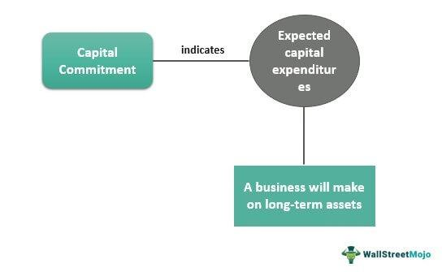

In the fast-evolving financial landscape, the convergence of underwriting, firm commitments, and algorithmic trading has become significant. These elements, while individually fundamental to finance, synergize to form robust capital market systems. Underwriting serves as a cornerstone, enabling the assessment and management of risks associated with launching new securities. It ensures that financial activities such as loans and securities issuance are executed with precision and due diligence.

Firm commitments in finance, particularly regarding initial public offerings (IPOs), provide assurance to issuers that they will receive the intended capital. This process requires underwriters to purchase all securities directly from the issuer, taking on considerable risk to sell them to the public. The assurance offered by firm commitments is a crucial mechanism for companies seeking to enter public markets with confidence.



Complementing these processes, algorithmic trading enhances the efficiency and effectiveness of financial transactions. By automating trading strategies through predefined algorithms, it reduces the time and human errors inherent in traditional trading methods. This automation facilitates optimal price discovery and market liquidity, especially beneficial during IPOs and underwriting activities. 

As we explore these areas, we aim to highlight how the interplay of underwriting, firm commitments, and algorithmic trading reshapes financial markets, driving progress and innovation while ensuring robust risk management strategies.

## Table of Contents

## Understanding Underwriting

Underwriting is a critical process utilized by financial institutions to assess and manage risk. This function is essential across various sectors, including insurance, banking, and investment. In these areas, underwriting evaluates the risk associated with transactions such as loans and securities issuance. The goal is to determine whether a financial commitment is viable and to establish appropriate terms for the engagement.

In the insurance sector, underwriting determines the risk level of an applicant and sets premiums accordingly. For instance, an insurance underwriter might assess an individual's health, lifestyle, and medical history to establish life insurance policy terms. In banking, underwriters evaluate loan applications by examining a borrower's creditworthiness and financial background to minimize default risk.

In the investment sector, particularly within the purview of investment banks, underwriting assumes a vital role in ensuring the successful launch of new securities into the market. Investment banks underwrite initial public offerings (IPOs), where they assess the financial health and growth potential of a company. The underwriters purchase the entire issue of securities from the company and then sell them to the public, mitigating the company's risk.

The role of underwriters involves several key responsibilities: risk assessment, due diligence, and setting terms for the financial instrument being offered. Risk assessment involves analyzing financial data, business models, and industry conditions to determine the likelihood of success and potential risks. Due diligence ensures that all material information is considered before moving forward, providing a comprehensive risk overview.

Setting terms involves deciding on the [interest rate](/wiki/interest-rate-trading-strategies), price, and other conditions that will make the financial instrument attractive to investors while ensuring that the issuer's needs are met. Through these mechanisms, underwriting helps stabilize financial systems and economies by systematically managing potential risks associated with new ventures or commitments.

## Firm Commitment in Finance

A firm commitment in finance is a binding agreement by an underwriter to purchase all the securities for an initial public offering (IPO) directly from the issuer. This arrangement ensures that the issuer receives the intended capital proceeds from the offering. In contrast to a 'best efforts' arrangement, where the underwriter only agrees to sell as much of the offering as possible, a firm commitment provides a guarantee to the issuer, often making it the preferred choice for companies looking to secure a specific amount of capital.

The firm commitment process places considerable risk on underwriters. They are obligated to buy all the securities, whether or not they can sell them to individual investors. Underwriters derive profit from this process through the spread, which is the difference between the purchase price paid to the issuer and the public offering price at which the securities are sold to investors. This profit margin compensates for the risk assumed by the underwriter.

Major investment banks, such as Goldman Sachs, frequently engage in firm commitments for significant IPOs. These financial institutions have the resources and expertise to assess market conditions and investor demand, making them capable of managing the risk involved in firm commitments. For example, during high-demand periods in the market, a firm commitment can be highly profitable as shares are likely to be sold at or above the offering price, thereby enhancing the profit from the spread.

Underwriters engaged in firm commitments must carefully evaluate several factors, including market [volatility](/wiki/volatility-trading-strategies) and investor appetite, to minimize potential risks associated with unsold shares. This evaluation often involves rigorous financial analysis and forecasting to ensure that the securities can be effectively marketed and sold. Additionally, underwriters may employ strategies such as forming an underwriting syndicate, where multiple institutions share the risk and rewards associated with the securities offering.

While a firm commitment can present opportunities for significant profit, it is essential for underwriters to maintain a robust risk management framework to navigate potential challenges. The complexities involved in such transactions necessitate comprehensive due diligence, market research, and an understanding of investor behavior to optimize the chances of a successful public offering.

## The Role of Algorithmic Trading

Algorithmic trading plays a pivotal role in financial markets by automating trading strategies, thereby improving market efficiency and reducing the cost and complexity of trading. This technology employs pre-set algorithms to make trading decisions, which minimizes the time and human error typically involved in traditional trading methods. It is particularly beneficial in executing trades at the most favorable times and prices, a critical [factor](/wiki/factor-investing) in escalating the competitiveness of financial markets.

In underwriting and Initial Public Offerings (IPOs), [algorithmic trading](/wiki/algorithmic-trading) optimizes the buying and selling of securities, thereby ensuring better price discovery and enhanced market [liquidity](/wiki/liquidity-risk-premium). By processing vast amounts of market data in real time, algorithms can identify optimal entry and [exit](/wiki/exit-strategy) points, which aids in accurately pricing securities during an IPO. This capability benefits both issuers and investors by ensuring that securities are fairly priced and efficiently allocated.

Furthermore, the integration of algorithms can significantly enhance the efficiency of firm commitment underwriting. Under this agreement, underwriters pledge to purchase all the securities offered by the issuer before selling them to the public. The risk inherent in this arrangement is that underwriters must sell all securities to avoid losses. Algorithms, by swiftly managing large data volumes and executing trades, can minimize this risk by identifying market trends and buyer interest, thus facilitating faster transaction processing and inventory turnover.

Algorithmic trading also aids in risk management by providing a systematic approach to executing trades. Given the high velocity at which markets operate, algorithms can adjust rapidly to market conditions, thereby reducing the exposure to unfavorable price movements. For instance, in rapidly declining markets, algorithms might scale back trading activities to prevent additional losses. 

Moreover, Python, a popular programming language used in fintech, allows for the development of complex algorithms with relative ease. Python's robust libraries and tools enable the construction of efficient trading algorithms that fetch and analyze market data, execute trades, and manage portfolios. Below is an example of a simple moving average crossover strategy using Python:

```python
import pandas as pd
import numpy as np

def moving_average_crossover_strategy(prices, short_window=40, long_window=100):
    signals = pd.DataFrame(index=prices.index)
    signals['price'] = prices
    signals['short_mavg'] = prices.rolling(window=short_window, min_periods=1).mean()
    signals['long_mavg'] = prices.rolling(window=long_window, min_periods=1).mean()
    signals['signal'] = 0.0
    signals['signal'][short_window:] = np.where(signals['short_mavg'][short_window:] > signals['long_mavg'][short_window:], 1.0, 0.0)
    signals['positions'] = signals['signal'].diff()

    return signals

# Example usage:
# prices = pd.Series([...])  # Replace with actual time series data
# signals = moving_average_crossover_strategy(prices)
```

The strategic integration of algorithmic trading within firm commitment underwriting and IPOs reflects a broader trend toward automation in finance. However, while the benefits are substantial, the reliance on these technologies necessitates rigorous oversight and risk management to mitigate potential market disruptions, such as those posed by algorithmic malfunctions or 'flash crashes'. Consequently, algorithmic trading, if appropriately harnessed, can significantly enhance the robustness and responsiveness of modern financial markets.

## Challenges and Opportunities

While firm commitments and underwriting provide stability to [capital raising](/wiki/hedge-fund-capital-raising), they also present inherent risks that require vigilant management. One of the primary concerns in this process is market volatility. When markets are unpredictable, underwriters might struggle to sell securities at predetermined prices, impacting their profitability. This risk factor becomes particularly evident during bearish market conditions or unexpected economic downturns, where investor demand may wane, leaving underwriters with unsold securities. 

Algorithmic trading introduces another layer of complexity to financial markets. Although it enhances efficiency by automating trade execution and optimizing liquidity, it can exacerbate market instability if not properly regulated. Episodes like 'flash crashes'—sudden, severe drops in stock prices followed by quick recovery—highlight the potential dangers of unchecked algorithmic trading. These incidents occur when high-speed trading algorithms respond to market signals in a way that amplifies price movements instead of stabilizing them.

Despite these challenges, the convergence of underwriting, firm commitment, and algorithmic trading also presents significant opportunities. When leveraged appropriately with robust risk management strategies, these financial tools can create more resilient capital markets. For instance, algorithmic trading can be calibrated to ensure orderly trading behavior and enhanced market stability, while firm commitments can be structured to better withstand price fluctuations through protective financial instruments like hedges and derivatives.

Risk management strategies are crucial for mitigating the risks associated with market volatility and algorithmic trading. These could include implementing circuit breakers to halt trading in the event of erratic price movements, enforcing stringent regulatory oversight on algorithmic trading practices, and applying sophisticated predictive models to assess and respond to market conditions.

To illustrate how firms might integrate these strategies, consider a simplified Python example for monitoring stock price volatility:

```python
import numpy as np

def calculate_volatility(prices):
    log_returns = np.log(np.array(prices[1:]) / np.array(prices[:-1]))
    volatility = np.std(log_returns) * np.sqrt(252)  # annualizing
    return volatility

# Example stock prices
example_prices = [100, 102, 101, 104, 103, 107]
volatility = calculate_volatility(example_prices)
print(f"Calculated Volatility: {volatility}")
```

In conclusion, while the risks associated with underwriting, firm commitments, and algorithmic trading are non-trivial, the proper application of technology and regulatory frameworks can transform these challenges into opportunities for financial innovation and stability.

## Conclusion

The interplay of underwriting, firm commitments, and algorithmic trading illustrates a dynamic transformation happening within financial markets. These components, despite the challenges they present, collectively enhance market efficiency, optimize transaction processes, and provide a robust framework for risk management. The integration of these mechanisms supports better capital market efficiency by ensuring smoother and more reliable transaction executions. This leads to improved liquidity and price discovery, which are critical for market stability.

Technological advancement is a significant catalyst in this transformation, continuously reshaping strategies and tools that financial institutions must leverage to optimize returns and mitigate risks. Algorithmic trading, with its ability to automate complex trading strategies, minimizes the time and errors associated with human-driven processes. This, combined with the discipline of underwriting and the assurance provided by firm commitments, creates a well-rounded approach to managing public offerings and securities transactions.

To excel in today's competitive financial markets, institutions must not only understand these financial concepts but also adeptly integrate them into their operations. Mastery of underwriting techniques, along with strategic use of firm commitments, empowers these entities to navigate market fluctuations more effectively. Additionally, by harnessing the power of algorithmic trading, they can achieve unprecedented efficiency in executing trades and managing large volumes of financial data.

This synergy of traditional financial practices with cutting-edge technology signifies a promising path forward for the financial sector. Institutions that strategically embrace and adapt to these innovations are likely to secure a sustainable competitive advantage in the evolving landscape of global finance.

## References & Further Reading

[1]: ["Investment Banking: Valuation, Leveraged Buyouts, and Mergers & Acquisitions"](https://www.amazon.com/Investment-Banking-Valuation-Leveraged-Acquisitions/dp/1118656210) by Joshua Rosenbaum and Joshua Pearl

[2]: Campbell, J. Y., Lo, A. W., & MacKinlay, A. C. (1997). ["The Econometrics of Financial Markets."](https://press.princeton.edu/books/hardcover/9780691043012/the-econometrics-of-financial-markets) Princeton University Press.

[3]: Hull, J. C. (2018). ["Options, Futures, and Other Derivatives."](https://www.semanticscholar.org/paper/Options%2C-Futures%2C-and-Other-Derivatives-Hull/89bdee500c8623864fc9eb7a471546aa713acc44) Pearson.

[4]: Hasbrouck, J. (2007). ["Empirical Market Microstructure: The Institutions, Economics, and Econometrics of Securities Trading."](https://academic.oup.com/book/52241) Oxford University Press.

[5]: Aldridge, I. (2013). ["High-Frequency Trading: A Practical Guide to Algorithmic Strategies and Trading Systems."](https://books.google.com/books/about/High_Frequency_Trading.html?id=6l0DDQAAQBAJ) Wiley.