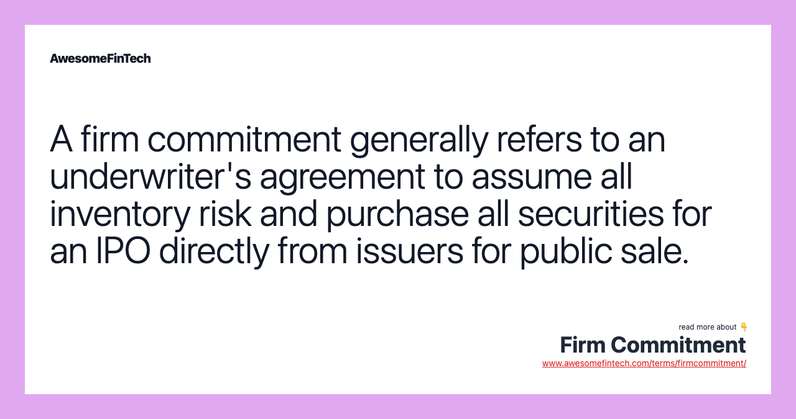

## Table of Contents

## What is a firm commitment in finance?

A firm commitment in finance is when an underwriter, usually a bank or financial institution, agrees to buy all the shares or securities from a company that wants to go public or issue new securities. The underwriter promises to buy these securities at a set price, no matter if they can sell them to investors or not. This gives the company a sure way to raise money because they know they will get the money from the underwriter.

The underwriter takes on a big risk with a firm commitment because they have to buy the securities even if they can't sell them all. If the market is not good and they can't sell the securities, the underwriter could lose money. But if the market is good and they can sell the securities for more than they paid, they can make a profit. This kind of agreement is common in initial public offerings (IPOs) and helps companies feel more secure when they are trying to raise money.

## How does a firm commitment underwriting work?

When a company wants to sell new stocks or bonds, they might use a firm commitment underwriting. This means they work with an underwriter, like a bank, who agrees to buy all the securities the company is selling. The underwriter promises to pay the company a set price for these securities, no matter what happens next. This gives the company a sure way to get money because they know the underwriter will buy everything.

After the underwriter buys the securities, they try to sell them to investors. If the market is good and investors want to buy the securities, the underwriter can sell them for more than they paid and make a profit. But if the market is bad and investors don't want to buy, the underwriter still has to keep the securities and might lose money. This is a big risk for the underwriter, but it helps the company feel safe because they know they will get their money no matter what.

## What are the roles of the underwriter in a firm commitment?

In a firm commitment, the underwriter's main job is to buy all the securities from the company that wants to sell them. This means the underwriter agrees to pay the company a set price for all the stocks or bonds, no matter what happens next. This gives the company a sure way to get money because they know the underwriter will buy everything.

After buying the securities, the underwriter's next job is to sell them to investors. They try to find people who want to buy the stocks or bonds and sell them for a higher price than they paid. If the market is good and investors want to buy, the underwriter can make a profit. But if the market is bad and no one wants to buy, the underwriter might lose money. This is a big risk, but it helps the company feel safe because they know they will get their money no matter what.

## What are the benefits of a firm commitment for an issuer?

A firm commitment is good for a company that wants to sell new stocks or bonds because it gives them a sure way to get money. When a company works with an underwriter on a firm commitment, the underwriter agrees to buy all the securities at a set price. This means the company knows exactly how much money they will get, no matter what happens in the market. This can help the company plan better because they don't have to worry about whether they will get the money they need.

Another benefit is that it can make investors feel more confident. When an underwriter agrees to a firm commitment, it shows that they believe in the company and think the securities will sell well. This can make the company look more trustworthy to investors, which might make it easier for the company to sell their securities. So, a firm commitment can help the company raise money more easily and with less risk.

## What are the risks associated with firm commitment for underwriters?

For underwriters, a firm commitment means they have to buy all the securities from the company, no matter what. This is a big risk because if the market is bad and no one wants to buy the securities, the underwriter is stuck with them. They might have to sell the securities for less than they paid or keep them, which could mean losing a lot of money. This risk is even bigger if the market changes suddenly or if there's bad news about the company that makes investors not want to buy.

On the other hand, if the market is good and investors want to buy the securities, the underwriter can sell them for more than they paid and make a profit. But they can't be sure this will happen. They have to guess how the market will be and how much people will want to buy. If they guess wrong, they could lose money. So, a firm commitment is a big risk for underwriters because they have to take all the securities and hope they can sell them well.

## How does a firm commitment differ from a best efforts agreement?

A firm commitment and a best efforts agreement are two ways a company can work with an underwriter to sell new stocks or bonds. In a firm commitment, the underwriter promises to buy all the securities from the company at a set price. This means the company knows exactly how much money they will get, no matter what happens in the market. The underwriter takes on a big risk because they have to buy everything, even if they can't sell it all to investors later.

In a best efforts agreement, the underwriter tries their best to sell the securities but doesn't promise to buy them all. If they can't sell all the securities, the company might not get as much money as they hoped. This is less risky for the underwriter because they don't have to buy everything if the market is bad. But it's riskier for the company because they aren't sure how much money they will get.

So, the main difference is that a firm commitment gives the company a sure way to get money, while a best efforts agreement leaves the amount of money the company gets up to how well the underwriter can sell the securities.

## Can you explain the process of pricing securities in a firm commitment?

When a company wants to sell new stocks or bonds through a firm commitment, the underwriter helps figure out the price for these securities. The underwriter looks at many things to decide on the price. They check how much people might want to buy the securities, what similar companies' stocks or bonds are selling for, and what's happening in the market right now. They might also talk to big investors to see what price they would be willing to pay. All this information helps the underwriter set a price that they think will work well for both the company and the investors.

Once the underwriter decides on a price, they agree to buy all the securities from the company at that price. This means the company knows exactly how much money they will get. The underwriter then tries to sell the securities to investors at a slightly higher price to make a profit. If the market is good and investors want to buy, the underwriter can sell the securities quickly and make money. But if the market is bad, the underwriter might have to keep the securities or sell them for less than they hoped, which could mean losing money.

## What are the legal and regulatory considerations for firm commitment underwritings?

When an underwriter does a firm commitment, they have to follow many rules and laws. These rules come from places like the Securities and Exchange Commission (SEC) in the United States. The underwriter has to make sure the company gives all the right information to investors, like in a prospectus. This document tells investors about the company and the risks of buying the securities. The underwriter also has to check that the company follows all the rules about selling securities, like not lying or leaving out important information.

Another important part is making sure the underwriter doesn't do anything that could be seen as unfair or against the law. For example, they can't promise to buy the securities and then try to sell them at a much higher price right away. They also have to be careful about how they talk to investors and what they say about the securities. If they break these rules, they could get in big trouble with the law, like fines or even being banned from doing this kind of work. So, it's really important for underwriters to know and follow all the legal and regulatory rules when they do a firm commitment.

## How do market conditions affect firm commitment decisions?

Market conditions play a big role in whether a company and an underwriter decide to go with a firm commitment. If the market is doing well and people are buying a lot of stocks and bonds, the underwriter might feel more confident about agreeing to a firm commitment. They think they can sell the securities easily and make a profit. The company also likes this because they know they will get all the money they need right away. But if the market is not doing well, the underwriter might be more worried. They might not want to take the risk of buying all the securities if they think they won't be able to sell them to investors.

When the market is uncertain or going down, the underwriter might suggest a different kind of agreement, like a best efforts agreement, instead of a firm commitment. This is because they don't want to take the big risk of buying everything if they're not sure they can sell it. The company might have to think hard about whether they want to go ahead with a firm commitment in a bad market. They might decide to wait for a better time or choose a different way to raise money. So, market conditions can really change how both the company and the underwriter feel about doing a firm commitment.

## What are some historical examples of firm commitment underwritings?

One famous example of a firm commitment underwriting happened in 1986 when Apple went public. Apple worked with a group of underwriters, led by Morgan Stanley and Hambrecht & Quist, who agreed to buy all the shares Apple was selling. This meant Apple knew exactly how much money they would get from the IPO, no matter what happened in the market. The underwriters then sold the shares to investors, and because the market was good and people wanted to buy Apple's stock, the underwriters made a profit.

Another example is the IPO of Google in 2004. Google chose a firm commitment with underwriters like Morgan Stanley and Credit Suisse. The underwriters bought all the shares Google was selling at a set price. Even though there was a lot of interest in Google's stock, the underwriters still took a risk because they had to buy everything. In the end, the market was strong, and the underwriters were able to sell the shares to investors at a higher price, making a profit.

## How do firms manage the inventory risk in a firm commitment?

When a firm does a firm commitment, they have to buy all the securities from the company. This means they have to keep the securities if they can't sell them right away. To manage this risk, firms often try to sell the securities as quickly as they can. They might talk to big investors before the sale to make sure there's interest. They also watch the market closely to see if it's a good time to sell. If the market is bad, they might have to wait and hold onto the securities until things get better.

Sometimes, firms use other ways to manage the risk. They might work with other underwriters to share the risk. This way, if they can't sell all the securities, they don't lose as much money. They might also use financial tools like hedging to protect themselves. Hedging means they buy other investments that can help them if the securities they bought go down in value. By doing these things, firms try to make sure they don't lose too much money if they can't sell all the securities they bought in a firm commitment.

## What advanced strategies can underwriters use to mitigate risks in firm commitment deals?

Underwriters can use a few smart strategies to lower the risks in firm commitment deals. One way is to work with other underwriters to share the risk. This means if they can't sell all the securities, they won't lose as much money because they only have to buy part of them. Another strategy is to talk to big investors before the sale to make sure there's enough interest. This can help them feel more sure that they can sell the securities quickly and at a good price.

Another way underwriters manage risk is by using financial tools like hedging. Hedging means they buy other investments that can help them if the securities they bought go down in value. For example, they might buy options or futures that can make money if the market goes down. This can help them not lose as much money if they can't sell the securities right away. By using these strategies, underwriters can feel safer when they agree to buy all the securities in a firm commitment deal.

## References & Further Reading

[1]: ["Investment Banking: Valuation, Leveraged Buyouts, and Mergers & Acquisitions"](https://www.amazon.com/Investment-Banking-Valuation-Leveraged-Acquisitions/dp/1118656210) by Joshua Rosenbaum and Joshua Pearl

[2]: Campbell, J. Y., Lo, A. W., & MacKinlay, A. C. (1997). ["The Econometrics of Financial Markets."](https://press.princeton.edu/books/hardcover/9780691043012/the-econometrics-of-financial-markets) Princeton University Press.

[3]: Hull, J. C. (2018). ["Options, Futures, and Other Derivatives."](https://www.semanticscholar.org/paper/Options%2C-Futures%2C-and-Other-Derivatives-Hull/89bdee500c8623864fc9eb7a471546aa713acc44) Pearson.

[4]: Hasbrouck, J. (2007). ["Empirical Market Microstructure: The Institutions, Economics, and Econometrics of Securities Trading."](https://academic.oup.com/book/52241) Oxford University Press.

[5]: Aldridge, I. (2013). ["High-Frequency Trading: A Practical Guide to Algorithmic Strategies and Trading Systems."](https://books.google.com/books/about/High_Frequency_Trading.html?id=6l0DDQAAQBAJ) Wiley.