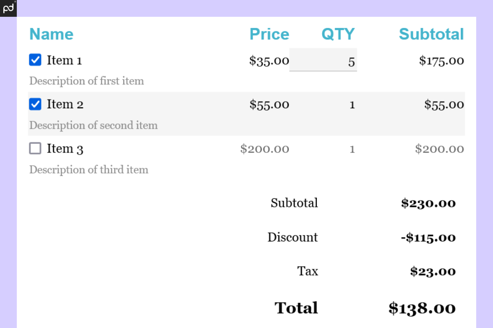

## Table of Contents

## What is a firm quote?

A firm quote is a price that a seller promises to stick to for a certain time. It means if you get a firm quote, the price won't change before you decide to buy. This is helpful because it lets you plan and budget without worrying about the price going up suddenly.

Firm quotes are common in many businesses, like construction or manufacturing. They give buyers confidence because they know exactly what they will pay. If the costs for the seller go up, they still have to sell at the quoted price. This makes firm quotes different from other types of quotes where the price can change.

## How does a firm quote differ from an indicative quote?

A firm quote is a solid promise from a seller about the price of something. When you get a firm quote, the seller agrees to sell the item at that exact price for a certain time. This means you can take your time to decide if you want to buy without worrying that the price will change. It's like a guarantee that helps you plan your budget better.

An indicative quote, on the other hand, is more like a guess or an estimate. It gives you an idea of what the price might be, but it can change. Sellers use indicative quotes when they're not sure about the final cost, maybe because they're waiting for more information or because costs can change quickly. So, if you decide to buy based on an indicative quote, the final price could be different from what you expected.

## Who typically provides firm quotes?

Businesses that sell things often give firm quotes. This includes companies that build houses, make machines, or do big projects. They give firm quotes because it helps their customers know exactly how much they will need to pay. It's like a promise that the price won't change for a while, so people can plan better.

Sometimes, other kinds of businesses give firm quotes too. For example, a car dealer might give a firm quote on the price of a new car. Or a moving company might give a firm quote for how much it will cost to move your things. These businesses use firm quotes to make their customers feel more sure about the price they will pay.

## In what industries are firm quotes most commonly used?

Firm quotes are most commonly used in industries where the price of a product or service can be clearly defined before the work starts. Construction is a big one. When you're building a house or a building, the company will often give you a firm quote so you know exactly how much it will cost. This helps you plan your budget without worrying about surprise costs. Manufacturing is another industry that uses firm quotes a lot. If you're buying machines or parts, the manufacturer will give you a firm quote so you know the price won't change before you decide to buy.

Other industries that often use firm quotes include transportation and logistics. For example, a moving company might give you a firm quote for how much it will cost to move your things from one place to another. This way, you can plan your move without worrying about the price going up. In the automotive industry, car dealers might give firm quotes on the price of a new car. This helps buyers feel confident about the price they will pay, making it easier to decide if they want to buy.

## What are the key components of a firm quote?

A firm quote has some important parts that make it clear and useful. The first part is the price. This is the exact amount of money you will need to pay for the product or service. The price won't change as long as the firm quote is valid. The second part is the time period. This tells you how long the firm quote will last. You need to decide if you want to buy within this time, or the price might change.

Another key part of a firm quote is the details about what you are buying. This includes a clear description of the product or service, so there's no confusion about what you will get. Sometimes, there are also terms and conditions. These are rules you need to follow, like how you will pay or what happens if you change your mind. All these parts together make a firm quote reliable and helpful for planning your budget.

## How long is a firm quote valid?

A firm quote is valid for a certain amount of time. This time period can be different depending on the business and what you are buying. For example, a construction company might give you a firm quote that lasts for 30 days. This means you have 30 days to decide if you want to go ahead with the project at the quoted price.

The length of time a firm quote is valid can change a lot. Sometimes, it might be just a few days if the price of materials can change quickly. Other times, it could be several months if the business wants to give you more time to decide. It's important to check the time period when you get a firm quote so you know how long you have to make your decision.

## Can a firm quote be changed once it is issued?

Once a firm quote is issued, it usually cannot be changed. The whole point of a firm quote is to give you a solid price that won't change for a certain time. If the seller could change the price after giving you the quote, it wouldn't be a firm quote anymore. It would be more like an estimate or an indicative quote.

However, there are some rare cases where a firm quote might be changed. This can happen if both the buyer and the seller agree to change the terms. For example, if you want to add something extra to your order, the seller might need to change the quote. But usually, the seller has to stick to the original firm quote until it expires.

## What are the legal implications of issuing a firm quote?

When a business gives a firm quote, it's like making a promise to the customer. The business has to sell the product or service at the price they quoted for the time the quote is valid. If the business changes the price before the time is up, it could be breaking the law. This is because a firm quote is a kind of contract. If the business doesn't follow the contract, the customer might be able to take legal action against them.

However, there are some situations where a firm quote can be changed. This can happen if both the business and the customer agree to change the terms. For example, if the customer wants to add something extra to their order, the business might need to change the quote. But usually, the business has to stick to the original firm quote until it expires. If they don't, they could face legal problems.

## How do firms ensure the accuracy of their firm quotes?

Firms work hard to make sure their firm quotes are right. They start by looking at all the costs they will have to pay to make the product or do the service. This includes things like the price of materials, how much they will pay their workers, and any other costs they might have. They also think about how long it will take to finish the job. By adding up all these costs carefully, firms can give a firm quote that is close to what the final price will be.

To make sure their firm quotes stay accurate, firms keep an eye on the market. They watch to see if the price of materials or other costs go up or down. If something changes a lot, they might need to change their firm quote, but only if the customer agrees. Firms also use their experience to guess if something might go wrong and cost more. By being careful and checking everything, firms can give firm quotes that customers can trust.

## What technologies are used to manage and track firm quotes?

Firms use special software to manage and track firm quotes. This software helps them keep all the information about the quotes in one place. It can store details like the price, the time the quote is valid, and what the customer is buying. The software also lets firms send quotes to customers easily, either by email or through a special online system. This makes it simpler for firms to keep track of all their quotes and make sure they are doing everything right.

Some firms also use tools that help them check if their quotes are accurate. These tools can look at the prices of materials and other costs in real time. If something changes, the tools can warn the firm so they can update their quotes if needed. This helps firms give firm quotes that are as accurate as possible. By using these technologies, firms can manage their quotes better and make sure they are following the rules.

## How does the process of obtaining a firm quote vary internationally?

The way you get a firm quote can be different in different countries. In some places, it's easy and quick. You might just need to call a company or fill out a form online. They will look at what you want and give you a firm quote fast. But in other countries, it can take longer. You might need to meet with the company in person or send them a lot of details about what you need. They might need more time to check everything and make sure their quote is right.

Even the rules about firm quotes can be different around the world. In some countries, the law says that a firm quote has to stay the same for a certain time. If the company changes the price, they could get in trouble. But in other places, the rules might not be as strict. Companies might be able to change their firm quotes more easily. So, when you are getting a firm quote from another country, it's good to know the local rules and how long it might take.

## What are the best practices for negotiating based on a firm quote?

When you get a firm quote, it's good to know that the price won't change for a while. This gives you a chance to think about it and maybe negotiate. Start by looking at the quote carefully. See if there are any parts of the price that you think could be lower. Maybe you can find a cheaper way to do something or use different materials. Talk to the seller about these ideas. They might be willing to change the quote if you can save them money too.

It's also important to be polite and respectful when you negotiate. Remember, the seller gave you a firm quote because they want to help you plan your budget. If you ask for a lower price, explain why you think it's fair. Maybe you can offer to pay faster or buy more if they give you a better deal. Keep talking until you both agree on a price that works. This way, you can get a good deal without making the seller feel bad.

## References & Further Reading

[1]: Johnson, B. (2010). ["Algorithmic Trading & DMA: An Introduction to Direct Access Trading Strategies."](https://archive.org/details/algorithmictradi0000john) 4myeloma Press.

[2]: ["Advances in Financial Machine Learning"](https://www.amazon.com/Advances-Financial-Machine-Learning-Marcos/dp/1119482089) by Marcos Lopez de Prado

[3]: Kissell, R. (2014). ["The Science of Algorithmic Trading and Portfolio Management."](https://www.sciencedirect.com/book/9780124016897/the-science-of-algorithmic-trading-and-portfolio-management) Academic Press.

[4]: Gates, D. (2009). ["The Basics of Algorithmic Trading."](https://onlinelibrary.wiley.com/doi/pdf/10.1002/9781119244066.ch1) Investopedia.

[5]: Securities and Exchange Commission (1934). ["Securities Exchange Act."](https://www.sec.gov/rules-regulations/statutes-regulations) U.S. Securities and Exchange Commission Website. 

[6]: Hasbrouck, J. (2018). ["Empirical Market Microstructure: The Institutions, Economics, and Econometrics of Securities Trading."](https://academic.oup.com/book/52241) Oxford University Press.