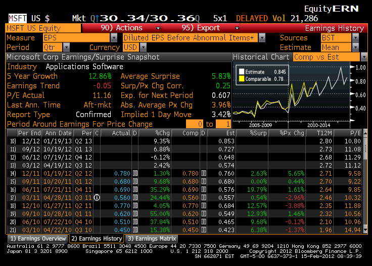

The financial markets have experienced profound changes driven by the rapid advancement of digital technologies. This evolution has fundamentally altered how trading is conducted, leading to increased efficiency, speed, and accessibility. At the forefront of this transformation are financial transactions firms, which play a pivotal role by engaging in activities such as quote quotations and algorithmic trading. These firms use their expertise to provide liquidity, facilitate trades, and ensure smooth market operations.

Understanding these processes is essential for traders and firms that aim to effectively navigate the complexities of today's fast-paced financial landscape. The shift to digital trading environments has brought about new methods and strategies that were not feasible in traditional trading settings.

Firm quotes are a crucial element in this ecosystem, serving as non-negotiable prices at which market participants can buy or sell assets. This concept ensures stability and trust within the market by obligating market makers to honor their quotes, thereby providing assurance to investors.

In tandem with firm quotes, the rise of algorithmic trading represents a significant innovation in modern trading practices. This approach leverages sophisticated algorithms to execute trades automatically based on pre-set criteria, often involving complex strategies and real-time data analysis. The integration of these algorithms with real-time market data allows traders to capitalize on small price movements, optimize trade execution, and manage risk more effectively.

The combined impact of firm quotes, precise quotation processes, and algorithmic trading has redefined the trading landscape. Mastering these concepts is crucial for participants looking to thrive in the competitive and rapidly changing financial markets. This article will explore these vital components, shedding light on their significance and influence on contemporary trading practices.

## Table of Contents

## Understanding Firm Quotes

Firm quotes play a critical role in the functioning of financial markets by providing fixed bid and ask prices at which an asset can be bought or sold. They are non-negotiable, meaning that market makers are committed to honoring the quotes they provide. This commitment is crucial for ensuring stability and trust in the markets as it provides traders with a reliable and transparent pricing structure. Market makers, such as large banks or specialized trading firms, utilize firm quotes to guarantee that they will perform transactions at the specified prices, thus allowing traders to execute trades with confidence that the stated prices will be honored.

The firm quote mechanism is regulated by legislative frameworks like the Securities Exchange Act, which outlines stringent requirements for maintaining the integrity of market quotations. This legal oversight is necessary to prevent manipulative practices and to foster an environment of fairness, thereby upholding investor confidence. The Securities Exchange Commission (SEC), under this Act, mandates that firm quotes be displayed in real-time and that they reflect true market conditions. Non-compliance or manipulation of these quotes can lead to legal repercussions, ensuring that the data presented through quotes remains both accurate and reliable.

Firm quotes are distinct from nominal quotes, which are merely indicative prices and open to negotiation. Nominal quotes do not [carry](/wiki/carry-trading) the obligation to transact at the specified price, offering flexibility but less certainty for traders. The distinction between firm and nominal quotes is fundamental to trading strategies, where the former provides a fixed basis for decision-making, and the latter offers potential negotiating room but without guaranteed execution.

Moreover, firm quotes contribute significantly to market [liquidity](/wiki/liquidity-risk-premium), which is the ease with which an asset can be bought or sold without affecting its price. By providing a steady flow of firm prices, market makers inject liquidity into the market, facilitating smoother and more efficient trading. This liquidity is crucial because it reduces the bid-ask spread, the difference between buying and selling prices, making trading more cost-effective for participants.

In conclusion, firm quotes are indispensable in modern trading environments, ensuring stability, trust, and liquidity in financial markets. Their regulation under acts such as the Securities Exchange Act ensures they are a reliable tool for traders, appropriate for executing well-informed trading strategies. By distinguishing firm quotes from their negotiable counterparts, firms can better navigate the markets and maintain a competitive edge.

## The Role of Quotation in Trading

Quotations play a crucial role in financial trading by reflecting the prices at which assets are presently being traded in the market. These quotations consist of two primary components: the bid price and the ask price. The bid price represents the highest price that a buyer is willing to pay for an asset, while the ask price indicates the lowest price at which a seller is ready to sell. The difference between these two prices is known as the spread. This spread serves as a measure of market liquidity; narrower spreads typically indicate higher liquidity and fiercer competition among buyers and sellers.

Traders depend heavily on these quotations to make informed decisions about buying and selling. By analyzing real-time bid and ask prices, traders can gauge the market sentiment and make strategic decisions to optimize their trades. For instance, if a trader notices a narrowing spread, it might indicate a surge in market activity and potentially better opportunities for executing trades with minimal price impact.

Accurate quotations are fundamental to the execution and eventual success of trading strategies. If a trader is implementing a strategy that relies on quick entries and exits, timely and precise quotations become indispensable. Any delay or inaccuracy in the quote data can lead to suboptimal execution of trades, potentially affecting gains from trading strategies.

Market dynamics, which are influenced by factors such as economic data releases, geopolitical events, and changes in investor sentiment, continuously alter quotations. These dynamics can result in shifts in the bid and ask prices, thereby impacting traders' decisions. For example, during periods of high [volatility](/wiki/volatility-trading-strategies), spreads might widen, reflecting increased uncertainty in the market. As such, traders must remain vigilant, adapting their strategies to the rapidly changing market conditions to maintain their edge and profitability.

In summary, quotations serve as a fundamental aspect of trading by providing a snapshot of market conditions through bid and ask prices and the spread. Their accuracy and real-time nature are essential for making informed trading decisions and for the successful implementation of trading strategies. As market conditions fluctuate, traders must adeptly assess and react to these changes to optimize their trading outcomes.

 to Algorithmic Trading

Algorithmic trading employs automated systems to execute trades based on predefined criteria, significantly enhancing trading efficiency. These automated systems reduce human intervention, allowing for rapid execution that takes advantage of small time windows in volatile markets. This speed is particularly critical in high-frequency trading, where systems execute thousands of trades in seconds to capitalize on minor price disparities.

Algorithms handle complex trading strategies, such as trend-following, where systems analyze historical price patterns to predict future movements and make trading decisions. Another common strategy is [arbitrage](/wiki/arbitrage), which involves exploiting price differences of the same asset across different markets. These strategies require precise calculations and quick execution to be profitable, tasks well-suited to [algorithmic trading](/wiki/algorithmic-trading) systems.

A crucial component of algorithmic trading is [backtesting](/wiki/backtesting), a process where strategies are tested against historical market data to determine their effectiveness. By simulating a strategy over past market conditions, traders can assess its potential performance, optimize parameters, and mitigate associated risks. This process involves using detailed historical data sets to refine and perfect trading algorithms before live deployment.

For large-scale investors, algorithmic trading plays an essential role in managing and executing significant orders efficiently. A major challenge for these investors is the market impact of their trades, where large orders can move prices unfavorably. Algorithms help minimize such impacts by breaking large orders into smaller, strategically timed trades, thus reducing market disturbance and achieving better average prices.

Overall, the role of algorithmic trading is pivotal for traders and firms aiming for precision and efficiency in executing large volumes of trades while navigating the complexities of modern financial markets.

## Integrating Quotations with Algo Trading

In the rapidly evolving landscape of financial markets, the integration of real-time quotations into algorithmic trading systems is a pivotal advancement. Real-time quotes provide the latest bid and ask prices of assets, which algorithms use to make informed trading decisions, capitalizing on even minute price discrepancies. The accuracy and timeliness of these quotations are essential for executing trades at optimal moments, thus enhancing both the precision and profitability of trading strategies.

Algorithmic trading systems are designed to process large volumes of data quickly, making real-time quotes indispensable. The algorithms continuously analyze quote data to predict market movements and execute trades. This rapid analysis allows traders to exploit small price fluctuations, often within fractions of a second, which human traders might not perceive or act upon quickly enough. By doing so, algorithms can execute high-frequency trades that yield profits from these slight differences in prices.

Moreover, real-time quotes are instrumental in improving risk management. Algorithms can detect pricing anomalies by comparing current quotes to historical data and expected market conditions. When such discrepancies are identified, the algorithms can adjust trading strategies instantaneously. For instance, if an asset is priced unusually high or low, the system can pause trading or recalibrate its strategy to minimize potential losses from unexpected market shifts.

The seamless integration of real-time quotations into algorithmic trading also affords traders the ability to adapt quickly to changing market conditions. This adaptability is crucial for maintaining a competitive edge in dynamic markets. Algorithms that can interpret and respond to current market data more swiftly and accurately than competitors are more likely to succeed. This advantage not only leads to higher profitability but also contributes to market stability by ensuring that asset prices reflect the most current market information.

As technology continues to evolve, the reliance on real-time quotations within algorithmic trading is expected to increase, further refining trade execution processes and strategy optimization. Firms that adeptly incorporate these elements into their trading systems are well-positioned to achieve success in today's complex financial environment.

## Challenges and Future of Algo Trading

Algorithmic trading, while transformative in the financial markets, presents a spectrum of challenges that impact its functionality and future development. The execution of large orders in algorithmic trading often leads to a phenomenon known as slippage, which occurs when the execution price of a trade differs from its expected price. This is particularly pronounced in conditions of low liquidity, where the impact of sizable transactions can cause significant market fluctuations. Slippage is a critical [factor](/wiki/factor-investing) that can erode the potential profits from algorithmic trading and requires sophisticated strategies to mitigate.

Technological failures and algorithmic errors are another significant concern in this fast-paced trading environment. The reliance on automated systems means that any glitches or inaccuracies in the algorithm can result in substantial financial losses. For instance, a coding error may lead to incorrect buying or selling decisions, affecting not just the trader but potentially causing broader market disruptions. Ensuring the robustness and reliability of these systems is paramount, and it necessitates rigorous testing and continuous monitoring to prevent malfunctions.

Looking toward the future, advancements in [artificial intelligence](/wiki/ai-artificial-intelligence) (AI) and [machine learning](/wiki/machine-learning) have the potential to significantly enhance algorithmic trading capabilities. These technologies can enable more sophisticated data analysis and predictive modeling, allowing for more accurate and efficient trading strategies. AI-driven algorithms can adapt to new information, learn from historical data, and better predict market trends, offering a competitive edge to traders and firms.

However, this technological evolution also attracts increased regulatory scrutiny. As algorithmic trading grows more prevalent and complex, regulatory bodies are intensifying their oversight to ensure market stability and prevent manipulative practices. Firms engaged in algorithmic trading must comply with evolving regulations, which often involves extensive reporting requirements and adherence to stringent trading standards. Failure to comply can result in penalties and damage to reputation.

To navigate these challenges and leverage the future opportunities of algorithmic trading, firms must invest in robust infrastructure and human expertise. Staying abreast of technological advancements, maintaining rigorous testing protocols, and adhering to regulatory requirements are essential strategies for success in this dynamic field.

## Conclusion

Mastering the concepts of firm quotes, quotation dynamics, and algorithmic trading is paramount for modern traders aiming to thrive in today's financial markets. Firm quotes, which indicate non-negotiable bid and ask prices, provide an essential foundation for market stability. They are integral to maintaining trust and liquidity within the markets, ensuring that market participants act with assurance in their transactions.

The integration of precise quotes is a critical component that enhances the effectiveness and efficiency of algorithmic trading strategies. Algorithmic trading relies heavily on real-time data to execute trades at optimal times. Accurate quotations allow these algorithms to predict market movements more precisely, thus optimizing profits and minimizing risks. The ability to swiftly process and analyze vast datasets ensures that algorithms can exploit small price fluctuations—a capability that is pivotal for achieving competitive advantage.

In an industry characterized by rapid technological and regulatory changes, staying informed is vital. Traders must remain aware of advancements such as AI and machine learning, which are set to redefine trading strategies through enhanced data analysis and predictive capabilities. Concurrently, understanding and complying with evolving regulatory requirements safeguard against potential pitfalls that may arise from non-compliance.

Continuous education and adaptation to market conditions are indispensable for sustainable success. The financial landscapes evolve, driven by technological innovations and shifting economic dynamics. Traders must embrace lifelong learning to refine their approaches and remain agile. By leveraging sophisticated algorithms, they can optimize trade execution, improve decision-making processes, and ultimately, achieve success in the competitive world of financial trading. As the financial sector advances, the ability to adapt and integrate emerging technologies will define the next generation of successful traders.

## References & Further Reading

[1]: Johnson, B. (2010). ["Algorithmic Trading & DMA: An Introduction to Direct Access Trading Strategies."](https://archive.org/details/algorithmictradi0000john) 4myeloma Press.

[2]: ["Advances in Financial Machine Learning"](https://www.amazon.com/Advances-Financial-Machine-Learning-Marcos/dp/1119482089) by Marcos Lopez de Prado

[3]: Kissell, R. (2014). ["The Science of Algorithmic Trading and Portfolio Management."](https://www.sciencedirect.com/book/9780124016897/the-science-of-algorithmic-trading-and-portfolio-management) Academic Press.

[4]: Gates, D. (2009). ["The Basics of Algorithmic Trading."](https://onlinelibrary.wiley.com/doi/pdf/10.1002/9781119244066.ch1) Investopedia.

[5]: Securities and Exchange Commission (1934). ["Securities Exchange Act."](https://www.sec.gov/rules-regulations/statutes-regulations) U.S. Securities and Exchange Commission Website. 

[6]: Hasbrouck, J. (2018). ["Empirical Market Microstructure: The Institutions, Economics, and Econometrics of Securities Trading."](https://academic.oup.com/book/52241) Oxford University Press.