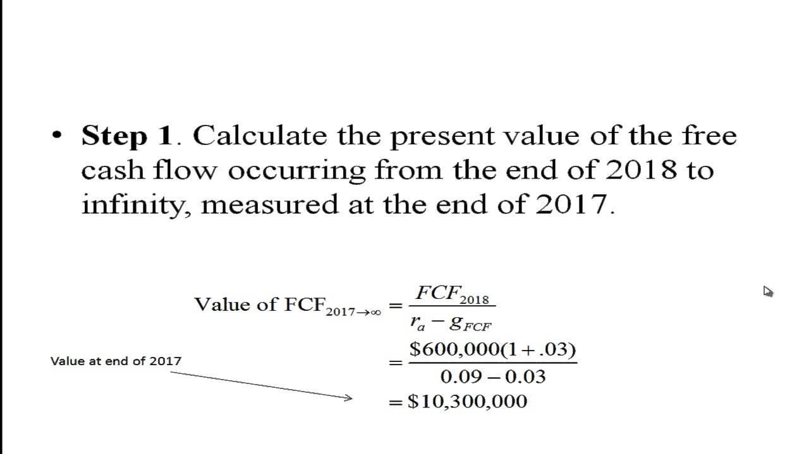

## Table of Contents

## What is firm valuation and why is it important?

Firm valuation is the process of figuring out how much a company is worth. It's like trying to put a price tag on a business. People use different methods to do this, like looking at the company's money coming in and going out, its assets, and how much other similar companies are worth. This helps investors, business owners, and others make smart choices about buying, selling, or investing in the company.

Understanding firm valuation is important for many reasons. For someone thinking about buying a company, knowing its value helps them decide if it's a good deal or if they should look elsewhere. For business owners, knowing the value of their company can help them plan for the future, like when they want to sell the business or bring in new investors. It also helps banks and investors figure out if lending money or investing in the company is a safe bet. Overall, firm valuation helps everyone involved make better financial decisions.

## What are free cash flows and how do they differ from other cash flow types?

Free cash flows are the money a company has left after it pays for everything it needs to keep running and growing. This includes things like buying new equipment or buildings. It's like the extra money in your pocket after you've paid your bills and bought groceries. Free cash flow is important because it shows how much money a company can use for things like paying back loans, buying back its own stock, or giving money back to shareholders.

Free cash flows are different from other types of cash flows, like operating cash flow and investing cash flow. Operating cash flow is the money a company makes from its day-to-day business activities, like selling products or services. It's the money that comes in and goes out just to keep the business going. Investing cash flow, on the other hand, is the money spent on or earned from investments, like buying or selling equipment or other businesses. Free cash flow is what's left after you take the operating cash flow and subtract the money spent on investments needed for the business to grow. So, it gives a clearer picture of the company's financial health and its ability to do more than just keep the lights on.

## How do you calculate free cash flows for a company?

To calculate free cash flows for a company, you start with the operating cash flow, which is the money the company makes from its regular business activities. You can find this number on the company's cash flow statement. Next, you need to subtract the capital expenditures, which are the costs of buying things like new equipment or buildings that the company needs to keep growing. So, free cash flow is basically what's left after you take the operating cash flow and subtract the capital expenditures.

This simple calculation gives you a good idea of how much money the company has left over to do other things, like paying back loans, buying back its own stock, or giving money back to shareholders. It's a useful number because it shows the true financial health of the company, beyond just keeping the business running day to day. By looking at free cash flow, you can see if the company is generating enough extra money to support its growth and other financial goals.

## What is the present value concept and how does it apply to firm valuation?

The present value concept is about figuring out how much money you'll have in the future is worth right now. It's like asking, "If I'm going to get $100 next year, how much is that worth to me today?" This is important because money today is worth more than the same amount of money in the future. That's because you could invest the money you have now and earn more from it over time. To find the present value, you use a discount rate, which is like the [interest rate](/wiki/interest-rate-trading-strategies) you could earn if you invested the money. You take the future money and divide it by 1 plus the discount rate raised to the power of the number of years until you get the money.

In firm valuation, present value helps you figure out how much a company is worth today based on the money it's expected to make in the future. You start by guessing how much money the company will make each year, usually using free cash flows. Then, you use the present value formula to turn those future cash flows into what they're worth right now. By adding up all these present values, you get the total value of the company. This method is called the discounted cash flow (DCF) approach. It's a powerful way to see if a company is a good investment because it shows you what all the future money is worth today, helping you decide if the price you're paying for the company is fair.

## What discount rate should be used when calculating the present value of free cash flows?

When calculating the present value of free cash flows, the discount rate you should use is called the Weighted Average Cost of Capital (WACC). This rate reflects the average cost of all the money the company uses, whether it's from loans or from investors. The WACC takes into account the cost of debt, which is the interest rate the company pays on its loans, and the cost of equity, which is the return investors expect for putting their money into the company. By using the WACC, you get a good idea of the overall cost of the money the company is using to operate and grow.

Choosing the right discount rate is important because it affects how much the future cash flows are worth today. If you use a higher discount rate, the present value of the future cash flows will be lower, meaning the company might seem less valuable. If you use a lower discount rate, the present value will be higher, making the company look more valuable. So, getting the WACC right is key to making a fair and accurate valuation of the company.

## How do you forecast future free cash flows for valuation purposes?

To forecast future free cash flows for valuation, you first need to look at the company's past financial statements to understand its historical performance. You'll look at things like sales, costs, and how much money the company has been making from its operations. From there, you make guesses about how these numbers might change in the future. You think about things like how fast the company might grow, how much it will need to spend on new equipment or buildings, and any big changes in the market or the economy that could affect the company.

Once you have these guesses, you put them into a model that helps you calculate the free cash flows for each future year. You start with the operating cash flow, which is the money the company makes from its day-to-day business, and then subtract the money spent on things like new equipment or buildings, which are called capital expenditures. This gives you the free cash flow for each year. You do this for several years into the future, usually five to ten years, to get a good picture of how much money the company might make over time. This forecast is important because it helps you figure out how much the company is worth today, using the present value concept.

## What are the steps involved in valuing a firm using the present value of free cash flows?

Valuing a firm using the present value of free cash flows starts with looking at the company's past financial statements to understand its history. You look at things like sales, costs, and how much money the company has been making from its operations. From this, you make guesses about how these numbers might change in the future. You think about how fast the company might grow, how much it will need to spend on new equipment or buildings, and any big changes in the market or the economy that could affect the company. Once you have these guesses, you put them into a model to calculate the free cash flows for each future year. You start with the operating cash flow, which is the money the company makes from its day-to-day business, and then subtract the money spent on things like new equipment or buildings, which are called capital expenditures. This gives you the free cash flow for each year. You do this for several years into the future, usually five to ten years, to get a good picture of how much money the company might make over time.

After you have your forecast of future free cash flows, you need to figure out what those future cash flows are worth today. This is where the present value concept comes in. You use a discount rate, which is the Weighted Average Cost of Capital (WACC), to turn the future cash flows into what they're worth right now. The WACC is the average cost of all the money the company uses, whether it's from loans or from investors. You take each year's free cash flow and divide it by 1 plus the WACC raised to the power of the number of years until you get the money. By adding up all these present values, you get the total value of the company. This method, called the discounted cash flow (DCF) approach, helps you see if the company is a good investment by showing you what all the future money is worth today.

## How can terminal value be calculated in the context of free cash flow valuation?

When you're valuing a company using free cash flows, you usually forecast the cash flows for a certain number of years, like five to ten years. But what about all the money the company will make after that? That's where terminal value comes in. Terminal value is a way to guess how much all the future cash flows beyond your forecast period are worth. It's like saying, "Even though we're only looking at the next ten years, the company will keep making money after that, and we need to account for that too."

There are two main ways to calculate terminal value. The first way is called the perpetuity growth method. You take the last year's free cash flow from your forecast and assume it will grow at a steady rate forever. You use a formula that takes this last cash flow, multiplies it by 1 plus the growth rate, and then divides it by the discount rate minus the growth rate. The second way is the [exit](/wiki/exit-strategy) multiple method. Here, you take the last year's free cash flow and multiply it by a number that's common in the industry, like how much other similar companies are worth based on their cash flows. Both methods help you figure out how much all the future money is worth today, so you can add it to your valuation and get a complete picture of the company's value.

## What are common pitfalls and errors to avoid when using free cash flow valuation?

When using free cash flow valuation, it's important to be careful about some common mistakes. One big mistake is making wrong guesses about the future. It's hard to predict how a company will do in the future, but you have to try. If you guess too high or too low, your valuation won't be right. Another mistake is [picking](/wiki/asset-class-picking) the wrong discount rate. The discount rate is like the interest rate you use to figure out how much future money is worth today. If it's too high or too low, it can make a big difference in your valuation. Also, don't forget about the terminal value. This is the money the company will make after your forecast period, and if you don't calculate it right, your valuation will be off.

Another common pitfall is not understanding the company's business well enough. You need to know what the company does, how it makes money, and what might change in the future. If you don't, your guesses about future cash flows won't be good. Also, be careful with how you handle changes in working capital. This is the money the company needs to run day-to-day, and if you don't account for it correctly, it can mess up your free cash flow calculations. Finally, don't ignore the effects of taxes and inflation. These can change how much money the company actually keeps, so you need to include them in your valuation to get a true picture of the company's worth.

## How does the choice of growth rate affect the valuation outcome?

The choice of growth rate can really change how much a company seems to be worth when you're doing a valuation. The growth rate is the guess you make about how fast the company's free cash flows will grow each year. If you pick a high growth rate, it means you think the company will make more and more money over time. This makes the future cash flows bigger, and when you turn those into present value, the company looks more valuable. But if you pick a low growth rate, it means you think the company won't grow much, so the future cash flows are smaller, and the company looks less valuable.

Getting the growth rate right is tricky because it's all about guessing the future. If you're too optimistic and use a growth rate that's too high, you might end up thinking the company is worth more than it really is. This could lead you to pay too much if you're buying the company or investing in it. On the other hand, if you're too cautious and use a growth rate that's too low, you might miss out on a good deal because you think the company is worth less than it really is. So, it's important to think carefully about what the company's future might look like and choose a growth rate that makes sense.

## How can sensitivity analysis be applied to firm valuation using free cash flows?

Sensitivity analysis is a way to see how changes in your guesses can affect the value of a company. When you're using free cash flows to value a company, you make guesses about things like how fast the company will grow, what discount rate to use, and what the terminal value will be. By doing sensitivity analysis, you change these guesses a little bit to see how the company's value changes. For example, you might try a higher growth rate and a lower discount rate to see how much the value goes up, or a lower growth rate and a higher discount rate to see how much it goes down. This helps you understand which guesses are most important and how sure you can be about your valuation.

Using sensitivity analysis can help you make better decisions. When you see how sensitive the company's value is to changes in your guesses, you get a better idea of the risks involved. If the value changes a lot with small changes in your guesses, it means your valuation might not be very reliable. But if the value stays pretty stable even when you change your guesses, you can feel more confident about your valuation. This way, sensitivity analysis helps you see how different scenarios might play out and helps you plan for different possibilities when making investment decisions.

## What are advanced techniques or models that can enhance the accuracy of free cash flow valuation?

To make free cash flow valuation more accurate, you can use advanced techniques like the Monte Carlo simulation. This technique lets you run your valuation model many times with different guesses each time. It's like playing out different futures for the company to see how likely each outcome is. By doing this, you get a range of possible values for the company instead of just one number. This helps you see how much risk there is in your valuation and gives you a better idea of what the company might really be worth.

Another way to improve accuracy is by using scenario analysis. This means you create different stories about what might happen to the company in the future. For example, you might have a "best case" story where everything goes well, a "worst case" story where things go badly, and a "most likely" story that's somewhere in between. By valuing the company under each of these stories, you can see how different events could change its worth. This helps you plan for different possibilities and makes your valuation more robust because it takes into account many different ways the future could go.

## What is the relationship between understanding free cash flows and present value?

Free Cash Flows (FCF) represent the cash that a company generates from its operations after accounting for capital expenditures. It captures the financial surplus available for distribution to investors, including both equity and debt holders. Free Cash Flow is a vital metric in finance as it offers a clear picture of a firm’s operational efficiency and its ability to generate cash. The formula for calculating FCF is given by:

$$
\text{FCF} = \text{Net Income} + \text{Non-Cash Charges} - \text{Changes in Working Capital} - \text{Capital Expenditures}
$$

The concept of Present Value (PV) is crucial in understanding firm valuation. Present Value calculates the current worth of expected future cash flows by discounting them at a particular rate. The discount rate typically reflects the opportunity cost of capital, adjusted for risk. This approach provides investors with a useful measure for evaluating the firm’s worth based on projected cash flow generation.

The formula for Present Value is:

$$
\text{PV} = \sum_{t=1}^{n} \frac{FCF_t}{(1 + r)^t}
$$

where $FCF_t$ is the free cash flow in year $t$, $r$ is the discount rate, and $n$ is the number of periods.

Understanding how to calculate Free Cash Flows and applying Present Value techniques enables investors to assess a firm’s value accurately. By considering both the time value of money and the risk associated with future cash flows, investors can make more informed decisions regarding their investments in the firm.

The application of FCF in valuation involves discounting these cash flows to their present value, thus determining the intrinsic value of the firm. This valuation technique is fundamental for assessing a company's financial health. It helps investors gauge whether the firm is overvalued or undervalued in the market, thereby offering insights into potential investment opportunities. In practice, firms with robust free cash flows and significant growth prospects are often seen as attractive investment opportunities, as they indicate a strong capacity to generate returns and sustain capital growth.

## What are the key components of firm valuation using free cash flows?

Firm valuation using free cash flows is a comprehensive process that requires a meticulous analysis of several financial components, each of which plays a vital role in determining the firm's intrinsic value. By understanding these components, investors can make informed decisions about a firm's financial health and its potential for long-term growth.

### Net Income
Net Income, often referred to as the bottom line, is the profit that remains after all expenses, taxes, and costs have been subtracted from total revenues. It serves as the starting point for calculating Free Cash Flow to the Firm (FCFF). It reflects a company’s profitability and is a crucial indicator of its ability to generate funds that are available for distribution to shareholders and debt holders.

### Non-cash Charges
Non-cash charges encompass expenses such as depreciation and amortization, which do not involve actual cash flow but affect the net income. These charges must be added back to the net income when calculating FCFF. Depreciation, for example, reduces taxable income but does not entail a cash outflow, thus providing a tax shield benefit.

### Interest Expense
Interest Expense is the cost incurred by a firm for borrowed funds. In FCFF calculations, the after-tax interest expense is added back to net income to account for the financing costs of debt. It reflects the portion of earnings required to cover the cost of borrowed capital, influencing the firm's cost of capital used in discounting future cash flows.

### Capital Expenditures
Capital Expenditures (CapEx) are investments in long-term assets that are essential for sustaining or expanding business operations. These expenses are deducted when determining FCFF as they represent cash outflows necessary for maintaining or enhancing the firm's productive capacity. Evaluating a firm’s CapEx provides insights into its commitment to growth and operational expansion.

### Change in Working Capital
The Change in Working Capital considers the difference between current assets and current liabilities over a period. It indicates the firm's efficiency in managing short-term assets and liabilities. An increase in working capital is typically subtracted in the FCFF calculation, as it represents a cash outflow, while a decrease signifies a cash inflow.

### Valuation Process
The valuation of a firm using FCFF can be represented by the following equation:

$$
FCFF = \text{Net Income} + \text{Non-cash Charges} + \text{Interest (1 - Tax Rate)} - \text{Capital Expenditures} - \Delta \text{Working Capital}
$$

The discounted present value of these projected cash flows is calculated using a discount rate that reflects the firm’s capital structure and risk profile, usually the weighted average cost of capital (WACC). This process requires an in-depth understanding of the firm’s operational efficiency and growth prospects, allowing for a more accurate appraisal of its value.

Through careful projections and analysis of these components, investors can gain substantial insights into a company's operational health and future growth trajectory, making FCFF a powerful tool in firm valuation.

## What is the conclusion?

Evaluating firms using the present value of free cash flows (FCFF) remains pivotal in both [fundamental analysis](/wiki/fundamental-analysis) and [algorithmic trading](/wiki/algorithmic-trading) strategies. Free cash flows provide critical insight into a firm's profitability and capacity to generate excess cash that can fuel growth, repay debt, or be returned to shareholders. By effectively leveraging FCFF, traders and investors can significantly enhance their decision-making processes. They can optimize investment outcomes by using this metric to gauge a company’s intrinsic value, thereby aligning trades with market expectations.

A solid understanding of FCF calculations, combined with comprehension of the associated challenges such as data integrity and interpretative flexibility, enables more accurate assessments of a firm's financial health and potential market actions. Analysts typically estimate FCFF using the formula:

$$
\text{FCFF} = \text{Net Income} + \text{Non-cash Charges} + \text{Interest} \times (1 - \text{Tax Rate}) - \text{Change in Working Capital} - \text{Capital Expenditures}
$$

By carefully calculating these variables, investors can forecast future cash flows and discount them to a present value, obtaining a tangible measure of firm value that incorporates risk and time.

Integrating these insights into algorithmic trading systems can streamline operations and significantly improve strategic portfolio management. Algorithms can automatically compare the calculated intrinsic value of stocks to their market prices, triggering trades based on deviations that represent potential gains or losses. This data-driven approach allows for dynamic rebalancing of portfolios and optimal risk management.

The synergy between firm valuation models and trading technologies opens new avenues for financial successes driven by data analysis. By merging the rigorous analysis of FCFF with the computational power of algorithmic trading, market participants can achieve superior financial results, efficiently manage portfolios, and dynamically adjust to market changes. This combination leverages the precision of financial models with the speed and scale of automated systems, offering a substantial edge in contemporary financial markets.

## References & Further Reading

Damodaran, A. (1999). *Valuing young, start-up and growth companies: Estimation issues and valuation challenges*. This work explores the unique challenges associated with valuing early-stage companies, which often lack historical financial data and exhibit high growth potential yet face significant risks. It provides methodologies for estimating values in scenarios of informational scarcity and market [volatility](/wiki/volatility-trading-strategies).

Vernimmen, P., Quiry, P., Dallocchio, M., & Le Fur, Y. (2021). *Corporate Finance: Theory and Practice*. This comprehensive guide covers corporate finance principles and offers insights into practical applications. It includes detailed discussions on the valuation techniques, including those using free cash flows, providing a foundational understanding crucial for assessing firm value.

Tvede, L. (1998). *The Psychology of Finance: Understanding the Behavioral Dynamics of Markets*. This book investigates into the psychological factors that influence market dynamics and investor behavior. Understanding these aspects is critical for evaluating how market sentiments can affect firm valuation and trading strategies.

Brealey, R. A., Myers, S. C., & Allen, F. *Principles of Corporate Finance*. This authoritative text presents fundamental corporate finance concepts, with emphasis on methodologies such as discounted cash flow analysis for valuating firms. It provides a rigorous treatment of financial principles necessary for sound investment decision-making.

Harris, R. S. (1986). *Using Cash Flow Data to Value Firms*. This paper discusses the intricacies of using cash flow data for firm valuation, focusing on the advantages and limitations of cash-based metrics. It underscores the importance of accurate cash flow analysis in financial assessments and valuation processes.

