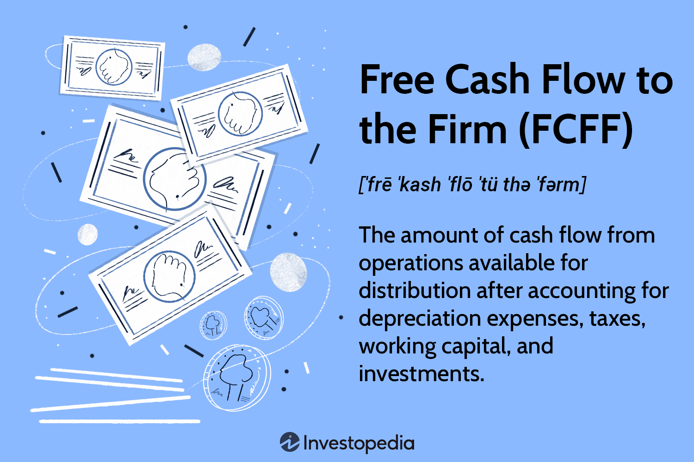

In today's dynamic financial landscape, understanding how firms are valued using the present value of free cash flows is crucial for both fundamental analysis and algorithmic trading. Firm valuation based on present value and free cash flows offers a vital perspective on a company's financial health and investment potential. This technique helps in estimating the intrinsic value of a firm by projecting its future cash flows and discounting them to their present value using an appropriate discount rate. The importance of firm valuation methods lies in their ability to provide investors with a clearer picture of the firm's potential for growth and profitability.

Incorporating these valuation techniques within algorithmic trading systems enhances the ability of investors to make informed, data-driven decisions. Algorithmic trading, known for its use of complex mathematical models and high-speed computations, can benefit significantly from the analytical depth provided by free cash flow valuation approaches. By integrating these valuation models, investors can improve stock selection processes, optimize portfolio performance, and strategically manage risks. This not only fosters superior investment outcomes but also aligns trading strategies with the fundamental value of securities.



This article aims to provide a comprehensive guide on using free cash flows for valuing firms and enhancing trading strategies through automated systems. The focus will be on understanding the key components involved in calculating free cash flows, such as operational efficiency, capital expenditures, and income adjustments, while addressing the challenges associated with these calculations. Essential aspects such as accounting manipulations, data accuracy, and expenditure interpretations will be discussed to ensure precise and reliable firm valuations.

Furthermore, the article will explore practical examples of integrating these concepts into trading algorithms, demonstrating the synergy between firm valuation models and algorithmic trading technologies. The fusion of these elements opens new avenues for data-driven financial successes, providing investors with a robust framework for evaluating financial status and making proactive market actions.

## Table of Contents

## Understanding Free Cash Flows and Present Value

Free Cash Flows (FCF) represent the cash that a company generates from its operations after accounting for capital expenditures. It captures the financial surplus available for distribution to investors, including both equity and debt holders. Free Cash Flow is a vital metric in finance as it offers a clear picture of a firm’s operational efficiency and its ability to generate cash. The formula for calculating FCF is given by:

$$
\text{FCF} = \text{Net Income} + \text{Non-Cash Charges} - \text{Changes in Working Capital} - \text{Capital Expenditures}
$$

The concept of Present Value (PV) is crucial in understanding firm valuation. Present Value calculates the current worth of expected future cash flows by discounting them at a particular rate. The discount rate typically reflects the opportunity cost of capital, adjusted for risk. This approach provides investors with a useful measure for evaluating the firm’s worth based on projected cash flow generation.

The formula for Present Value is:

$$
\text{PV} = \sum_{t=1}^{n} \frac{FCF_t}{(1 + r)^t}
$$

where $FCF_t$ is the free cash flow in year $t$, $r$ is the discount rate, and $n$ is the number of periods.

Understanding how to calculate Free Cash Flows and applying Present Value techniques enables investors to assess a firm’s value accurately. By considering both the time value of money and the risk associated with future cash flows, investors can make more informed decisions regarding their investments in the firm.

The application of FCF in valuation involves discounting these cash flows to their present value, thus determining the intrinsic value of the firm. This valuation technique is fundamental for assessing a company's financial health. It helps investors gauge whether the firm is overvalued or undervalued in the market, thereby offering insights into potential investment opportunities. In practice, firms with robust free cash flows and significant growth prospects are often seen as attractive investment opportunities, as they indicate a strong capacity to generate returns and sustain capital growth.

## Key Components of Firm Valuation Using Free Cash Flows

Firm valuation using free cash flows is a comprehensive process that requires a meticulous analysis of several financial components, each of which plays a vital role in determining the firm's intrinsic value. By understanding these components, investors can make informed decisions about a firm's financial health and its potential for long-term growth.

### Net Income
Net Income, often referred to as the bottom line, is the profit that remains after all expenses, taxes, and costs have been subtracted from total revenues. It serves as the starting point for calculating Free Cash Flow to the Firm (FCFF). It reflects a company’s profitability and is a crucial indicator of its ability to generate funds that are available for distribution to shareholders and debt holders.

### Non-cash Charges
Non-cash charges encompass expenses such as depreciation and amortization, which do not involve actual cash flow but affect the net income. These charges must be added back to the net income when calculating FCFF. Depreciation, for example, reduces taxable income but does not entail a cash outflow, thus providing a tax shield benefit.

### Interest Expense
Interest Expense is the cost incurred by a firm for borrowed funds. In FCFF calculations, the after-tax interest expense is added back to net income to account for the financing costs of debt. It reflects the portion of earnings required to cover the cost of borrowed capital, influencing the firm's cost of capital used in discounting future cash flows.

### Capital Expenditures
Capital Expenditures (CapEx) are investments in long-term assets that are essential for sustaining or expanding business operations. These expenses are deducted when determining FCFF as they represent cash outflows necessary for maintaining or enhancing the firm's productive capacity. Evaluating a firm’s CapEx provides insights into its commitment to growth and operational expansion.

### Change in Working Capital
The Change in Working Capital considers the difference between current assets and current liabilities over a period. It indicates the firm's efficiency in managing short-term assets and liabilities. An increase in working capital is typically subtracted in the FCFF calculation, as it represents a cash outflow, while a decrease signifies a cash inflow.

### Valuation Process
The valuation of a firm using FCFF can be represented by the following equation:

$$
FCFF = \text{Net Income} + \text{Non-cash Charges} + \text{Interest (1 - Tax Rate)} - \text{Capital Expenditures} - \Delta \text{Working Capital}
$$

The discounted present value of these projected cash flows is calculated using a discount rate that reflects the firm’s capital structure and risk profile, usually the weighted average cost of capital (WACC). This process requires an in-depth understanding of the firm’s operational efficiency and growth prospects, allowing for a more accurate appraisal of its value.

Through careful projections and analysis of these components, investors can gain substantial insights into a company's operational health and future growth trajectory, making FCFF a powerful tool in firm valuation.

## Applying Valuation Methods in Algorithmic Trading

Algorithmic trading, a cornerstone of modern financial markets, can significantly benefit from the integration of firm valuation methods, particularly those based on free cash flows (FCF). This approach allows for the automation of stock selection and optimization of portfolio performance through data-driven strategies. By harnessing the power of Free Cash Flow to Firm (FCFF) metrics, [algorithmic trading](/wiki/algorithmic-trading) systems can effectively assess a company's financial health, guiding investment decisions and risk management.

### Integrating FCFF in Algorithmic Trading

1. **Automated Stock Selection:** 
Algorithmic trading systems can automatically evaluate and select stocks based on FCFF metrics. By discounting future free cash flows to present value using a firm’s weighted average cost of capital (WACC), algorithms can determine a firm’s intrinsic value. This intrinsic value is then compared to the current market price, guiding trading decisions such as buying undervalued stocks or selling overvalued ones.

   ```python
   def calculate_fcff(net_income, non_cash_charges, interest_expense, capital_expenditures, change_in_working_capital):
       return net_income + non_cash_charges + interest_expense - capital_expenditures - change_in_working_capital

   def calculate_present_value(fcf_values, discount_rate):
       pv = 0
       for t in range(len(fcf_values)):
           pv += fcf_values[t] / ((1 + discount_rate) ** (t + 1))
       return pv
   ```

2. **Portfolio Optimization:**
Algorithms can optimize portfolio composition by dynamically adjusting holdings based on the calculated FCFF and corresponding intrinsic values. This optimization takes into account both the expected return and the risk associated with the firm’s cash flow projections, allowing for efficient capital allocation.

3. **Strategic Investment and Risk Management:**
By continuously monitoring FCFF data, algorithmic systems can adjust investment positions in response to changes in a firm’s financial condition or market environment. This data-driven approach ensures timely strategic positioning, minimizes risks, and aligns with investment objectives.

### Practical Examples 

- **Mean-Variance Optimization Algorithms:** By incorporating FCFF valuations, these algorithms can improve the selection of assets to maximize expected return for a given risk level, or equivalently, minimize risk for a given level of expected return.

  ```python
  def mean_variance_optimization(expected_returns, cov_matrix, target_return):
      # Implementation of optimization logic here
      pass
  ```

- **Event-Driven Strategies:** Algorithms triggered by specific corporate events (like earnings reports) can be refined using FCFF analysis, ensuring decisions are grounded in comprehensive financial evaluations rather than purely market-driven signals.

### Conclusion

The integration of firm valuation methods based on free cash flows into algorithmic trading systems offers a sophisticated means to enhance trading strategies. By leveraging FCFF metrics, traders can automate complex processes, strategically adjust portfolios, and manage risks effectively. The ability to quantitatively assess firm health within trading algorithms marks a significant advancement in the pursuit of data-driven financial success.

## Challenges and Considerations

Using free cash flows (FCF) for firm valuation is a valuable approach, but it is not without challenges that necessitate careful attention. These challenges can influence the accuracy and reliability of Free Cash Flow to Firm (FCFF) calculations and, consequently, investment decisions.

One primary challenge is creative accounting. Companies may resort to accounting practices designed to embellish their financial health, which can affect the reported cash flows. This manipulation might leave investors with an inaccurate picture of the firm's actual financial position. To mitigate this risk, investors should closely examine the footnotes of financial statements and seek transparency regarding non-operational activities, such as asset sales or restructuring costs that might be presented in the FCF calculations.

Data accuracy is another significant concern. The reliability of FCF calculations heavily depends on the quality and precision of the underlying financial data. Discrepancies or errors in this data can drastically alter the outcome of the valuation. Ensuring data integrity requires due diligence, such as cross-verifying figures from multiple sources and periodically revisiting reported historical data.

Furthermore, the varying interpretations of expenditures can lead to inconsistent FCF calculations. For instance, capital expenditures might be categorized differently across companies or industries, impacting the subsequent FCF projections. Standardized accounting practices and guidelines help, but inconsistencies may still arise, necessitating a contextual understanding of industry norms and company-specific accounting policies.

Investors must also be vigilant about potential manipulations in financial reports and extraordinary events, such as economic recessions or significant market disruptions, which can skew FCF estimates. These events require adjustments to normalize the impact on cash flows. Sensitivity analyses and scenario planning are useful techniques for assessing the potential effects of different economic conditions on FCF projections.

In conclusion, while free cash flows provide an insightful way to value firms, their application is fraught with challenges. Investors must be cautious of creative accounting, ensure data accuracy, and account for diverse interpretations of expenditures. By engaging in thorough due diligence and adopting robust analytical practices, they can mitigate some of these risks and make more informed investment decisions.

## Conclusion

Evaluating firms using the present value of free cash flows (FCFF) remains pivotal in both [fundamental analysis](/wiki/fundamental-analysis) and algorithmic trading strategies. Free cash flows provide critical insight into a firm's profitability and capacity to generate excess cash that can fuel growth, repay debt, or be returned to shareholders. By effectively leveraging FCFF, traders and investors can significantly enhance their decision-making processes. They can optimize investment outcomes by using this metric to gauge a company’s intrinsic value, thereby aligning trades with market expectations.

A solid understanding of FCF calculations, combined with comprehension of the associated challenges such as data integrity and interpretative flexibility, enables more accurate assessments of a firm's financial health and potential market actions. Analysts typically estimate FCFF using the formula:

$$
\text{FCFF} = \text{Net Income} + \text{Non-cash Charges} + \text{Interest} \times (1 - \text{Tax Rate}) - \text{Change in Working Capital} - \text{Capital Expenditures}
$$

By carefully calculating these variables, investors can forecast future cash flows and discount them to a present value, obtaining a tangible measure of firm value that incorporates risk and time.

Integrating these insights into algorithmic trading systems can streamline operations and significantly improve strategic portfolio management. Algorithms can automatically compare the calculated intrinsic value of stocks to their market prices, triggering trades based on deviations that represent potential gains or losses. This data-driven approach allows for dynamic rebalancing of portfolios and optimal risk management.

The synergy between firm valuation models and trading technologies opens new avenues for financial successes driven by data analysis. By merging the rigorous analysis of FCFF with the computational power of algorithmic trading, market participants can achieve superior financial results, efficiently manage portfolios, and dynamically adjust to market changes. This combination leverages the precision of financial models with the speed and scale of automated systems, offering a substantial edge in contemporary financial markets.

## References & Further Reading

Damodaran, A. (1999). *Valuing young, start-up and growth companies: Estimation issues and valuation challenges*. This work explores the unique challenges associated with valuing early-stage companies, which often lack historical financial data and exhibit high growth potential yet face significant risks. It provides methodologies for estimating values in scenarios of informational scarcity and market [volatility](/wiki/volatility-trading-strategies).

Vernimmen, P., Quiry, P., Dallocchio, M., & Le Fur, Y. (2021). *Corporate Finance: Theory and Practice*. This comprehensive guide covers corporate finance principles and offers insights into practical applications. It includes detailed discussions on the valuation techniques, including those using free cash flows, providing a foundational understanding crucial for assessing firm value.

Tvede, L. (1998). *The Psychology of Finance: Understanding the Behavioral Dynamics of Markets*. This book investigates into the psychological factors that influence market dynamics and investor behavior. Understanding these aspects is critical for evaluating how market sentiments can affect firm valuation and trading strategies.

Brealey, R. A., Myers, S. C., & Allen, F. *Principles of Corporate Finance*. This authoritative text presents fundamental corporate finance concepts, with emphasis on methodologies such as discounted cash flow analysis for valuating firms. It provides a rigorous treatment of financial principles necessary for sound investment decision-making.

Harris, R. S. (1986). *Using Cash Flow Data to Value Firms*. This paper discusses the intricacies of using cash flow data for firm valuation, focusing on the advantages and limitations of cash-based metrics. It underscores the importance of accurate cash flow analysis in financial assessments and valuation processes.

