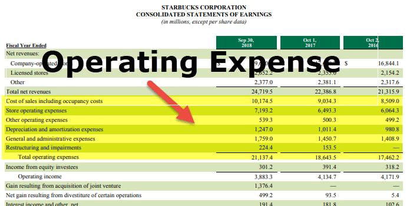

The First Amendment of the United States Constitution is a cornerstone of American constitutional rights, prominently ensuring the freedom of speech among several other critical liberties. Its significance is heightened in the contemporary era characterized by rapid technological development and pervasive digital communication. This transformation is particularly evident in the arena of algorithmic trading. As trading technologies have evolved, so too have the dialogues surrounding these algorithms—defined sequences of instructions designed for computation—where their regulation intersects with free speech rights.

Algorithmic trading employs computer algorithms to execute trades at speeds and frequencies that are beyond human capability. The involvement of these algorithms raises important questions about the application of First Amendment freedoms to the financial markets. The debate centers on whether these complex sequences of computer code can be considered a form of expression, thereby warranting protection under the First Amendment.

The principles of free expression are rigorously tested in this modern context where technology and finance intersect. The paramount question is whether the programming and execution of algorithmic trading strategies constitute a form of speech that merits constitutional protection, or if they are merely mechanical processes devoid of intent or message.

To fully understand this intersection, it is crucial to examine various examples and case law where issues of constitutional rights intersect with digital technologies and economic activities. Such analysis will provide insight into how traditional legal principles are being interpreted and adapted to address the unique challenges posed by advances in technology. This exploration is not only vital for understanding current legal standards but also for shaping future approaches to maintaining the balance between safeguarding individual rights and ensuring regulatory compliance in rapidly evolving technological landscapes.

## Table of Contents

## Understanding the First Amendment

The First Amendment to the United States Constitution is an integral part of the Bill of Rights, crucially safeguarding several key freedoms: religion, speech, press, assembly, and the right to petition the government. Among these provisions, the guarantee of freedom of speech plays a pivotal role in ensuring an open and democratic society. The First Amendment explicitly prohibits the government from enacting laws that would abridge these freedoms, effectively securing the right to free expression and the press against governmental intrusions.

Notwithstanding these comprehensive protections, the rights enshrined in the First Amendment are not unequivocal. There exist well-defined exceptions where speech may not be shielded by constitutional protections. For example, speech that incites imminent violence or lawless action, known as incitement, does not garner protection under the First Amendment. This principle was famously articulated in the landmark Supreme Court case Brandenburg v. Ohio (1969), which established the imminent lawless action test. Similarly, defamatory speech—false statements about a person that cause harm to their reputation—falls outside the ambit of protected speech, as elucidated in the case of New York Times Co. v. Sullivan (1964), which introduced the "actual malice" standard for public figures.

Understanding these exceptions is essential when exploring the nuances of free speech, particularly as these principles are applied to contemporary issues in digital spaces. With the rapid expansion of digital communication technologies, new challenges arise regarding the balance between free expression and other competing interests, such as national security and public welfare. These challenges necessitate a nuanced interpretation of the First Amendment that accommodates modern modalities of communication, such as online speech and algorithmic decision-making.

The ongoing evolution of technology and digital platforms presents unique cases where traditional interpretations of free speech may be tested, necessitating careful judicial consideration and potentially recalibrated legal frameworks to appropriately manage the complexities of free expression in an increasingly digital society.

## Algorithmic Trading: A New Age of Digital Expression?

Algorithmic trading involves the deployment of computer algorithms to execute trading decisions, a practice that has undergone rapid growth and now dominates financial markets worldwide. These algorithms can process vast amounts of data more quickly and efficiently than human traders, enabling them to make rapid decisions that can capitalize on fleeting market opportunities.

Proponents of [algorithmic trading](/wiki/algorithmic-trading) argue that these algorithms should be viewed as extensions of human expression, embodying the strategies and innovations devised by their creators. By this reasoning, algorithms could be perceived as a form of expression eligible for protection under the First Amendment, which safeguards freedom of speech. The argument hinges upon recognizing the code as a medium through which human intellect and creativity are conveyed, thereby necessitating similar protections as other forms of intellectual output.

On the other hand, critics express concerns regarding the systemic risks posed by algorithmic trading to financial markets. The Flash Crash of 2010 is frequently cited, where the Dow Jones Industrial Average plummeted about 1,000 points within minutes, largely attributed to high-frequency trading algorithms. Such events have highlighted the potential fragility introduced by algorithm-driven trades, raising questions about their reliability and the potential for manipulation or error, which could have destabilizing effects on global markets.

These critics argue against extending First Amendment protections to algorithmic processes, pointing out that automated systems operate without direct human intervention once they are set in motion. In this view, algorithms lack the nuanced human discernment that traditionally characterizes protected speech, thus placing them outside the intended purview of constitutional safeguards.

The debate over whether algorithmic trading should be considered a new form of digital expression protected by free speech rights reflects broader questions about how emerging technologies intersect with traditional legal frameworks. As algorithmic trading strategies become more sophisticated, this conversation continues to evolve, balancing innovation with the imperative to maintain financial system stability.

## Case Studies and Legal Precedents

Several landmark cases have significantly influenced the discourse on freedom of speech concerning digital and economic activities, establishing critical legal precedents. A pivotal case, Schenck v. United States (1919), introduced the “clear and present danger” test, which has been instrumental in defining the boundaries between free speech and national security. In this case, the Supreme Court held that speech that presents a clear and present danger to the nation's security is not protected by the First Amendment. This decision laid the groundwork for examining situations where speech could cause significant harm, thus necessitating limitations.

In the context of private sector employment, the firing of Google employee James Damore in 2017 brought the conversation on free speech into the corporate world. Damore was terminated after distributing a memo that criticized Google's diversity policies. This case raised essential questions about the extent to which free speech is protected within private companies and highlighted the tension between individual expression and corporate values. The controversy underscored the challenge of reconciling free speech rights with organizational policies promoting workplace inclusivity.

These cases are illustrative of the evolving interpretations of the First Amendment as new technologies and societal norms emerge. While the Schenck case addressed speech in the context of national security, the Damore incident reflects modern-day issues where expression intersects with digital communication and private corporate governance. As technological advancements continue to influence both economic activities and individual expression, judicial interpretations of the First Amendment must adapt to address the complexities arising within these new paradigms.

Understanding these legal precedents is crucial for comprehending how constitutional protections evolve alongside technological advancements. As the landscape of free speech changes, the judiciary remains a pivotal player in delineating the boundaries of expression, ensuring that fundamental rights are maintained while addressing the implications of modern innovations.

## The Regulatory Landscape of Algo Trading

Regulation in financial markets, particularly concerning algorithmic trading, is centered on ensuring fairness and minimizing risks. This regulatory environment addresses various challenges, including potential conflicts with free speech rights. The primary goal is to maintain market integrity and protect investors while accommodating technological advancements.

The U.S. Securities and Exchange Commission (SEC), along with other regulatory bodies like the Commodity Futures Trading Commission (CFTC), plays a crucial role in overseeing trading practices. These institutions have established frameworks to monitor and regulate the use of trading algorithms. Concerns about manipulation and systemic risks necessitate certain constraints on how these algorithms operate. For example, the SEC's Market Access Rule (Rule 15c3-5) requires that broker-dealers have adequate risk management controls to prevent erroneous trades that could disrupt the financial market.

The challenge lies in balancing these regulatory measures with the need to foster innovation and free expression in the development of algorithmic trading strategies. Critics argue that overly stringent rules may stifle creativity and advancement within the field, potentially hindering the potential benefits of sophisticated trading algorithms. On the other hand, regulators must ensure that the automated systems do not compromise the stability of financial markets.

Analysts often debate the extent to which current regulations might limit the expression of innovative algorithmic designs. The discourse involves finding ways to uphold constitutional rights, like free speech, while maintaining robust oversight to protect market participants and the broader economic system.

As algorithmic trading grows, both in complexity and prevalence, the ongoing dialogue between regulatory bodies, financial institutions, and technology developers will be crucial. This discussion seeks to establish a framework that respects constitutional rights and encourages innovation while safeguarding market integrity and preventing adverse effects on the financial system.

## Balancing Free Expression and Market Integrity

Finding the equilibrium between protecting free expression and ensuring market integrity remains a pivotal and challenging dialogue in the evolving landscape of algorithmic trading. As financial markets increasingly rely on complex algorithms, the need for regulatory approaches that safeguard innovation while maintaining financial stability becomes more critical. 

Algorithmic trading, driven by sophisticated mathematical models and automation, introduces questions about the role of free expression within the digital sphere. On one hand, algorithms can be seen as a form of expression or speech, encapsulating the strategic intent and intellectual imprint of their creators. On the other hand, the potential risks posed by unfettered algorithmic activity necessitate scrutiny and oversight to prevent market manipulation and systemic failures.

Regulatory bodies such as the U.S. Securities and Exchange Commission (SEC) have instituted frameworks to oversee algorithmic trading practices. These frameworks aim to strike a balance by imposing limits designed to curb excessive risk-taking and ensure transparency. However, the rapid pace of technological advancement often complicates the regulatory landscape. New trading technologies and strategies continually challenge existing rules, necessitating adaptive responses from regulators.

Future discussions are likely to focus on developing standards that respect constitutional rights without compromising market integrity. This includes engaging in technological impact assessments, fostering collaboration between technologists, regulators, and legal experts, and promoting ethical algorithm design. The development of such standards could involve mechanisms like "sandbox" environments, where innovative trading strategies can be tested under controlled conditions without immediate regulatory repercussions.

Ensuring robust ethical boundaries will also be crucial. Ethical considerations address not only the fairness and transparency of algorithms but also their broader societal impacts, such as equity in access to opportunities enabled by financial markets. As the dialogue moves forward, it will be essential for legal frameworks to flexibly adapt to protect both freedom of speech and the economic infrastructures that underpin global finance. 

Ultimately, achieving a harmonious relationship between innovation and regulation in algorithmic trading is an ongoing process that must accommodate both the need for liberty in entrepreneurial expression and the imperative of maintaining a stable, fair, and reliable financial system.

## Conclusion

The intersection of First Amendment rights and algorithmic trading encapsulates the dynamic challenges emerging from technological progress. Algorithmic trading, driven by complex algorithms and high-speed data processing, raises pertinent questions about the application of free speech protections to digital algorithms. This intersection demands a nuanced legal approach that comprehends not only the technical mechanics of algorithms but also their economic and ethical dimensions.

Legally, the challenge lies in distinguishing between the expressive elements of algorithmic trading—a domain historically protected under free speech—and the operational aspects, which may require regulation for market stability. This balance between expression and regulation becomes critical as algorithms increasingly influence the financial market landscape, often with global impacts.

Economically, the implications of treating algorithms as a form of speech extend into market innovation and competition. Protecting algorithms under free speech could encourage innovation by granting developers broader latitude to experiment and implement novel financial strategies. However, this must be weighed against potential risks of unchecked automation, including market manipulation and systemic instability.

Ethically, there is a need to ensure that algorithmic trading practices align with societal values, fostering transparency and accountability. This includes considering the social impacts of trading algorithms, such as their role in exacerbating inequality or contributing to financial crises.

As algorithmic trading continues to evolve, it is vital for legal frameworks to adapt thoughtfully. This adaptation involves crafting policies that uphold fundamental rights, such as free speech, while recognizing the necessity of regulatory oversight to maintain fair and stable markets. The ongoing dialogue between legal scholars, economists, technologists, and policymakers will be pivotal in shaping a future where technological advancements are harmonized with constitutional principles and public interest.

## References & Further Reading

[1]: Schauer, F. (1982). "Free Speech: A Philosophical Enquiry". Cambridge University Press.

[2]: Balkin, J. M. (2004). ["Digital Speech and Democratic Culture: A Theory of Freedom of Expression for the Information Society"](https://papers.ssrn.com/sol3/papers.cfm?abstract_id=470842). New York University Law Review, 79(1).

[3]: Hasbrouck, J. & Saar, G. (2013). ["Low-Latency Trading"](https://www.sciencedirect.com/science/article/abs/pii/S1386418113000165). The Review of Financial Studies, 26(9), 3276-3321.

[4]: Securities and Exchange Commission (SEC) (2010). ["Concept Release on Equity Market Structure"](https://www.sec.gov/rules-regulations/2010/01/concept-release-equity-market-structure). 

[5]: Patterson, S. (2013). ["Dark Pools: High-Speed Traders, A.I. Bandits, and the Threat to the Global Financial System"](https://dl.acm.org/doi/10.5555/2385786). Crown Business.