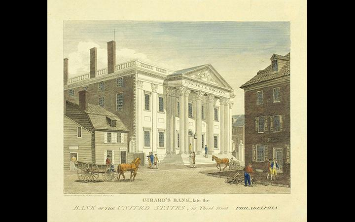

## Table of Contents

## What was the First Bank of the United States?

The First Bank of the United States was a bank created by the U.S. government in 1791. It was set up to help manage the country's money and debts. Alexander Hamilton, who was the Secretary of the Treasury at the time, thought it was a good idea. The bank was in Philadelphia and had branches in other cities too.

The bank helped the government by keeping its money safe and lending money to the government when it needed it. It also helped businesses by giving them loans. Some people liked the bank because it made the country's money more stable. But others didn't like it because they thought it gave too much power to a few people. The bank's charter, or permission to operate, lasted for 20 years and ended in 1811. After that, the bank closed down.

## When was the First Bank of the United States established?

The First Bank of the United States was established in 1791. It was created by the U.S. government to help manage the country's money and debts. Alexander Hamilton, who was the Secretary of the Treasury at that time, came up with the idea. The bank was located in Philadelphia and also had branches in other cities.

The bank played an important role in keeping the government's money safe and lending money to the government when needed. It also helped businesses by giving them loans. Some people supported the bank because it made the country's money more stable. However, others opposed it because they believed it gave too much power to a few people. The bank operated for 20 years until its charter expired in 1811, after which it closed down.

## Who proposed the creation of the First Bank of the United States?

Alexander Hamilton proposed the creation of the First Bank of the United States. He was the Secretary of the Treasury at that time. Hamilton thought the bank would help the country manage its money and debts better. He believed it would make the country's money more stable and help businesses grow.

The First Bank of the United States was set up in 1791. It was located in Philadelphia and had branches in other cities too. The bank kept the government's money safe and lent money to the government when it needed it. It also gave loans to businesses. Some people liked the bank because it helped stabilize the country's money. But others didn't like it because they thought it gave too much power to a few people. The bank operated for 20 years until its charter ended in 1811, and then it closed down.

## What was the primary purpose of the First Bank of the United States?

The main reason for creating the First Bank of the United States was to help manage the country's money and debts. Alexander Hamilton, who was the Secretary of the Treasury at the time, came up with the idea. He thought the bank would make the country's money more stable and help the government keep track of its finances better. The bank was set up in 1791 and was located in Philadelphia, with branches in other cities too.

The bank did several important things. It kept the government's money safe and lent money to the government when it needed it. It also gave loans to businesses, which helped them grow. Some people liked the bank because it made the country's money more stable. But others didn't like it because they thought it gave too much power to a few people. The bank operated for 20 years until its charter ended in 1811, after which it closed down.

## How did the First Bank of the United States function as a central bank?

The First Bank of the United States worked a lot like a central bank. It was set up in 1791 to help the U.S. government manage its money and debts. Alexander Hamilton, who was the Secretary of the Treasury, thought it was a good idea. The bank kept the government's money safe and lent money to the government when it needed it. It also helped make the country's money more stable by controlling how much money was in circulation.

The bank also gave loans to businesses, which helped them grow. It had branches in different cities, so it could reach more people. Some people liked the bank because it made the country's money more stable. But others didn't like it because they thought it gave too much power to a few people. The bank worked for 20 years until its charter ended in 1811, and then it closed down.

## What were the key features of the First Bank of the United States' structure?

The First Bank of the United States was set up in 1791 to help manage the country's money and debts. It was located in Philadelphia but also had branches in other cities. This allowed the bank to reach more people and businesses across the country. The bank was partly owned by the government, which owned 20% of the shares, and partly by private investors, who owned the other 80%. This mix of ownership was important because it helped the bank work closely with the government while also involving private money.

The bank had a board of directors that made important decisions. Some directors were chosen by the government, and others were chosen by the private shareholders. This helped make sure the bank was run fairly and considered both public and private interests. The bank also had the power to issue banknotes, which acted like money, and to control how much money was in circulation. This helped keep the country's money stable. The bank's charter, or permission to operate, lasted for 20 years and ended in 1811, after which the bank closed down.

## How was the First Bank of the United States funded?

The First Bank of the United States was funded by a mix of government and private money. The U.S. government owned 20% of the bank's shares, while private investors owned the other 80%. This mix of ownership helped the bank work closely with the government while also involving private money. The bank was set up in 1791, and it was located in Philadelphia with branches in other cities.

The bank's funding came from selling these shares to investors. The money raised from selling the shares was used to start the bank and to [carry](/wiki/carry-trading) out its operations. The bank used this money to keep the government's money safe, lend money to the government when it needed it, and give loans to businesses. This helped the bank play an important role in managing the country's money and debts.

## What role did the First Bank of the United States play in the early American economy?

The First Bank of the United States played a big role in the early American economy. It was set up in 1791 to help the government manage its money and debts. Alexander Hamilton, who was the Secretary of the Treasury, thought it was a good idea. The bank kept the government's money safe and lent money to the government when it needed it. It also gave loans to businesses, which helped them grow. The bank had branches in different cities, so it could reach more people and businesses across the country.

The bank also helped make the country's money more stable. It did this by controlling how much money was in circulation and issuing banknotes, which acted like money. Some people liked the bank because it made the country's money more stable. But others didn't like it because they thought it gave too much power to a few people. The bank worked for 20 years until its charter ended in 1811, and then it closed down. Even though it didn't last long, the First Bank of the United States played an important role in the early American economy.

## How did the First Bank of the United States influence monetary policy?

The First Bank of the United States had a big impact on how the country managed its money. It was set up in 1791 to help the government keep its money safe and lend money when needed. The bank also had the power to control how much money was in circulation. By doing this, it could help make the country's money more stable. For example, if there was too much money around, the bank could take some out of circulation to stop prices from going up too fast. If there wasn't enough money, the bank could put more into circulation to help businesses grow.

Some people liked the bank because it helped keep the economy stable. But others didn't like it because they thought it gave too much power to the people who ran the bank. The bank's ability to issue banknotes, which acted like money, was a big part of how it influenced monetary policy. By controlling these banknotes, the First Bank could affect how much money people had and how they spent it. The bank worked for 20 years until its charter ended in 1811, but during that time, it played an important role in shaping early American monetary policy.

## What were the major criticisms and controversies surrounding the First Bank of the United States?

The First Bank of the United States faced a lot of criticism and controversy. One big issue was that some people thought the bank gave too much power to a few people. They worried that the bank's directors, who were chosen by the government and private shareholders, might not always make decisions that were good for everyone. Some people, like Thomas Jefferson and James Madison, thought the bank was not even legal under the Constitution. They argued that the Constitution did not give the government the right to create a bank like this.

Another major criticism was about how the bank affected the economy. Some people believed the bank favored rich people and big businesses over regular folks. They thought the bank's ability to control how much money was in circulation could be used to make money for the bank's owners, not to help the whole country. There were also worries that the bank's banknotes, which acted like money, might not always be worth the same amount, which could cause problems for people who used them. These criticisms and controversies played a big role in why the bank's charter was not renewed in 1811, leading to its closure.

## How did the First Bank of the United States impact the development of the U.S. financial system?

The First Bank of the United States, set up in 1791, played a big role in shaping the U.S. financial system. It helped the government manage its money and debts by keeping the government's money safe and lending money when needed. The bank also gave loans to businesses, which helped them grow. By having branches in different cities, the bank could reach more people and businesses across the country. This helped create a more connected financial system where money could move more easily from one place to another.

The bank also influenced how the country's money worked. It had the power to control how much money was in circulation, which helped make the country's money more stable. The bank issued banknotes that acted like money, and by controlling these, it could affect how much money people had and how they spent it. Even though the bank only lasted for 20 years until its charter ended in 1811, it set an example for future banks and helped lay the groundwork for the U.S. financial system we have today.

## What led to the eventual demise of the First Bank of the United States?

The First Bank of the United States closed down because its charter, or permission to operate, ended in 1811 and was not renewed. Many people had different opinions about the bank. Some thought it was good because it helped keep the country's money stable and helped businesses grow. But others didn't like it because they thought it gave too much power to a few people. These people, including Thomas Jefferson and James Madison, argued that the bank was not even legal under the Constitution.

The controversy over the bank's power and its impact on the economy played a big role in why the charter was not renewed. Some people believed the bank favored rich people and big businesses over regular folks. They worried that the bank's ability to control how much money was in circulation could be used to make money for the bank's owners, not to help the whole country. In the end, these criticisms and the political disagreements led to the bank's closure in 1811.

## References & Further Reading

[1]: Hammond, B. (1957). "Banking in the Early Republic: The First and Second Banks of the United States, 1791-1836." Princeton University Press.

[2]: Cowen, D. J. (2000). "The Origins and Economic Impact of the First Bank of the United States, 1791-1797." Garland Publishing.

[3]: ["Alexander Hamilton"](https://en.wikipedia.org/wiki/Alexander_Hamilton) by Ron Chernow

[4]: ["Advances in Financial Machine Learning"](https://www.amazon.com/Advances-Financial-Machine-Learning-Marcos/dp/1119482089) by Marcos Lopez de Prado

[5]: Sylla, R. (1976). "Forgotten Men of Money: Private Bankers in Early US History." Journal of Economic History, 36(1), 173-188.

[6]: ["History of the American Economy"](https://en.wikipedia.org/wiki/Economic_history_of_the_United_States) by Gary M. Walton and Hugh Rockoff

[7]: Remini, R. V. (1967). "Andrew Jackson and the Bank War: A Study in the Growth of Presidential Power." W.W. Norton & Company.

[8]: ["Quantitative Trading: How to Build Your Own Algorithmic Trading Business"](https://www.amazon.com/Quantitative-Trading-Build-Algorithmic-Business/dp/0470284889) by Ernest P. Chan