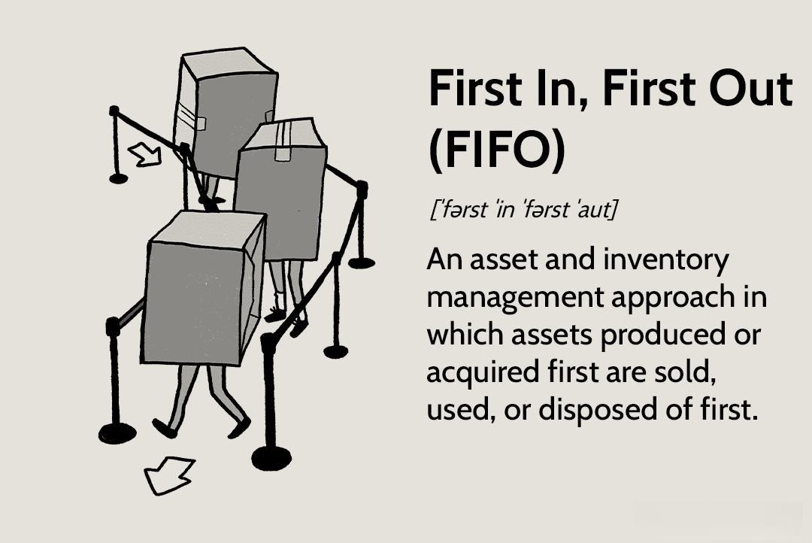

In today's fast-paced financial world, efficient management of inventory and trading strategies is crucial for success. The interplay between accounting practices, inventory management, and algorithmic trading is significant in shaping businesses' operational effectiveness and financial performance. Central to this discussion is the First In, First Out (FIFO) method, a straightforward yet powerful approach utilized across these domains.

FIFO serves as a foundational principle whereby the earliest stock items procured or recorded are the first to be sold or used. This method aligns closely with natural inventory turnover, making it particularly favorable in industries where products have limited shelf life, such as grocery and pharmaceuticals. By ensuring that older inventory items are used or sold first, companies can minimize the risk of obsolescence and reduce waste, leading to potential cost savings and enhanced asset management.



In algorithmic trading, FIFO methodology extends its utility beyond traditional inventory spheres. It aids in efficiently managing the sequence of trades, particularly in high-frequency trading environments where the speed and timing of transactions are paramount. Applying FIFO in this context can influence tax implications and profit reporting, as the cost basis of securities sold reflects the oldest securities purchased.

Thus, comprehending the FIFO accounting method proves beneficial for businesses aiming to optimize their operations, enhance financial reporting accuracy, and achieve a competitive edge. By leveraging FIFO, businesses can align their inventory management and trading strategies with market conditions and regulatory requirements, ultimately leading to more informed decision-making and improved financial outcomes. Understanding the basics of the FIFO accounting method is a critical step for enterprises looking to capitalize on these opportunities.

## Table of Contents

## What is the FIFO Method in Accounting?

FIFO, an acronym for "First In, First Out," is a prevalent accounting method used in asset management and valuation. This technique dictates that inventory items acquired first are the ones to be recorded as sold before any newer inventory. In essence, the cost associated with the oldest stock is the first to be recognized once inventory is expensed as the Cost of Goods Sold (COGS).

The FIFO method aids businesses in aligning their inventory costs with sales, thus preventing issues related to obsolescence. By assigning costs from older inventory first, companies can streamline the matching of revenues with expenses, which is a fundamental accounting principle. This method is particularly advantageous in environments where prices are rising, as it may result in older, cheaper costs being reflected on the income statement, potentially enhancing perceived profitability.

The widespread adoption of FIFO can be attributed to its logical representation of actual business operations where products are typically used or sold in the order they are acquired. Such natural alignment often reflects in sectors like groceries and retail, where inventory turnover is critical. The adherence to first-in, first-out stock usage aids in minimizing waste due to expired or outdated products, further underscoring its relevance in these industries.

In summary, the FIFO method provides a systematic approach to inventory valuation by focusing on the chronological order of stock acquisition and sale. Consequently, it supports businesses in maintaining accurate financial records, predicting cash flow needs with improved precision, and potentially optimizing tax strategies.

## How FIFO Works in Inventory Management

In inventory management, the First In, First Out (FIFO) method is utilized to determine the cost of goods sold (COGS) by using the cost associated with the oldest inventory items first. This approach is particularly advantageous in situations characterized by inflation. In such environments, the prices of goods tend to rise over time, meaning older inventory - purchased at lower prices - is accounted for first under FIFO. Consequently, this results in reporting lower COGS and higher gross profits on the income statement, as the costs reflect older, and typically cheaper, inventory prices.

The grocery industry is a prime example of where the FIFO method is prevalently used. In grocery retail, goods often have limited shelf lives, necessitating a stock rotation where older items are sold before newer ones to prevent spoilage. As such, the FIFO method naturally aligns with this flow, presenting a realistic and efficient accounting of inventory use. By mirroring actual stock rotation, FIFO aids in maintaining accurate financial reports that reflect true business operations.

Moreover, the FIFO method is beneficial in maintaining optimal stock levels. By prioritizing the sales of older inventory, businesses can ensure they do not hold onto stock that may eventually become obsolete or expired. This systematic approach to inventory turnover helps reduce wastage and allows for more precise forecasting of future inventory needs.

Understanding the implications of FIFO on inventory valuation is crucial for accurate profit calculations. Consider two scenarios where a company purchases inventory at different prices due to inflation. If a company buys 100 units of a product at $10 each, then 100 more units at $15 each, and sells 150 units at $20 each, the COGS under FIFO would account for the cost of the first 100 units at $10 and the next 50 units at $15. This results in a COGS of $(100 \times 10) + (50 \times 15) = 1000 + 750 = 1750$.

This systematic approach reveals how FIFO can affect the overall financial outlook of a business. When correctly implemented, FIFO allows companies to present a true and fair view of their financial position, providing insights for stakeholders and facilitating informed decision-making regarding inventory management and cost control strategies.

## FIFO in Algorithmic Trading

In [algorithmic trading](/wiki/algorithmic-trading), the First In, First Out (FIFO) method is an essential tool for managing securities transactions. This method is crucial for maintaining order and efficiency, particularly in high-frequency trading environments where the sheer [volume](/wiki/volume-trading-strategy) of trades necessitates precise handling of securities. Algorithmic trading leverages advanced software systems to automate trading decisions, executing trades at speeds and frequencies that are impossible for human traders.

FIFO operates on a simple principle: the oldest stock purchased is the first to be sold. This is particularly advantageous in algorithmic trading because it provides a clear framework for determining the sequence of transactions. By applying FIFO, traders can ensure that earlier trades are accounted for first, which significantly influences both profit calculations and tax reporting. Since profits are calculated based on the purchase and sale price of securities, FIFO helps in aligning these calculations by sequentially matching sales against the oldest purchase prices.

Using FIFO in algorithmic trading also impacts tax liabilities. Many tax jurisdictions require FIFO to determine capital gains, which can be particularly relevant in a high-frequency trading setting. By consistently applying FIFO, traders can potentially manage tax burdens by controlling which gains are recognized within a given tax period. This can be particularly useful in bullish markets where older securities, bought at a lower price, are liquidated at today's higher market prices, potentially increasing taxable income.

Implementing FIFO in algorithmic trading necessitates sophisticated software that can meticulously track each transaction. The systems must be capable of recording trade data, maintaining an accurate record of which securities were acquired when, and executing trades as per FIFO rules. For example, consider a Python snippet that might be used in a trading algorithm:

```python
from collections import deque

class FIFOQueue:
    def __init__(self):
        self.queue = deque()

    def buy(self, quantity, price):
        self.queue.append((quantity, price))

    def sell(self, quantity):
        total_cost = 0
        while quantity > 0:
            if not self.queue:
                raise ValueError("Not enough stock to sell")
            oldest_quantity, oldest_price = self.queue.popleft()
            if oldest_quantity > quantity:
                total_cost += quantity * oldest_price
                self.queue.appendleft((oldest_quantity - quantity, oldest_price))
                quantity = 0
            else:
                total_cost += oldest_quantity * oldest_price
                quantity -= oldest_quantity
        return total_cost
```

In this Python code, the `FIFOQueue` class efficiently manages purchases with a queue structure, ensuring that the oldest items are processed first during a sale. This mimics the FIFO approach by calculating the cost of goods sold based on the oldest inventory prices.

Adopting FIFO within algorithmic trading frameworks offers traders several advantages: it simplifies transaction records, aligns profit and loss accounting with tax regulations, and provides clarity in trade sequencing. However, it is vital for traders to ensure that their systems are accurately configured to follow FIFO rules, as errors could lead to incorrect financial reports or tax filings. As such, the benefits relying on the FIFO method in algorithmic trading cannot be understated for those aiming to streamline operations and optimize financial outcomes.

## Advantages and Disadvantages of FIFO

The FIFO (First In, First Out) method offers several advantages and disadvantages that businesses must consider in their accounting and inventory management strategies.

One of the primary advantages of FIFO is its simplicity. The method is easy to implement and understand, as it follows a natural and logical flow of goods. This simplicity aligns closely with the physical flow of many products, particularly perishable goods, which need to be sold in the order they are received to avoid spoilage. For example, in a grocery store, older batches of produce are typically sold before newer ones, mirroring the FIFO approach.

FIFO also provides high transparency, making it less vulnerable to manipulation compared to other valuation methods like LIFO (Last In, First Out). The straightforward nature of FIFO ensures clear tracking of inventory costs and revenues, which contributes to reliable financial statements. Transparency in inventory valuation can increase stakeholder confidence and compliance with international financial reporting standards, as many countries do not permit LIFO under their accounting regulations.

Despite these advantages, FIFO has its drawbacks. One significant disadvantage is the potential for increased tax liabilities in environments where prices are rising. Since FIFO assigns the cost of earlier, often cheaper inventory to the cost of goods sold (COGS), it generally results in higher profits during inflationary periods. These increased profits, while beneficial for showcasing financial health, can lead to higher tax obligations. This higher tax burden is a critical consideration for businesses in strategic financial planning, particularly in countries where tax codes are variable or complex.

In international contexts, businesses must weigh the pros and cons of using FIFO, taking into account local regulations, currency fluctuations, and economic conditions. While FIFO aligns well with practices that encourage transparency and an accurate reflection of inventory value, alternative methods might be more suitable for specific economic climates or business models.

Ultimately, understanding these trade-offs is crucial for effective financial planning and reporting. The choice of inventory accounting method should align with a company's financial strategy and operational objectives, ensuring that it provides the most accurate representation of financial performance in alignment with regulatory standards.

## Comparing FIFO with Other Valuation Methods

In addition to the First In, First Out (FIFO) method, companies have alternative inventory valuation methods at their disposal, such as Last In, First Out (LIFO) and Average Cost. Each method has its own approach to inventory accounting, influencing financial outcomes and tax implications.

**Last In, First Out (LIFO)** is a method that contrasts with FIFO by assuming the most recently acquired inventory is sold first. In environments where prices are rising, LIFO can result in higher costs of goods sold (COGS), thereby reducing taxable income and deferring tax liabilities. However, LIFO is not permissible under International Financial Reporting Standards (IFRS), limiting its application to organizations adhering to Generally Accepted Accounting Principles (GAAP) in the United States.

**Average Cost**, or weighted average cost, accounts for inventory by averaging the cost of all goods available for sale during the period and assigning this average cost to each unit sold. This method smoothens out price fluctuations, leading to a more stable cost representation over time. The formula for the average cost is:

$$
\text{Average Cost} = \frac{\text{Total Cost of Goods Available for Sale}}{\text{Total Units Available for Sale}}
$$

Choosing between these methods requires careful consideration of several factors. **Regulatory standards** play a significant role, as the acceptability of methods like LIFO varies globally. **Economic conditions** also influence the decision, as inflationary trends might favor LIFO to leverage tax deferrals, while stable price environments could align better with FIFO or Average Cost. **Business strategy** is another crucial determinant, as companies may favor the method that optimizes financial reporting, aligns with internal policies, or best represents inventory turnover.

Each method carries distinct implications: FIFO tends to produce higher profits during inflationary periods, which can lead to increased tax liabilities. Conversely, LIFO offers potential tax advantages but does not align well with the physical flow of goods in most industries. Average Cost provides consistency in pricing but may not reflect the precise value of specific inventory items during rapid market changes.

Ultimately, selecting the appropriate inventory valuation method is a strategic decision, reflecting a company's regulatory context, economic environment, and financial objectives.

## Conclusion

The FIFO method, First In, First Out, is a critical component in both inventory management and algorithmic trading. Its widespread adoption across various industries can be attributed to its ability to provide clear and accurate financial reporting. By recording the oldest inventory first and matching it with current sales, businesses can avoid obsolescence and maintain an efficient flow of goods, closely mirroring natural stock rotations observed in sectors such as groceries. This not only supports maintaining optimal stock levels but also ensures that the cost of goods sold reflects accurate market conditions, especially beneficial during inflationary periods.

In algorithmic trading, FIFO plays a crucial role by systematically managing transaction records where the first acquired securities are the first to be accounted for. This orderly processing can significantly impact profit calculations and tax liabilities, making it essential for implementing effective and transparent trading strategies. The method’s adaptability is especially beneficial for handling the complexities of high-frequency trading, where accurate tracking of numerous transactions is of paramount importance.

Despite its advantages, FIFO is not without drawbacks. The method can lead to higher tax liabilities in environments where prices are rising, due to the reporting of higher profits. This risk necessitates a careful consideration of business goals and economic context when selecting FIFO, alongside other valuation methods like LIFO (Last In, First Out) or the Average Cost method.

Ultimately, a comprehensive understanding and strategic application of the FIFO method are imperative for businesses aiming to optimize their financial outcomes. By choosing the accounting method that aligns best with their operational strategies and market conditions, businesses can enhance their decision-making processes and achieve their long-term financial objectives.

## References & Further Reading

[1]: ["Inventory Management and Optimization in SAP ERP"](https://www.sap-press.com/inventory-management-and-optimization-in-sap-erp_3977/) by Elke Roettig and Martin Murray

[2]: ["Financial Accounting: An Integrated Approach"](https://archive.org/details/financialaccount0000gibb) by Ken Trotman and Michael Gibbins

[3]: ["Trading and Exchanges: Market Microstructure for Practitioners"](https://www.amazon.com/Trading-Exchanges-Market-Microstructure-Practitioners/dp/0195144708) by Larry Harris 

[4]: ["Algorithmic Trading: Winning Strategies and Their Rationale"](https://www.wiley.com/en-us/Algorithmic+Trading%3A+Winning+Strategies+and+Their+Rationale-p-9781118460146) by Ernest P. Chan

[5]: ["Security Analysis"](https://www.amazon.com/Security-Analysis-Foreword-Buffett-Editions/dp/0071592539) by Benjamin Graham and David Dodd