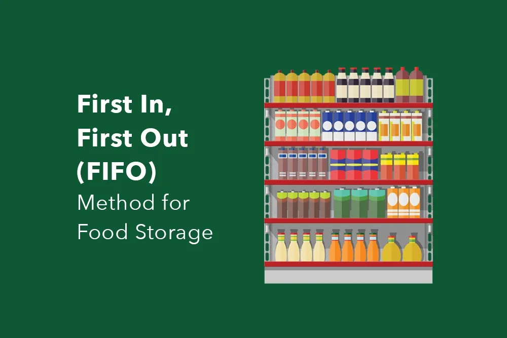

## Table of Contents

## What is the First In, First Out (FIFO) method?

The First In, First Out (FIFO) method is a way to manage and organize things, like inventory or tasks, based on the order they arrive. Imagine you have a line of people waiting to get into a movie theater. The first person who arrived is the first one to enter. In the same way, with FIFO, the first item or task that comes in is the first one to be used or completed.

This method is commonly used in businesses, especially for managing stock in warehouses or stores. If a store gets a new shipment of goods, the items from that shipment are sold before any items from older shipments. This helps keep products fresh and can be important for things like food or medicine that have expiration dates. It also makes tracking inventory easier because you always know which items came in first and need to go out first.

## How does the FIFO method work in inventory management?

In inventory management, the FIFO method means that the items that come into the warehouse or store first are the ones that get sold or used first. Imagine you're stacking boxes in a room. You put the new boxes at the back and take the old boxes from the front to use or sell them. This way, the oldest items are always used before the newer ones.

Using FIFO helps keep products fresh, especially for things like food or medicine that can go bad over time. It also makes it easier to keep track of what you have in stock. By always using the oldest items first, you know exactly which items need to be sold or used next. This can help prevent waste and make sure that customers always get the freshest products possible.

## What are the main advantages of using the FIFO method?

Using the FIFO method has many good points. One big advantage is that it helps keep products fresh. If you have things like food or medicine that can go bad, FIFO makes sure you use the oldest items first. This means less waste because you're not throwing away old stuff. It also makes customers happy because they get the freshest products.

Another advantage is that FIFO makes it easier to keep track of your inventory. When you always use the oldest items first, you know exactly which items you need to sell or use next. This helps you plan better and makes sure you always have the right amount of stock. It's like keeping your room tidy; you know where everything is and what needs to go out first.

## Can you explain the impact of FIFO on financial statements?

When a business uses the FIFO method, it can affect how they report their money on financial statements. With FIFO, the cost of the oldest items is used first when calculating the cost of goods sold (COGS). If prices are going up, this means the COGS will be lower because you're using the cost of the older, cheaper items. This can make the company's profit look higher because the difference between what they sell the items for and what they cost to buy is bigger.

This higher profit can also make the company's taxes higher because they have to pay taxes on their profit. On the balance sheet, the value of the inventory will be higher because it's based on the cost of the newer, more expensive items. So, using FIFO can make a company look more profitable and have more valuable inventory on paper, but it also means they might have to pay more in taxes.

## How does FIFO affect the cost of goods sold (COGS)?

When a company uses the FIFO method, it affects the cost of goods sold (COGS) by using the cost of the oldest items first. If prices are going up over time, the older items cost less than the newer ones. So, when you calculate COGS using FIFO, you're using these lower costs. This means the COGS will be lower compared to if you used the costs of the newer, more expensive items.

Having a lower COGS can make the company's profit look higher. This is because profit is what you get when you subtract COGS from the money you make from selling things. If COGS is lower, the difference between what you sell things for and what they cost you is bigger, so your profit goes up. This can be good for the company, but it also means they might have to pay more in taxes because they have to pay taxes on their profit.

## What are the potential disadvantages of using the FIFO method?

One downside of using the FIFO method is that it can lead to higher taxes. When you use FIFO, the cost of goods sold is lower because you're using the cost of the older, cheaper items. This makes your profit look bigger, and you have to pay taxes on your profit. So, if prices are going up, FIFO can mean you pay more in taxes than if you used another method like LIFO, where you use the cost of the newer, more expensive items first.

Another problem with FIFO is that it might not show the real value of your inventory on your financial statements. If prices are rising, the value of your inventory will be higher because it's based on the cost of the newer, more expensive items. But this might not reflect what you could actually sell those items for in the market. This can make it hard for people looking at your financial statements to understand the true financial health of your business.

## In what industries is the FIFO method most commonly used?

The FIFO method is most commonly used in industries where products have a short shelf life, like the food and beverage industry. In these industries, it's important to sell the oldest items first to make sure customers get fresh products. For example, a grocery store uses FIFO to manage its stock of fruits and vegetables, so they don't spoil before they're sold. This helps reduce waste and keeps customers happy.

FIFO is also widely used in the pharmaceutical industry. Medicines have expiration dates, so using FIFO helps ensure that patients get the freshest and most effective drugs. Pharmacies and drug manufacturers use FIFO to keep track of their inventory and make sure they use or sell the oldest batches first. This is important for safety and to prevent medicine from going bad.

In addition to these industries, FIFO is used in manufacturing and retail. Companies that make or sell products like electronics or clothing use FIFO to manage their inventory. This helps them keep track of which items came in first and need to be sold first, making it easier to plan and manage their stock levels.

## How does FIFO compare to other inventory valuation methods like LIFO and average cost?

FIFO, LIFO, and average cost are three common ways to value inventory. FIFO stands for "First In, First Out," which means the oldest items in your inventory are sold or used first. LIFO, or "Last In, First Out," is the opposite; the newest items are sold or used first. The average cost method calculates the cost of goods sold by taking the average cost of all items in inventory. Each method affects how much profit a company shows and how much tax they have to pay.

When prices are going up, FIFO makes the cost of goods sold lower because it uses the cost of the older, cheaper items. This means the profit looks higher, but the company might have to pay more in taxes. LIFO, on the other hand, uses the cost of the newer, more expensive items first, so the cost of goods sold is higher and the profit looks lower. This can lead to paying less in taxes. The average cost method smooths out the costs over time, so it's less affected by big price changes. It can be easier to use but might not show the real ups and downs in costs.

## What are the tax implications of using the FIFO method?

When a company uses the FIFO method, it can affect how much tax they have to pay. With FIFO, the cost of the oldest items is used first when calculating the cost of goods sold. If prices are going up, this means the cost of goods sold will be lower because you're using the cost of the older, cheaper items. This makes the company's profit look higher because the difference between what they sell the items for and what they cost to buy is bigger. A higher profit means the company has to pay more in taxes because they have to pay taxes on their profit.

On the other hand, if prices are going down, using FIFO might not have such a big effect on taxes. In this case, the cost of the older items might be higher than the newer ones, so the cost of goods sold could be higher, and the profit might look lower. This could mean paying less in taxes. But usually, when people talk about FIFO and taxes, they're thinking about times when prices are going up, which is more common.

## How can FIFO be implemented in a computerized inventory system?

To use the FIFO method in a computerized inventory system, you need to keep track of when each item comes into the system. When new items arrive, the system adds them to the inventory list with their date of arrival. When items are sold or used, the system looks at the list and picks the oldest items first. This way, the computer knows which items to take out of the inventory first, following the FIFO rule.

Setting up the system to use FIFO is pretty simple. You just need to make sure the software can sort the inventory by the date items came in. Many inventory management programs already have this feature, so you might just need to turn it on or choose it as your method. Once it's set up, the system does the work for you, making sure the oldest items are always used or sold first, which helps keep your inventory fresh and easy to manage.

## What are the regulatory and compliance considerations for using FIFO?

When using the FIFO method, businesses need to follow certain rules and laws. In the United States, the Generally Accepted Accounting Principles (GAAP) allow companies to use FIFO for inventory accounting. This means that if a business chooses FIFO, it must apply it consistently to all its inventory to stay in line with these rules. The Internal Revenue Service (IRS) also has rules about how companies can value their inventory for tax purposes, and FIFO is one of the methods they accept.

In other countries, the rules might be different. For example, in some places, using LIFO might not be allowed at all, while FIFO is more common. Companies that do business in different countries need to know the local laws and make sure they follow them. It's important for businesses to understand these rules to avoid problems with tax authorities and to keep their financial reports accurate and trustworthy.

## How does FIFO impact inventory turnover and business efficiency?

Using the FIFO method can help a business have a higher inventory turnover. Inventory turnover means how fast a business can sell its products. With FIFO, the oldest items are sold first, which helps keep the stock fresh. This is good for businesses that sell things like food or medicine that can go bad. When products are sold quickly, the business doesn't have to keep a lot of old stock around, which means less waste and more room for new products. This can make the business run better because it's always selling new items.

FIFO also makes it easier for a business to manage its inventory. When you always know which items came in first and need to go out first, you can plan better. You can order new stock at the right time and make sure you have enough of the right products. This helps the business run more smoothly and can save time and money. By keeping the inventory organized and moving quickly, FIFO can help a business be more efficient and successful.

## How does FIFO compare with other valuation methods?

In addition to the First In, First Out (FIFO) method, companies have alternative inventory valuation methods at their disposal, such as Last In, First Out (LIFO) and Average Cost. Each method has its own approach to inventory accounting, influencing financial outcomes and tax implications.

**Last In, First Out (LIFO)** is a method that contrasts with FIFO by assuming the most recently acquired inventory is sold first. In environments where prices are rising, LIFO can result in higher costs of goods sold (COGS), thereby reducing taxable income and deferring tax liabilities. However, LIFO is not permissible under International Financial Reporting Standards (IFRS), limiting its application to organizations adhering to Generally Accepted Accounting Principles (GAAP) in the United States.

**Average Cost**, or weighted average cost, accounts for inventory by averaging the cost of all goods available for sale during the period and assigning this average cost to each unit sold. This method smoothens out price fluctuations, leading to a more stable cost representation over time. The formula for the average cost is:

$$
\text{Average Cost} = \frac{\text{Total Cost of Goods Available for Sale}}{\text{Total Units Available for Sale}}
$$

Choosing between these methods requires careful consideration of several factors. **Regulatory standards** play a significant role, as the acceptability of methods like LIFO varies globally. **Economic conditions** also influence the decision, as inflationary trends might favor LIFO to leverage tax deferrals, while stable price environments could align better with FIFO or Average Cost. **Business strategy** is another crucial determinant, as companies may favor the method that optimizes financial reporting, aligns with internal policies, or best represents inventory turnover.

Each method carries distinct implications: FIFO tends to produce higher profits during inflationary periods, which can lead to increased tax liabilities. Conversely, LIFO offers potential tax advantages but does not align well with the physical flow of goods in most industries. Average Cost provides consistency in pricing but may not reflect the precise value of specific inventory items during rapid market changes.

Ultimately, selecting the appropriate inventory valuation method is a strategic decision, reflecting a company's regulatory context, economic environment, and financial objectives.

## References & Further Reading

[1]: ["Inventory Management and Optimization in SAP ERP"](https://www.sap-press.com/inventory-management-and-optimization-in-sap-erp_3977/) by Elke Roettig and Martin Murray

[2]: ["Financial Accounting: An Integrated Approach"](https://archive.org/details/financialaccount0000gibb) by Ken Trotman and Michael Gibbins

[3]: ["Trading and Exchanges: Market Microstructure for Practitioners"](https://www.amazon.com/Trading-Exchanges-Market-Microstructure-Practitioners/dp/0195144708) by Larry Harris 

[4]: ["Algorithmic Trading: Winning Strategies and Their Rationale"](https://www.wiley.com/en-us/Algorithmic+Trading%3A+Winning+Strategies+and+Their+Rationale-p-9781118460146) by Ernest P. Chan

[5]: ["Security Analysis"](https://www.amazon.com/Security-Analysis-Foreword-Buffett-Editions/dp/0071592539) by Benjamin Graham and David Dodd