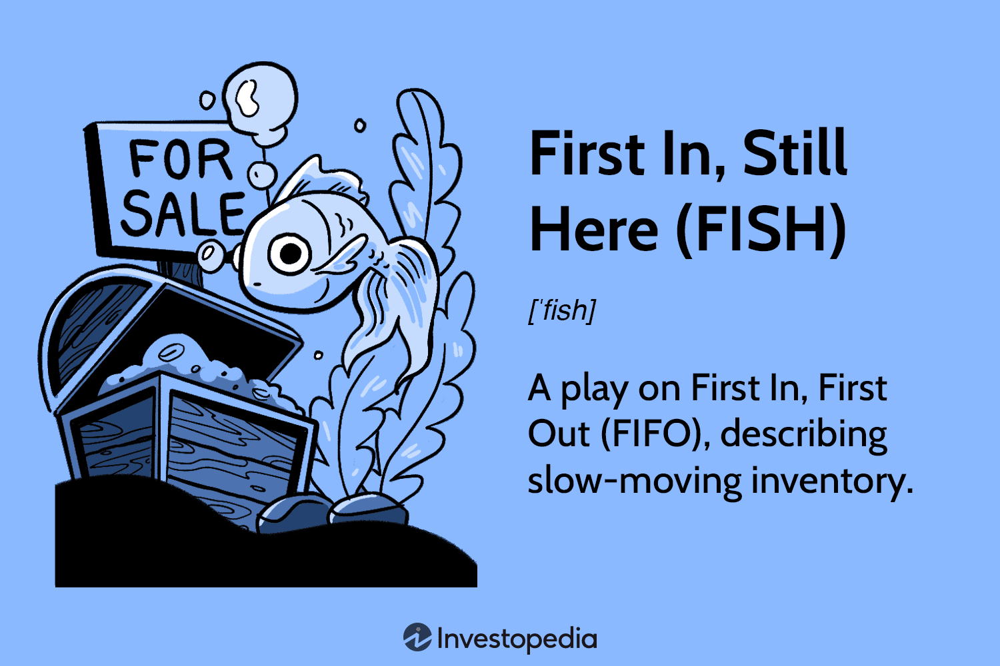

The financial world is perpetually evolving, introducing new strategies and terminologies to enhance efficiency and competitiveness. One such emerging concept within accounting and inventory management systems is the 'First In, Still Here' (FISH) method. The FISH method offers a unique perspective on inventory handling, contrasting with more traditional accounting practices such as First In, First Out (FIFO) and Last In, First Out (LIFO).

In this article, we aim to examine the intricacies of the FISH algorithm, focusing on its implications for trading and inventory management. As businesses strive to adapt to rapidly shifting market conditions, understanding FISH becomes crucial for both investors and companies. This approach can aid in refining inventory and capital strategies, aligning them with the demands of contemporary trading environments.



FISH serves as a conceptual tool, bringing attention to inefficiencies in stock management and encouraging a reassessment of existing practices. By gaining insight into FISH, stakeholders can better navigate the complexities of modern financial strategy and automated trading systems. This introduction sets the stage to comprehend how FISH functions and its potential impact on the financial and trading sectors.

## Table of Contents

## Definition of First In, Still Here (FISH)

First In, Still Here (FISH) is an accounting concept utilized to depict a scenario wherein a company retains inventory that is not selling, often due to reasons such as neglect, poor demand forecasting, or obsolescence. Unlike formal accounting approaches like First In, First Out (FIFO) and Last In, First Out (LIFO), FISH is not recognized as an official method for valuing inventory; rather, it serves as a heuristic or conceptual tool to aid companies in assessing the effectiveness of their inventory management strategies. 

The FISH concept underscores the inefficiencies associated with maintaining stagnant inventory by highlighting how long-held stock can tie up operational capital and incur added storage costs without contributing to revenue. When inventory items remain unsold and overlooked, they can become obsolete, further diminishing their potential value and increasing the financial burden on the firm. This situation contrasts with FIFO and LIFO, in which inventory items are systematically rotated based on purchase or production date.

By drawing attention to the challenges associated with inactive inventory, FISH encourages businesses to scrutinize their stock levels and assess the factors leading to such inefficiencies. Through this examination, companies can discover bottlenecks or lapses in their inventory policies and potentially enhance their resource allocation, thereby improving financial performance and market responsiveness.

## Understanding the Mechanics of FISH

Companies that adopt a First In, Still Here (FISH) strategy often experience reduced inventory turnover rates, which can adversely affect their financial health metrics. Inventory turnover is a critical measure of how efficiently a company manages its stock by selling and replacing inventory within a given period. The formula for inventory turnover is:

$$
\text{Inventory Turnover} = \frac{\text{Cost of Goods Sold (COGS)}}{\text{Average Inventory}}
$$

A low turnover rate suggests that products remain unsold for extended periods, tying up capital that could otherwise be used for operational expenses or investments. This not only affects [liquidity](/wiki/liquidity-risk-premium) but also prevents the reallocation of resources toward more profitable activities.

The FISH approach emphasizes the inefficiency in managing stationary inventory rather than pinpointing specific reasons for unsold goods. Ineffective inventory management leads to accumulation costs, as companies incur expenses related to warehousing and storage without generating corresponding revenues. This stagnant stock represents sunk costs and may involve additional losses due to factors such as depreciation, spoilage, or obsolescence.

From an investment perspective, businesses exhibiting characteristics of a FISH inventory system may become less attractive. Investors often view such scenarios as risky because stagnant inventory ties up operational capital required for innovation and expansion. Moreover, it necessitates substantial storage resources, increasing overhead costs without contributing to profit generation.

In conclusion, while FISH brings attention to critical inefficiencies, it is not without risk. Companies must address the underlying issues to prevent cash flow constraints and maintain financial health. This might involve reassessing inventory strategies, employing effective forecasting techniques, and balancing inventory levels with market demand.

## Implications of FISH in Automated Trading

First In, Still Here (FISH) has significant implications in the context of automated trading, primarily because inventory turnover and agility are critical components of success in this field. Automated trading environments necessitate an acute ability to adapt to market changes swiftly, aligning inventory with real-time market dynamics and consumer preferences. 

The FISH methodology prompts algorithmic adjustments that help in tracking product lifecycles and identifying obsolescence factors. This is increasingly important as automated trading systems rely on precise algorithms to manage and optimize inventory levels efficiently. The inherent nature of FISH highlights scenarios where inventories could stagnate, requiring attention to align strategies with active market conditions. 

For example, an automated trading system might implement a predictive model that identifies non-performing inventory (products likely to become obsolete) using data analytics. Such a model would take historical sales data, current market trends, and consumer preferences into account. Applying statistical methods, like regression analysis or time-series forecasting, can help predict the likelihood of certain inventory becoming non-essential. Consider a hypothetical function in Python leveraging [machine learning](/wiki/machine-learning) algorithms for predictive analytics:

```python
from sklearn.linear_model import LinearRegression
import numpy as np

# Sample data
inventory_age = np.array([1, 2, 3, 4, 5])  # Months
sales_data = np.array([100, 80, 60, 40, 20])  # Number of items sold

# Reshape data for sklearn
inventory_age = inventory_age.reshape(-1, 1)

# Create a linear regression model
model = LinearRegression()
model.fit(inventory_age, sales_data)

# Predict potential obsolescence of inventory
new_inventory_age = np.array([[6]])
predicted_sales = model.predict(new_inventory_age)

print("Predicted sales for inventory at month 6:", predicted_sales)
```

In the above code, linear regression is utilized to understand the potential decline in sales with increasing inventory age. Implementing such predictive strategies within automated systems allows for seamless adjustments in trading strategies, minimizing the risk of inventory wastage and ensuring alignment with current market needs.

Moreover, automated trading systems equipped with FISH methodologies can quickly adjust strategies by liquidating non-essential inventory or shifting focus to more in-demand products. This proactive management ensures efficient capital use and supports maintaining a competitive edge in a volatile market.

In conclusion, implementing the FISH methodology within automated trading systems allows businesses to proactively manage inventories, reduce inefficiencies, and align their offerings effectively with market demands, thus facilitating agile and dynamic trading environments.

## Challenges and Solutions in Implementing FISH

Implementing the First In, Still Here (FISH) method in inventory management presents several challenges, primarily revolving around the tracking and management of aging inventory while simultaneously maintaining a diverse stock. Companies often encounter difficulties in accurately forecasting market trends, which can lead to the accumulation of FISH inventory — unsold stock that continues to occupy space and resources without contributing to revenue.

One of the primary challenges in employing FISH is the need to differentiate between inventory that is strategically held and inventory that has become obsolete. This requires sophisticated inventory tracking systems that can constantly monitor stock movement and status. Companies must address not only the physical tracking of inventory but also the reasons behind stagnation, such as shifts in consumer preferences or technological advancements rendering certain products outdated.

To effectively manage FISH inventory, companies can leverage data analytics and machine learning algorithms. These technologies help in parsing through large sets of inventory data to identify patterns that lead to inventory stagnation. Machine learning models can predict demand trends more accurately by analyzing historical sales data, seasonal fluctuations, and other market indicators. For example, a simple linear regression model could be employed to forecast inventory demand:
```python
import numpy as np
from sklearn.linear_model import LinearRegression

# Sample data: months and corresponding sales
months = np.array([[1], [2], [3], [4], [5]])
sales = np.array([100, 150, 200, 250, 300])

# Defining and training the model
model = LinearRegression()
model.fit(months, sales)

# Predicting future sales
future_months = np.array([[6], [7], [8]])
predicted_sales = model.predict(future_months)
print(predicted_sales)
```

Best practices for tackling FISH-related challenges include periodically reevaluating inventory systems to ensure they remain responsive to market signals and internal demands. Implementing flexible supply chain strategies is crucial, as it allows companies to adjust their purchasing and stocking levels in response to changes in supply or demand. This flexibility can be achieved by maintaining a robust network of multiple suppliers, thereby minimizing dependency on any single entity and reducing the risk of supply chain disruptions.

Additionally, integrating just-in-time (JIT) inventory principles can help lessen the financial burden of excess stock. The JIT approach requires effective communication across the supply chain to ensure that inventory is replenished in line with real-time demand, thus minimizing the incidence of FISH inventory. Ultimately, a strategic combination of advanced technological tools and adaptive management practices can significantly mitigate the challenges posed by implementing the FISH methodology, promoting a more agile and efficient inventory management system.

## FISH and Economic Efficiency

Understanding and applying the principles of First In, Still Here (FISH) can have a significant positive impact on a company's economic efficiency. The FISH method, which focuses on managing inventory that remains unsold due to neglect or obsolescence, urges organizations to proactively improve their inventory management strategies. By effectively handling these inventory issues, companies can achieve several economic benefits.

Firstly, proactive inventory management under the FISH framework can lead to reduced waste. Inventory that sits idle or becomes outdated not only occupies valuable storage space but also incurs additional carrying costs. By identifying and addressing these inefficiencies, businesses can streamline their inventories, minimize waste, and optimize storage costs, ultimately contributing to a more sustainable operation.

Additionally, FISH principles support improved cash flow through increased inventory turnover. High levels of stagnant inventory tie up capital that could otherwise be reinvested into more productive assets or business ventures. By systematically managing their unsold inventory, companies can free up cash, improve liquidity, and more efficiently allocate financial resources, which enhances their ability to respond to market changes and invest in new opportunities.

Maintaining product quality is also a crucial aspect of economic efficiency. Excess inventory is often at risk of becoming obsolete or deteriorating, which can impact the overall quality of products offered to customers. By employing FISH strategies, organizations can better align their inventory levels with actual demand, ensuring that product quality remains consistent. This alignment not only improves customer satisfaction but also reinforces brand reputation, leading to long-term market success.

Applying FISH requires companies to carefully balance resources and commit to continuous strategic foresight and technological integration. This involves leveraging data analytics to forecast demand accurately, employing machine learning algorithms to identify potential FISH inventory, and adopting flexible supply chain strategies to respond dynamically to market fluctuations. For instance, a Python-based inventory management system could be developed to automatically flag aging inventory items and suggest actions to clear them, thereby optimizing inventory levels.

In conclusion, understanding FISH and incorporating its principles into business operations can enable companies to operate more efficiently. By focusing on inventory reduction, cash flow optimization, and quality maintenance, businesses can enhance their economic performance and sustain a competitive edge in the marketplace.

## Conclusion

First In, Still Here (FISH) offers a lens through which companies can assess their inventory management and trading strategies. By acknowledging and adapting to the concept of FISH, organizations can substantially enhance their operational efficiencies, particularly in fast-paced markets where agility is paramount. The FISH framework encourages a shift from passive inventory holding to active management, emphasizing the need for a dynamic approach to inventory turnover and capital allocation.

As the business environment continues to evolve, adopting such innovative methodologies is crucial for maintaining competitive advantages and achieving sustainable growth. The emphasis on proactive inventory strategies, facilitated by the FISH concept, can help mitigate obsolescence and enhance responsiveness to market demands. Additionally, the integration of predictive analytics and data-driven decision-making aligns with the principles of FISH, offering insights into inventory and market trends, thereby preventing the accumulation of stagnant stock.

Stakeholders must focus on both immediate inventory issues and long-term strategic adjustments to harness the full potential of FISH. This includes leveraging technology to refine inventory insights and optimizing supply chain processes to reduce excess and outdated inventory. Ultimately, the successful implementation of FISH principles necessitates a commitment to continual evaluation and adaptation, ensuring a balance between inventory efficiency and economic growth.

## References & Further Reading

[1]: ["Inventory Management: Balancing Demand and Supply Chain"](https://www.ascm.org/topics/inventory-management) by John Mangan, Chandra Lalwani, Tim Butcher, and Roya Javadpour

[2]: ["Inventory Optimization: Models and Simulations"](https://www.amazon.com/Inventory-Optimization-Simulations-Nicolas-Vandeput/dp/3110673916) by Nicolas Vandeput

[3]: ["The Machine Learning Impact on Algorithmic Trading"](https://opendatascience.com/how-to-use-machine-learning-for-algorithmic-trading/) in The Journal of Investing

[4]: ["Essentials of Inventory Management"](https://www.amazon.com/Essentials-Inventory-Management-Max-Muller/dp/1400212375) by Max Muller

[5]: ["Advanced Inventory Management Techniques"](https://www.assetwatch.com/glossary/advanced-inventory-management) in IEEE Transactions on Engineering Management