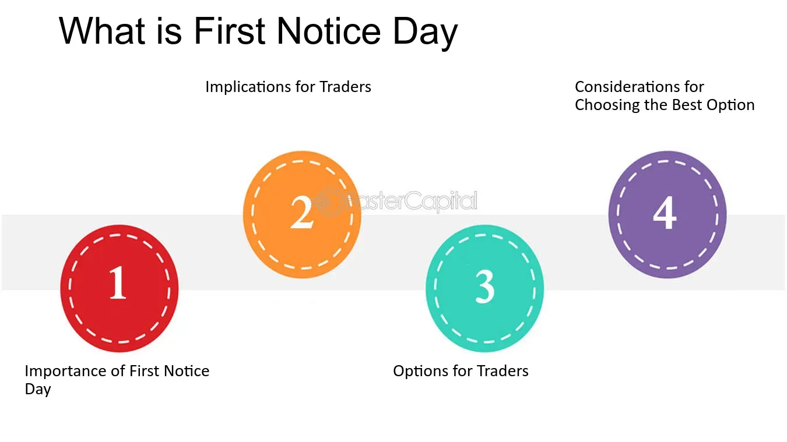

## Table of Contents

## What is a futures contract?

A futures contract is an agreement to buy or sell something at a future date for a price that is decided today. This "something" can be anything from farm products like wheat and corn, to financial things like stock indexes or currencies. People use futures contracts to protect themselves from price changes. For example, a farmer might use a futures contract to make sure they get a good price for their crops, even if the market price drops later.

Trading futures contracts happens on special places called futures exchanges. These places make sure that everyone follows the rules and that the contracts are safe. People who trade futures don't always plan to actually buy or sell the thing in the contract. Instead, they might just want to make money from guessing if the price will go up or down. This can be risky because if they guess wrong, they could lose money.

## What does 'First Notice Day' mean in the context of futures contracts?

In the world of futures contracts, 'First Notice Day' is an important date that traders need to know about. It is the first day that the seller of a futures contract can tell the buyer that they want to deliver the actual thing that the contract is about. This means that if you are the buyer, you might have to take delivery of, say, wheat or oil, instead of just settling the contract with money.

For people who trade futures but don't want to actually deal with the physical stuff, First Notice Day is a signal to get out of their position before this day. If they don't, they could end up having to handle the delivery, which can be complicated and costly. So, traders often close their positions or roll them over to a new contract before First Notice Day to avoid these issues.

## Why is the First Notice Day important for traders?

First Notice Day is a big deal for traders because it's the first day that the person selling the futures contract can say they want to deliver the actual thing, like wheat or oil. If you're the buyer, this means you might have to take that stuff instead of just paying money to settle the contract. Traders who don't want to deal with the physical stuff need to be careful about this day.

For these traders, First Notice Day is like a warning sign. They need to close their position or move it to a new contract before this day comes. If they don't, they could end up having to handle the delivery, which can be a hassle and cost a lot of money. So, knowing when First Notice Day is helps traders avoid these problems and keep their trading smooth.

## How can a trader find out the First Notice Day for a specific futures contract?

A trader can find out the First Notice Day for a specific futures contract by checking the information provided by the futures exchange where the contract is traded. Each futures exchange, like the Chicago Mercantile Exchange (CME) or the Intercontinental Exchange (ICE), has its own website where they list all the important dates for their contracts, including the First Notice Day. Traders can visit these websites, look up the specific contract they are interested in, and find the date easily.

If a trader doesn't want to go directly to the exchange's website, they can also use trading platforms or financial data services. These services often have detailed information about futures contracts, including First Notice Days. Traders can log into their trading account or subscribe to a financial data service, search for the contract, and quickly see the First Notice Day along with other important details. This makes it easy for traders to stay on top of their positions and plan their trades accordingly.

## What are the consequences of holding a futures contract past the First Notice Day?

If a trader holds a futures contract past the First Notice Day, they might have to take delivery of the actual thing the contract is about, like wheat or oil. This can be a big problem if the trader doesn't want to deal with the physical stuff. They might not have the space to store it, or they might not know how to handle it. This can lead to extra costs and a lot of hassle.

To avoid these issues, traders usually close their position or roll it over to a new contract before the First Notice Day. If they don't, and they end up having to take delivery, they could lose money. It's important for traders to know when the First Notice Day is so they can plan their trades and avoid these kinds of problems.

## Can you explain the difference between First Notice Day and Last Trading Day?

First Notice Day and Last Trading Day are two important dates for people trading futures contracts. First Notice Day is the first day that the person selling the futures contract can say they want to deliver the actual thing the contract is about, like wheat or oil. If you're the buyer, you might have to take that stuff instead of just paying money to settle the contract. Traders who don't want to deal with the physical stuff need to be careful about this day because they could end up with unwanted goods if they don't close their position in time.

Last Trading Day, on the other hand, is the last day you can trade the futures contract. After this day, you can't buy or sell the contract anymore. If you still have the contract after the Last Trading Day, you'll have to settle it according to the rules of the exchange. This might mean taking delivery of the goods or paying or receiving money based on the final price of the contract. Knowing both dates is important for traders to manage their positions and avoid any surprises.

## How does the First Notice Day affect the strategy of a futures trader?

The First Notice Day is a key date that futures traders need to keep in mind when planning their trading strategy. If a trader is not interested in taking delivery of the actual goods like wheat or oil, they need to close their position or roll it over to a new contract before the First Notice Day. This is because if they hold onto the contract past this date, they might be forced to take delivery, which can be a big problem. It can lead to extra costs and a lot of hassle, especially if they don't have the space or the know-how to handle the physical goods.

Knowing when the First Notice Day is helps traders plan their trades more effectively. They can decide whether to stay in the market or get out based on their predictions about the price movements. If they think the price will keep going their way, they might choose to close the position just before the First Notice Day to avoid delivery risks. If they want to keep their position open, they can roll it over to a new contract. This way, they can continue trading without worrying about having to deal with the physical goods.

## What steps should a trader take as the First Notice Day approaches?

As the First Notice Day gets closer, a trader needs to think about what they want to do with their futures contract. If they don't want to take delivery of the actual goods, like wheat or oil, they should plan to close their position before this day. This means selling the contract if they bought it, or buying it back if they sold it. By doing this, they can avoid the hassle and costs of dealing with the physical stuff.

If a trader wants to keep trading but avoid delivery, they can roll over their position to a new contract. This means closing the current contract and opening a new one with a later First Notice Day. This way, they can keep their trading strategy going without worrying about having to take delivery. Knowing when the First Notice Day is coming up helps traders make these decisions and manage their trades smoothly.

## Are there any exceptions or special cases regarding the First Notice Day?

Sometimes, there can be exceptions or special cases with the First Notice Day. For example, some futures contracts might have different rules about when the First Notice Day happens. This can depend on the type of contract or the exchange where it's traded. Traders need to check the specific rules for each contract they're trading to make sure they know when the First Notice Day is and what they need to do.

Another special case can happen if a trader has a special agreement with their broker. Some brokers might let traders hold onto a contract past the First Notice Day without having to take delivery. But this is not common and depends on the broker's rules. It's important for traders to talk to their broker and understand any special agreements or rules that might apply to their trading.

## How do market participants typically manage their positions around the First Notice Day?

Market participants usually manage their positions around the First Notice Day by closing out their contracts before this date if they don't want to take delivery of the actual goods. For example, if a trader bought a futures contract for wheat, they would sell it back before the First Notice Day to avoid having to store and handle the wheat. This way, they can settle the contract in cash instead of dealing with the physical stuff. Traders keep a close eye on the calendar and make sure they know when the First Notice Day is coming up so they can plan their trades accordingly.

Another common strategy is to roll over the position to a new contract with a later First Notice Day. This means closing the current contract and opening a new one that gives the trader more time to trade without worrying about delivery. For instance, if a trader is still betting on the price of oil going up, they might close their current oil futures contract and open a new one that expires later. This allows them to keep their trading strategy going without the risk of having to take delivery of oil. By managing their positions this way, traders can stay in the market and avoid the complications that come with the First Notice Day.

## What are the potential risks associated with the First Notice Day, and how can they be mitigated?

The biggest risk with First Notice Day is that if a trader holds onto a futures contract past this date, they might have to take delivery of the actual goods, like wheat or oil. This can be a big problem because it can lead to extra costs and a lot of hassle. Traders might not have the space to store the goods or know how to handle them. Also, if they're not prepared, they could end up losing money because of these unexpected costs.

To avoid these risks, traders need to plan ahead. They should close their position before the First Notice Day if they don't want to take delivery. This means selling the contract if they bought it, or buying it back if they sold it. Another way to manage this risk is to roll over the position to a new contract with a later First Notice Day. By doing this, traders can keep trading without worrying about having to deal with the physical goods. Keeping track of the First Notice Day and planning their trades around it helps traders stay safe and avoid any surprises.

## How does the First Notice Day impact the pricing and liquidity of futures contracts?

As the First Notice Day gets closer, the pricing and [liquidity](/wiki/liquidity-risk-premium) of futures contracts can change. Traders who don't want to take delivery of the actual goods, like wheat or oil, will often close their positions before this day. This can make the market less liquid because there are fewer people trading. Also, the price of the futures contract might change as more traders try to get out of their positions. If a lot of traders want to sell their contracts at the same time, the price might go down.

The First Notice Day can also cause the price to be more volatile. This means the price can go up and down a lot as the day gets closer. Traders who are still in the market might be more careful about their trades, which can affect how much they are willing to buy or sell. Knowing when the First Notice Day is coming up helps traders plan their trades better and can impact how they see the value of the futures contract.

## References & Further Reading

[1]: ["Algorithmic Trading and DMA: An introduction to direct access trading strategies"](https://www.semanticscholar.org/paper/Algorithmic-trading-%26-DMA-%3A-an-introduction-to-Johnson/aa5de1ab883d5e23b6651faa7c1807586d688e4b) by Barry Johnson

[2]: ["Trading Commodities and Financial Futures: A Step-by-Step Guide to Mastering the Markets"](https://ptgmedia.pearsoncmg.com/images/9780133367485/samplepages/0133367487.pdf) by George Kleinman

[3]: ["Futures and Options Markets: An Introduction"](https://www.amazon.com/Futures-Options-Markets-Colin-Carter/dp/B0C87SBYCB) by Susan Thomas

[4]: ["Building Winning Algorithmic Trading Systems: A Trader's Journey From Data Mining to Monte Carlo Simulation to Live Trading"](https://www.amazon.com/Building-Winning-Algorithmic-Trading-Systems/dp/1118778987) by Kevin Davey

[5]: ["Inside the Black Box: A Simple Guide to Quantitative and High Frequency Trading"](https://www.amazon.com/Inside-Black-Box-Quantitative-Frequency/dp/1118362411) by Rishi K. Narang