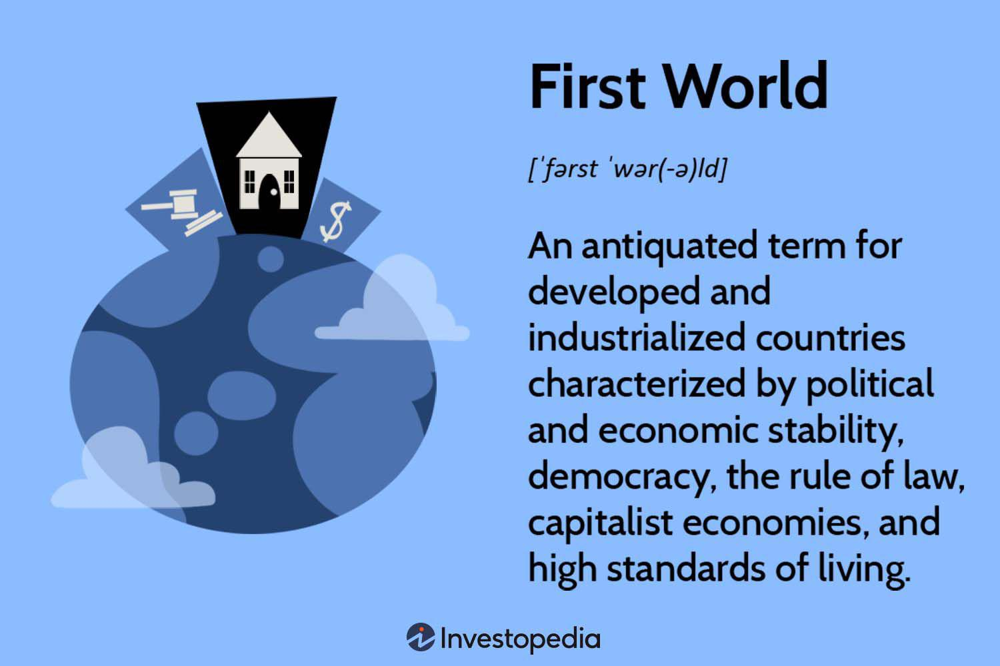

In today's rapidly evolving financial landscape, algorithmic trading is transforming how developed countries engage in financial markets. This sophisticated method of trading employs complex algorithms to automate and optimize trading decisions, offering speed and precision that manual trading simply cannot match. Developed nations, often characterized by advanced technological infrastructures and strong financial markets, are at the forefront of adopting these automated trading systems. 

The adoption of algorithmic trading in these countries is not just a mere technological advancement; it is reshaping the very foundations of their economic stability. Automated trading systems contribute significantly to market liquidity and efficiency, essential components for robust economic health. For developed countries, whose economies are deeply intertwined with global financial markets, maintaining economic stability often requires embracing cutting-edge financial technologies such as algorithmic trading systems.



Furthermore, these systems affect economic stability and growth by efficiently allocating resources and facilitating smoother capital formation. In first-world countries, where financial markets serve as a critical engine for economic development, the integration of algorithmic trading aids in maintaining a competitive edge. However, this evolution also raises pertinent questions about the broader economic and societal impacts, including issues of regulatory frameworks and market dynamics. Understanding these implications is crucial for comprehending how developed nations will navigate the challenges and opportunities posed by algorithmic trading.

## Table of Contents

## Understanding Developed and Industrialized Countries

Developed countries, often referred to as industrialized nations, are distinguished by their political and economic stability, high living standards, and robust infrastructures. These nations exhibit characteristics that include a high Gross Domestic Product (GDP) per capita, advanced technological integration, and elevated levels of education and literacy. 

The term "first world" originates from the Cold War era, coined to describe countries aligned with the United States and other NATO allies, as opposed to the "second world" of the Soviet bloc and the "third world" of non-aligned and economically developing nations. Over time, the designation "first world" has evolved beyond its geopolitical origins to connote economic affluence and societal advancement.

Key indicators defining developed countries include strong GDP figures, which reflect substantial economic productivity and output. These economies often boast a diversified industrial base, service sector predominance, and considerable global trade engagement. The incorporation of cutting-edge technology not only supports economic operations but also enhances public services, healthcare, and education systems.

Literacy rates are another critical measure, often nearing universality in developed nations, underscoring their commitment to education and skill development. This focus on education contributes to a knowledgeable workforce, capable of driving innovation and maintaining competitive advantages across various industries.

Technological advancements are pervasive in developed countries, facilitating efficient communication, streamlined production processes, and expanded access to information. These capabilities often translate into higher productivity rates and enhanced quality of life for citizens.

Overall, the combination of economic stability, technological integration, and high living standards creates a framework within which developed countries continue to prosper, adapting to and leveraging the evolving global economy.

## Algorithmic Trading: An Overview

Algorithmic trading refers to the use of computerized systems and mathematical models to make trading decisions in financial markets. This approach leverages algorithms—precise sequences of instructions—to automate the execution of trades, often at speeds and frequencies significantly beyond human capabilities. These algorithms consider a multitude of variables, including market conditions, asset prices, and volumes, to determine the optimal timing and size of trades, thereby optimizing investment strategies.

The development of [algorithmic trading](/wiki/algorithmic-trading) can be traced back to the late 20th century when electronic trading platforms first emerged. As computational power grew and financial data became more readily available, the adoption of algorithmic trading started its exponential growth. Today, it constitutes a significant part of trading volumes on major exchanges, particularly in developed markets. Notably, algorithmic trading has been prevalent in equities, futures, options, and foreign exchange markets.

One of the most significant advantages of algorithmic trading is speed. Algorithms can execute trades in microseconds (millionths of a second), capitalizing on market opportunities faster than any human trader could. This speed allows traders to exploit small price discrepancies in the market, a practice often referred to as high-frequency trading ([HFT](/wiki/high-frequency-trading-strategies)).

In addition to speed, algorithmic trading enhances efficiency by minimizing the impact of human emotion and error, which often lead to suboptimal trading decisions. Algorithms follow predefined rules and parameters meticulously, ensuring consistency in trading performance. This systematic approach reduces the likelihood of mistakes due to fatigue or cognitive biases that typically affect human traders.

Algorithmic trading also contributes to market [liquidity](/wiki/liquidity-risk-premium), an essential feature for the smooth functioning of financial markets. By facilitating rapid buying and selling, these systems enhance the availability of marketable securities, ensuring that buyers and sellers can easily execute their trades. This increase in liquidity can lead to tighter bid-ask spreads, reducing trading costs for participants.

The implementation of algorithmic trading systems requires rigorous testing and validation. Historical [backtesting](/wiki/backtesting) is commonly used to assess the effectiveness of an algorithm, simulating how it would have performed using past market data. This practice helps developers refine and optimize their algorithms before deployment in live trading environments.

Python, with libraries such as NumPy, pandas, and scikit-learn, plays a crucial role in the development and optimization of trading algorithms. The following simple Python script provides a basic illustration of how one might begin developing an algorithmic trading strategy using historical stock data:

```python
import pandas as pd
import numpy as np

# Sample data loading
data = pd.read_csv('historical_stock_data.csv')
data['PriceChange'] = data['Close'].pct_change()

# Parameters for a simple moving average strategy
short_window = 40
long_window = 100

# Generate signals
signals = pd.DataFrame(index=data.index)
signals['signal'] = 0.0

# Create short and long simple moving averages (SMA)
signals['short_mavg'] = data['Close'].rolling(window=short_window, min_periods=1, center=False).mean()
signals['long_mavg'] = data['Close'].rolling(window=long_window, min_periods=1, center=False).mean()

# Generate buy/sell signals
signals['signal'][short_window:] = np.where(signals['short_mavg'][short_window:] > signals['long_mavg'][short_window:], 1.0, 0.0)

# Calculate entry/exit points
signals['positions'] = signals['signal'].diff()

print(signals.head())
```

This script calculates short and long moving averages of a stock's closing price and generates buy or sell signals based on their crossover. Such a strategy is a simple example of what can be achieved with algorithmic trading systems.

Ultimately, the rise of algorithmic trading reflects the broader technological advancements in financial markets, driving improvements in speed, efficiency, and market participation. Its continuing evolution suggests a future where trading strategies become increasingly sophisticated, utilizing cutting-edge computational techniques and technologies.

## Impact of Algorithmic Trading on First World Economies

In the contemporary landscape of financial markets, developed countries are at the forefront of leveraging algorithmic trading to drive market efficiencies and liquidity. Algorithmic trading, which utilizes automated systems to execute trading strategies at high speed and frequency, plays a pivotal role in the economies of industrialized nations.

### Contribution to Market Liquidity and Efficiency

Algorithmic trading significantly enhances market liquidity by facilitating a higher [volume](/wiki/volume-trading-strategy) of transactions with minimal human intervention. This increase in liquidity is crucial, as it allows for the swift execution of large trades without substantially impacting the market price, thus minimizing the transaction costs and reducing the spread between bid and ask prices. In financial markets, liquidity is a critical attribute that reflects the ease with which assets can be bought and sold without causing a drastic change in their prices. In mathematical terms, the liquidity of an asset can be appreciated through its price impact function:

$$
\Delta P = L(Q)
$$

where $\Delta P$ denotes the change in price, $L$ is the liquidity function, and $Q$ is the quantity of assets traded. Algorithmic trading optimizes this relationship by executing trades in smaller, strategically timed increments, reducing $\Delta P$.

Moreover, algorithmic trading enhances market efficiency by leveraging computational power to analyze vast datasets at speeds far beyond human capability. Algorithms can quickly assess complex market conditions and exploit [arbitrage](/wiki/arbitrage) opportunities, thus contributing to the price discovery process. Efficient markets are those where asset prices fully reflect all available information. In developed economies, the efficiency gains from algorithmic trading facilitate more accurate valuations of equities and other financial instruments, bolstering investor confidence and attracting more capital to financial markets.

### Role of Financial Markets in Economic Growth and Capital Formation

Financial markets serve as engines for economic growth and capital formation, and algorithmic trading plays a significant role in this context. By augmenting liquidity and efficiency, algorithmic trading lowers the cost of capital for firms, enabling them to access funding more readily for expansion and innovation. This capital influx is vital for the growth of companies and the broader economic development of industrialized nations.

Furthermore, efficient and liquid markets attract global investors, increasing foreign direct investment (FDI) and furthering capital formation. As a result, developed countries can maintain robust infrastructure and technological advancements that continue to support economic stability and growth. Algorithmic trading also facilitates better risk management, allowing for more optimal asset pricing and allocation, which in turn supports sustainable economic expansion.

In conclusion, algorithmic trading enhances the functioning of financial markets in first world economies, promoting greater liquidity, efficiency, and capital formation. These developments underpin the economic dynamism and innovation that characterize industrialized countries, positioning them as leaders in financial market evolution.

## Challenges and Criticisms

Algorithmic trading, while offering significant advantages in terms of speed and efficiency, has its fair share of challenges and criticisms. One of the primary concerns centers around market [volatility](/wiki/volatility-trading-strategies). Algorithmic trading can lead to sudden and unpredictable market movements, as seen in events such as the Flash Crash of 2010. During such incidents, the rapid execution of trades by algorithms can amplify price swings, leading to increased market instability.

Moreover, algorithmic trading may exacerbate wealth inequality. High-frequency trading firms, typically well-capitalized and technologically advanced, often exploit algorithmic systems to extract profits from markets more effectively than individual or smaller investors. This capability creates a disparity in market access and potential returns, further concentrating wealth among large institutional players. As a result, there is an increased gap between those who can afford the latest technology and those who cannot, potentially widening economic inequality.

Ethical concerns also arise with algorithmic trading, particularly around market manipulation. Some algorithms are designed to engage in strategies that, while legal, may skirt ethical boundaries. For instance, tactics like spoofing—placing fake orders to manipulate prices—pose ethical challenges and undermine market trust.

Regulatory challenges are another significant issue associated with the proliferation of algorithmic trading. The rapid evolution of trading technologies often outpaces the development of regulatory frameworks, creating a need for updated rules that ensure market integrity and protect investors. Regulators in developed countries face the task of curbing potential abuses without stifling innovation. This involves implementing measures such as circuit breakers to halt trading during extreme volatility and establishing guidelines for the development and deployment of trading algorithms.

The balance between encouraging financial innovation and ensuring fair market conditions remains delicate. Addressing these challenges requires coordinated efforts from regulators, exchanges, and trading firms to foster a stable and equitable trading environment.

## Future Prospects for Algo Trading in Industrialized Nations

As technology continues to evolve, algorithmic trading presents both opportunities and challenges for industrialized nations. The ongoing digital transformation of global financial markets speaks to a future where trading systems are increasingly sophisticated, leveraging cutting-edge technologies. Among the forefront of these technological advancements are [artificial intelligence](/wiki/ai-artificial-intelligence) (AI) and blockchain, both poised to redefine the landscape of algorithmic trading.

The integration of AI into algorithmic trading is expected to significantly enhance decision-making processes. AI algorithms can analyze vast datasets at speeds and efficiencies beyond human capabilities. Machine learning, a subset of AI, allows systems to improve trading strategies over time by learning from historical data. This adaptability can lead to more predictive and proactive trading strategies. For example, AI can identify complex patterns and correlations within market data, helping traders anticipate price movements and optimize trade execution. Python libraries such as TensorFlow and PyTorch are commonly used in developing AI models for trading applications.

```python
import tensorflow as tf

# A simple TensorFlow model to predict stock price movements
model = tf.keras.Sequential([
    tf.keras.layers.Dense(64, activation='relu', input_shape=(num_features,)),
    tf.keras.layers.Dense(32, activation='relu'),
    tf.keras.layers.Dense(1, activation='linear')
])

model.compile(optimizer='adam', loss='mse')
```

Blockchain technology also offers potential enhancements for algorithmic trading by ensuring transparency and security in transactions. Distributed ledger technology can simplify back-office processes, such as clearance and settlement, which tend to be time-consuming and costly. Smart contracts, running on blockchain networks, could automate a range of trading activities, reducing the need for intermediaries and enhancing the speed and efficiency of transactions.

Moreover, blockchain's immutability ensures data integrity, crucial for maintaining trust in automated trading systems. This transparency can also facilitate regulatory compliance, as it provides an accessible audit trail. The Ethereum blockchain is particularly relevant here due to its support for smart contracts.

The convergence of AI and blockchain could yield synergistic benefits, paving the way for more autonomous trading platforms. For instance, AI algorithms can analyze blockchain data to provide insights into [cryptocurrency](/wiki/cryptocurrency) markets, which are increasingly integral to global financial ecosystems.

As digitalization accelerates, the proliferation of 5G technology and the Internet of Things (IoT) will further impact algorithmic trading. Improved connectivity and real-time data streams from IoT devices could feed into trading algorithms, enhancing their capacity to react to market fluctuations with increased precision and speed.

However, alongside these opportunities, challenges remain. The ethical considerations associated with AI, such as bias and transparency, require attention. Moreover, the regulatory frameworks for blockchain and AI in financial services are still evolving. These factors could impact how effectively industrialized nations harness these technologies for algorithmic trading.

In summary, the future of algorithmic trading in industrialized nations is closely tied to technological advancements, particularly AI and blockchain. These innovations promise to redefine trading methods, provided that associated challenges and regulatory considerations are adeptly managed. The continued evolution of technology signifies a path toward more sophisticated, efficient, and transparent financial markets, supporting economic stability and growth in developed countries.

## Conclusion

In conclusion, the rise of algorithmic trading in first world countries underscores both the innovative and disruptive characteristics of financial technology. As financial markets increasingly integrate advanced technologies, algorithmic trading has emerged as a pivotal force, reshaping the economic narratives across developed nations. This technological evolution enhances market efficiency and liquidity, offering opportunities for improved capital allocation and economic growth. However, it also presents challenges such as increased market volatility and potential exacerbation of wealth inequality.

The trajectory of algorithmic trading's impact on the economies of developed countries is intricately linked to their underlying economic policies and infrastructure. These factors will play a decisive role in determining how each nation navigates the complexities posed by automated trading systems. Robust regulatory frameworks and inclusive economic strategies can help mitigate potential downsides, ensuring that the benefits of algorithmic trading are broadly distributed across society.

The potential integration of emerging technologies, such as artificial intelligence and blockchain, with algorithmic trading systems offers new frontiers for innovation. These technologies could further enhance the capabilities and efficiency of trading systems, presenting both opportunities and challenges for policymakers and market participants. As the global economy continues to digitalize, the careful management of these developments will be crucial in harnessing algorithmic trading's potential while addressing its risks.

## References & Further Reading

[1]: Bergstra, J., Bardenet, R., Bengio, Y., & Kégl, B. (2011). ["Algorithms for Hyper-Parameter Optimization."](https://papers.nips.cc/paper/4443-algorithms-for-hyper-parameter-optimization) Advances in Neural Information Processing Systems 24.

[2]: ["Advances in Financial Machine Learning"](https://www.amazon.com/Advances-Financial-Machine-Learning-Marcos/dp/1119482089) by Marcos Lopez de Prado

[3]: ["Evidence-Based Technical Analysis: Applying the Scientific Method and Statistical Inference to Trading Signals"](https://www.amazon.com/Evidence-Based-Technical-Analysis-Scientific-Statistical/dp/0470008741) by David Aronson

[4]: ["Machine Learning for Algorithmic Trading: Predictive models to extract signals from market and alternative data for systematic trading strategies with Python"](https://github.com/stefan-jansen/machine-learning-for-trading) by Stefan Jansen

[5]: ["Quantitative Trading: How to Build Your Own Algorithmic Trading Business"](https://www.amazon.com/Quantitative-Trading-Build-Algorithmic-Business/dp/1119800064) by Ernest P. Chan

[6]: Aldridge, I. (2013). ["High-Frequency Trading: A Practical Guide to Algorithmic Strategies and Trading Systems"](https://www.amazon.com/High-Frequency-Trading-Practical-Algorithmic-Strategies/dp/1118343506). Wiley.

[7]: Hasbrouck, J. (2003). ["Trading Technology and Market Structure: Theory and Evidence from a Regulatory Experiment in the E‐Mini Futures Market"](https://pmc.ncbi.nlm.nih.gov/articles/PMC2367127/) Review of Financial Studies.

[8]: Hendershott, T., Jones, C. M., & Menkveld, A. J. (2011). ["Does Algorithmic Trading Improve Liquidity?"](https://onlinelibrary.wiley.com/doi/full/10.1111/j.1540-6261.2010.01624.x) Review of Financial Studies.

[9]: Narang, R. K. (2013) ["Inside the Black Box: A Simple Guide to Quantitative and High-Frequency Trading"](https://onlinelibrary.wiley.com/doi/book/10.1002/9781118662717). Wiley.