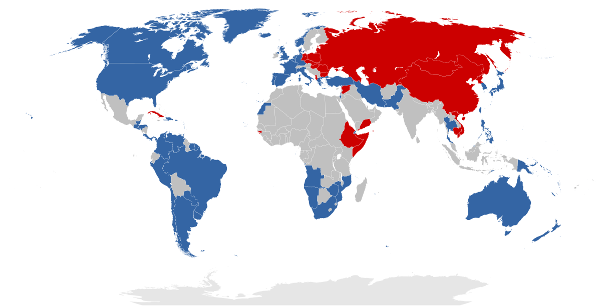

## Table of Contents

## What are First World countries?

First World countries are nations that were originally considered to be aligned with the United States and its allies during the Cold War. This term was used to describe countries that had strong economies, democratic governments, and high standards of living. Today, the term is often used more broadly to refer to developed countries with advanced economies, such as the United States, Canada, Japan, and most of Western Europe.

These countries typically have high levels of industrialization, strong infrastructures, and well-developed social services like healthcare and education. They also have higher average incomes and better access to technology compared to other countries. While the term "First World" is still used, it is less common now because it can be seen as outdated and oversimplifying the complex differences between nations.

## How did the term 'First World' originate?

The term 'First World' started during the Cold War. It was used to describe countries that were friends with the United States and against the Soviet Union. These countries had strong economies and good living conditions. They were called 'First World' to show they were different from the 'Second World,' which included the Soviet Union and its friends, and the 'Third World,' which was everyone else.

Today, 'First World' is often used to talk about rich countries with good technology and services. This includes places like the United States, Canada, Japan, and many countries in Western Europe. Even though the term is still used, some people think it's old-fashioned and doesn't really explain how different countries are now.

## Which countries are typically classified as First World?

First World countries are usually the ones that people think of as rich and developed. These include the United States, Canada, and Japan. Many countries in Western Europe are also considered First World, like the United Kingdom, France, Germany, and Italy.

These countries have strong economies, good technology, and high standards of living. They also have good healthcare and education systems. Even though the term "First World" comes from the Cold War, it's still used today to talk about these developed countries.

## What are the common characteristics of First World countries?

First World countries are known for having strong economies. They have a lot of businesses and factories, and people there usually have good jobs. These countries also have a lot of money and use advanced technology in their daily lives. This helps them to have a high standard of living, which means people can afford to buy things they need and want.

These countries also have good healthcare and education systems. People in First World countries can go to the doctor when they are sick and get the medicine they need. They also have schools where kids can learn and grow. Governments in these countries work to make sure everyone has access to these services. This helps to make life better for everyone who lives there.

Even though the term "First World" started during the Cold War, it is still used today to talk about these rich and developed countries. The United States, Canada, Japan, and many countries in Western Europe, like the United Kingdom, France, Germany, and Italy, are examples of First World countries. They are known for their wealth, technology, and good living conditions.

## How does the economy of First World countries differ from others?

First World countries have strong economies. This means they have a lot of businesses and factories that make things and provide services. People in these countries usually have good jobs and can earn a lot of money. They use a lot of technology to help their businesses run well. This makes their economy grow fast and helps them to be rich. They also trade a lot with other countries, which helps their economy even more.

Other countries might not have such strong economies. They might not have as many businesses or factories, so people might not have as many good jobs. They might not use as much technology, so their businesses might not grow as fast. This can make it hard for them to get rich. They might also have trouble trading with other countries, which can make their economy weaker.

Because of these differences, people in First World countries usually have more money and a better standard of living than people in other countries. They can afford to buy things they need and want, like good food, nice homes, and healthcare. This is not always true for people in countries with weaker economies.

## What role do First World countries play in global politics?

First World countries have a big role in global politics. They are often the leaders in international groups like the United Nations and the World Bank. These countries use their power and money to help make decisions that affect the whole world. They also have a lot of influence because they can help other countries with money, technology, and military support. This makes them important players in keeping the world stable and helping to solve big problems like climate change and poverty.

Sometimes, First World countries work together to solve problems. They might make agreements about trade or how to protect the environment. But they can also disagree and have conflicts with each other. For example, they might argue about how to deal with countries that have different political ideas or how to respond to global crises. Even though they have a lot of power, First World countries need to work with other countries to make the world a better place for everyone.

## How do First World countries address social issues like poverty and inequality?

First World countries often have programs to help people who are poor or facing inequality. These programs can include giving money to people who need it, like welfare or unemployment benefits. They also have services like food stamps, which help people buy food, and affordable housing programs to help people find a place to live. Schools and healthcare are also important. First World countries try to make sure everyone can go to school and get medical help when they need it. These efforts help to reduce poverty and make life fairer for everyone.

But it's not always easy to solve these problems. Even in rich countries, some people still face a lot of challenges. Governments have to balance helping people with keeping the economy strong. Sometimes, there are debates about how much money should be spent on social programs. People might disagree on whether the government should do more to help or if people should be more responsible for themselves. Despite these challenges, First World countries keep working to find better ways to address poverty and inequality, often by trying new ideas and learning from what works in other places.

## What are the challenges faced by First World countries in terms of sustainability?

First World countries face big challenges when it comes to being sustainable. One big problem is that these countries use a lot of energy and resources. They have a lot of factories, cars, and buildings that need power. This can harm the environment because it creates a lot of pollution and uses up resources that can't be replaced easily. These countries need to find ways to use less energy and find cleaner ways to get the energy they need, like using more wind or solar power instead of oil and coal.

Another challenge is dealing with waste. First World countries produce a lot of trash because people buy a lot of things and throw away a lot of stuff. This can be bad for the environment if the trash is not handled properly. These countries need to find better ways to recycle and reuse things instead of just throwing them away. They also need to teach people how to live in a way that makes less waste. This can be hard because it means changing how people live and what they buy.

Even though these challenges are big, First World countries have the money and technology to help solve them. They can invest in new ideas and technologies that are better for the environment. They can also work together with other countries to share what they learn and make the whole world more sustainable. But it will take time and effort to make these changes happen.

## How have First World countries historically influenced global economic development?

First World countries have had a big impact on the world's economy for a long time. They started to grow rich and powerful during the Industrial Revolution, when they built a lot of factories and made a lot of things. This helped them to become rich and have strong economies. They used their power to trade with other countries and set up businesses all over the world. This helped them to keep growing and getting richer. They also made rules about trade and money that other countries had to follow. This gave them even more power over the world's economy.

These countries also helped other countries to grow their economies. They did this by giving money and technology to poorer countries. This was called development aid. Sometimes, they also helped by building roads, schools, and hospitals in other countries. But it wasn't always easy. Sometimes, the help they gave didn't work out as planned, and it could even make things worse for the countries they were trying to help. Even so, First World countries have been very important in shaping how the world's economy works today.

## What is the impact of First World countries on international trade and finance?

First World countries have a big impact on international trade and finance. They make a lot of rules and agreements about how countries should trade with each other. These rules help them to sell their products all over the world and make a lot of money. They also have big banks and financial companies that lend money to other countries. This helps them to control a lot of the world's money and have a lot of power over the economy.

These countries also help to keep the world's money system stable. They do this by working together in groups like the World Bank and the International Monetary Fund. These groups make rules about money and help countries that are having financial problems. But sometimes, the rules they make can be hard for poorer countries to follow. This can make it harder for those countries to grow their economies and can create problems for them.

Even though First World countries have a lot of power, they need to work with other countries to make the world's economy fair for everyone. They need to make sure that the rules they set up help all countries to grow and not just the rich ones. This can be hard, but it's important for making the world a better place for everyone.

## How do First World countries approach technological advancement and innovation?

First World countries put a lot of effort into making new technology and coming up with new ideas. They spend a lot of money on research and development, which means they pay people to think of new ways to do things. These countries have big companies and universities that work together to create new inventions. They also have good laws that protect people's ideas, so inventors can make money from their new creations. This encourages more people to come up with new ideas and helps the country's economy grow.

These countries also use technology to make life better for their people. They use new technology in schools to help kids learn, in hospitals to help doctors treat patients, and in businesses to make them more efficient. They also work on big projects like building better roads, creating faster internet, and finding new ways to use energy that are good for the environment. By doing all these things, First World countries stay at the front of the world when it comes to technology and innovation.

## What future trends might affect the status of First World countries?

In the future, First World countries might face challenges from new technology and changing economies. Other countries are starting to grow and use more technology. This could mean that First World countries won't be the only ones with strong economies and good technology. They might have to work harder to stay ahead. Also, the world's economy is changing. Countries that used to be poor are getting richer, and this could change how much power First World countries have.

Another big trend is climate change. First World countries use a lot of energy and create a lot of pollution. They will need to find new ways to use less energy and make less pollution. This could be hard because it means changing how people live and work. But it's important for keeping the world safe and healthy. If they can find good solutions, it could help them stay strong and respected in the world.

Lastly, social changes could affect First World countries. People are starting to care more about equality and fairness. This means these countries might need to do more to help people who are poor or facing other problems. If they can't, it could cause problems at home and make it harder for them to lead in the world. But if they can find ways to make life better for everyone, it could help them stay strong and respected.

## What is the impact of algorithmic trading on first world economies?

In the contemporary landscape of financial markets, developed countries are at the forefront of leveraging algorithmic trading to drive market efficiencies and liquidity. Algorithmic trading, which utilizes automated systems to execute trading strategies at high speed and frequency, plays a pivotal role in the economies of industrialized nations.

### Contribution to Market Liquidity and Efficiency

Algorithmic trading significantly enhances market liquidity by facilitating a higher [volume](/wiki/volume-trading-strategy) of transactions with minimal human intervention. This increase in liquidity is crucial, as it allows for the swift execution of large trades without substantially impacting the market price, thus minimizing the transaction costs and reducing the spread between bid and ask prices. In financial markets, liquidity is a critical attribute that reflects the ease with which assets can be bought and sold without causing a drastic change in their prices. In mathematical terms, the liquidity of an asset can be appreciated through its price impact function:

$$
\Delta P = L(Q)
$$

where $\Delta P$ denotes the change in price, $L$ is the liquidity function, and $Q$ is the quantity of assets traded. Algorithmic trading optimizes this relationship by executing trades in smaller, strategically timed increments, reducing $\Delta P$.

Moreover, algorithmic trading enhances market efficiency by leveraging computational power to analyze vast datasets at speeds far beyond human capability. Algorithms can quickly assess complex market conditions and exploit [arbitrage](/wiki/arbitrage) opportunities, thus contributing to the price discovery process. Efficient markets are those where asset prices fully reflect all available information. In developed economies, the efficiency gains from algorithmic trading facilitate more accurate valuations of equities and other financial instruments, bolstering investor confidence and attracting more capital to financial markets.

### Role of Financial Markets in Economic Growth and Capital Formation

Financial markets serve as engines for economic growth and capital formation, and algorithmic trading plays a significant role in this context. By augmenting liquidity and efficiency, algorithmic trading lowers the cost of capital for firms, enabling them to access funding more readily for expansion and innovation. This capital influx is vital for the growth of companies and the broader economic development of industrialized nations.

Furthermore, efficient and liquid markets attract global investors, increasing foreign direct investment (FDI) and furthering capital formation. As a result, developed countries can maintain robust infrastructure and technological advancements that continue to support economic stability and growth. Algorithmic trading also facilitates better risk management, allowing for more optimal asset pricing and allocation, which in turn supports sustainable economic expansion.

In conclusion, algorithmic trading enhances the functioning of financial markets in first world economies, promoting greater liquidity, efficiency, and capital formation. These developments underpin the economic dynamism and innovation that characterize industrialized countries, positioning them as leaders in financial market evolution.

## References & Further Reading

[1]: Bergstra, J., Bardenet, R., Bengio, Y., & Kégl, B. (2011). ["Algorithms for Hyper-Parameter Optimization."](https://papers.nips.cc/paper/4443-algorithms-for-hyper-parameter-optimization) Advances in Neural Information Processing Systems 24.

[2]: ["Advances in Financial Machine Learning"](https://www.amazon.com/Advances-Financial-Machine-Learning-Marcos/dp/1119482089) by Marcos Lopez de Prado

[3]: ["Evidence-Based Technical Analysis: Applying the Scientific Method and Statistical Inference to Trading Signals"](https://www.amazon.com/Evidence-Based-Technical-Analysis-Scientific-Statistical/dp/0470008741) by David Aronson

[4]: ["Machine Learning for Algorithmic Trading: Predictive models to extract signals from market and alternative data for systematic trading strategies with Python"](https://github.com/stefan-jansen/machine-learning-for-trading) by Stefan Jansen

[5]: ["Quantitative Trading: How to Build Your Own Algorithmic Trading Business"](https://www.amazon.com/Quantitative-Trading-Build-Algorithmic-Business/dp/1119800064) by Ernest P. Chan

[6]: Aldridge, I. (2013). ["High-Frequency Trading: A Practical Guide to Algorithmic Strategies and Trading Systems"](https://www.amazon.com/High-Frequency-Trading-Practical-Algorithmic-Strategies/dp/1118343506). Wiley.

[7]: Hasbrouck, J. (2003). ["Trading Technology and Market Structure: Theory and Evidence from a Regulatory Experiment in the E‐Mini Futures Market"](https://pmc.ncbi.nlm.nih.gov/articles/PMC2367127/) Review of Financial Studies.

[8]: Hendershott, T., Jones, C. M., & Menkveld, A. J. (2011). ["Does Algorithmic Trading Improve Liquidity?"](https://onlinelibrary.wiley.com/doi/full/10.1111/j.1540-6261.2010.01624.x) Review of Financial Studies.

[9]: Narang, R. K. (2013) ["Inside the Black Box: A Simple Guide to Quantitative and High-Frequency Trading"](https://onlinelibrary.wiley.com/doi/book/10.1002/9781118662717). Wiley.