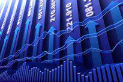

Understanding the complex interrelationships between taxation, fiscal capacity, government revenue, and algorithmic trading is key to comprehending the dynamics of modern economies. Fiscal capacity is essentially the government's ability to generate revenue necessary for funding public goods and services, playing a critical role in maintaining societal infrastructure and welfare programs. This capacity is largely dependent on the system of taxation, which serves as one of the primary avenues through which governments accumulate revenue. An effective taxation system is pivotal for enhancing fiscal capacity, thereby empowering governments to meet their financial obligations and policy objectives.

Algorithmic trading introduces a new dimension to this economic landscape. With the deployment of computer algorithms to automate trading decisions, algorithmic trading has revolutionized financial markets by offering unprecedented speed and the capability to handle vast quantities of data. This development impacts market dynamics and introduces new factors that policymakers must consider when formulating economic strategies. By understanding these relationships, insights are gained into how they jointly shape fiscal policies and economic outcomes, culminating in a deeper understanding of how modern economies function and adapt to emerging challenges. This article examines these interconnected elements, aiming to provide clarity and insights into their influence on economic policy and stability.



## Table of Contents

## Understanding Fiscal Capacity

Fiscal capacity refers to a government's ability to generate revenue to fund public goods and services, ensuring the welfare of its citizens. This capacity is primarily derived from taxation, but also includes non-tax sources such as fees, fines, and profits from public enterprises. The effectiveness and sustainability of a government's fiscal capacity are critical for evaluating its fiscal policies.

The available tax base significantly influences fiscal capacity. A broad tax base, where taxes are levied on a wide range of economic activities, can provide a stable and substantial revenue stream. Conversely, a narrow tax base, limited to specific sectors or income brackets, may constrain revenue generation, making the government vulnerable to economic fluctuations.

Administrative efficiency is another key determinant in enhancing fiscal capacity. Efficient tax collection systems minimize evasion and maximize compliance, ensuring that taxes are collected as intended. Advanced technology and data analytics can streamline the process, reduce costs, and deter fraudulent practices. For example, automated tax return systems and electronic invoicing provide transparency and ease of monitoring.

Economic and political constraints also affect fiscal capacity. Economic downturns can reduce income and profits, shrinking the tax base. Political factors, such as resistance to tax increases or preferences for certain tax structures, shape the extent and effectiveness of fiscal measures. Therefore, understanding fiscal constraints and opportunities within a specific context is essential for sustainable policy formulation.

Governments utilize their fiscal capacity to allocate resources for public infrastructure, healthcare, education, and social welfare programs, directly impacting citizens' quality of life. Effective use of fiscal capacity ensures that essential services are delivered efficiently and equitably, contributing to economic stability and growth.

Understanding fiscal capacity is paramount for assessing the viability and responsiveness of fiscal policies. By evaluating fiscal capacity, governments can optimize resource allocation, adapt to economic changes, and meet developmental goals. This comprehension also assists in identifying potential weaknesses in revenue systems, enabling timely reforms and adjustments. Through a proactive approach, governments can achieve a balance between revenue generation and economic vitality, fostering a resilient economic environment.

## The Role of Taxation in Government Revenue

Taxation serves as a pivotal mechanism for governments to generate revenue, thereby bolstering fiscal capacity. It enables the funding of public services and infrastructure, which are essential for a functioning society. Various forms of taxation, each with its distinct role in government revenue, include income tax, corporate tax, and sales tax.

Income tax is levied on individual earnings and is often structured progressively, meaning that higher income earners pay a higher percentage of their earnings, aiming at reducing income inequality. Corporate tax, on the other hand, is imposed on a company's profit and plays a significant role in government revenue, particularly important in economies with substantial industrial and business activities. Sales tax is a consumption tax placed on goods and services, contributing uniformly as most consumers engage in regular purchases.

Taxation also significantly influences economic behavior by incentivizing or disincentivizing certain actions. For instance, tax credits for renewable energy investments can encourage companies and individuals to adopt sustainable practices. Conversely, higher taxes on tobacco products aim to reduce smoking rates. This behavioral influence is grounded in economic theories related to supply and demand, where the cost changes due to taxes alter consumer and producer behaviors.

Effective tax policy is essential for optimized government revenue without substantial economic disruption. This balance is achieved by carefully designing tax systems that maximize revenue while minimizing adverse effects on economic activity. Key considerations include maintaining a broad tax base to ensure fairness and efficiency, reducing loopholes, and setting rates that do not overly deter economic participation.

Mathematically, the impact of a tax policy can be expressed in terms of elasticity. If $E_d$ represents the elasticity of demand, a relatively inelastic demand (i.e., $|E_d| < 1$) implies that quantity demanded doesn't change much with price increases, indicative of a good candidate for taxation without significantly altering consumption levels. Python can model such ideas, illustrating potential revenue impacts for different elasticity scenarios.

```python
def tax_revenue(price, tax_rate, elasticity):
    quantity_demanded = lambda p: 1000 - 50 * p # Assumed demand function
    price_with_tax = price * (1 + tax_rate)
    new_demand = quantity_demanded(price_with_tax)
    return new_demand * tax_rate * price

price = 10
elasticity = 0.5  # Inelastic demand
tax_rate = 0.1

revenue = tax_revenue(price, tax_rate, elasticity)
print(f"Estimated Revenue: ${revenue:.2f}")
```

In conclusion, taxation is more than just a revenue tool; it is an economic policy instrument that can target specific economic outcomes while supporting fiscal capacity. The challenge lies in understanding and predicting the myriad ways various taxes interact with economic behavior, requiring a nuanced approach to policy design and implementation.

## Algorithmic Trading and Its Impact on Economic Policy

Algorithmic trading involves the use of advanced computer algorithms to automate trading decisions according to predetermined criteria. This innovative approach has transformed financial markets by offering unparalleled advantages, such as executing trades with high speed and processing vast volumes of data with precision. The speed at which [algorithmic trading](/wiki/algorithmic-trading) operates enhances market [liquidity](/wiki/liquidity-risk-premium), often leading to narrower spreads between bid and ask prices. It also allows for the quick integration of new information into market prices, thereby fostering more efficient market conditions.

One of the notable contributions of algorithmic trading to economic policy is its ability to provide detailed insights into the implications of various fiscal policies. By analyzing large datasets and spotting patterns, algorithmic trading facilitates a more data-driven approach to understanding economic behaviors and trends. This data-centric analysis aids policymakers in assessing the real-time impact of fiscal measures, thus enabling more informed decision-making.

Moreover, the prevalence of algorithmic trading has direct repercussions on how fiscal policies are formulated and implemented. For instance, as algorithmic trading accounts for a significant share of trade volumes in modern financial markets, it can influence asset pricing and [volatility](/wiki/volatility-trading-strategies), factors that are crucial when considering fiscal interventions. Policymakers must account for these dynamics to ensure that fiscal policies engender the desired economic outcomes without unintended market disruptions.

Additionally, algorithmic trading can impact capital flows and investment patterns, indirectly shaping fiscal policy objectives. The immediate response of algorithmic trading systems to news and policy announcements can cause swift changes in market sentiments, impacting investor confidence and economic stability. As such, understanding the feedback loop between algorithmic trading activity and fiscal policy is essential for crafting measures that support sustainable economic growth.

In summary, algorithmic trading plays a critical role in modern financial systems by enhancing trading efficiency and providing valuable insights into policy effects. Its influence on market dynamics necessitates its consideration in the development and implementation of fiscal policies, thereby highlighting its integral role in shaping economic policy in an increasingly complex financial landscape.

## Challenges in Balancing Fiscal Capacity and Economic Growth

Balancing fiscal capacity with economic growth presents significant challenges for policymakers. One major aspect involves navigating the trade-offs between maximizing tax revenues and fostering a conducive environment for economic activity. High tax rates can potentially lead to reduced investment, lower consumer spending, and hindered economic growth. Conversely, low tax rates might not generate sufficient revenue to fund critical government functions and services, adversely affecting fiscal capacity.

To enhance fiscal capacity without hampering economic growth, optimizing the tax base is a crucial strategy. This involves broadening the scope of taxable entities or activities, which allows governments to maintain or reduce tax rates while still increasing revenue. For example, minimizing loopholes and exemptions in tax legislation can lead to a more equitable tax system and maintain competitiveness within the global market.

Utilizing non-tax revenue sources is another effective approach. Governments can explore alternative revenue streams such as fees, charges for public services, and leveraging national resources. This diversification reduces reliance on taxation alone, providing a buffer against potential economic downturns.

Global economic interactions and leakages, such as cross-border trade and capital flows, play a vital role in shaping fiscal capacity and growth. Policymakers must consider these elements when formulating fiscal policies. International tax treaties and cooperative frameworks, like those aimed at preventing base erosion and profit shifting (BEPS), are integral in addressing fiscal leakages. Furthermore, understanding multinational corporations' behaviors can aid in crafting policies that capture tax revenues more efficiently without stifling cross-border investments.

In conclusion, a balanced approach towards fiscal capacity and economic growth requires a multifaceted strategy that involves optimizing tax structures, exploring non-tax revenue sources, and considering global economic dynamics. This balance is imperative for sustainable development and economic prosperity.

## Conclusion

The interplay between taxation, fiscal capacity, government revenue, and algorithmic trading plays a crucial role in shaping the trajectories of modern economies. A comprehensive understanding of these interconnected components enables policymakers to design and implement strategies that encourage economic growth and maintain stability. By effectively managing taxation and fiscal capacity, governments can generate sufficient revenue to fund public services while minimizing any negative economic distortion.

Algorithmic trading introduces a technological dimension that has redefined financial markets. Its ability to process large datasets and execute trades with unprecedented speed provides valuable insights into market behavior and allows for the real-time assessment of economic policies. Policymakers can leverage these insights to refine fiscal policies, ensuring they are grounded in robust data analytics.

For a balanced economic strategy, it is essential that policymakers strike a middle ground between generating adequate fiscal resources and fostering a healthy economic environment. This involves optimizing tax systems to maximize revenue without stifling innovation or economic activity. Additionally, integrating insights from algorithmic trading into fiscal policy formation can enhance the effectiveness and adaptability of economic strategies.

Future economic strategies will benefit from a holistic approach that synergizes taxation frameworks with algorithmic trading insights. This synthesis will not only support the crafting of more resilient economic policies but also ensure that they are adaptable to changing market conditions and emerging challenges in the global economic landscape. As such, the integration of these elements shapes a dynamic and responsive economic policy framework capable of sustaining long-term growth and stability.

## References & Further Reading

Blanchard, O., & Leigh, D. (2013). "Growth Forecast Errors and Fiscal Multipliers." IMF Working Paper. This paper explores the relationship between fiscal multipliers and economic growth forecast errors, providing insights into how fiscal policies can influence economic performance. 

Ramey, V. A. (2019). "Ten Years After the Financial Crisis: What Have We Learned from the Renaissance in Fiscal Research?" National Bureau of Economic Research Working Paper. This work reassesses fiscal policy impacts in the decade following the financial crisis, offering critical evaluations of fiscal interventions and their long-term effects.

Zandi, M. (2010). "An Update on the Economic Impact of the American Recovery and Reinvestment Act of 2009." Moody's Analytics. This report provides an analysis of the economic impact of the 2009 stimulus package, shedding light on how fiscal interventions affect macroeconomic outcomes.

For a deeper understanding of how these work interconnect with taxation, fiscal capacity, and economic growth, it is crucial to consider further resources that evaluate fiscal policies' effectiveness and the role of algorithmic trading in market dynamics. These resources offer foundational knowledge useful for policymakers aiming to optimize economic strategies in modern economies.

