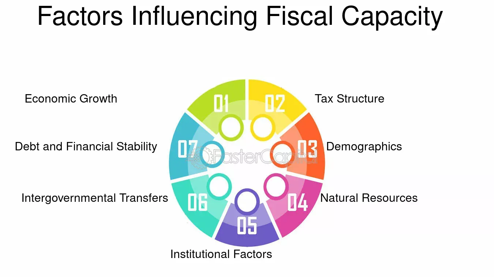

## Table of Contents

## What is fiscal capacity?

Fiscal capacity refers to a government's ability to generate revenue through taxes and other sources to fund its expenditures. It's like figuring out how much money a government can collect to pay for things like schools, roads, and public services. If a government has a high fiscal capacity, it means it can raise enough money to support its needs and programs without too much trouble.

However, if a government has a low fiscal capacity, it might struggle to collect enough money to cover its costs. This can lead to problems like budget deficits, where the government spends more money than it brings in. Understanding a government's fiscal capacity is important for planning and managing public finances effectively, ensuring that essential services can be provided to the community.

## How is fiscal capacity measured?

Fiscal capacity is measured by looking at how much money a government can realistically collect from taxes and other sources. This involves looking at things like the size of the economy, the number of people who can be taxed, and what kinds of taxes the government can use. For example, if a country has a lot of businesses and high-income earners, it might have a higher fiscal capacity because it can collect more money from corporate and income taxes.

To get a more accurate measure, experts often use a formula called the Representative Revenue System (RRS). This formula compares what a government actually collects to what it could potentially collect if it used the same tax rates and methods as other similar governments. This helps to see if a government is doing a good job at collecting taxes or if it could do better. By understanding these measurements, governments can make better plans for spending and saving money.

## Why is fiscal capacity important for a country's economy?

Fiscal capacity is really important for a country's economy because it shows how much money the government can collect to spend on things like schools, hospitals, and roads. If a country has a high fiscal capacity, it means the government can raise enough money to pay for these important services without borrowing too much. This helps keep the economy stable and makes sure that people have the services they need to live well.

On the other hand, if a country has a low fiscal capacity, it might struggle to collect enough money to cover its costs. This can lead to problems like budget deficits, where the government spends more money than it brings in. When this happens, the government might need to borrow money, which can lead to higher debts and make it harder for the economy to grow. So, understanding and improving fiscal capacity is key to keeping a country's economy strong and healthy.

## What are the main components that contribute to fiscal capacity?

The main components that contribute to fiscal capacity include the size of the economy, the tax base, and the types of taxes a government can use. The size of the economy matters because a bigger economy usually means more money can be collected from taxes. The tax base is all the things that can be taxed, like income, sales, and property. If a country has a lot of people earning good money, or a lot of businesses, it can collect more taxes. The types of taxes also make a difference. Some taxes, like income tax, can bring in a lot of money if set at the right rates, while others, like sales tax, might not bring in as much.

Another important component is the efficiency of tax collection. This means how good the government is at actually getting the money it's owed. If the tax system is easy to understand and hard to cheat, the government can collect more money. Also, the government's ability to borrow money can affect fiscal capacity. If lenders trust the government to pay back loans, it can borrow more easily, which can help cover costs when tax revenue isn't enough. All these parts together help decide how much money a government can raise and spend on public services.

## How does fiscal capacity differ from fiscal policy?

Fiscal capacity and fiscal policy are two different but related ideas. Fiscal capacity is about how much money a government can collect from taxes and other sources. It's like figuring out how much money is in the government's wallet. This depends on things like how big the economy is, how many people can be taxed, and what kinds of taxes the government can use. If a government has a high fiscal capacity, it means it can collect a lot of money to spend on things like schools and roads.

Fiscal policy, on the other hand, is about how the government decides to spend and collect that money. It's like making a budget and deciding where to spend the money in the wallet. Fiscal policy includes decisions like raising or lowering taxes, spending more or less on public services, and borrowing money if needed. While fiscal capacity tells us how much money the government can get, fiscal policy is about the choices the government makes with that money to help the economy grow or to manage problems like inflation or unemployment.

## What are the mechanisms through which fiscal capacity can be enhanced?

To improve fiscal capacity, a government can focus on making its economy grow. A bigger economy means more people and businesses that can be taxed, which leads to more money coming in. Governments can do this by creating jobs, helping businesses, and making it easier for people to start new companies. Another way is to make the tax system better. If the tax system is clear and fair, more people will pay their taxes, and it will be harder for others to cheat. Governments can also look at changing the kinds of taxes they use. For example, if income taxes are not bringing in enough money, they might think about adding or increasing other taxes like sales or property taxes.

Another important way to boost fiscal capacity is to improve how the government collects taxes. If the tax collection system is efficient and hard to avoid, the government can get more money from what it's owed. This can mean using technology to make paying taxes easier or hiring more people to make sure everyone pays what they should. Also, the government can work on getting more money from other sources, like fees or fines. Lastly, if the government can borrow money at good rates, it can use this to help cover costs when tax money isn't enough. By using these methods, a government can increase its fiscal capacity and have more money to spend on things that people need.

## Can fiscal capacity influence a country's credit rating?

Yes, fiscal capacity can influence a country's credit rating. Credit rating agencies look at how much money a country can collect from taxes and other sources to see if it can pay back its debts. If a country has a high fiscal capacity, it means it can collect a lot of money and is more likely to pay back what it owes. This makes lenders feel more confident, and the country might get a better credit rating. A better credit rating means the country can borrow money at lower interest rates, which is good for its economy.

On the other hand, if a country has a low fiscal capacity, it might struggle to collect enough money to cover its debts. This can make lenders worried that the country won't be able to pay back what it borrows. As a result, the country might get a lower credit rating. A lower credit rating means the country has to pay higher interest rates when it borrows money, which can make it even harder to manage its finances. So, having a strong fiscal capacity is important for keeping a good credit rating and helping the economy stay healthy.

## How do different economic theories explain the role of fiscal capacity?

Different economic theories view the role of fiscal capacity in unique ways. Keynesian economics, for example, sees fiscal capacity as crucial for government spending to boost the economy during downturns. Keynesians believe that when the economy is struggling, the government should spend more money, even if it means running a deficit, to help people keep their jobs and keep businesses running. If the government has a strong fiscal capacity, it can raise enough money through taxes to fund these programs without causing too many problems. This helps the economy recover faster and keeps people from suffering too much during tough times.

On the other hand, classical and neoclassical economists think that fiscal capacity should be used carefully. They believe that the government should not spend more than it collects in taxes because running deficits can lead to problems like inflation and higher debts. These economists argue that a strong fiscal capacity is important, but it should be used to keep the government's budget balanced, not to spend more than it earns. They believe that if the government keeps its spending in check, it will help the economy grow in a steady and healthy way over the long term.

## What are the challenges in accurately assessing a country's fiscal capacity?

One big challenge in figuring out a country's fiscal capacity is that it depends on a lot of things that can change. The economy can grow or shrink, and this affects how much money the government can collect from taxes. Also, the tax system itself can be hard to understand. If the rules are complicated, it can be tough to know exactly how much money the government can get. Plus, people and businesses might try to avoid paying taxes, which makes it even harder to predict how much money will come in.

Another challenge is that different countries have different ways of collecting taxes. Some might rely a lot on income taxes, while others might use sales or property taxes more. This makes it hard to compare one country's fiscal capacity to another's. Also, the government's ability to borrow money can affect fiscal capacity, but this can change based on things like the country's credit rating and what's happening in the global economy. All these things make it tricky to get a clear and accurate picture of a country's fiscal capacity.

## How does fiscal capacity impact intergovernmental fiscal relations?

Fiscal capacity plays a big role in how different levels of government work together. When a country has different levels of government, like a national government and state or local governments, they all need money to do their jobs. If the national government has a high fiscal capacity, it can collect a lot of money from taxes and might be able to share some of that money with state or local governments. This helps make sure that even if a state or local government doesn't have a lot of money, it can still provide important services to its people. But if the national government has a low fiscal capacity, it might not be able to help out as much, and state or local governments might struggle to pay for things like schools and roads.

On the other hand, if state or local governments have a strong fiscal capacity, they might not need as much help from the national government. This can lead to more independence for these governments, but it can also create differences between richer and poorer areas. For example, a state with a lot of businesses and high-income earners might be able to collect a lot of money in taxes, while a state with fewer resources might struggle. This can affect how money is shared between different levels of government and can lead to discussions about fairness and how to make sure everyone gets the services they need.

## What role does fiscal capacity play in economic stabilization and growth?

Fiscal capacity is really important for keeping the economy stable and helping it grow. When a government has a high fiscal capacity, it means it can collect a lot of money from taxes and other sources. This money can be used to spend on things like building roads, schools, and hospitals, which help the economy grow. If the economy is doing well, the government can collect even more money, which it can then use to keep things going smoothly. But if the economy starts to slow down, a government with a strong fiscal capacity can spend more money to help people keep their jobs and businesses stay open, which helps the economy recover faster.

On the other hand, if a government has a low fiscal capacity, it might not have enough money to help the economy when it needs it. This can make it harder for the economy to grow and can lead to problems like high unemployment and slow growth. When the government can't collect enough money, it might have to borrow more, which can lead to higher debts and make the economy even more unstable. So, having a strong fiscal capacity is key to making sure the government can do what it needs to do to keep the economy stable and growing.

## How can fiscal capacity be sustainably increased over the long term?

To sustainably increase fiscal capacity over the long term, a government needs to focus on growing its economy. When the economy grows, there are more people and businesses that can be taxed, which means more money for the government. This can be done by creating jobs, helping businesses, and making it easier for people to start new companies. Another important way is to make the tax system better. If the tax system is clear and fair, more people will pay their taxes, and it will be harder for others to cheat. Governments can also look at changing the kinds of taxes they use. For example, if income taxes are not bringing in enough money, they might think about adding or increasing other taxes like sales or property taxes.

Another way to sustainably increase fiscal capacity is to improve how the government collects taxes. If the tax collection system is efficient and hard to avoid, the government can get more money from what it's owed. This can mean using technology to make paying taxes easier or hiring more people to make sure everyone pays what they should. Also, the government can work on getting more money from other sources, like fees or fines. Lastly, if the government can borrow money at good rates, it can use this to help cover costs when tax money isn't enough. By using these methods, a government can increase its fiscal capacity in a way that helps the economy stay strong and healthy over the long term.

## References & Further Reading

Blanchard, O., & Leigh, D. (2013). "Growth Forecast Errors and Fiscal Multipliers." IMF Working Paper. This paper explores the relationship between fiscal multipliers and economic growth forecast errors, providing insights into how fiscal policies can influence economic performance. 

Ramey, V. A. (2019). "Ten Years After the Financial Crisis: What Have We Learned from the Renaissance in Fiscal Research?" National Bureau of Economic Research Working Paper. This work reassesses fiscal policy impacts in the decade following the financial crisis, offering critical evaluations of fiscal interventions and their long-term effects.

Zandi, M. (2010). "An Update on the Economic Impact of the American Recovery and Reinvestment Act of 2009." Moody's Analytics. This report provides an analysis of the economic impact of the 2009 stimulus package, shedding light on how fiscal interventions affect macroeconomic outcomes.

For a deeper understanding of how these work interconnect with taxation, fiscal capacity, and economic growth, it is crucial to consider further resources that evaluate fiscal policies' effectiveness and the role of algorithmic trading in market dynamics. These resources offer foundational knowledge useful for policymakers aiming to optimize economic strategies in modern economies.

