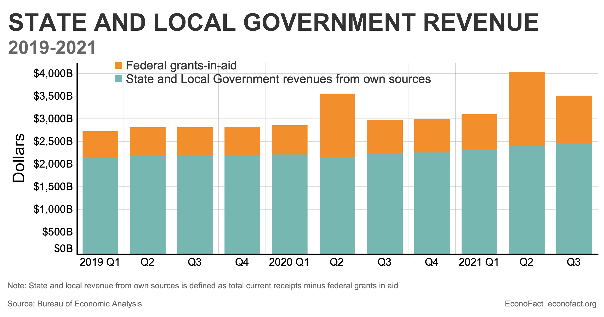

## Table of Contents

## What is a fiscal deficit?

A fiscal deficit happens when a government spends more money than it earns in a year. It's like when you spend more than what you earn, and you have to borrow money to cover the difference. Governments collect money through taxes and other sources, but sometimes this isn't enough to pay for everything they need to spend on, like schools, hospitals, and roads.

When a government has a fiscal deficit, it usually borrows money to make up for the shortfall. This borrowing can be from within the country or from other countries. While borrowing can help the government to keep providing important services, it also means the government has to pay back the money with interest. If the deficit is too large and keeps growing, it can lead to problems like higher interest rates and less money for other important things in the future.

## How do fiscal deficits affect state and local governments in the U.S.?

Fiscal deficits at the state and local level in the U.S. can create challenges because these governments, unlike the federal government, usually can't run deficits for long. When they spend more than they earn, they often have to cut services or raise taxes to balance their budgets. This can mean less money for schools, roads, and other public services that people rely on. If a state or local government keeps having deficits, it might have to borrow money, but this can be hard because lenders might worry about getting their money back.

These deficits can also affect the economy of a state or city. If a government cuts spending a lot, it can slow down the local economy because there's less money being spent on projects and services. On the other hand, if a government raises taxes to cover the deficit, it can make life harder for residents and businesses, which might discourage people from moving to or staying in the area. Balancing the need to manage deficits with the need to keep services running and the economy growing is a big challenge for state and local leaders.

## What are the main causes of fiscal deficits in U.S. state and local governments?

One main cause of fiscal deficits in U.S. state and local governments is when they spend more money than they collect in taxes and other revenues. This can happen because of economic downturns, when people earn less money and businesses make less profit, so they pay less in taxes. Also, sometimes the cost of things like health care and pensions for government workers goes up, which means the government has to spend more money than it planned.

Another reason for fiscal deficits is when state and local governments make big promises to spend money on things like new schools or roads, but they don't raise enough taxes to pay for them. Sometimes, they hope that the economy will grow and bring in more tax money later, but if it doesn't, they end up with a deficit. Also, some states have laws that say they can't run deficits, so they have to find ways to balance their budgets, which can be hard if they've already promised to spend a lot of money.

In some cases, natural disasters or unexpected events can lead to fiscal deficits. For example, if a hurricane damages a city, the local government might have to spend a lot of money on repairs and emergency services. If they don't have enough money saved up or if they can't get help from the federal government, they might end up with a deficit. These unexpected costs can be hard to plan for and can put a lot of pressure on state and local budgets.

## How do state and local governments finance their fiscal deficits?

When state and local governments in the U.S. have fiscal deficits, they often need to find ways to borrow money to cover the gap between what they spend and what they earn. One common way they do this is by selling bonds. Bonds are like IOUs that the government promises to pay back with interest over time. People and institutions buy these bonds, giving the government the money it needs now, but the government has to pay back this money later, which can add to future budget problems if the deficits keep growing.

Another way state and local governments might finance their deficits is by using their savings or rainy day funds. These are like emergency savings accounts that governments set aside for tough times. If a government has enough money saved up, it can use this to cover a deficit without having to borrow. But if they keep using their savings and don't have enough coming in, they might run out of money and still need to borrow or cut spending. In some cases, governments might also get help from the federal government, especially if the deficit is caused by something unexpected like a natural disaster.

## What are the differences between state and local government fiscal policies?

State and local governments both have to manage their money carefully, but they often have different rules and ways of doing things. States usually have more power to make big decisions about taxes and spending because they have their own constitutions and laws. Many states have rules that say they can't run deficits, so they have to balance their budgets every year. This means they might have to raise taxes or cut spending if they don't have enough money. States also have more options for borrowing money, like selling bonds to pay for big projects like highways or schools.

Local governments, like cities and counties, have less power and usually have to follow the rules set by their state. They can't always make their own decisions about taxes and spending. For example, a city might want to raise property taxes to pay for a new park, but it might need permission from the state to do that. Local governments often rely more on property taxes and fees to get money, and they might not have as much saved up in rainy day funds as states do. Because of this, local governments can have a harder time dealing with deficits and might need to cut services more quickly if they run out of money.

Both state and local governments face challenges in managing their money, but the way they handle fiscal policies can be quite different because of the rules they have to follow and the resources they have available. States might be able to spread out the costs of big projects over time by borrowing, while local governments might have to find the money right away or ask for help from the state. Understanding these differences is important for figuring out how each level of government can best serve its people and keep its finances in order.

## How have fiscal deficits in U.S. state and local governments changed over the last decade?

Over the last decade, fiscal deficits in U.S. state and local governments have gone up and down because of different things happening in the economy and with government spending. After the big economic downturn in 2008, many states and cities had big deficits because they were spending more money than they were getting from taxes. People were [earning](/wiki/earning-announcement) less money and businesses were making less profit, so they were paying less in taxes. Governments had to cut spending on things like schools and roads, or they had to borrow money to keep going. As the economy got better, some states and cities started to have smaller deficits or even surpluses, which means they were getting more money than they were spending.

But then, in 2020, another big problem hit: the COVID-19 pandemic. This caused a lot of states and cities to have big deficits again because they had to spend a lot of money on things like health care and helping people who lost their jobs. At the same time, they were getting less money from taxes because businesses were closed and people were out of work. The federal government gave some help to states and cities, but many still had to borrow money or cut spending to deal with their deficits. Over the last few years, as the economy has started to recover from the pandemic, some states and cities have seen their deficits get smaller, but it's still a challenge for many to keep their budgets balanced.

## What are the economic impacts of fiscal deficits on state and local economies?

Fiscal deficits can have big effects on state and local economies. When a state or city has a deficit, it means they are spending more money than they are bringing in. To cover this gap, they might have to borrow money, raise taxes, or cut spending on things like schools, roads, and parks. If they cut spending a lot, it can slow down the local economy because there's less money being spent on projects and services. This can lead to fewer jobs and less money for people to spend on things they need. If they raise taxes, it can make life harder for residents and businesses, which might make some people move away or stop new businesses from coming to the area.

On the other hand, sometimes having a deficit can help the economy grow. If a state or city borrows money to spend on big projects like building new schools or fixing roads, it can create jobs and help the economy get better. This can lead to more people working and more money being spent in the community. But if the deficits keep growing and the government has to keep borrowing more and more money, it can lead to problems in the future. The government will have to pay back the money with interest, which can take away money from other important things and make it harder to keep the economy growing. Balancing the need to spend money to help the economy with the need to keep deficits under control is a big challenge for state and local leaders.

## How do fiscal deficits influence public services and infrastructure at the state and local level?

When state and local governments have fiscal deficits, it can mean less money for public services and infrastructure. If they don't have enough money coming in, they might have to cut back on things like schools, libraries, and parks. This can make it harder for people to get the services they need, like education and health care. If the government can't spend enough on roads and bridges, these might not get fixed as often, which can make it harder for people to get around and can slow down the economy.

On the other hand, sometimes governments might borrow money to spend on big projects like new schools or fixing roads. This can help improve public services and infrastructure, which can make life better for people and help the economy grow. But if the government keeps borrowing more and more money, it can lead to bigger deficits in the future. This means they might have to pay back a lot of money with interest, which can take away money from other important things and make it harder to keep services and infrastructure in good shape.

## What measures can state and local governments take to reduce fiscal deficits?

State and local governments can take several steps to reduce their fiscal deficits. One way is by cutting spending. This might mean spending less on things like new projects or reducing the number of people who work for the government. They might also look at how they spend money and try to find ways to do things more cheaply. Another way is by raising more money. This can be done by increasing taxes, like property or sales taxes, or by finding new ways to bring in money, like charging fees for certain services. By spending less and bringing in more money, governments can help close the gap between what they spend and what they earn.

Another approach is to use savings or rainy day funds to cover the deficit. These are like emergency savings accounts that governments set aside for tough times. If they have enough saved up, they can use this money to help balance their budgets without having to borrow. Governments can also try to grow their economies to bring in more tax money. This can be done by investing in things like education and infrastructure, which can create jobs and help businesses grow. But they have to be careful not to spend too much and make the deficit even bigger. Balancing these different measures is important for reducing fiscal deficits and keeping public services running smoothly.

## How do federal policies impact fiscal deficits in state and local governments?

Federal policies can have a big impact on how much money state and local governments have to spend and how much they can collect in taxes. When the federal government gives money to states and cities, like through grants or programs, it can help them pay for things like schools and roads. This can make their deficits smaller because they have more money to spend without having to borrow as much. But if the federal government cuts back on this money, states and cities might have to find other ways to pay for these things, which can make their deficits bigger. Also, federal tax policies can affect how much money people and businesses make, which changes how much they pay in state and local taxes.

Another way federal policies affect state and local deficits is through rules about what they can and can't do. For example, some states have to follow federal rules about how they spend money on things like health care. If these rules change, it can mean states have to spend more or less money in certain areas, which can make their deficits bigger or smaller. Federal policies can also affect the economy, like when the government tries to help during a recession. If the economy gets better, states and cities might collect more taxes and have smaller deficits. But if the economy stays bad, their deficits might grow because they're still spending money but not getting as much back in taxes.

## What are the long-term sustainability issues related to fiscal deficits in U.S. state and local governments?

Long-term sustainability issues related to fiscal deficits in U.S. state and local governments can be a big problem. If a state or city keeps having deficits year after year, it means they are spending more money than they are getting from taxes and other sources. This can lead to a lot of borrowing, which means they have to pay back the money with interest. Over time, this can make it harder for them to pay for important things like schools, roads, and health care. If they don't find a way to balance their budgets, they might have to keep cutting services or raising taxes, which can make life harder for people who live there.

Another issue is that big deficits can make it harder for state and local governments to deal with unexpected problems, like a natural disaster or an economic downturn. If they don't have enough money saved up or if they can't borrow more, they might not be able to help people who need it. This can make the economy worse and lead to even bigger problems in the future. Balancing the need to spend money on things that help people now with the need to keep deficits under control is a big challenge for state and local leaders. They have to find ways to manage their money carefully to make sure they can keep providing important services for a long time.

## Can you provide case studies of successful fiscal deficit management in U.S. state and local governments?

One good example of managing fiscal deficits well is what happened in Virginia. A few years ago, Virginia had a big deficit because the economy was not doing well. They had to find a way to spend less money and bring in more money to fix the problem. They did this by cutting spending on some things and making their government work more efficiently. They also looked for new ways to bring in money, like by growing their economy and bringing in new businesses. Over time, these steps helped Virginia get their budget under control and reduce their deficit. Now, they have a stronger economy and can spend money on important things like schools and roads.

Another example is the city of Denver, Colorado. Denver had a big deficit because they were spending more money than they were getting from taxes. They decided to ask people who live there if they could raise taxes a little bit to help pay for important services like schools and parks. The people said yes, and Denver used the extra money to help balance their budget. They also looked for ways to save money, like by making their government work better and spending less on things they didn't need. By doing these things, Denver was able to reduce their deficit and keep providing good services for people who live there.

## References & Further Reading

[1]: Alt, R., & Wiedmann, M. (2014). ["Electronic Markets and Algorithmic Trading."](https://link.springer.com/book/10.1007/978-3-319-11662-4) Electronic Markets.

[2]: Kim, M.K., & Bentler, P.M. (2002). ["Algorithmic trading and information."](https://psycnet.apa.org/record/2006-05382-009) International Journal of Finance and Economics.

[3]: Mongan, J. (2005). ["The Determinants of Fiscal Deficits and the Some Policy Implications."](https://www.researchgate.net/publication/340722385_The_determinants_of_fiscal_deficits_a_survey_of_literature) Journal of Economics and Business.

[4]: ["State and Local Fiscal Policy: Thinking Outside the Box?"](https://archive.org/details/statelocalfiscal0000unse) by Sally Wallace

[5]: Campbell, J.Y., & Cochrane, J.H. (2000). ["Explaining Corporate Leverage."](https://www.jstor.org/stable/10.1086/250059) National Bureau of Economic Research.