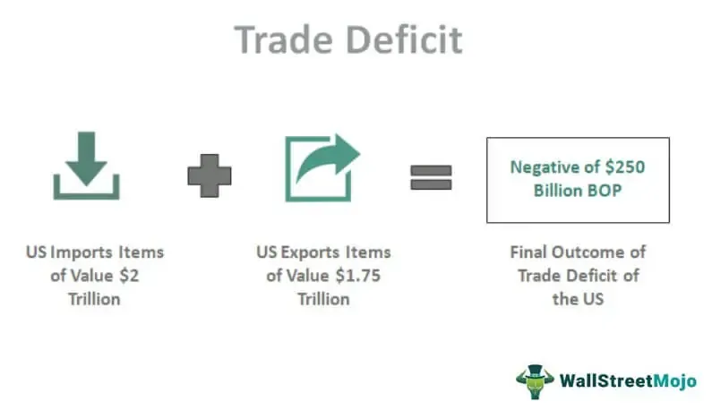

In recent times, discussions about fiscal policies and budgeting have gained significant prominence in political and economic spheres. A major area of focus within these discussions is the fiscal deficits faced by state and local governments. Unlike the federal government, which has the capability to operate with deficits largely due to its ability to issue treasury securities, state and local governments confront unique constraints. The legal and financial mechanisms that govern their fiscal operations impose stricter requirements, often necessitating balanced budgets.

This article scrutinizes the constraints state and local governments encounter due to these fiscal limitations. It also examines strategies employed to manage their budgets effectively, highlighting emerging innovations such as algorithmic trading in local governance. Algo trading, traditionally associated with financial markets, presents a promising opportunity for optimizing budget allocations and enhancing fiscal efficiency at the local government level.



Moreover, the article addresses the legality and feasibility of fiscal deficits, investigating their economic impacts as distinct from federal fiscal practices. By analyzing these aspects, the article provides a comprehensive understanding of how state and local governments navigate fiscal challenges and the potential solutions they might harness to ensure financial stability and economic growth.

## Table of Contents

## Understanding Fiscal Deficits in Local Governments

A fiscal deficit in local governments occurs when their expenditures exceed their revenues within a fiscal year. Unlike the federal government, which has the ability to finance deficits through the issuance of treasury securities, state and local governments encounter stricter financial constraints. The primary mechanism for these constraints is the presence of balanced budget requirements.

Balanced budget requirements are enforced through legal frameworks that can be either constitutional or legislative. These requirements are designed to ensure fiscal discipline at the state and local levels. Typically, the process begins with the governor, who is obligated to propose a balanced budget. This proposal must account for estimated revenues and planned expenditures, matching or exceeding the expected revenues with proposed spending.

The legislature then plays a critical role, as it is responsible for reviewing, amending if necessary, and ultimately passing the budget. Balanced budget mandates compel legislators to align expenditures with revenues, ensuring no deficit spending occurs under normal circumstances. This statutory requirement preserves fiscal responsibility but can also limit the flexibility of these governments to engage in deficit spending as a tool for economic stimulation during downturns.

In essence, these balanced budget rules mean that state and local governments must operate within their means, avoiding the accumulation of debt through operating deficits. While such fiscal discipline can prevent the accumulation of unsustainable debt, it also restricts the ability of these governmental entities to respond flexibly to fiscal challenges and economic crises. Consequently, the challenge remains to balance fiscal responsibility with the need for economic adaptability.

## Challenges Faced by State and Local Governments

State and local governments encounter several distinct challenges when it comes to managing fiscal deficits. Unlike the federal government, these entities typically cannot run fiscal deficits without restrictions. This limitation significantly influences their ability to stimulate local economies, especially during economic downturns.

First and foremost, while the federal government has the ability to issue treasury securities to finance deficits, state and local governments operate under more stringent financial regulations. Many states are bound by constitutional or legislative balanced budget requirements. These rules often demand that governors propose balanced budgets and that legislatures approve them, creating an environment where deficit spending is not a readily available tool for economic stimulus.

The necessity for legislative or public approval for incurring debt further complicates the situation. For local governments, this process can be both lengthy and complex. For instance, issuing municipal bonds, a common debt instrument, requires several procedural steps, including voter referendums in some cases. This requirement for public consent acts as a double-edged sword, ensuring democratic oversight but also potentially delaying urgent financial interventions.

Furthermore, the democratic process itself presents additional challenges. Politicians, mindful of their electorate, may be hesitant to propose measures that increase governmental debt, fearing potential backlash from constituents who prefer fiscal conservatism. Local governments are often subject to political pressures that vary widely depending on the local political climate and public opinion.

An additional consideration is the legal framework governing fiscal operations at the state and local levels. Each state has its unique set of laws that dictate how budgets can be managed, including what constitutes permissible levels of debt and deficit. For example, while states like Vermont operate without stringent balanced budget requirements, others, such as California, implement strict financial controls.

Overall, these governance structures limit the capacity of state and local governments to respond flexibly to economic changes. The inability to easily run deficits means these governments must rely on either cutting expenditures or increasing taxes to balance budgets, a constraint that can stifle economic recovery efforts. It is imperative for state and local governments to navigate these challenges carefully, balancing fiscal responsibility with the need for economic vitality.

## Innovative Solutions: The Rise of Algo Trading in Local Governance

Algorithmic trading, commonly associated with transformative shifts in financial markets, is now beginning to be explored by local governments as a tool to enhance fiscal management. Traditionally, [algorithmic trading](/wiki/algorithmic-trading) automates market transactions using predefined criteria or complex mathematical models; similarly, local governments could apply these principles to optimize budget allocations efficiently.

Local governments face many challenges in aligning their spending with volatile economic conditions. By using algorithmic solutions, these municipalities can improve their financial operations in several critical ways. Firstly, algorithm-based systems can enhance the accuracy of budget forecasts by analyzing large datasets to identify trends and anomalies. For instance, algorithms could be developed to predict revenue or expenditure patterns based on historical data, seasonal variations, and macroeconomic indicators. Such predictions enable governments to allocate resources more effectively, ensuring that funds are directed towards essential services during fluctuations.

Moreover, algorithmic solutions can offer robust tools for predictive analytics in anticipating economic downturns or upswings. By employing [machine learning](/wiki/machine-learning) models, local governments can detect early warning signs of economic stress, allowing them to proactively adjust their fiscal policies. For example, machine learning models trained on economic data can identify leading indicators of downturns, such as decreases in consumer spending or business investment. This foresight allows governmental bodies to implement counter-cyclical measures, such as discretionary spending cuts or investment in infrastructural projects, at opportune times.

To illustrate, consider a simple Python script that uses machine learning to forecast economic trends:

```python
import pandas as pd
from sklearn.model_selection import train_test_split
from sklearn.ensemble import RandomForestRegressor
from sklearn.metrics import mean_squared_error

# Example economic data
data = pd.read_csv('economic_data.csv') # Load dataset

# Define features and target variable
X = data.drop('EconomicIndicator', axis=1)
y = data['EconomicIndicator']

# Split data into training and testing sets
X_train, X_test, y_train, y_test = train_test_split(X, y, test_size=0.2, random_state=42)

# Initialize and train the model
model = RandomForestRegressor(n_estimators=100, random_state=42)
model.fit(X_train, y_train)

# Predict and evaluate
predictions = model.predict(X_test)
error = mean_squared_error(y_test, predictions) ** 0.5

print('Root Mean Squared Error:', error)
```

This basic framework demonstrates how local governments could implement a data-driven approach to financial management. It relies on algorithms to process complex datasets, enabling more informed and dynamic budgetary decisions.

While the exploration of algo trading within government finance is in its nascent stages, it holds the promise of more agile and responsive public sector financial management. By leveraging the computational power to analyze vast amounts of data, local governments can better prepare for economic variability, ultimately promoting fiscal stability and efficiency. The challenge lies in the integration of these technologies within existing public finance frameworks while ensuring transparency, accountability, and public trust.

## Case Studies: State Government Approaches to Fiscal Deficit Management

State governments in the U.S. adopt various strategies to manage fiscal deficits, driven by differences in constitutional mandates, economic structures, and revenue sources. This section examines how Vermont, Wyoming, and Alaska handle fiscal deficit management, highlighting the diversity in state approaches.

### Vermont

Vermont is unique among U.S. states as it does not have a formal requirement for a balanced budget. Despite this, the state has maintained a tradition of fiscal discipline, often achieving balanced budgets through prudent financial management and conservative revenue forecasting. Vermont's approach emphasizes adaptive budgeting, where expenditure and revenue forecasts are continuously adjusted based on the economic outlook. This flexibility allows Vermont to react to fiscal pressures without the constraints of rigid budget mandates.

### Wyoming

Wyoming operates under a constitutional mandate to balance its budget, but it faces challenges due to its revenue reliance on mineral extraction, particularly coal, oil, and gas. As these industries face [volatility](/wiki/volatility-trading-strategies), Wyoming employs a conservative budgeting approach, setting aside surplus revenues in its Permanent Wyoming Mineral Trust Fund. This fund acts as a buffer during downturns, enabling the state to maintain essential services without drastic fiscal measures. Additionally, the state prioritizes spending on infrastructure and education, seeking long-term economic stability.

### Alaska

Alaska's budget strategy is heavily influenced by its vast oil reserves, with significant revenues flowing from taxes and royalties in the sector. The Alaska Permanent Fund, established in 1976, is a sovereign wealth fund that helps stabilize the state's finances. During lean years, dividends from the fund support the budget, but this dependence on oil revenues can lead to fiscal shortfalls when oil prices decline. Alaska does not have a sales or income tax, increasing its vulnerability to revenue fluctuations. To counterbalance this, Alaska has explored diversified revenue streams and expenditure reductions to enhance fiscal stability.

### Conclusion of Case Studies

These case studies illustrate the varied fiscal strategies across different states, shaped by unique economic factors and policy environments. Vermont's flexibility, Wyoming's reliance on resource-based revenue with strategic reserves, and Alaska's dependency on oil revenues with efforts towards diversification underscore the dynamics of state fiscal management. Balancing budgets requires states to navigate economic uncertainties while maintaining essential public services, using creative approaches tailored to their specific challenges and opportunities.

### References

1. Vermont Legislature. (n.d.). "Vermont Fiscal Facts." Retrieved from [Vermont Legislature Website](https://legislature.vermont.gov/reports-and-research).
2. State of Wyoming. (n.d.). "Wyoming State Budget." Retrieved from [State of Wyoming Website](https://wyoleg.gov/budget).
3. State of Alaska. (n.d.). "Alaska's Fiscal Policy and The Permanent Fund." Retrieved from [State of Alaska Website](http://doa.alaska.gov/dof/reports).

## Federal Support and Its Impact on Local Economies

State and local governments in the United States frequently depend on federal financial aid to manage economic downturns. This support takes various forms, including grants-in-aid, categorical grants, and block grants, and is a crucial component of fiscal federalism. However, while beneficial in the short term, federal aid is not a sustainable solution for long-term fiscal stability at the local and state levels.

During periods of economic hardship, such as recessions, state and local revenues typically decline due to reduced income and sales tax collections. At the same time, demands on social services increase. To mitigate this fiscal strain, federal financial aid becomes essential. For instance, during the 2008 financial crisis, the American Recovery and Reinvestment Act (ARRA) was enacted, which included significant funding for state and local governments to help stabilize budgets and sustain public services.

Federal support can ease fiscal pressures temporarily but does not address underlying budgetary imbalances. Such aid is often accompanied by stipulations on how funds should be used, constraining the flexibility of state and local policymakers. Moreover, reliance on federal aid can delay necessary fiscal reforms by local governments, such as restructuring tax systems or cutting inefficient programs.

Understanding the interplay between federal and local fiscal policies is vital for effective economic planning. Federal policies can have significant spillover effects on local economies. For example, federal tax cuts may increase local revenues by boosting economic activity, whereas federal spending cuts can exacerbate local fiscal challenges by reducing federal transfers.

In conclusion, while federal support is indispensable during economic crises, state and local governments must adopt strategies that ensure fiscal sustainability beyond federal assistance. This requires careful coordination between different levels of government and a strategic approach to budgeting, taxation, and expenditure management.

## Conclusion

State and local governments are integral components of the larger economic system, tasked with providing essential services and infrastructure while maintaining fiscal responsibility. Their role is pivotal, yet they face stringent fiscal constraints compared to the federal government. These limitations arise primarily from balanced budget requirements and the complexities of obtaining public or legislative approval for debt. Despite these constraints, there is an ongoing need to ensure economic stability and growth at these levels of government, which can be particularly challenging during periods of economic downturns when stimulative spending might be most needed.

Innovations like algorithmic trading are emerging as potential solutions for enhancing the fiscal strategies of state and local governments. By leveraging the capabilities of advanced data analytics and automation, these jurisdictions can improve the precision of budget allocations and better anticipate economic shifts. Algorithmic solutions can aid in optimizing expenditure by recognizing patterns and forecasting economic conditions, thereby enabling more informed decision-making. This predictive power can lead to proactive adjustments in spending, which are crucial for maintaining fiscal health without overreliance on borrowing or federal aid.

As economic challenges continue to evolve, it becomes increasingly important for state and local governments to explore and implement flexible yet responsible fiscal policies. This involves not only adopting innovative technologies but also reassessing traditional budgetary constraints to allow for more adaptive financial management. By embracing both innovation and fiscal discipline, state and local governments can better navigate fiscal challenges and contribute to the overall economic resilience of their regions. The pursuit of such balanced approaches will be essential in ensuring that governments can fulfill their roles effectively while safeguarding fiscal sustainability for future generations.

## References & Further Reading

[1]: Alt, R., & Wiedmann, M. (2014). ["Electronic Markets and Algorithmic Trading."](https://link.springer.com/book/10.1007/978-3-319-11662-4) Electronic Markets.

[2]: Kim, M.K., & Bentler, P.M. (2002). ["Algorithmic trading and information."](https://psycnet.apa.org/record/2006-05382-009) International Journal of Finance and Economics.

[3]: Mongan, J. (2005). ["The Determinants of Fiscal Deficits and the Some Policy Implications."](https://www.researchgate.net/publication/340722385_The_determinants_of_fiscal_deficits_a_survey_of_literature) Journal of Economics and Business.

[4]: ["State and Local Fiscal Policy: Thinking Outside the Box?"](https://archive.org/details/statelocalfiscal0000unse) by Sally Wallace

[5]: Campbell, J.Y., & Cochrane, J.H. (2000). ["Explaining Corporate Leverage."](https://www.jstor.org/stable/10.1086/250059) National Bureau of Economic Research.