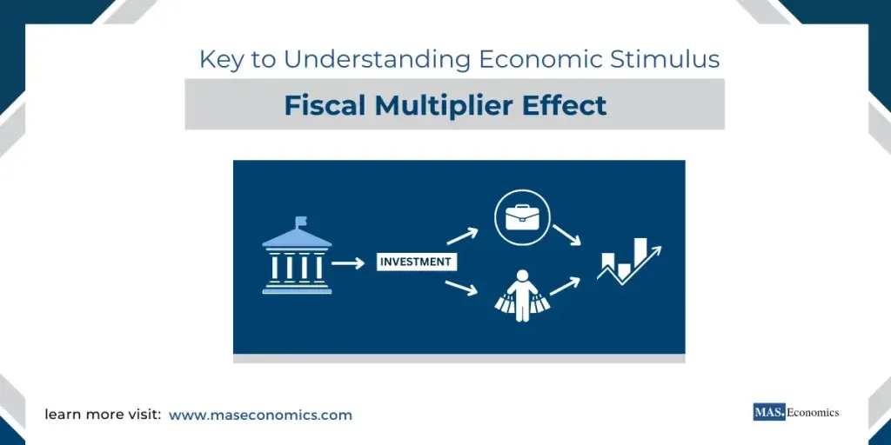

## Table of Contents

## What is the fiscal multiplier?

The fiscal multiplier is a measure that shows how much a country's economy grows when the government spends more money or cuts taxes. Imagine the government decides to build more roads. This spending can lead to more jobs and more money in people's pockets, which they might spend on other things, causing the economy to grow even more. The multiplier tells us how much bigger this effect is compared to the initial spending.

For example, if the government spends $1 billion on new projects and the economy grows by $1.5 billion, the fiscal multiplier would be 1.5. This means that for every dollar the government spends, the economy grows by $1.50. The size of the multiplier can depend on many things, like how much people save versus spend, and how the economy is doing at the time. If people tend to save more, the multiplier might be smaller because less money is being spent and circulating in the economy.

## How does the fiscal multiplier work?

The fiscal multiplier works by showing how government spending or tax cuts can boost the economy. When the government spends money, like on building new schools or roads, it pays workers and buys materials. These workers then have more money to spend on things they need or want, like food or clothes. This extra spending can lead to more jobs and more spending by others, creating a chain reaction that grows the economy. The fiscal multiplier measures how much bigger this growth is compared to the initial government spending.

For example, if the government spends $1 million on a new project, and this leads to an extra $1.5 million in economic activity, the fiscal multiplier would be 1.5. This means that for every dollar the government spends, the economy grows by $1.50. The size of the multiplier can change based on how much people save or spend. If people save more of their money instead of spending it, the multiplier might be smaller because less money is circulating in the economy.

## What are the different types of fiscal multipliers?

There are different types of fiscal multipliers based on what the government does and how the economy reacts. One type is the government spending multiplier. This shows how much the economy grows when the government spends money on things like building roads or schools. If the government spends $1 and the economy grows by more than $1, the multiplier is bigger than 1. Another type is the tax multiplier. This shows how much the economy grows when the government cuts taxes. When people pay less in taxes, they have more money to spend, which can help the economy grow.

The third type is the transfer payment multiplier. This shows how much the economy grows when the government gives money directly to people, like through social security or unemployment benefits. When people get this money, they usually spend it, which can help the economy. Each type of multiplier can be different because they affect the economy in different ways. The size of the multiplier also depends on things like how much people save or spend and how the economy is doing at the time.

## Can you explain the difference between short-run and long-run fiscal multipliers?

The short-run fiscal multiplier shows how much the economy grows right after the government spends money or cuts taxes. Imagine the government decides to build a new hospital. They start paying workers and buying materials right away. These workers then have more money to spend, which can lead to more jobs and more spending by others. This quick boost to the economy is what the short-run multiplier measures. It's usually bigger than the long-run multiplier because people are more likely to spend the extra money right away instead of saving it.

The long-run fiscal multiplier looks at how the economy grows over a longer time after the government's actions. After the hospital is built, the effects of the spending might not be as strong. People might start saving more of their money instead of spending it, or the economy might adjust to the new spending in other ways. This means the long-run multiplier is usually smaller than the short-run multiplier. It takes into account things like how the economy grows over time and how people change their behavior in response to the government's actions.

## What factors influence the size of the fiscal multiplier?

Several things can change how big the fiscal multiplier is. One big thing is how much people save versus spend. If people spend most of the extra money they get from the government, the multiplier will be bigger because more money is going around in the economy. But if people save more, the multiplier will be smaller because less money is being spent. Another thing that matters is how the economy is doing. When the economy is not doing well, people might spend more of the extra money, making the multiplier bigger. But when the economy is doing well, people might save more, making the multiplier smaller.

The type of fiscal policy also affects the multiplier. If the government spends money directly on things like building roads or schools, the multiplier might be bigger because this spending creates jobs and more spending right away. But if the government cuts taxes, people might not spend all of the extra money they get, so the multiplier might be smaller. Also, how quickly the economy can use extra resources matters. If there are a lot of unemployed people and unused factories, the multiplier can be bigger because the economy can grow more easily. But if the economy is already using most of its resources, it might be harder to grow, making the multiplier smaller.

## How is the fiscal multiplier calculated?

The fiscal multiplier is calculated by looking at how much the economy grows compared to the government's spending or tax cuts. Imagine the government spends $1 million on a new project. If this spending leads to an extra $1.5 million in economic activity, the fiscal multiplier would be 1.5. This means that for every dollar the government spends, the economy grows by $1.50. To find this number, economists look at the total increase in economic activity and divide it by the initial government spending.

There are different ways to calculate the fiscal multiplier, depending on whether it's for spending, taxes, or transfer payments. For spending, economists might use a formula that takes into account how much people spend versus save. If people spend most of the extra money, the multiplier will be bigger. For taxes, they might look at how much people spend the extra money they get from tax cuts. And for transfer payments, like social security, they look at how much people spend the money they receive. All these calculations help economists understand how government actions can help the economy grow.

## What are some historical examples of fiscal multiplier effects?

One famous example of the fiscal multiplier effect happened during the Great Depression in the 1930s. The U.S. government started big projects like building roads and dams as part of the New Deal. This spending helped create jobs and put money in people's pockets. When people spent this money, it helped the economy grow even more. Economists believe that these projects had a big fiscal multiplier because the economy was not doing well, and people were more likely to spend the extra money they got.

Another example is from the 2009 American Recovery and Reinvestment Act (ARRA) after the global financial crisis. The government spent a lot of money on things like fixing roads, giving money to states, and helping people who lost their jobs. Studies show that this spending helped the economy grow. The fiscal multiplier was estimated to be around 1.5 to 2, meaning that for every dollar the government spent, the economy grew by $1.50 to $2.00. This shows how government spending can help the economy when it's not doing well.

## How do fiscal multipliers vary across countries?

Fiscal multipliers can be different in different countries because each country's economy works a bit differently. One big reason is how much people in a country save versus spend. In countries where people spend most of their money, like the United States, the fiscal multiplier might be bigger. But in countries where people save more, like Germany, the multiplier might be smaller. Also, how the economy is doing matters. If a country's economy is not doing well, like during a recession, the fiscal multiplier can be bigger because people are more likely to spend the extra money they get from the government.

Another reason fiscal multipliers vary across countries is the type of government spending or tax cuts used. For example, in countries with a lot of infrastructure needs, like India, spending on building roads and bridges can have a big effect on the economy. But in countries where the economy is already using most of its resources, like Japan, the multiplier might be smaller because it's harder to grow the economy even more. Also, how quickly a country can use extra resources, like unemployed workers, can make the multiplier bigger in some places and smaller in others.

## What role does the fiscal multiplier play in economic policy?

The fiscal multiplier is really important for people who make economic policies. It helps them understand how much the economy will grow if the government spends money or cuts taxes. When the economy is not doing well, like during a recession, the government might use the fiscal multiplier to decide how much to spend to help the economy get better. If they know the multiplier is big, they might spend more money because they know it will help a lot. But if the multiplier is small, they might not spend as much because it won't help as much.

Knowing the fiscal multiplier also helps the government plan for the future. If they want to build new schools or roads, they can use the multiplier to figure out how much the economy will grow from this spending. This helps them decide if it's worth spending the money. The fiscal multiplier can also change how the government thinks about cutting taxes. If they know that cutting taxes will make people spend more and help the economy grow, they might decide to do it. But if the multiplier is small, they might choose other ways to help the economy.

## How do fiscal multipliers interact with monetary policy?

Fiscal multipliers and monetary policy work together to help the economy. When the government spends money or cuts taxes, it can make the economy grow. But how much it grows can depend on what the central bank, like the Federal Reserve in the U.S., is doing with interest rates. If the central bank keeps interest rates low, people and businesses might borrow more money to spend or invest. This can make the fiscal multiplier bigger because there's more money going around in the economy. But if the central bank raises interest rates, borrowing becomes more expensive, and people might spend less, making the fiscal multiplier smaller.

Sometimes, the government and the central bank work together to help the economy. For example, during a recession, the government might spend a lot of money to create jobs and help people, while the central bank might keep interest rates low to make borrowing easier. This can make the fiscal multiplier even bigger because both policies are helping the economy at the same time. But if the government spends a lot of money and the central bank raises interest rates to fight inflation, the fiscal multiplier might not be as big because the two policies are working against each other.

## What are the limitations and criticisms of the fiscal multiplier concept?

The fiscal multiplier concept has some limitations and people have criticized it. One big problem is that it's hard to know exactly how big the multiplier is. It can change a lot depending on things like how much people save or spend, and how the economy is doing. Also, the multiplier might be different for different kinds of government spending or tax cuts. This makes it hard for the government to plan because they can't be sure how much their actions will help the economy.

Another criticism is that the fiscal multiplier doesn't always work the same way in every situation. Sometimes, if the government spends a lot of money, it can lead to higher prices instead of more economic growth. This is called inflation, and it can make the multiplier smaller because people's money doesn't go as far. Also, if the economy is already doing well, more government spending might not help much because there's not much room for the economy to grow even more. This means the fiscal multiplier can be tricky to use and might not always work the way people expect.

## How can advanced econometric models improve the estimation of fiscal multipliers?

Advanced econometric models can help us get a better idea of how big the fiscal multiplier is. These models use a lot of data and fancy math to look at how the economy reacts when the government spends money or cuts taxes. They can take into account things like how much people save or spend, and how the economy is doing at the time. By using these models, economists can make better guesses about how much the economy will grow from the government's actions. This can help the government make smarter decisions about how to help the economy.

These models also let economists look at how the fiscal multiplier might change over time or in different situations. For example, they can see how the multiplier might be different during a recession compared to when the economy is doing well. They can also look at how different kinds of government spending or tax cuts might have different effects. By understanding these things better, the government can use the right kind of fiscal policy at the right time to help the economy grow. This makes the fiscal multiplier a more useful tool for making economic policy.

## What is the Fiscal Multiplier and how can it be understood?

The fiscal multiplier is a fundamental concept in macroeconomics that quantifies the relationship between changes in government spending or tax revenue and the resultant changes in a nation's income, specifically measured by Gross Domestic Product (GDP). It is computed as the ratio of a change in national income to the change in government fiscal activity. This metric is crucial for assessing the efficacy of fiscal policies in stimulating economic growth.

The principle of the fiscal multiplier is rooted in Keynesian economics, formulated by economist John Maynard Keynes during the early 20th century. Keynesian theory posits that active government intervention can promote economic activity, particularly during periods of economic downturns. A salient component underpinning this theory is the multiplier effect, where government expenditure can lead to a more than proportional increase in overall economic output.

The marginal propensity to consume (MPC) plays a pivotal role in understanding the workings of the fiscal multiplier. MPC refers to the fraction of additional income that households are likely to spend on consumption rather than saving. For instance, if the MPC is 0.8, it implies that out of every extra dollar received, 80 cents will be spent on consumption. This behavior stimulates further rounds of economic activity as consumption spending by one person becomes income for another, thereby inducing additional consumption.

Mathematically, the fiscal multiplier can be expressed using the formula:

$$
\text{Fiscal Multiplier} = \frac{1}{1 - \text{MPC}}
$$

This formula illustrates the multiplier's reliance on consumer behavior, specifically the propensity to consume. A higher MPC results in a larger multiplier, indicating that government spending will have a significant impact on national income. Conversely, a lower MPC results in a smaller multiplier.

For example, consider a scenario where the MPC is 0.9. Applying the formula, the fiscal multiplier would be:

$$
\text{Fiscal Multiplier} = \frac{1}{1 - 0.9} = 10
$$

This means that for every dollar of government spending, the national income could potentially increase by ten dollars, assuming other factors remain constant.

The injection of government spending initiates a chain reaction of increased consumption, production, and income, which is disseminated throughout the economy in successive rounds. The impact of this chain reaction depends on various factors, including the initial state of the economy, the levels of existing resources and employment, and the structure of fiscal policy measures implemented.

In summary, understanding the fiscal multiplier involves recognizing its origins in Keynesian economics, the critical role of the marginal propensity to consume, and its mathematical formulation. This concept is vital for designing effective fiscal policies aimed at achieving desired economic outcomes, such as alleviating recessions or promoting sustainable growth.

## References & Further Reading

[1]: Blanchard, O., & Leigh, D. (2013). ["Growth Forecast Errors and Fiscal Multipliers."](https://www.imf.org/external/pubs/ft/wp/2013/wp1301.pdf) IMF Working Paper.

[2]: Ramey, V. A. (2019). ["Ten Years After the Financial Crisis: What Have We Learned from the Renaissance in Fiscal Research?"](https://www.aeaweb.org/articles?id=10.1257/jep.33.2.89) National Bureau of Economic Research Working Paper.

[3]: Krugman, P. (2009). ["How Did Economists Get It So Wrong?"](https://www.nytimes.com/2009/09/06/magazine/06Economic-t.html) The New York Times Magazine.

[4]: Zandi, M. (2010). ["An Update on the Economic Impact of the American Recovery and Reinvestment Act of 2009."](https://obamawhitehouse.archives.gov/administration/eop/cea/Economic-Impact) Moody's Analytics.

[5]: Keynes, J. M. (1936). ["The General Theory of Employment, Interest and Money."](https://www.files.ethz.ch/isn/125515/1366_KeynesTheoryofEmployment.pdf) Macmillan (original publication).