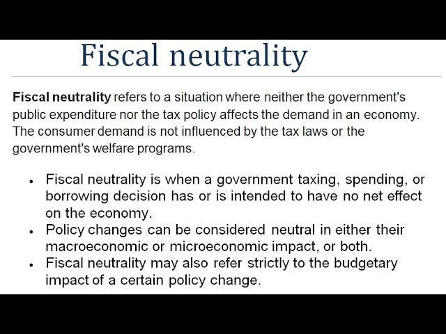

## Table of Contents

## What is fiscal neutrality?

Fiscal neutrality is a concept in economics where the government's tax and spending policies do not favor one group or activity over another. This means that the government tries to treat everyone and everything the same, without giving special advantages or disadvantages through its financial decisions. The idea is to create a level playing field where people and businesses can make choices based on their own needs and preferences, rather than being influenced by government policies.

In practice, achieving true fiscal neutrality can be challenging because governments often use taxes and spending to achieve specific goals, like encouraging economic growth or reducing inequality. For example, a government might offer tax breaks to certain industries to boost their development, which would not be fiscally neutral. Despite these challenges, the principle of fiscal neutrality remains important because it promotes fairness and efficiency in the economy by minimizing the government's role in tilting the scales in favor of certain groups or activities.

## Why is fiscal neutrality important in economic policy?

Fiscal neutrality is important in economic policy because it helps create a fair and efficient economy. When the government follows fiscal neutrality, it doesn't favor one group or activity over another with its tax and spending decisions. This means everyone has an equal chance to succeed based on their own efforts and choices, not because the government is helping some more than others. It's like making sure everyone plays by the same rules in a game, which makes the game fair for everyone.

Another reason fiscal neutrality matters is that it can lead to better use of resources. When the government doesn't interfere too much with taxes and spending, people and businesses can make decisions based on what they think is best for them. This can lead to more innovation and growth because people are free to try new things without worrying about the government tilting the scales. In the end, fiscal neutrality helps the economy work better by letting the market decide what's most valuable, rather than the government [picking](/wiki/asset-class-picking) winners and losers.

## Can you provide a simple example of fiscal neutrality?

Imagine a small town where the government decides to build a new playground. If they want to be fiscally neutral, they would make sure that everyone pays the same amount of taxes to fund the playground, no matter where they live or how much money they make. They wouldn't give special tax breaks to people who live near the playground or charge more to people who live far away. Everyone in the town would contribute equally, and everyone would have the same chance to enjoy the new playground.

This approach is fair because it treats everyone the same. If the government chose to give tax breaks to people who live near the playground, it wouldn't be fiscally neutral. Some people would get a special advantage, and that wouldn't be fair to everyone else. By keeping things neutral, the government helps make sure that the playground is a benefit for the whole community, not just for a few people.

## How does fiscal neutrality differ from fiscal policy?

Fiscal neutrality and fiscal policy are two different ideas in how governments handle money. Fiscal neutrality means the government tries to be fair and not favor any group or activity with its taxes and spending. It's like making sure everyone plays by the same rules, so no one gets special treatment. If the government wants to build a new park, for example, it would ask everyone to pay the same amount in taxes, no matter where they live or how much money they make. This way, everyone gets an equal chance to enjoy the park.

Fiscal policy, on the other hand, is when the government uses taxes and spending to reach certain goals. These goals could be things like helping the economy grow or making sure everyone has a fair chance. For example, if the economy is slow, the government might lower taxes or spend more money to help it grow faster. This is different from fiscal neutrality because the government is trying to change things on purpose, not just treat everyone the same. So, while fiscal neutrality is about being fair and equal, fiscal policy is about making changes to reach specific goals.

## What are the key principles underlying fiscal neutrality?

The key principles of fiscal neutrality focus on fairness and equality in how the government handles taxes and spending. The main idea is that the government should not give special treatment to any group or activity. This means everyone should pay the same taxes and get the same benefits from government spending, no matter who they are or what they do. If the government wants to build a new road, for example, it should ask everyone to pay the same amount in taxes to fund it, without giving any special tax breaks to some people.

Another important principle is that fiscal neutrality helps the economy work better by letting people and businesses make choices based on what they think is best for them. When the government doesn't interfere too much with its tax and spending decisions, it allows the market to decide what's most valuable. This can lead to more innovation and growth because people are free to try new things without worrying about the government tilting the scales. In the end, fiscal neutrality is about creating a level playing field where everyone has an equal chance to succeed based on their own efforts and choices.

## How do governments implement fiscal neutrality?

Governments implement fiscal neutrality by making sure their tax and spending policies treat everyone the same. This means they set taxes in a way that doesn't give special breaks or benefits to certain groups or activities. For example, if the government wants to build a new library, it would ask everyone to pay the same amount of taxes, no matter where they live or how much money they make. This way, everyone helps pay for the library and everyone gets to use it equally.

To keep things neutral, governments also make sure their spending is fair. They avoid giving more money to some areas or groups just because they want to help them more. Instead, they try to spread the money out evenly so that everyone gets the same benefits from what the government does. By following these rules, governments help make sure that everyone has a fair chance and that the economy works better because people can make choices based on what they think is best for them, not on what the government wants.

## What are the challenges in maintaining fiscal neutrality?

Keeping fiscal neutrality can be really hard for governments. One big challenge is that governments often want to use taxes and spending to help certain parts of the economy or to reach other goals, like making things more equal or helping the environment. When they do this, they can't be totally neutral because they're giving some people or groups special treatment. For example, if a government wants to help a certain industry grow, it might give that industry tax breaks. This means other industries don't get the same help, which isn't neutral.

Another challenge is that people and businesses often ask for special treatment. They might want lower taxes or more government money for their projects. It's hard for governments to say no to these requests, especially when they come from powerful groups or when they seem like they could help the economy. This pressure can make it tough for governments to stick to being neutral. In the end, trying to be fair to everyone while also dealing with these pressures is a big challenge in keeping fiscal neutrality.

## Can fiscal neutrality affect economic growth? If so, how?

Fiscal neutrality can affect economic growth, but it depends on how you look at it. On one hand, being neutral means the government isn't picking winners and losers. This can help the economy grow because it lets people and businesses make choices based on what they think is best for them, not on what the government wants. When everyone has a fair chance, it can lead to more innovation and new ideas, which can make the economy stronger.

On the other hand, sometimes the government needs to help certain parts of the economy to make it grow faster. If the government is always neutral and doesn't give special help to industries that need it, some parts of the economy might not do as well. For example, if a new technology needs a boost to get started, a little help from the government could make a big difference. So, while fiscal neutrality can help the economy be fair, it might also mean missing out on chances to help the economy grow even more.

## What are some historical examples of fiscal neutrality in action?

One historical example of fiscal neutrality in action is the tax reforms in the United States during the 1980s under President Ronald Reagan. The government tried to make the tax system simpler and fairer by lowering tax rates for everyone and getting rid of a lot of special tax breaks. The idea was to treat everyone the same and let people keep more of their money, which could help the economy grow. This approach was meant to be neutral because it didn't favor one group over another.

Another example is the European Union's efforts to create a single market. The EU wanted to make sure that businesses from different countries could compete fairly. They did this by setting rules that made sure taxes and regulations were the same across all member countries. This way, a company in France would have the same chances as a company in Germany, without any special advantages or disadvantages. The goal was to create a level playing field, which is what fiscal neutrality is all about.

## How do different economic theories view fiscal neutrality?

Different economic theories have different views on fiscal neutrality. Classical economists believe in a hands-off approach where the government should not interfere much with the economy. They think fiscal neutrality is good because it lets the market work on its own. This means people and businesses can make their own choices without the government tilting things one way or another. Classical economists believe this can lead to a fair and efficient economy where everyone has an equal chance to succeed.

On the other hand, Keynesian economists believe the government should use taxes and spending to help the economy grow or fix problems. They think that sometimes the government needs to step in and give special help to certain parts of the economy. This means they might not support fiscal neutrality all the time because they believe the government should pick winners and losers to reach certain goals. Keynesians think this can help the economy be stronger and more stable, even if it's not always fair to everyone in the same way.

## What are the criticisms of fiscal neutrality as a policy approach?

Some people think fiscal neutrality is not a good idea because it doesn't let the government help when it's needed. They say that sometimes the economy needs a push in the right direction, and the government should use taxes and spending to do that. For example, if a new technology could help the environment, the government might want to give that industry some help to get started. If the government always stays neutral, it might miss chances to make things better for everyone.

Another criticism is that fiscal neutrality can make things unfair in other ways. Not everyone starts from the same place, so treating everyone the same might not be fair. Some people or businesses might need more help to have a real chance to succeed. If the government doesn't give that help, it could make inequality worse. Critics say that sometimes the government needs to step in and make things more equal, even if it means not being neutral.

## How can fiscal neutrality be measured and evaluated?

Measuring and evaluating fiscal neutrality can be tricky, but it usually involves looking at how the government's tax and spending policies affect different groups and activities. One way to do this is by checking if everyone pays the same taxes and gets the same benefits from government spending. For example, if a new school is built, you can see if everyone paid the same amount in taxes to fund it and if everyone can use the school equally. If some people got special tax breaks or if the school is only for certain people, then the policy isn't neutral.

Another way to evaluate fiscal neutrality is by looking at economic data to see if the government's policies are making things more or less fair. Economists might study things like income levels, business profits, and how much different groups are helped or hurt by taxes and spending. If the data shows that some groups are doing much better or worse because of the government's actions, then the policy might not be neutral. By looking at these things, people can decide if the government is treating everyone the same or if it's giving special treatment to some.

## References & Further Reading

- Auerbach, A. J., Gale, W. G., & Harris, B. H. (2010). Activist Fiscal Policy. *Journal of Economic Perspectives*. This paper explores the role of fiscal policy as an active tool for economic stabilization, especially in times of economic downturn, emphasizing the importance of strategic government intervention.

- Reinhart, C. M., & Rogoff, K. S. (2010). Growth in a Time of Debt. *American Economic Review*. This study examines the relationship between national debt levels and economic growth, offering insights into how debt burdens can impact economic performance and stability.

- Chodorow-Reich, G. (2014). The Employment Effects of Credit Market Disruptions. *The Quarterly Journal of Economics*. This article provides an analysis of how disruptions in credit markets affect employment, presenting empirical evidence on the impacts of financial instability on the labor market.

- Carney, M. (2009). Some Considerations on Using Government Spending to Stimulate Economic Activity. *Bank of Canada*. This discussion paper highlights the effectiveness of government spending as a mechanism to stimulate economic activity, particularly during periods of economic slack.

- Alden, C., & Arner, D. W. (2019). Financial Stability, Resolution of Systemic Banking Crises, and Globalization. *Journal of Financial Regulation*. The authors delve into the complexities of maintaining financial stability amidst systemic crises, considering the implications of globalization on financial regulations and stability mechanisms.

