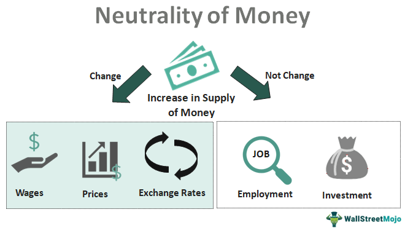

The interplay between government budget policies, economic management, fiscal neutrality, and algorithmic trading forms a complex ecosystem that affects national and global economic stability. These components of the financial landscape are intertwined, each influencing and being influenced by the others in various ways. For instance, government budget policies, including decisions on public spending and taxation, directly impact economic management and help define the fiscal environment within which businesses operate. Fiscal neutrality suggests that such policies should be structured to neither overly stimulate nor restrain the economy, aiming for a balanced approach that supports sustainable growth.

Algorithmic trading, on the other hand, represents a technological evolution in financial markets, where trades are executed at high speed and volume using pre-programmed instructions. This form of trading significantly enhances market liquidity and efficiency but can also introduce challenges such as increased market volatility and unpredictability. The relationship between algorithmic trading and government fiscal policies is particularly critical as it affects the pricing and trading of government securities, which are fundamental to national debt management.



Understanding these components' intricate relationships is crucial to grasp their impacts on financial markets and national economies. Government fiscal policies set the framework within which economic decisions are made, while algorithmic trading influences how these decisions are played out in real-time on financial markets. This dynamic impacts everything from government borrowing costs to overall market stability.

This article explores these dynamics, particularly focusing on how algorithmic trading intersects with government fiscal policies and debt management. It aims to shed light on the challenges and opportunities presented by algorithmic trading while considering its implications for economic policy. We aim to provide insight into the challenges and future strategies for balancing fiscal policy with technological advancements in trading.

The key objective is to unravel how these elements coalesce to influence economic policy and financial market behavior. By understanding how these different aspects interact, policymakers and market participants can better navigate the complexities of modern financial systems, aiming to enhance economic resilience and promote stability in the face of ongoing technological and economic shifts.

## Table of Contents

## Government Budget and Fiscal Policy

Government budgets play a crucial role in shaping a nation’s economic well-being by directing fiscal policy and enabling various social and infrastructure programs. These budgets are comprehensive tools that delineate how governments allocate resources to different sectors of the economy, impacting everything from healthcare and education to transportation and national defense. The design and execution of government budgets can significantly influence economic growth, employment, and the overall quality of life for citizens.

A central concept in fiscal policy is fiscal neutrality, which aims for government fiscal decisions to neither unduly stimulate nor inhibit economic behavior. This principle seeks a balance where fiscal measures do not cause unintended economic distortions, thereby preserving the natural functionality of markets. Achieving fiscal neutrality involves a meticulous approach to policymaking where alterations in taxation or expenditure are designed to offset each other, keeping the overall economic demand steady.

Balancing a government budget entails harmonizing expenditure with revenue, which necessitates strategic decisions about taxation and borrowing. Policymakers must assess current economic conditions, projecting future fiscal needs to ensure sustainable economic management. This involves understanding which fiscal measures can be used to influence economic activity without causing long-term imbalances. For instance, during economic downturns, governments may increase borrowing to finance public spending and stimulate growth, later returning to a balanced budget approach during times of economic expansion.

Understanding fiscal neutrality also requires differentiating between macroeconomic and microeconomic neutrality. At the macroeconomic level, fiscal neutrality involves ensuring that fiscal policies do not lead to inflationary pressures or deflationary spirals by maintaining aggregate demand. On the microeconomic level, it examines how taxes and government spending influence individual and business behaviors, potentially affecting labor supply, savings, and investment decisions. Policymakers must therefore design tax systems and public spending programs that minimize economic distortions while achieving desired social outcomes.

Real-world examples of budgetary and fiscal neutrality underscore their implications across diverse economic landscapes. For instance, a government might introduce a tax reform that lowers personal income tax rates while simultaneously closing loopholes and broadening the tax base, aiming for revenue neutrality. This approach tries to enhance efficiency without altering the overall tax burden on the economy. Another example might be a temporary increase in public investment financed by borrowing during an economic downturn to boost employment and growth, with a subsequent return to balanced budgets as economic conditions stabilize.

In conclusion, effective fiscal management necessitates a deep understanding of how government budgetary decisions influence economic activity and behavior. Through careful implementation of fiscal neutrality, governments can strive to maintain economic stability, foster growth, and improve social welfare without introducing undue market distortions.

## Economic Policy and Fiscal Neutrality

Economic policy forms a critical framework through which governments navigate the complex dynamics of national and global economic environments. It includes the strategic use of fiscal measures and regulatory policies to influence economic conditions, aiming to achieve sustainable growth, control inflation, manage employment levels, and ensure equitable resource distribution. Within this sphere, fiscal policy plays a pivotal role in modulating economic activity through government spending and taxation. Achieving fiscal neutrality is a strategic goal, ensuring that policy decisions do not have an expansionary or contractionary effect on the economy. 

Fiscal neutrality encapsulates the idea that tax policies and government spending should be structured so as not to influence or alter the overall level of demand in the economy. This principle aims for a neutral impact where the cumulative effects of fiscal actions do not lead to an increase or decrease in aggregate demand. Consider as an example a government faced with a budget deficit choosing to raise taxes while proportionally increasing public spending. While higher taxes can dampen consumption, the boost in public spending can stimulate it, keeping overall demand stable. Thus, achieving fiscal neutrality requires finely-tuned policies where the opposing effects of taxation and spending balance each other out.

At the microeconomic level, fiscal neutrality examines how taxes and expenditures affect individual behaviors and transactions within the market. For instance, an income tax reduction aimed at increasing disposable income does not necessarily lead to increased consumption if accompanied by a cut in government transfers or an increase in indirect taxes. For policymakers, the challenge lies in deciphering and predicting these microeconomic behaviors and crafting policies that prevent excessive market distortions.

Crafting policies that maintain economic equilibrium without unintended distortions is particularly challenging, given the complexity of economic systems and the diverse responses of economic [agents](/wiki/agents). It demands a sophisticated understanding of economic indicators and behavioral economics, as well as a comprehensive forecasting model that anticipates potential market disruptions. Models might employ calculation approaches that consider not just immediate impacts but also future implications, using data-driven simulations.

Python, with its robust libraries like NumPy and pandas, can be used to model such fiscal scenarios. For example:

```python
import numpy as np
import pandas as pd

# Hypothetical data for tax and spending elasticity
data = {'Tax_Effect': [0.1, -0.2, 0.3], 'Spending_Effect': [-0.1, 0.2, -0.3]}
df = pd.DataFrame(data)

# Calculate overall economic impact
df['Net_Effect'] = df['Tax_Effect'] + df['Spending_Effect']
neutral_policy = df[df['Net_Effect'] == 0]

print(neutral_policy)
```

This snippet uses simple rules to suggest which fiscal policies might maintain neutrality. The real world, however, will require more sophisticated, multi-dimensional modeling approaches.

In conclusion, the quest for fiscal neutrality challenges economic policymakers to balance economic activity prudently. They must ensure policies' inertness at a macro level while acknowledging the micro-level elasticity of variables. Successful fiscal management requires innovations in policy tools and computational models that can predict and adapt to ever-evolving economic landscapes.

## Algorithmic Trading: Transformation of Financial Markets

Algorithmic trading utilizes sophisticated computer algorithms to automate trading decisions and executions at unprecedented speeds and frequency. This innovative approach has fundamentally altered the landscape of financial markets, creating a new paradigm characterized by enhanced [liquidity](/wiki/liquidity-risk-premium) and efficiency but also increased [volatility](/wiki/volatility-trading-strategies) and unpredictability.

One of the primary advantages of [algorithmic trading](/wiki/algorithmic-trading) is the improvement it brings to market liquidity. By enabling rapid execution of large volumes of orders, algorithmic trading helps narrow bid-ask spreads, making it easier for traders to buy and sell securities without significantly affecting market prices. This increased liquidity benefits all market participants by reducing transaction costs and improving the ability to quickly enter or [exit](/wiki/exit-strategy) positions.

However, the speed and automation characteristic of algorithmic trading can introduce significant volatility and unpredictability to the markets. High-frequency trading ([HFT](/wiki/high-frequency-trading-strategies)), a subset of algorithmic trading, often involves placing a large number of small trades to capitalize on minute price discrepancies. While this can contribute to market efficiency, it can also result in erratic price movements, particularly during periods of market stress or instability. These rapid fluctuations can pose challenges for traditional investors and can lead to cascading effects, as was observed in incidents like the May 2010 "Flash Crash."

Algorithmic trading's influence extends notably to government securities. The efficient pricing and trading of these assets are crucial because they directly affect the yields at which governments can borrow. By improving liquidity in the government securities markets, algorithmic trading can lower government borrowing costs. This is because more liquid markets allow for a broader array of investors and a more competitive pricing environment. In turn, reduced borrowing costs can lead to significant fiscal benefits, allowing governments to allocate more resources to essential public services or invest in growth-stimulating projects.

Nonetheless, the automated nature of algorithmic trading systems can challenge financial stability, especially under market duress. The reliance on predefined algorithms means that unexpected market events can trigger automated responses that amplify volatility, such as rapid selling in a downturn. These dynamics necessitate robust risk management strategies and regulatory oversight to ensure that the benefits of algorithmic trading can be harnessed without compromising market integrity.

In summary, while algorithmic trading has brought substantial advancements to the functionality and liquidity of financial markets, its role in creating volatility and the challenges it presents to financial stability cannot be overlooked. Effective oversight and adaptive risk management are essential in balancing these benefits and risks to maintain orderly and resilient markets.

## National Debt and Algo Trading Interactions

National debt, fundamentally the accumulation of a government's budget deficits, is subject to the ebb and flow of market conditions, with algorithmic trading playing an increasingly pivotal role in shaping these dynamics. The yields on government securities, which directly influence borrowing costs, can be sensitive to the rapid trading decisions driven by advanced algorithms. This impact is particularly significant given that algorithmic trading, by executing large volumes of transactions at accelerated speeds, can alter the perceived risk and return profiles of these securities.

Algorithmic trading uses sophisticated mathematical models to determine trade opportunities, focusing on aspects such as pricing inefficiencies and market trends. When applied to government securities, algorithms swiftly adjust positions based on minute changes in data, leading to shifts in demand and supply dynamics. This can, in effect, manipulate yields upward or downward depending upon the trading [volume](/wiki/volume-trading-strategy) and direction initiated by these algorithms. Consequently, governments may find their cost of borrowing fluctuating in accordance with algorithmic market behavior, rather than solely traditional economic indicators.

Furthermore, the interplay between algorithmic strategies and debt markets can lead to feedback loops that exacerbate existing fiscal conditions. For example, an increase in national debt levels may lead to a perception of higher credit risk, causing algorithms to trigger sell-offs of government bonds. This, in turn, can lead to higher yields, increasing borrowing costs and further compounding fiscal strain. Such loops necessitate vigilant regulatory oversight to prevent destabilizing economic consequences.

Technological progress, notably in [artificial intelligence](/wiki/ai-artificial-intelligence) (AI) and high-frequency trading (HFT), is revolutionizing traditional practices in debt issuance and management. AI models can process and learn from vast datasets to predict market movements more accurately and autonomously. High-frequency trading, characterized by executing trades within fractions of a second, captures fleeting [arbitrage](/wiki/arbitrage) opportunities and enhances market liquidity. However, these advances also mean that government debt strategies must evolve to consider the hyper-responsive nature of algorithmic trading environments.

Understanding the feedback loops created by the interaction of algorithmic trading and national debt is essential to mitigating fiscal risks. Monitoring and analyzing trade patterns can provide insights into potential volatilities and allow for preemptive policy or regulatory adjustments. Developing robust algorithms capable of simulating market stress scenarios involving government securities would aid in planning effective debt management tactics. As algorithmic trading continues to shape the landscape of financial markets, its influence on national debt dynamics will be a critical area for economic policy consideration and innovation.

## Future Implications for Economic Policy and Trading

The rise of algorithmic trading significantly influences economic policy and trading, offering both promising prospects and formidable challenges. The integration of technology into trading practices mandates that governments adapt by enhancing their policy frameworks to ensure greater market stability. This involves not only addressing the rapid pace of trading but also implementing regulatory measures that can preempt and manage the risks associated with high-frequency transactions.

Innovations such as artificial intelligence (AI) and blockchain technology stand at the forefront of revolutionizing government debt management. AI can provide more accurate and advanced forecasting models, improving the government's ability to predict and plan for future economic conditions. This enhanced predictability can aid in formulating better economic strategies that align with actual market dynamics. Blockchain technology, with its inherent transparency and security features, can significantly improve the tracking and management of government debt. By allowing for real-time updates and verifications, these technologies enhance the transparency of financial records, thereby boosting trust in financial transactions and governance.

The global nature of financial markets necessitates harmonizing international regulatory standards. As trading technologies advance and markets become ever more interconnected, discrepancies in national regulations can lead to systemic risks. Therefore, aligning these standards internationally is critical. Such alignment not only facilitates smoother cross-border transactions but also mitigates the risk of regulatory arbitrage, where firms take advantage of less stringent regulations in certain jurisdictions.

Policymakers face the ongoing challenge of maintaining economic resilience amidst rapid technological evolution. Integrating these technologies with fiscal discipline is crucial to ensuring that the economic benefits of technological advancements do not come at the cost of financial stability. Balancing innovation with regulation requires a dynamic and forward-thinking approach. It is essential that policymakers continually refine their strategies to adapt to both the benefits and potential disruptions posed by new trading technologies.

Looking ahead, the continuous evolution of trading technology will demand that governments and financial institutions collaborate closely. They must not only develop but also constantly update policy frameworks that safeguard economic stability while embracing technological innovation. Fostering a collaborative global environment and encouraging the adoption of uniform regulations are paramount for sustaining a robust and resilient global economy.

## Conclusion

The confluence of government budgets, fiscal policies, fiscal neutrality, and algorithmic trading shapes the modern financial ecosystem, demanding a comprehensive understanding to maintain stability. The economic policy framework, which includes the strategic planning and execution of government budgets and fiscal measures, must consider the influence and rapid evolution of technological advancements such as algorithmic trading. This interaction can significantly impact market dynamics, potentially affecting pricing, liquidity, and the overall financial environment.

Policymakers are tasked with navigating the dual imperatives of fostering innovation and ensuring robust regulation. Harnessing the benefits of technology like algorithmic trading requires a delicate balance to mitigate systemic risks inherent in highly automated systems. The potential for rapid market fluctuations necessitates resilient regulatory frameworks that not only accommodate technological progress but also safeguard against volatility.

As global financial dynamics continue to shift, adaptive strategies become even more crucial. The ability to recalibrate fiscal policies in response to technological changes can secure economic sustainability and promote growth. For instance, leveraging algorithmic trading for more efficient debt management can reduce costs, but it must be coupled with vigilant oversight to prevent destabilizing feedback loops.

The imperative for further research and dialogue cannot be understated. Developing policies that integrate fiscal equilibrium with technological advancement is an ongoing process. Collaborative efforts among international bodies, governments, and financial institutions will be necessary to harmonize regulatory standards, thus supporting a stable and efficient global financial system. Embracing these challenges presents the opportunity to enhance economic policy frameworks, ensuring they are equipped to support future growth and resilience in an increasingly digital economy.

## References & Further Reading

- Auerbach, A. J., Gale, W. G., & Harris, B. H. (2010). Activist Fiscal Policy. *Journal of Economic Perspectives*. This paper explores the role of fiscal policy as an active tool for economic stabilization, especially in times of economic downturn, emphasizing the importance of strategic government intervention.

- Reinhart, C. M., & Rogoff, K. S. (2010). Growth in a Time of Debt. *American Economic Review*. This study examines the relationship between national debt levels and economic growth, offering insights into how debt burdens can impact economic performance and stability.

- Chodorow-Reich, G. (2014). The Employment Effects of Credit Market Disruptions. *The Quarterly Journal of Economics*. This article provides an analysis of how disruptions in credit markets affect employment, presenting empirical evidence on the impacts of financial instability on the labor market.

- Carney, M. (2009). Some Considerations on Using Government Spending to Stimulate Economic Activity. *Bank of Canada*. This discussion paper highlights the effectiveness of government spending as a mechanism to stimulate economic activity, particularly during periods of economic slack.

- Alden, C., & Arner, D. W. (2019). Financial Stability, Resolution of Systemic Banking Crises, and Globalization. *Journal of Financial Regulation*. The authors delve into the complexities of maintaining financial stability amidst systemic crises, considering the implications of globalization on financial regulations and stability mechanisms.

