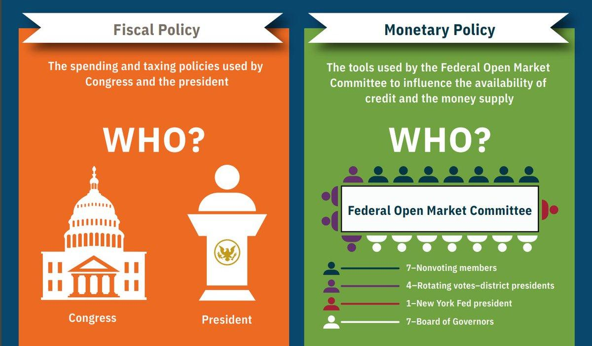

## Table of Contents

## What is fiscal policy?

Fiscal policy is the way a government manages its money to influence the economy. It involves deciding how much to spend, what to spend on, and how much tax to collect. When the government wants to boost the economy, it might spend more money on things like building roads or schools, or it might lower taxes so people have more money to spend. If the economy is growing too fast and causing inflation, the government might spend less or raise taxes to cool things down.

There are two main types of fiscal policy: expansionary and contractionary. Expansionary fiscal policy is used to grow the economy. The government does this by increasing spending or cutting taxes, which puts more money into people's pockets and encourages them to spend more. Contractionary fiscal policy is used to slow down the economy. The government does this by decreasing spending or raising taxes, which takes money out of circulation and helps to control inflation. Both types of policy are tools that governments use to try to keep the economy stable and healthy.

## Who are the key players in setting fiscal policy in the United States?

In the United States, the key players in setting fiscal policy are the President and Congress. The President plays a big role by proposing a budget to Congress every year. This budget shows how much the President thinks the government should spend and how much it should collect in taxes. The President's budget is like a suggestion, and it's up to Congress to decide if they agree with it or want to change it.

Congress has the final say on fiscal policy. It is made up of two parts: the House of Representatives and the Senate. Both parts need to agree on the budget before it becomes law. Congress can change the President's budget by deciding to spend more or less money on different things, or by changing tax laws. They also have the power to create new laws that affect how the government spends money and collects taxes.

Sometimes, other groups can influence fiscal policy too. For example, the Federal Reserve, which is the central bank of the United States, can give advice to the government about the economy. Also, special groups called think tanks and lobbyists can try to influence Congress and the President to make certain decisions about spending and taxes. But at the end of the day, it's the President and Congress who make the big decisions about fiscal policy.

## What is the role of the President in fiscal policy?

The President has a big role in setting fiscal policy in the United States. Every year, the President makes a budget and sends it to Congress. This budget is like a plan that says how much money the government should spend and how much it should collect in taxes. The President can suggest spending more money on things like schools or roads, or they can suggest cutting taxes so people have more money to spend. This is how the President tries to help the economy grow or slow down.

Even though the President makes the budget, Congress has the final say. They can change the President's plan by deciding to spend more or less money on different things, or by changing tax laws. But the President's budget is important because it starts the conversation about what the government should do with its money. The President can also use speeches and meetings to talk about their ideas and try to convince Congress and the public to support their plan.

## What is the role of Congress in fiscal policy?

Congress has the final say on fiscal policy in the United States. It is made up of two parts: the House of Representatives and the Senate. Both parts need to agree on the budget before it becomes law. Congress can change the President's budget by deciding to spend more or less money on different things, or by changing tax laws. They also have the power to create new laws that affect how the government spends money and collects taxes.

The process starts when the President sends their budget to Congress. Congress then looks at the budget and decides if they want to make any changes. They can hold meetings and talk to experts to help them make their decisions. If the House of Representatives and the Senate agree on a budget, it goes to the President. The President can sign it to make it law, or they can veto it, which means they don't agree with it. If the President vetoes the budget, Congress can try to override the veto with a special vote, but this is hard to do.

## How does the President propose a budget?

The President proposes a budget by working with their team in the White House. They start thinking about the budget months before it's due. They look at how the economy is doing and what the country needs. They decide how much money to spend on things like schools, roads, and the military. They also decide how much money to collect in taxes. Once they have a plan, they write it down in a big document called the budget proposal.

When the budget is ready, the President sends it to Congress. This usually happens in early February. The budget proposal tells Congress what the President thinks the government should do with its money for the next year. It's like a suggestion, and Congress can change it if they want. The President's budget starts a big discussion in Congress about how to help the country and keep the economy healthy.

## How does Congress review and modify the President's budget proposal?

When Congress gets the President's budget proposal, they start by looking at it carefully. They have special committees in both the House of Representatives and the Senate that focus on the budget. These committees hold meetings where they talk about the President's plan. They might also listen to experts and other people who can help them understand what the country needs. Sometimes, they might even ask the public for their thoughts. All this helps Congress decide if they agree with the President's plan or if they want to change it.

After the committees finish their work, they make their own version of the budget. This version might be different from what the President suggested. The House of Representatives and the Senate then vote on their budget. If both parts of Congress agree on the same budget, it goes back to the President. The President can sign the budget to make it law, or they can veto it if they don't like it. If the President vetoes the budget, Congress can try to override the veto with a special vote, but this is hard to do. The whole process can take many months, and it's a big part of how the government decides what to do with its money.

## What is the significance of the Congressional Budget and Impoundment Control Act of 1974?

The Congressional Budget and Impoundment Control Act of 1974 is a very important law that changed how the U.S. government makes its budget. Before this law, the President had a lot of power to decide how to spend money. Sometimes, the President could even decide not to spend money that Congress had already approved, which is called impoundment. This law stopped the President from doing that without Congress's okay. It made sure that Congress, which represents the people, has a bigger say in how money is spent.

The Act also set up a new way for Congress to make the budget. It created special committees in the House and Senate that focus just on the budget. These committees help Congress look at the President's budget plan and decide if they want to change it. The Act also made a schedule for when different parts of the budget process need to happen. This helps make sure that the government can plan ahead and know how much money it will have to spend. Overall, this law helped make the budget process more fair and clear, so that the government can better serve the people.

## How do the House of Representatives and the Senate differ in their fiscal policy roles?

The House of Representatives and the Senate both play important roles in making fiscal policy, but they do things a bit differently. The House starts the budget process by making its own version of the budget. They have a special committee called the House Budget Committee that looks at the President's budget and decides what to change. The House then votes on their budget. If it passes, it goes to the Senate. The House also has the power to start bills about taxes, which is a big part of fiscal policy.

The Senate gets the budget after the House is done with it. They have their own special committee, called the Senate Budget Committee, which looks at the House's budget and can make more changes. The Senate then votes on the budget. If both the House and the Senate agree on the same budget, it goes to the President. The Senate can also change tax bills that come from the House, but they can't start their own tax bills. Both the House and the Senate need to work together to make the final budget, but they each have their own steps in the process.

## What are the mechanisms Congress uses to influence fiscal policy, such as appropriations and taxation?

Congress uses two main ways to influence fiscal policy: appropriations and taxation. Appropriations are when Congress decides how much money to spend on different things like schools, roads, and the military. They do this by passing laws that say how much money can be spent on each thing. This is a big part of fiscal policy because it helps the government decide what to do with its money. If Congress wants to help the economy grow, they might decide to spend more money on things that create jobs. If they want to slow down the economy, they might spend less.

Taxation is the other main way Congress influences fiscal policy. Congress can change tax laws to collect more or less money from people and businesses. If they want to help the economy grow, they might lower taxes so people have more money to spend. If they want to slow down the economy, they might raise taxes to take money out of circulation. Both appropriations and taxation are tools that Congress uses to try to keep the economy stable and healthy. They work together to decide how much money the government has and how it should be spent.

## How can the President influence fiscal policy outside of the budget proposal?

The President can influence fiscal policy in many ways even after sending the budget proposal to Congress. One way is by using speeches and meetings to talk about their ideas. The President can give big speeches to the country or meet with important people in Congress to explain why they think certain spending or tax plans are good. This can help convince Congress and the public to support the President's ideas. The President can also use their power to veto laws that Congress passes. If Congress sends a budget or a tax law to the President that they don't like, the President can veto it. This means the law doesn't happen unless Congress can override the veto, which is hard to do.

Another way the President can influence fiscal policy is by working with other groups. For example, the President can talk to the Federal Reserve, which is the central bank of the United States. The Federal Reserve can give advice to the government about the economy and help the President's ideas work better. The President can also work with special groups called think tanks and lobbyists. These groups can help the President spread their ideas and try to get Congress to agree with them. By using all these different ways, the President can have a big impact on fiscal policy even outside of the budget proposal.

## What historical examples illustrate conflicts between the President and Congress over fiscal policy?

One big fight between the President and Congress over fiscal policy happened in 1995 and 1996. President Bill Clinton wanted to spend more money on things like schools and health care. But, the Republican-led Congress wanted to cut spending and lower taxes. They couldn't agree on a budget, so the government had to shut down for a few weeks. This meant many government workers didn't get paid, and some services stopped working. In the end, President Clinton and Congress made a deal that let the government open again, but it showed how hard it can be when the President and Congress don't agree on money.

Another example is from 2011 when President Barack Obama and Congress had a big fight over the debt ceiling. The debt ceiling is like a limit on how much money the government can borrow. President Obama wanted to raise it so the government could keep paying its bills. But, some people in Congress, especially Republicans, wanted to cut spending first. They almost didn't agree in time, which could have made the U.S. not able to pay its debts. This scared a lot of people because it could have hurt the economy. In the end, they made a deal to raise the debt ceiling, but it was a close call and showed how serious these fights can be.

## How do economic theories and political ideologies affect the fiscal policy decisions of the President and Congress?

Economic theories and political ideologies play a big role in how the President and Congress make fiscal policy decisions. Different economic theories, like Keynesian economics, say that the government should spend more money during bad economic times to help the economy grow. Other theories, like classical economics, say that the government should spend less and let the economy fix itself. The President and members of Congress might believe in different theories, which can make it hard for them to agree on a budget. For example, if the President believes in Keynesian economics, they might want to spend more on things like building roads to create jobs. But if Congress believes in classical economics, they might want to cut spending and lower taxes instead.

Political ideologies also affect fiscal policy decisions. People who lean more to the left, like Democrats, often want the government to spend more money on things like schools, health care, and helping poor people. They think this makes the country fairer and helps everyone. On the other hand, people who lean more to the right, like Republicans, often want to cut spending and lower taxes. They think this helps the economy grow and gives people more freedom to spend their own money. These different views can lead to big fights between the President and Congress over how to make the budget. For example, a Democratic President might want to raise taxes on rich people to help pay for more spending, while a Republican Congress might want to cut taxes for everyone and spend less.

## References & Further Reading

[1]: Taylor, J. B. (2000). ["Reassessing Discretionary Fiscal Policy."](https://www.aeaweb.org/articles?id=10.1257/jep.14.3.21) Journal of Economic Perspectives, 14(3), 21-36.

[2]: ["Dynamic Programming and Optimal Control"](https://www.mit.edu/~dimitrib/dpbook.html) by Dimitri P. Bertsekas

[3]: Loginova, O. (2019). ["Algorithmic Trading and Its Role on Financial Markets."](https://www.researchgate.net/publication/378548435_Algorithmic_Trading_and_AI_A_Review_of_Strategies_and_Market_Impact) Procedia Computer Science, 150, 853-861. 

[4]: ["Macroeconomics and Fiscal Policy"](https://www.economicshelp.org/macroeconomics/fiscal-policy/fiscal_policy/) by the International Monetary Fund

[5]: Baker, C., Bloom, N., & Davis, S. J. (2015). ["Measuring Economic Policy Uncertainty."](https://www.nber.org/papers/w21633) National Bureau of Economic Research Working Paper No. 21633.