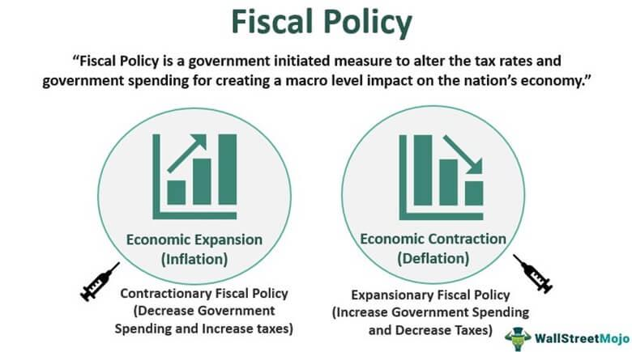

## Table of Contents

## What is fiscal policy?

Fiscal policy is the way a government manages its spending and taxes to influence the economy. It's like a tool that governments use to try to keep the economy healthy. When the economy is not doing well, the government might spend more money or cut taxes to help people and businesses. This can encourage them to spend more money, which can help the economy grow. On the other hand, if the economy is growing too fast and causing inflation, the government might spend less or raise taxes to cool things down.

There are two main types of fiscal policy: expansionary and contractionary. Expansionary fiscal policy is used when the economy needs a boost. The government might increase its spending on things like roads, schools, and healthcare, or it might lower taxes so people have more money to spend. Contractionary fiscal policy is used when the economy is overheating. The government might cut back on spending or raise taxes to take some money out of the economy and slow down inflation. Both types of policies are important tools for managing the economy and keeping it stable.

## How does fiscal policy differ from monetary policy?

Fiscal policy and monetary policy are both tools used to manage the economy, but they work in different ways. Fiscal policy is all about how the government manages its spending and taxes. When the government wants to help the economy grow, it might spend more money on things like building roads or schools, or it might lower taxes so people have more money to spend. If the economy is growing too fast and causing prices to go up too much, the government might spend less or raise taxes to slow things down. It's like the government using its wallet to help the economy.

Monetary policy, on the other hand, is managed by a country's central bank, like the Federal Reserve in the United States. Instead of using spending and taxes, monetary policy focuses on controlling the supply of money and interest rates. When the central bank wants to help the economy grow, it might lower interest rates, making it cheaper for people and businesses to borrow money. This can encourage them to spend and invest more. If the economy is growing too fast, the central bank might raise interest rates to make borrowing more expensive, which can slow down spending and help control inflation. It's like the central bank using the levers of money supply and interest rates to steer the economy.

Both fiscal and monetary policies are important for keeping the economy stable, but they work through different channels. Fiscal policy directly affects government spending and taxes, while monetary policy influences the economy through changes in the money supply and interest rates. Together, these policies help governments and central banks respond to economic challenges and keep things running smoothly.

## What are the main objectives of fiscal policy?

The main goal of fiscal policy is to help keep the economy stable and growing. Governments use fiscal policy to try to make sure that the economy doesn't grow too fast or too slow. When the economy is not doing well, the government might spend more money or cut taxes to help people and businesses. This can encourage them to spend more, which can help the economy grow. On the other hand, if the economy is growing too fast and causing prices to go up too much, the government might spend less or raise taxes to cool things down.

Another important objective of fiscal policy is to reduce unemployment. When there are a lot of people without jobs, the government might use fiscal policy to create more jobs. For example, the government could spend more money on building roads, schools, or other projects that need workers. By doing this, the government can help more people find jobs and earn money, which can also help the economy grow. So, fiscal policy is not just about keeping the economy stable, but also about making sure people have jobs and can support themselves.

## What are the types of fiscal policy?

There are two main types of fiscal policy: expansionary and contractionary. Expansionary fiscal policy is used when the economy needs a boost. The government might spend more money on things like building roads, schools, or hospitals. They might also lower taxes so that people and businesses have more money to spend. This can help the economy grow by encouraging people to buy more things and businesses to invest more.

Contractionary fiscal policy is used when the economy is growing too fast and causing prices to go up too much, which is called inflation. To slow things down, the government might spend less money on projects or raise taxes. By doing this, they take some money out of the economy, which can help to cool things down and keep prices from going up too fast.

Both types of fiscal policy are important tools for the government to manage the economy. They help to keep things balanced, making sure the economy doesn't grow too fast or too slow. By using these policies, the government can help to create jobs, control inflation, and keep the economy stable.

## How does expansionary fiscal policy work?

Expansionary fiscal policy is what the government does when it wants to help the economy grow. It's like giving the economy a little push to get it moving faster. The government does this by spending more money on things like building roads, schools, and hospitals. When the government spends more, it creates jobs for people who work on these projects. More jobs mean more people [earning](/wiki/earning-announcement) money, and when people have money, they spend it on things they need and want. This spending helps businesses grow and can make the whole economy stronger.

Another way the government uses expansionary fiscal policy is by cutting taxes. When taxes are lower, people and businesses have more money left over after paying the government. With more money in their pockets, people might buy more things, like cars or clothes, and businesses might invest in new projects or hire more workers. All this extra spending and investing can help the economy grow. So, by spending more and cutting taxes, the government can help the economy get back on its feet when it's not doing well.

## How does contractionary fiscal policy work?

Contractionary fiscal policy is what the government does when it wants to slow down the economy. It's like putting on the brakes to keep things from growing too fast. The government does this by spending less money on things like building roads, schools, and hospitals. When the government spends less, there are fewer jobs for people who work on these projects. Fewer jobs mean less money for people to spend, which can help slow down the economy and keep prices from going up too fast.

Another way the government uses contractionary fiscal policy is by raising taxes. When taxes go up, people and businesses have less money left over after paying the government. With less money in their pockets, people might buy fewer things, and businesses might not invest as much or hire new workers. This can help to cool down the economy and stop prices from rising too quickly. By spending less and raising taxes, the government can help to keep the economy from growing too fast and causing problems.

## What are the tools of fiscal policy?

The main tools of fiscal policy are government spending and taxes. Government spending is when the government uses money to pay for things like building roads, schools, and hospitals. When the government spends more, it can create jobs and help the economy grow. On the other hand, if the government spends less, it can slow down the economy and help to control prices.

Taxes are another important tool. When the government lowers taxes, people and businesses have more money to spend. This can help the economy grow because people might buy more things and businesses might invest more. But if the government raises taxes, people and businesses have less money to spend. This can help to slow down the economy and keep prices from going up too fast.

By using these tools, the government can try to keep the economy stable. They can spend more and cut taxes when the economy needs a boost, or spend less and raise taxes when the economy is growing too fast. It's all about finding the right balance to help the economy grow without causing problems.

## Can you explain the multiplier effect in the context of fiscal policy?

The multiplier effect is like a snowball that gets bigger as it rolls down a hill. In the context of fiscal policy, it means that when the government spends money or cuts taxes, the impact on the economy can be much larger than the initial amount of money. For example, if the government spends money to build a new road, the workers who build the road get paid. They then spend that money on things they need, like food and clothes. The people who sell those things then have more money to spend, and so on. This chain reaction can make the economy grow more than you might expect from just the initial spending.

The size of the multiplier effect depends on how much people spend the money they get. If people spend most of the money they receive, the multiplier effect will be bigger. But if they save a lot of it, the effect will be smaller. Economists use a number called the multiplier to figure out how much the economy will grow from a certain amount of government spending or tax cuts. Understanding the multiplier effect helps the government decide how much to spend or how much to cut taxes to get the economy moving in the right direction.

## How does fiscal policy impact economic growth?

Fiscal policy can really help the economy grow. When the government spends more money on things like building roads or schools, it creates jobs for people. More jobs mean more people have money to spend on things they need and want. If the government also cuts taxes, people and businesses have more money left over after paying the government. This extra money can help people buy more things and businesses invest in new projects, which makes the economy grow even more. It's like giving the economy a boost to help it move faster.

But fiscal policy can also slow down the economy if it's growing too fast. When prices start going up too much, the government might spend less money on projects or raise taxes. Spending less means fewer jobs, so people have less money to spend. Raising taxes also means people and businesses have less money left over. This can help to cool down the economy and keep prices from going up too fast. By using these tools, the government tries to keep the economy balanced and growing in a healthy way.

## What are the limitations and challenges of implementing fiscal policy?

Implementing fiscal policy can be tricky because it takes time for the effects to show up. When the government decides to spend more money or cut taxes, it can take months or even years for the economy to feel the impact. This delay makes it hard for the government to respond quickly to economic problems. Also, figuring out the right amount of spending or tax changes is not easy. If the government spends too much or cuts taxes too deeply, it could cause inflation or even lead to a bigger budget deficit, which means the government owes more money.

Another challenge is that fiscal policy can be affected by politics. Different political parties might have different ideas about how much the government should spend or how taxes should be set. This can lead to arguments and delays in making decisions. Also, the government has to be careful about how it spends money. If it spends on projects that don't really help the economy, like ones that are not needed or are too expensive, it might not get the boost it's looking for. So, the government needs to make smart choices about where to spend and how to adjust taxes to really help the economy grow in a healthy way.

## Can you provide historical examples of successful fiscal policy?

One good example of successful fiscal policy happened in the United States during the Great Depression in the 1930s. President Franklin D. Roosevelt started a program called the New Deal. The government spent a lot of money on building projects like roads, bridges, and schools. This helped create jobs for people who were out of work. The government also set up programs to help farmers and people who couldn't find jobs. These actions helped the economy start to recover and gave people hope during a tough time.

Another example is from the 2008 financial crisis. Many countries, including the United States, used fiscal policy to help their economies. The U.S. government passed the American Recovery and Reinvestment Act, which was a big plan to spend money and cut taxes. The government spent money on things like fixing roads and bridges, helping schools, and giving money to people who lost their jobs. This helped the economy start to grow again and created jobs for people. By using fiscal policy, the government was able to help the economy recover from a big problem.

## How do different countries approach fiscal policy, and what are the global implications?

Different countries have their own ways of using fiscal policy to manage their economies. Some countries, like the United States, often use big spending programs and tax cuts to help their economies grow. For example, during tough times like the Great Depression or the 2008 financial crisis, the U.S. government spent a lot of money on building projects and helping people who were out of work. Other countries, like those in the European Union, might be more careful about spending and try to keep their budgets balanced. They might not spend as much during tough times because they worry about owing too much money. Each country's approach depends on its own economic situation, political views, and what its people need.

The way different countries use fiscal policy can have big effects on the whole world. When big economies like the U.S. or China use fiscal policy to grow, it can help other countries too. For example, if the U.S. spends more money on building things, it can create jobs and make people buy more stuff. This can help other countries that sell things to the U.S. But if many countries spend too much and owe a lot of money, it can cause problems. It might make prices go up too fast or make it harder for countries to borrow money. So, what one country does with its fiscal policy can affect the whole world, and countries need to work together to keep the global economy stable.

## References & Further Reading

[1]: Blanchard, O., & Leigh, D. (2013). ["Growth Forecast Errors and Fiscal Multipliers."](https://www.imf.org/external/pubs/ft/wp/2013/wp1301.pdf) IMF Working Paper.

[2]: Alesina, A., & Ardagna, S. (2010). ["Large Changes in Fiscal Policy: Taxes Versus Spending."](https://www.nber.org/system/files/working_papers/w15438/w15438.pdf) Tax Policy and the Economy, 24(1), 35-68.

[3]: Keynes, J. M. (1936). ["The General Theory of Employment, Interest, and Money."](https://www.files.ethz.ch/isn/125515/1366_KeynesTheoryofEmployment.pdf) London: Macmillan (classic reference to Keynesian economic theory).

[4]: Bernanke, B. S. (2004). ["The Great Moderation."](https://www.federalreserve.gov/boarddocs/speeches/2004/20040220/) Speech at the Eastern Economic Association.

[5]: Fernandez, A., & Llano-Verduras, C. (2019). ["Algorithmic Trading and Market Impact: A Survey."](https://link.springer.com/content/pdf/10.1007/s00168-021-01066-x.pdf) Finance Research Letters, 29, 110-116.

[6]: Hendershott, T., & Riordan, R. (2013). ["Algorithmic Trading and the Market for Liquidity."](https://www.cambridge.org/core/journals/journal-of-financial-and-quantitative-analysis/article/abs/algorithmic-trading-and-the-market-for-liquidity/C1A34D3767436529EA4F23DB1780273C) Journal of Financial and Quantitative Analysis, 48(4), 1001-1024.