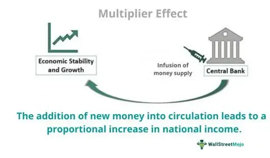

Fiscal policy is a cornerstone of macroeconomic management, involving government actions to influence economic activity through taxation and expenditure. It is instrumental in promoting economic stability and growth. By adjusting tax rates and government spending, fiscal policy aims to influence aggregate demand, thereby affecting overall economic output and employment levels. This policy is particularly vital during economic downturns, where it can be used to stimulate growth and counteract recessions, or during booms to cool down inflationary pressures.

Central to fiscal policy's efficacy is the concept of the multiplier effect. The multiplier effect refers to the process by which an initial injection of government spending leads to a chain reaction of increased consumption and production. This amplification effect means that the total increase in Gross Domestic Product (GDP) is a multiple of the original government expenditure. The size of this multiplier depends on various factors, including the marginal propensity to consume, the level of idle resources in the economy, and the openness of the economy to trade. The multiplier effect thus underscores the potential of fiscal policy to generate more significant economic changes than the initial spending outlay might suggest.



Algorithmic trading, on the other hand, represents a modern approach to financial markets where computer algorithms execute trades at high speeds based on pre-defined criteria. This method of trading is highly relevant in the context of economic concepts like the multiplier effect. By integrating economic indicators within trading algorithms, traders can make more informed decisions that account for fiscal policy shifts and their broader economic implications. Algorithmic trading has revolutionized market behavior, offering the ability to process large volumes of market data rapidly, identifying and exploiting even minute price inefficiencies. Understanding economic principles such as the multiplier effect can enhance these algorithms, potentially improving trading outcomes by anticipating market movements triggered by changes in fiscal policy.

In summary, fiscal policy plays a crucial role in economic growth through its impact on aggregate demand and its capacity to elicit a multiplier effect. Meanwhile, the advent of algorithmic trading presents new opportunities to leverage these economic concepts in real-time financial decision-making.

## Table of Contents

## Understanding Fiscal Policy and the Multiplier Effect

### Understanding Fiscal Policy and the Multiplier Effect

Fiscal policy refers to the use of government spending and taxation to influence a nation's economic activity. The core components of fiscal policy are government expenditures and revenue collection through taxes. These components are utilized to achieve macroeconomic objectives, such as controlling inflation, reducing unemployment, and fostering economic growth. Fiscal policy can be classified into two main types: Expansionary and Contractionary. Expansionary fiscal policy involves increasing government spending and/or decreasing taxes to stimulate economic growth, while contractionary fiscal policy aims to reduce spending and/or increase taxes to cool down an overheated economy.

A critical concept associated with fiscal policy is the multiplier effect, an economic mechanism where an initial change in spending (government or otherwise) leads to a larger change in overall economic output, such as Gross Domestic Product (GDP). The multiplier effect occurs because an increase in government spending raises household incomes, leading to higher consumption expenditures, which in turn stimulates additional production and income increments. This chain reaction continues, although at a diminishing rate, as each round of re-spending is subject to some savings.

The formula for the multiplier is commonly expressed as:

$$
\text{Multiplier} = \frac{1}{1 - MPC}
$$

where MPC stands for the marginal propensity to consume, which is the proportion of additional income that a household is likely to spend on consumption rather than save. A higher MPC results in a larger multiplier, indicating that more of each additional dollar of income is spent, amplifying the initial economic boost through successive rounds of spending.

Fiscal policy can lead to a substantial multiplier effect on GDP, especially when the economy has idle resources, such as underemployment or underutilized capital. In such instances, a government injection of spending can activate these dormant resources, setting off a ripple effect that magnifies the initial fiscal stimulus. Conversely, during periods when the economy is near full capacity, the multiplier effect might be smaller due to constraints on resource availability, leading to inflationary pressure rather than real growth in output.

Essentially, the effectiveness of fiscal policy in instigating a multiplier effect is contingent on various factors, such as the state of the economy, the size of the initial spending change, and the economic entities' propensity to consume. By understanding and leveraging these dynamics, policymakers aim to harness fiscal policy as a tool to enhance economic stability and growth.

## The Mechanics of the Multiplier Effect

The multiplier effect is a fundamental concept in macroeconomics, illustrating how an initial change in spending leads to a more significant overall impact on the national income. It is primarily driven by the interaction between consumption and income. The basic multiplier formula is given by:

$$
\text{Multiplier} = \frac{1}{1 - MPC}
$$

where MPC represents the marginal propensity to consume, which is the proportion of additional income that a consumer spends on goods and services rather than saving. For instance, if the MPC is 0.8, every additional dollar earned will result in an 80-cent increase in consumption, leading to a multiplier of 5. This implies that an initial $1 increase in spending can raise the total output by $5.

### Factors Influencing the Size of the Multiplier Effect

Various factors influence the magnitude of the multiplier effect. These include:

1. **Marginal Propensity to Consume (MPC)**: A higher MPC leads to a larger multiplier since a more significant portion of income is spent rather than saved, fueling further economic activity.

2. **Marginal Propensity to Save (MPS)**: As the complement to MPC, MPS is the fraction of additional income that is saved. A lower MPS results in a higher multiplier because it indicates more spending rather than saving.

3. **Tax Rates**: Higher taxation reduces disposable income, thus decreasing consumption and diminishing the multiplier effect.

4. **Import Propensity**: If a significant portion of additional income is spent on imports, the domestic multiplier effect is weaker because the spending does not circulate within the economy.

5. **Interest Rates**: High-interest rates can dampen the multiplier effect by discouraging borrowing and spending, while low rates tend to encourage both.

### Examples of Positive and Negative Multiplier Effects

**Positive Multiplier Effect**: 

Assume the government initiates a $100 million infrastructure project. If the MPC is 0.9, the multiplier is calculated as:

$$
\text{Multiplier} = \frac{1}{1 - 0.9} = 10
$$

The total impact on GDP would be $100 million multiplied by 10, resulting in a $1 billion increase in GDP. This reflects a positive multiplier effect, where the initial spending injects additional economic activity and growth through successive rounds of spending.

**Negative Multiplier Effect**:

Conversely, consider a scenario where an austerity measure reduces government spending by $50 million, with an MPC of 0.8. The multiplier is:

$$
\text{Multiplier} = \frac{1}{1 - 0.8} = 5
$$

Here, the GDP could potentially decrease by $50 million multiplied by 5, equating to a $250 million reduction in the GDP. This represents a negative multiplier effect, where the initial decrease in spending results in a larger contraction in economic output.

Understanding the mechanics of the multiplier effect provides crucial insights into how fiscal policy can influence economic activity. By recognizing the factors that affect its size, policymakers and economists can better predict and manage economic outcomes.

## Fiscal Policy's Economic Impacts: Case Studies

Fiscal policy plays a pivotal role in shaping economic growth through its impact on aggregate demand and employment levels. One of the key mechanisms through which fiscal policy can influence the economy is the multiplier effect. This section provides real-world examples of fiscal policy leading to multiplier effects, with a focus on historical case studies like the 2008 financial crisis and recent fiscal responses to COVID-19, alongside comparative insights on different types of government spending and their multiplier effects.

### The 2008 Financial Crisis

The 2008 financial crisis was a global economic downturn that led to a significant increase in government intervention through fiscal policy. In response to the crisis, many governments implemented expansive fiscal policies involving increased public spending and tax cuts to stimulate demand. The United States, for instance, enacted the American Recovery and Reinvestment Act (ARRA) in 2009, which infused approximately $831 billion into the economy through investments in infrastructure, education, health, and renewable energy.

The ARRA aimed to boost consumer spending and job creation. Quantitative estimates of the multiplier effect during this period suggest that government spending multipliers can vary significantly depending on economic conditions. For example, studies by Blanchard and Leigh (2013) found that during recessionary conditions, fiscal multipliers can exceed 1, meaning that each dollar of government spending could generate more than a dollar increase in GDP. This enhanced multiplier effect can be attributed to high unemployment levels and lower interest rates, which minimize crowding out of private investment.

### Fiscal Responses to COVID-19

The global pandemic brought about unprecedented fiscal interventions. Governments worldwide introduced extensive stimulus packages to counteract the economic shock caused by COVID-19. The United States implemented measures amounting to over $5 trillion, including direct payments to individuals, enhanced unemployment benefits, and support for small businesses.

The multiplier effect of such measures has been the subject of various analyses. A report by the International Monetary Fund (2020) indicated that direct fiscal transfers and public health spending had high multipliers, particularly in economies that effectively controlled the virus spread. These multipliers, in some cases, were estimated to be between 0.7 and 1.0 in the short run, demonstrating a substantial impact on maintaining consumption and supporting economic activity.

### Comparative Insights on Government Spending

Different types of government spending yield varying multiplier effects. Infrastructure spending, for instance, is often associated with high multipliers due to its ability to create jobs and enhance productivity. Research suggests that infrastructure spending can have multipliers ranging from 1.5 to 2.5, especially when there is slack in the economy.

In contrast, tax cuts generally exhibit smaller multipliers, especially if they predominantly benefit higher-income households less likely to spend the additional income. This highlights the importance of targeting government spending towards areas with the highest potential for stimulating aggregate demand.

### Conclusion

These historical case studies underscore the significance of fiscal policy in influencing economic outcomes through the multiplier effect. Both the 2008 financial crisis and the COVID-19 pandemic illustrate the importance of timely and well-targeted government interventions in boosting economic resilience. Understanding the differential impacts of various spending types can aid policymakers in designing effective fiscal strategies to maximize economic growth and stability.

## Algorithmic Trading and the Multiplier Effect

Algorithmic trading refers to the use of computers programmed to follow a defined set of instructions for placing trades in financial markets. These instructions are based on timing, price, quantity, or any mathematical model, allowing for the execution of trades at speeds and frequencies impossible for human traders. This type of trading capitalizes on data-driven insights and can effectively exploit small price discrepancies, executing trades rapidly and in bulk.

Understanding the multiplier effect, typically associated with fiscal policy, can enhance [algorithmic trading](/wiki/algorithmic-trading) strategies. The multiplier effect refers to the proportional amount of increase in final income that results from an injection of spending. This economic concept highlights how changes in government spending or taxation can lead to multiple changes in GDP. Knowing the potential impact of fiscal policy changes on overall economic activity allows algorithmic traders to adjust their strategies accordingly. For instance, if a government announces a significant infrastructure investment, the multiplier effect suggests a potential increase in economic output, which traders could anticipate and position their portfolios to benefit from expected market shifts.

Integrating economic indicators like the multiplier effect into algorithmic models involves using data analytics to assess the potential impacts of fiscal policy changes on asset prices. Traders can incorporate predicted multiplier outcomes into their algorithms to forecast market movements. Python, for example, offers libraries such as NumPy and pandas, which can handle large datasets and perform complex calculations to simulate these economic scenarios. By using these tools, algorithms can dynamically adjust trading strategies based on expected macroeconomic shifts.

The Python pseudo-code snippet below illustrates a simplified approach to incorporating the multiplier effect into algorithmic trading models:

```python
import numpy as np
import pandas as pd

# Load economic and market data
economic_data = pd.read_csv('economic_indicators.csv')
market_data = pd.read_csv('market_prices.csv')

# Define a function to calculate the fiscal multiplier effect
def calculate_multiplier(investment_change, marginal_propensity_to_consume):
    # Simple multiplier formula: 1 / (1 - MPC)
    multiplier = 1 / (1 - marginal_propensity_to_consume)
    return investment_change * multiplier

# Calculate potential GDP impact based on policy changes
investment_change = economic_data['investment_change'].iloc[-1]
mpc = economic_data['MPC'].iloc[-1]
potential_gdp_change = calculate_multiplier(investment_change, mpc)

# Adjust trading strategy based on expected GDP change
if potential_gdp_change > 0:
    # Strategic buy decision
    market_data['Strategy'] = 'Buy'
else:
    # Strategic sell decision
    market_data['Strategy'] = 'Sell'

# Output the adjusted trading strategy
print(market_data[['Date', 'Strategy']])
```

This integration underscores the importance of aligning trading algorithms with broader economic insights. Algorithmic models that consider fiscal policy's ripple effects through the multiplier can offer strategic advantages, positioning them to better react to economic developments and optimize returns.

## Leveraging Economic Concepts in Algo Trading Strategies

Incorporating fiscal policy impacts into trading algorithms involves a multifaceted approach that converges economic theory with technological advancements. One key method is the development of predictive models that utilize fiscal policy indicators such as government spending, taxes, and deficits to forecast market trends. These models typically integrate macroeconomic data, allowing traders to anticipate shifts in economic policy and adjust their portfolios accordingly. For instance, an increase in government spending may signal an impending boost in economic activity, leading traders to favor equities over bonds.

Big data and [machine learning](/wiki/machine-learning) play pivotal roles in this integration by processing vast amounts of economic data to discern patterns and correlations. Machine learning algorithms, such as regression models and neural networks, can be trained on historical data to predict the market impacts of fiscal policy changes. These models benefit from big data's ability to analyze diverse datasets, including GDP reports, tax changes, and public spending announcements, providing a comprehensive understanding of the economic landscape. For example, a machine learning model might identify a correlation between tax cuts and consumer spending increases, enabling traders to make informed decisions.

An example scenario where fiscal policy shifts inform trading decisions is during announcements of significant tax reforms. Suppose a government announces corporate tax cuts expected to boost business investment. Trading algorithms can swiftly analyze the announcement's text and historical market reactions to similar policies. The algorithm might increase positions in capital goods and technology sectors, anticipating enhanced corporate profits and increased stock valuations.

In addition, trading algorithms might incorporate economic indicators such as the multiplier effect when evaluating fiscal policy impacts. If a government announces substantial infrastructure spending, algorithms could estimate the multiplier effect on economic growth to predict enhancements in employment and income levels. An algorithm coded in Python for this purpose could trigger buy signals for stocks in the construction and related sectors shortly after the policy announcement.

Here is a simplified Python code snippet illustrating how an algorithm might integrate economic announcements:

```python
def evaluate_policy_impact(policy_announcement):
    if "tax cut" in policy_announcement:
        # Predict increased consumer spending
        adjust_portfolio(sectors=["consumer", "tech"], action="buy")
    elif "infrastructure spending" in policy_announcement:
        # Anticipate multiplier effect on economy
        adjust_portfolio(sectors=["construction", "materials"], action="buy")

def adjust_portfolio(sectors, action):
    for sector in sectors:
        # Logic to buy or sell stocks in specified sectors
        execute_trade(sector, action)

# Example policy announcement
policy_announcement = "The government announces a significant tax cut aimed at boosting consumer spending."
evaluate_policy_impact(policy_announcement)
```

In summary, leveraging economic concepts such as fiscal policy changes and the multiplier effect in algorithmic trading strategies involves harnessing big data and machine learning technologies to develop adaptive and predictive models. These models assist traders in making data-driven decisions that account for macroeconomic signals, ultimately optimizing investment outcomes.

## Challenges and Considerations

Applying the fiscal multiplier to economic prediction and policy design presents several challenges and complexities. Understanding these obstacles is crucial for policymakers and analysts aiming to harness the multiplier effect effectively.

One of the primary challenges is the issue of time lags. Fiscal policy measures, such as government spending or tax changes, do not translate into immediate economic impacts. The delay between the implementation of a policy and its observable effects on gross domestic product (GDP) can vary significantly. These time lags can complicate efforts to stabilize the economy, particularly in times of recession or overheating, where prompt responses are crucial.

Consumer behavior variability further complicates the application of the fiscal multiplier. Economic models typically assume uniform responses from consumers to changes in income, yet in reality, consumer reactions can differ widely based on factors such as income level, confidence in economic stability, and regional economic conditions. For instance, high-income individuals might save a larger portion of any additional income, reducing the multiplier effect compared to lower-income individuals who are likelier to spend additional earnings.

Global leakages are another consideration, especially in an interconnected global economy. When government spending increases, some of the additional demand may be satisfied by imports, rather than domestic production. This leakage can reduce the multiplier effect within the country implementing the policy. The extent of these leakages can be influenced by factors such as trade openness and the elasticity of import demand.

Given these complexities, there is a pressing need for adaptive strategies in using the fiscal multiplier. Policies must be continuously refined based on empirical analysis and data from both domestic and global markets. This includes leveraging advances in big data analytics and machine learning, which can enhance the precision of economic modeling. Algorithms that can adapt to new data and revise predictions dynamically may prove particularly beneficial in assessing the effectiveness of fiscal measures in real-time.

Overall, continuous research and innovation in economic analysis tools are essential to overcome these challenges, enabling more accurate predictions and efficient policy implementations. As such, the fiscal multiplier remains a nuanced and vital concept within economic theory, necessitating sophisticated approaches to apply it effectively.

## Conclusion

Fiscal policy significantly impacts economic growth through its ability to influence aggregate demand, employment, and overall economic activity. Central to this discussion is the multiplier effect, a concept that details how initial changes in fiscal policy—such as government spending or tax cuts—can lead to a larger overall increase in national income and GDP. The multiplier effect demonstrates that fiscal interventions can have amplified impacts on an economy, fostering growth or contraction depending on the policy's nature and execution. The formula for the multiplier is given by:

$$
\text{Multiplier} = \frac{1}{1-MPC}
$$

where $MPC$ is the marginal propensity to consume. A higher MPC means a larger multiplier, indicating stronger economic responses to fiscal policy changes.

Integrating economic insights, particularly those concerning the multiplier effect, into algorithmic trading is crucial for potential advantages in financial markets. Algorithmic trading can harness these insights to anticipate market movements that result from fiscal policy actions. By understanding the expected multiplier effects, traders can build algorithms that predict economic shifts, adjusting their strategies to optimise returns.

As technological advancements like big data analytics and machine learning continue to evolve, these tools further enhance the capacity to analyse complex economic indicators. Traders can effectively incorporate fiscal policy shifts into their algorithms, enabling them to adjust portfolios dynamically and mitigate risks associated with economic fluctuations.

The future implications for economic policy and financial market strategies are profound. As policymakers and traders increasingly rely on advanced data analytics, the integration of comprehensive economic insights into decision-making processes will likely become more prevalent. This trend may encourage more informed fiscal policies that consider potential multiplier effects, consequently fostering economic stability and growth. Additionally, financial markets may see enhanced algorithmic strategies that are better adapted to changing economic environments, potentially leading to more robust and resilient investment portfolios. These developments underscore the importance of continuous learning and adaptation in both economic policy formulation and algorithmic trading strategies.

## References & Further Reading

1. **Blanchard, O. (2009)**. *Macroeconomics*. Pearson Prentice Hall.
   - This textbook provides a comprehensive overview of macroeconomic principles, including detailed discussions on fiscal policy and economic multipliers, making it an essential resource for understanding these concepts in depth.

2. **Mankiw, N. G. (2018)**. *Principles of Economics*. Cengage Learning.
   - Mankiw's book covers fundamental economic theories and principles, offering insights into the multiplier effect and how fiscal policy can shape economic outcomes.

3. **Krugman, P., & Wells, R. (2015)**. *Macroeconomics*. Worth Publishers.
   - This book features an analysis of fiscal policy and economic crises, including historical case studies like the 2008 financial crisis, focusing on the multiplier effect's role.

4. **Taylor, J. B., & Weerapana, A. (2011)**. *Principles of Macroeconomics*. South-Western College Pub.
   - This resource discusses macroeconomic phenomena with a focus on policy tools like fiscal policy, along with insights into the mechanisms and impacts of multipliers.

5. **Ait-Sahalia, Y., & Jacod, J. (2014)**. *High-Frequency Financial Econometrics*. Princeton University Press.
   - This book explores algorithmic trading in depth, with sections that tie economic indicators such as the multiplier effect to high-frequency trading instruments.

6. **Carlin, B. I., & Soskice, D. (2014)**. *Macroeconomics: Institutions, Instability, and the Financial System*. Oxford University Press.
   - The authors provide a modern perspective on macroeconomic policy, focusing on its effects, including the fiscal multiplier's significance in different economic contexts.

7. **Harris, L. (2003)**. *Trading and Exchanges: Market Microstructure for Practitioners*. Oxford University Press.
   - A seminal resource on market structure and trading, discussing the role of algorithmic trading strategies and their interaction with economic indicators like fiscal policy effects.

8. **Jorion, P. (2007)**. *Value at Risk: The New Benchmark for Managing Financial Risk*. McGraw-Hill.
   - Essential reading for understanding risk assessment in trading, with contextual mentions of fiscal policy impacts and economic multipliers on market risk.

9. **Johnson, B. (2010)**. *Algorithmic Trading & DMA: An Introduction to Direct Access Trading Strategies*. 4Myeloma Press.
   - This guide provides an introduction to algorithmic trading techniques, highlighting the potential to incorporate various economic factors, such as multiplier effects, into trading strategies.

10. **Romer, D. (2012)**. *Advanced Macroeconomics*. McGraw-Hill/Irwin.
    - Romer’s advanced text delves into dynamic macroeconomic frameworks, focusing on policy effects and the empirical quantification of economic multipliers.

11. **Shreve, S. E. (2004)**. *Stochastic Calculus for Finance*. Springer.
    - For those interested in the mathematical underpinnings of financial models, this book covers stochastic calculus techniques that can be utilized in developing sophisticated algorithmic trading systems.

