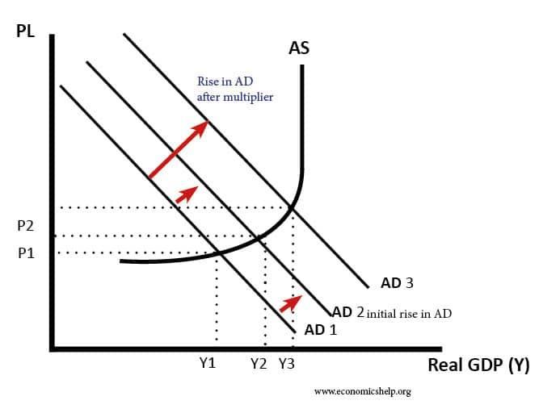

## Table of Contents

## What is fiscal policy?

Fiscal policy is about how a government manages its money to help the economy. It includes deciding how much to spend and how much tax to collect. When the government wants to boost the economy, it might spend more money on things like building roads or giving money to people who need it. Or, it might lower taxes so people and businesses have more money to spend. On the other hand, if the economy is growing too fast and causing inflation, the government might spend less or raise taxes to cool things down.

There are two main types of fiscal policy: expansionary and contractionary. Expansionary fiscal policy is used when the economy needs a boost. The government increases spending or cuts taxes to encourage more economic activity. This can help during times of recession or high unemployment. Contractionary fiscal policy is the opposite. It's used when the economy is overheating. The government reduces spending or raises taxes to slow down the economy and control inflation. Both types of policies are tools that governments use to keep the economy stable and healthy.

## What are the main tools of fiscal policy?

The main tools of fiscal policy are government spending and taxation. Government spending means how much money the government uses to pay for things like schools, hospitals, roads, and social programs. When the government decides to spend more, it can help the economy grow by creating jobs and increasing demand for goods and services. On the other hand, if the government spends less, it can slow down the economy because there's less money flowing around.

Taxation is another important tool. It's about how much money the government takes from people and businesses in the form of taxes. If the government lowers taxes, people and businesses have more money to spend or invest, which can help the economy grow. But if the government raises taxes, people and businesses have less money, which can slow down the economy. By adjusting these two tools, the government tries to keep the economy balanced and healthy.

Sometimes, the government also uses something called transfer payments, which are payments like welfare, unemployment benefits, and social security. These payments can help people who need financial support, and they can also be used to influence the economy. For example, increasing transfer payments can put more money into people's pockets, encouraging them to spend more and help the economy grow.

## How does fiscal policy differ from monetary policy?

Fiscal policy and monetary policy are both ways to manage the economy, but they work in different ways. Fiscal policy is about the government's decisions on spending and taxes. When the government wants to help the economy grow, it might spend more money on things like building roads or helping people who are out of work. Or it might lower taxes so people have more money to spend. If the economy is growing too fast and causing prices to go up a lot, the government might spend less or raise taxes to slow things down.

Monetary policy, on the other hand, is about controlling the money supply and interest rates, and it's usually managed by a country's central bank, like the Federal Reserve in the United States. When the central bank wants to help the economy grow, it might lower interest rates to make borrowing cheaper, encouraging people and businesses to take out loans and spend more. If the economy is growing too fast, the central bank might raise interest rates to make borrowing more expensive, which can slow down spending and help control inflation. So, while fiscal policy uses government spending and taxes, monetary policy uses interest rates and the money supply to influence the economy.

## What is the multiplier effect in economics?

The multiplier effect in economics is like a snowball that gets bigger as it rolls down a hill. It happens when an initial change in spending leads to a bigger overall change in economic activity. For example, if the government spends more money on building a new road, the construction workers get paid and they spend that money on things they need, like food and clothes. The people who sell food and clothes then have more money to spend, and so on. This chain reaction means the initial spending by the government can lead to a much larger increase in total spending in the economy.

The size of the multiplier effect depends on how much people spend out of their extra income. If people spend a lot of their extra money, the multiplier effect will be bigger. But if people save most of their extra money, the multiplier effect will be smaller. Economists use a formula to figure out the multiplier, but the basic idea is that spending by one person can lead to more spending by others, making the total impact on the economy much larger than the initial spending.

## How does government spending influence the multiplier effect?

Government spending can have a big impact on the multiplier effect. When the government decides to spend money on things like building roads or helping people who are out of work, it puts money directly into the economy. This initial spending can start a chain reaction. For example, if the government pays workers to build a new school, those workers will spend their wages on things like food and clothes. The people who sell food and clothes then have more money to spend, and so on. This chain of spending can lead to a much bigger overall increase in economic activity than the government's initial spending.

The size of the multiplier effect from government spending depends on how much people spend out of their extra income. If people tend to spend a lot of the money they get, the multiplier effect will be bigger because each round of spending will lead to more spending by others. But if people save most of their extra money instead of spending it, the multiplier effect will be smaller. So, government spending can kickstart a cycle of spending that grows the economy, but how much it grows depends on how people react to having more money.

## Can you explain the concept of the fiscal multiplier?

The fiscal multiplier is a way to measure how much a change in government spending or taxes can affect the overall economy. It's like a domino effect where one dollar spent by the government can lead to more than one dollar of economic activity. For example, if the government spends money to build a new bridge, the workers get paid and then spend that money on things they need, like groceries and clothes. The people who sell groceries and clothes then have more money to spend, and this chain of spending can keep going, making the total impact on the economy bigger than the government's original spending.

The size of the fiscal multiplier depends on how much people spend out of the extra money they get. If people spend a lot of their extra income, the multiplier will be bigger because each round of spending leads to more spending by others. But if people save most of their extra money instead of spending it, the multiplier will be smaller. Economists use different formulas to calculate the fiscal multiplier, but the main idea is that government spending can start a cycle of spending that grows the economy, and how much it grows depends on how people react to having more money.

## What factors determine the size of the fiscal multiplier?

The size of the fiscal multiplier depends on a few important things. One big thing is how much people spend out of the extra money they get. If people spend a lot of their extra income, the multiplier will be bigger. This is because each round of spending leads to more spending by others, making the total effect on the economy larger. But if people save most of their extra money instead of spending it, the multiplier will be smaller. Another thing that matters is the state of the economy. In a recession, when there are lots of unemployed people and unused factories, the multiplier might be bigger because the extra spending can quickly lead to more jobs and production.

Another [factor](/wiki/factor-investing) is how the government spends its money. If the government spends on things that directly create jobs and income, like building roads or schools, the multiplier might be bigger. On the other hand, if the government gives money to people who might save it instead of spending it, the multiplier could be smaller. Also, the type of taxes the government changes can make a difference. If the government cuts taxes that people are likely to spend, the multiplier might be bigger. But if the tax cuts go to people who are likely to save the money, the multiplier might be smaller. All these things together decide how big the fiscal multiplier will be.

## How does taxation impact the fiscal multiplier?

Taxation can affect the fiscal multiplier by changing how much money people and businesses have to spend. When the government lowers taxes, people and businesses have more money in their pockets. If they spend this extra money, it can lead to more economic activity. For example, if someone gets a tax cut and uses the money to buy a new car, the car dealership gets more money and might hire more workers. This can start a chain reaction of spending that makes the total impact on the economy bigger than the original tax cut. So, lowering taxes can make the fiscal multiplier bigger if people spend their extra money.

On the other hand, if the government raises taxes, people and businesses have less money to spend. This can slow down the economy because there's less money flowing around. If people save the money they have left after paying higher taxes instead of spending it, the fiscal multiplier will be smaller. The type of tax also matters. For example, if the government cuts taxes that people are likely to spend, like sales taxes, the multiplier might be bigger. But if the tax cuts go to people who are likely to save the money, like high-income earners, the multiplier might be smaller. So, the way taxes are changed can really affect how big the fiscal multiplier is.

## What are the differences between short-term and long-term fiscal multipliers?

The short-term fiscal multiplier and the long-term fiscal multiplier show how government spending or tax changes can affect the economy over different periods of time. The short-term fiscal multiplier looks at the immediate impact of these changes. For example, if the government spends money to build a new road, the workers get paid right away and start spending that money, which can quickly boost the economy. The short-term multiplier is often bigger because people and businesses react quickly to changes in their income or spending power.

The long-term fiscal multiplier, on the other hand, looks at the effects over a longer period. Over time, the economy might adjust to the changes in government spending or taxes. For example, if the government keeps spending a lot of money, it might lead to higher prices (inflation) or higher interest rates, which can slow down the economy. So, the long-term multiplier might be smaller because these adjustments can reduce the overall impact of the initial spending or tax changes. Understanding both short-term and long-term multipliers helps policymakers make better decisions about how to manage the economy.

## How do economists measure the effectiveness of fiscal policy?

Economists measure the effectiveness of fiscal policy by looking at how much it helps the economy grow or shrink. They use something called the fiscal multiplier to see how much a change in government spending or taxes affects the overall economy. If the government spends money to build a new road, economists will watch to see how much more people spend because of that. They also look at things like how many new jobs are created or how much more people are [earning](/wiki/earning-announcement). By comparing these changes to what the government spent, economists can figure out if the policy worked well.

Another way economists measure the effectiveness of fiscal policy is by looking at how it affects things like unemployment and inflation. If the government spends more money to help the economy during a recession, economists will check if unemployment goes down and if people start spending more. On the other hand, if the government raises taxes to slow down an overheating economy, economists will see if inflation goes down. By studying these effects over time, economists can tell if the fiscal policy was successful in reaching its goals.

## What are the limitations and criticisms of using fiscal policy to stimulate the economy?

Using fiscal policy to stimulate the economy has some challenges and people often criticize it. One big problem is that it can take a long time for the government to decide to spend more money or cut taxes, and then even longer for the effects to show up in the economy. This delay can make it hard to help the economy when it needs it most. Another issue is that if the government spends too much money, it can lead to higher prices, or inflation. If people start expecting prices to keep going up, they might spend more now, which can make inflation even worse. Also, if the government borrows a lot of money to pay for its spending, it might push up interest rates, making it harder for people and businesses to borrow and spend.

Critics also worry about the long-term effects of using fiscal policy. If the government keeps spending a lot of money and doesn't raise enough in taxes, it can build up a big debt. This debt might need to be paid back by future generations, which can be unfair. Some people also think that the government might not always spend money in the best way. For example, if the government spends money on projects that don't really help the economy, like building roads that nobody uses, then the money is wasted. Finally, some critics argue that the private sector might be better at deciding where to spend money, and too much government spending can crowd out private investment, slowing down the economy in the long run.

## How have recent economic theories and models changed our understanding of the fiscal multiplier?

Recent economic theories and models have given us new ways to think about the fiscal multiplier. One big change is that economists now pay more attention to how the economy is doing when they try to figure out the multiplier. For example, if the economy is in a recession with lots of unemployed people and unused factories, the fiscal multiplier might be bigger. This is because extra government spending can quickly lead to more jobs and more production. On the other hand, if the economy is already doing well, the multiplier might be smaller because there's less room for the spending to make a big difference.

Another change in our understanding comes from looking at how people and businesses react to government spending and tax changes. New models show that if people expect the government to keep spending a lot of money, they might start to expect higher taxes in the future. This can make them save more of their money now instead of spending it, which can make the fiscal multiplier smaller. Also, these models take into account that different kinds of spending can have different effects. For example, spending on things like infrastructure might have a bigger multiplier than giving money directly to people who might save it. So, these new theories and models help us see that the fiscal multiplier isn't just one number; it can change based on a lot of different things.

## What is the relationship between Fiscal Policy and the Multiplier Effect?

### Understanding Fiscal Policy and the Multiplier Effect

Fiscal policy refers to the use of government spending and taxation to influence a nation's economic activity. The core components of fiscal policy are government expenditures and revenue collection through taxes. These components are utilized to achieve macroeconomic objectives, such as controlling inflation, reducing unemployment, and fostering economic growth. Fiscal policy can be classified into two main types: Expansionary and Contractionary. Expansionary fiscal policy involves increasing government spending and/or decreasing taxes to stimulate economic growth, while contractionary fiscal policy aims to reduce spending and/or increase taxes to cool down an overheated economy.

A critical concept associated with fiscal policy is the multiplier effect, an economic mechanism where an initial change in spending (government or otherwise) leads to a larger change in overall economic output, such as Gross Domestic Product (GDP). The multiplier effect occurs because an increase in government spending raises household incomes, leading to higher consumption expenditures, which in turn stimulates additional production and income increments. This chain reaction continues, although at a diminishing rate, as each round of re-spending is subject to some savings.

The formula for the multiplier is commonly expressed as:

$$
\text{Multiplier} = \frac{1}{1 - MPC}
$$

where MPC stands for the marginal propensity to consume, which is the proportion of additional income that a household is likely to spend on consumption rather than save. A higher MPC results in a larger multiplier, indicating that more of each additional dollar of income is spent, amplifying the initial economic boost through successive rounds of spending.

Fiscal policy can lead to a substantial multiplier effect on GDP, especially when the economy has idle resources, such as underemployment or underutilized capital. In such instances, a government injection of spending can activate these dormant resources, setting off a ripple effect that magnifies the initial fiscal stimulus. Conversely, during periods when the economy is near full capacity, the multiplier effect might be smaller due to constraints on resource availability, leading to inflationary pressure rather than real growth in output.

Essentially, the effectiveness of fiscal policy in instigating a multiplier effect is contingent on various factors, such as the state of the economy, the size of the initial spending change, and the economic entities' propensity to consume. By understanding and leveraging these dynamics, policymakers aim to harness fiscal policy as a tool to enhance economic stability and growth.

## What are the mechanics of the multiplier effect?

The multiplier effect is a fundamental concept in macroeconomics, illustrating how an initial change in spending leads to a more significant overall impact on the national income. It is primarily driven by the interaction between consumption and income. The basic multiplier formula is given by:

$$
\text{Multiplier} = \frac{1}{1 - MPC}
$$

where MPC represents the marginal propensity to consume, which is the proportion of additional income that a consumer spends on goods and services rather than saving. For instance, if the MPC is 0.8, every additional dollar earned will result in an 80-cent increase in consumption, leading to a multiplier of 5. This implies that an initial $1 increase in spending can raise the total output by $5.

### Factors Influencing the Size of the Multiplier Effect

Various factors influence the magnitude of the multiplier effect. These include:

1. **Marginal Propensity to Consume (MPC)**: A higher MPC leads to a larger multiplier since a more significant portion of income is spent rather than saved, fueling further economic activity.

2. **Marginal Propensity to Save (MPS)**: As the complement to MPC, MPS is the fraction of additional income that is saved. A lower MPS results in a higher multiplier because it indicates more spending rather than saving.

3. **Tax Rates**: Higher taxation reduces disposable income, thus decreasing consumption and diminishing the multiplier effect.

4. **Import Propensity**: If a significant portion of additional income is spent on imports, the domestic multiplier effect is weaker because the spending does not circulate within the economy.

5. **Interest Rates**: High-interest rates can dampen the multiplier effect by discouraging borrowing and spending, while low rates tend to encourage both.

### Examples of Positive and Negative Multiplier Effects

**Positive Multiplier Effect**: 

Assume the government initiates a $100 million infrastructure project. If the MPC is 0.9, the multiplier is calculated as:

$$
\text{Multiplier} = \frac{1}{1 - 0.9} = 10
$$

The total impact on GDP would be $100 million multiplied by 10, resulting in a $1 billion increase in GDP. This reflects a positive multiplier effect, where the initial spending injects additional economic activity and growth through successive rounds of spending.

**Negative Multiplier Effect**:

Conversely, consider a scenario where an austerity measure reduces government spending by $50 million, with an MPC of 0.8. The multiplier is:

$$
\text{Multiplier} = \frac{1}{1 - 0.8} = 5
$$

Here, the GDP could potentially decrease by $50 million multiplied by 5, equating to a $250 million reduction in the GDP. This represents a negative multiplier effect, where the initial decrease in spending results in a larger contraction in economic output.

Understanding the mechanics of the multiplier effect provides crucial insights into how fiscal policy can influence economic activity. By recognizing the factors that affect its size, policymakers and economists can better predict and manage economic outcomes.

## What is the conclusion?

Fiscal policy significantly impacts economic growth through its ability to influence aggregate demand, employment, and overall economic activity. Central to this discussion is the multiplier effect, a concept that details how initial changes in fiscal policy—such as government spending or tax cuts—can lead to a larger overall increase in national income and GDP. The multiplier effect demonstrates that fiscal interventions can have amplified impacts on an economy, fostering growth or contraction depending on the policy's nature and execution. The formula for the multiplier is given by:

$$
\text{Multiplier} = \frac{1}{1-MPC}
$$

where $MPC$ is the marginal propensity to consume. A higher MPC means a larger multiplier, indicating stronger economic responses to fiscal policy changes.

Integrating economic insights, particularly those concerning the multiplier effect, into [algorithmic trading](/wiki/algorithmic-trading) is crucial for potential advantages in financial markets. Algorithmic trading can harness these insights to anticipate market movements that result from fiscal policy actions. By understanding the expected multiplier effects, traders can build algorithms that predict economic shifts, adjusting their strategies to optimise returns.

As technological advancements like big data analytics and [machine learning](/wiki/machine-learning) continue to evolve, these tools further enhance the capacity to analyse complex economic indicators. Traders can effectively incorporate fiscal policy shifts into their algorithms, enabling them to adjust portfolios dynamically and mitigate risks associated with economic fluctuations.

The future implications for economic policy and financial market strategies are profound. As policymakers and traders increasingly rely on advanced data analytics, the integration of comprehensive economic insights into decision-making processes will likely become more prevalent. This trend may encourage more informed fiscal policies that consider potential multiplier effects, consequently fostering economic stability and growth. Additionally, financial markets may see enhanced algorithmic strategies that are better adapted to changing economic environments, potentially leading to more robust and resilient investment portfolios. These developments underscore the importance of continuous learning and adaptation in both economic policy formulation and algorithmic trading strategies.

## References & Further Reading

1. **Blanchard, O. (2009)**. *Macroeconomics*. Pearson Prentice Hall.
   - This textbook provides a comprehensive overview of macroeconomic principles, including detailed discussions on fiscal policy and economic multipliers, making it an essential resource for understanding these concepts in depth.

2. **Mankiw, N. G. (2018)**. *Principles of Economics*. Cengage Learning.
   - Mankiw's book covers fundamental economic theories and principles, offering insights into the multiplier effect and how fiscal policy can shape economic outcomes.

3. **Krugman, P., & Wells, R. (2015)**. *Macroeconomics*. Worth Publishers.
   - This book features an analysis of fiscal policy and economic crises, including historical case studies like the 2008 financial crisis, focusing on the multiplier effect's role.

4. **Taylor, J. B., & Weerapana, A. (2011)**. *Principles of Macroeconomics*. South-Western College Pub.
   - This resource discusses macroeconomic phenomena with a focus on policy tools like fiscal policy, along with insights into the mechanisms and impacts of multipliers.

5. **Ait-Sahalia, Y., & Jacod, J. (2014)**. *High-Frequency Financial Econometrics*. Princeton University Press.
   - This book explores algorithmic trading in depth, with sections that tie economic indicators such as the multiplier effect to high-frequency trading instruments.

6. **Carlin, B. I., & Soskice, D. (2014)**. *Macroeconomics: Institutions, Instability, and the Financial System*. Oxford University Press.
   - The authors provide a modern perspective on macroeconomic policy, focusing on its effects, including the fiscal multiplier's significance in different economic contexts.

7. **Harris, L. (2003)**. *Trading and Exchanges: Market Microstructure for Practitioners*. Oxford University Press.
   - A seminal resource on market structure and trading, discussing the role of algorithmic trading strategies and their interaction with economic indicators like fiscal policy effects.

8. **Jorion, P. (2007)**. *Value at Risk: The New Benchmark for Managing Financial Risk*. McGraw-Hill.
   - Essential reading for understanding risk assessment in trading, with contextual mentions of fiscal policy impacts and economic multipliers on market risk.

9. **Johnson, B. (2010)**. *Algorithmic Trading & DMA: An Introduction to Direct Access Trading Strategies*. 4Myeloma Press.
   - This guide provides an introduction to algorithmic trading techniques, highlighting the potential to incorporate various economic factors, such as multiplier effects, into trading strategies.

10. **Romer, D. (2012)**. *Advanced Macroeconomics*. McGraw-Hill/Irwin.
    - Romer’s advanced text investigates into dynamic macroeconomic frameworks, focusing on policy effects and the empirical quantification of economic multipliers.

11. **Shreve, S. E. (2004)**. *Stochastic Calculus for Finance*. Springer.
    - For those interested in the mathematical underpinnings of financial models, this book covers stochastic calculus techniques that can be utilized in developing sophisticated algorithmic trading systems.

