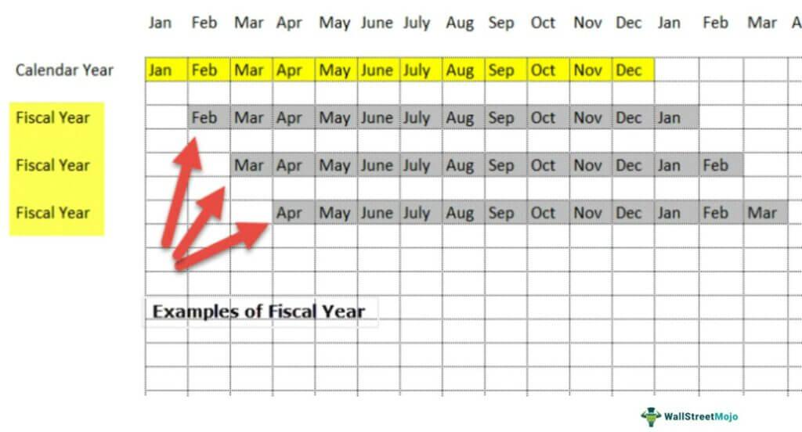

In today's fast-paced financial landscape, understanding the nuances of fiscal and calendar years is crucial for effective financial planning. The rise of algorithmic trading has enriched the way businesses plan financially around these timeframes, offering robust solutions to maximize market performance. This article explores the intersection of calendar year, fiscal year, and financial planning within the framework of algorithmic trading.

A calendar year follows the standard timeline from January 1st to December 31st, which many businesses use for tax purposes. Conversely, a fiscal year can begin on any date and span a 12-month period, allowing organizations to tailor their financial planning according to specific operational needs or industry cycles. The choice between these two can influence strategic financial decisions, like tax management and reporting schedules.



Algorithmic trading, characterized by using complex algorithms to execute trades, is reshaping financial planning approaches. This technology allows businesses to process vast amounts of market data, automating trading strategies that align with financial objectives. Algorithms can identify trends and predict market movements, facilitating the alignment of fiscal strategies to optimize outcomes.

Aligning fiscal strategies with algorithmic innovations offers organizations an opportunity to enhance financial results. By integrating these concepts, businesses can achieve higher efficiency, agility, and precision in their financial operations. Such strategic alignment not only fosters market performance but also ensures that businesses remain competitive in a rapidly evolving financial environment.

## Table of Contents

## Understanding Fiscal Year vs. Calendar Year

A fiscal year is defined as a 12-month period used by companies for accounting and financial statement preparation. This period does not necessarily coincide with the calendar year, which runs from January 1st to December 31st. Instead, a fiscal year can commence on any chosen date, making it a flexible option for businesses that wish to align their accounting periods with specific financial cycles or industry practices.

Understanding the distinction between fiscal and calendar years is crucial for strategic planning. Opting for a fiscal year that differs from the calendar year can offer several advantages. Companies operating in industries with unique financial cycles, such as agriculture or retail, may benefit from aligning their fiscal year with peak seasons or harvest cycles. This alignment can provide a more accurate reflection of their financial performance and help in forecasting and budgeting.

The choice between a fiscal year and a calendar year can have significant implications for tax filing and investor relations. For instance, tax regulations in certain jurisdictions might favor fiscal years that allow companies to defer taxes by strategically timing their revenue recognition. Additionally, aligning reporting periods with industry peers can facilitate better comparative analysis for investors. This alignment can enhance transparency and improve communication with stakeholders, influencing investor confidence and perceived market stability.

Companies must carefully consider the financial, operational, and regulatory factors when deciding their accounting year framework. The decision should reflect the organization’s business cycle, regulatory environment, and strategic objectives to optimize financial outcomes and maintain effective stakeholder engagement.

## Financial Planning: Aligning with Fiscal and Calendar Years

Effective financial planning requires a comprehensive approach that integrates both fiscal and calendar year strategies. Distinguishing between these two frameworks allows businesses to optimize their financial activities in several ways, ensuring efficient budget planning, asset management, and financial forecasting.

At the core of effective financial planning is the synchronization of key business activities with the chosen yearly framework. This includes aligning budget plans to ensure that financial resources are allocated effectively throughout the year. Businesses can implement predictive models to forecast cash flows and budgetary requirements based on historical data. For example, a Python function to forecast cash flow based on historical trends might look like this:

```python
import pandas as pd
from statsmodels.tsa.arima_model import ARIMA

# Load historical cash flow data
data = pd.read_csv('historical_cash_flow.csv')

# Prepare ARIMA model
model = ARIMA(data['cash_flow'], order=(5,1,0))
model_fit = model.fit(disp=0)

# Forecast the next fiscal year
forecast = model_fit.forecast(steps=12)[0]
```

Aligning financial planning activities with fiscal or calendar year specifics can also offer tax advantages and improve cash flow management. Tax benefits often depend on the timing of income and expenses within the fiscal year, which varies between businesses. For instance, organizations with a fiscal year ending in March may optimize tax liabilities by accelerating deductions in the closing months. 

The differentiation between fiscal and calendar years plays an essential role when setting short- and long-term financial objectives. Strategic financial goals should reflect the organization's operational cycles, industry demands, and investment opportunities. Companies can use variance analysis between planned and actual budgets to track their alignment with their yearly framework through detailed reports and adjusted forecasts.

Understanding seasonal trends and market fluctuations is vital when planning financial activities aligned with the chosen yearly structure. Retail businesses, for instance, may experience peaks during holiday seasons, impacting their inventory purchases and sales strategies. Companies should use data analytics to anticipate these trends, adjusting supply chain activities and marketing efforts to maximize financial performance.

By systematically aligning financial planning activities with either the fiscal or calendar year structure, businesses can achieve greater precision in financial management. This strategy enhances adaptability, allowing organizations to respond effectively to tax regulations, market conditions, and internal financial challenges. Through this alignment, companies can enhance their financial stability and position themselves for long-term success.

## Algorithmic Trading: A Game Changer in Financial Planning

Algorithmic trading utilizes computer algorithms to execute trades at optimal times, significantly reducing the necessity for human intervention. These sophisticated algorithms analyze vast amounts of market data in real-time to identify trading opportunities that directly align with financial planning goals. By processing data at speeds and volumes beyond human capacity, algorithms can pinpoint patterns and trends that inform precise trading decisions, thus enhancing the overall effectiveness of financial planning.

Incorporating [algorithmic trading](/wiki/algorithmic-trading) into financial planning enhances decision-making and improves risk management. Algorithms can be programmed to manage complex trading strategies, account for market [volatility](/wiki/volatility-trading-strategies), and adjust trading executions according to pre-set parameters. This adaptability ensures that trades are executed efficiently, minimizing potential losses and maximizing returns within the established financial framework.

Moreover, algorithms can be tailored to align with fiscal or calendar year strategies, providing more precise financial outcomes. For instance, traders can program algorithms to prioritize trades that could yield higher tax advantages within a fiscal year, aligning trading activities with broader financial strategies. This synchronization facilitates optimized asset allocation and cash flow management, enabling businesses to capitalize on financial cycles unique to their fiscal or calendar year structure.

The predictive power of algorithms is another significant benefit, assisting in planning ahead, forecasting market trends, and adjusting strategies as needed. Advanced [machine learning](/wiki/machine-learning) models and statistical methods can forecast potential market movements and anomalies, allowing businesses to develop proactive strategies rather than reactive measures. This predictive capability expands the horizon of financial planning, supporting businesses in maintaining competitiveness in dynamic market environments.

Overall, the integration of algorithmic trading into financial planning provides a strategic advantage through enhanced efficiency, precision, and foresight, not only in executing trades but also in achieving comprehensive financial objectives.

## Integrating Fiscal Strategies with Algorithmic Innovations

Successful financial planning in today's dynamic environment involves harmonizing fiscal strategies with the capabilities of algorithmic trading. The fusion of these elements allows businesses to leverage technology for enhanced strategic decision-making, often resulting in superior financial outcomes.

One of the primary applications of algorithmic trading in fiscal strategy is [backtesting](/wiki/backtesting) financial strategies using historical fiscal or calendar data. Algorithms can analyze vast datasets far more efficiently than traditional methods, facilitating the identification of patterns and trends that may inform future planning. This process involves simulating how a particular strategy would have performed using past data, providing invaluable insights into its potential effectiveness in real-world scenarios. For businesses, this capability translates into a more empirically grounded approach to financial planning, reducing uncertainties and bolstering strategic confidence.

```python
import pandas as pd
import numpy as np

# Sample data processing for backtesting
def backtest_strategy(data, strategy_function):
    initial_capital = 100000  # starting capital
    shares = 0  # initial shares

    for index, row in data.iterrows():
        action = strategy_function(row)
        # Buy signal
        if action == 'buy' and initial_capital >= row['price']:
            shares = initial_capital // row['price']
            initial_capital -= shares * row['price']
        # Sell signal
        elif action == 'sell' and shares > 0:
            initial_capital += shares * row['price']
            shares = 0
    return initial_capital

# Example strategy function
def example_strategy(row):
    if row['indicator'] > 0.5:
        return 'buy'
    elif row['indicator'] < -0.5:
        return 'sell'
    else:
        return 'hold'

# Assuming 'data' is a pandas DataFrame with 'price' and 'indicator' columns
# final_capital = backtest_strategy(data, example_strategy)
```

Real-time data analysis is another crucial area where algorithmic trading can direct fiscal year decisions, such as budget allocation and resource management. Algorithms designed for real-time data ingestion and processing empower companies to swiftly react to market developments, minimizing risks and optimizing asset distribution. By continuously digesting and analyzing incoming data, companies can maintain flexibility, ensuring that fiscal decisions remain aligned with current market conditions.

Custom algorithm development, incorporating specific fiscal timings, can result in more effective trading strategies. These algorithms can account for periodic events, such as tax deadlines or quarterly earnings reports, enabling companies to optimize their strategies around these time-bound events. By forecasting market reactions to fiscal events and incorporating these predictions into trading models, algorithms can help capitalize on temporary market inefficiencies.

Integrating algorithmic trading within fiscal strategies ensures businesses stay agile and responsive to financial shifts. This adaptability is crucial in an era where economic landscapes can fluctuate rapidly due to geopolitical developments, regulatory changes, or technological innovation. Companies that adeptly combine algorithmic insights with traditional fiscal planning are better positioned to navigate the complexities of modern markets, protect their assets, and enhance long-term profitability. 

This strategic integration presents a path toward a more resilient and responsive financial planning model, capable of sustaining competitive advantage amid evolving market demands.

## Case Studies: Success Stories in Algo Trading and Fiscal Planning

Several companies have effectively merged fiscal planning with algorithmic trading to achieve substantial financial success. These cases exemplify how strategic alignment of fiscal strategies with technological advancements can drive both growth and profit.

One notable example is Goldman Sachs, which employs sophisticated algorithms to enhance its trading operations. By integrating algorithmic trading into their fiscal plans, they efficiently optimize their capital allocation. Algorithms allow Goldman Sachs to perform real-time data analysis, aiding in precise decision-making and minimizing risks associated with trading activities. This integration led to a marked increase in trading efficiency and profitability, showcasing the potential of algorithmic trading when aligned with adept fiscal strategy.

Another prominent case is that of Renaissance Technologies, a [hedge fund](/wiki/hedge-fund-trading-strategies) that has consistently outperformed the market by leveraging quantitative models and algorithmic strategies. These models take into account not just market trends but also fiscal cycles and seasonal variations. Through backtesting against historical fiscal and calendar data, Renaissance Technologies identifies patterns and strategies that inform their trading operations. This systematic approach, driven by algorithmic precision, demonstrates how integrating fiscal awareness with technological prowess can lead to superior financial outcomes.

Furthermore, [quantitative trading](/wiki/quantitative-trading) firms like Two Sigma use machine learning algorithms to predict market movements, thus aligning their trading operations with fiscal plans. This predictive capability allows them to allocate resources efficiently, adjust strategies promptly, and optimize tax management, aligning with both fiscal and calendar year requirements. The effectiveness of these strategies is evident in Two Sigma's ability to manage assets worth billions, maintain consistent growth, and drive competitive edge.

These case studies underscore the critical role of continuous innovation and adaptability in finance. They illustrate how businesses can benefit from embracing technological advancements, like algorithmic trading, in sync with strategic fiscal planning. By learning from these success stories, businesses can develop robust strategies that harness the full potential of both fiscal awareness and algorithmic innovation, ultimately aiming to enhance their market position and financial performance.

## Conclusion

The landscape of financial planning is evolving with the integration of algorithmic trading and strategic fiscal year alignment. Understanding the distinct roles of fiscal and calendar years is crucial to effective financial management and planning. Distinguishing these two timeframes allows businesses to optimize their financial operations by selecting a structure that aligns with their industry cycles and market conditions. For instance, retailers might favor a fiscal year that ends after the holiday season to better capture the financial impact of increased sales during that period.

Aligning business strategies with algorithmic innovations can grant companies a competitive edge in the market. Algorithmic trading, which employs sophisticated algorithms to analyze market data and execute trades, offers precision and speed unmatched by traditional methods. By integrating algorithmic trading into their financial frameworks, companies can enhance their decision-making processes, improve risk management, and achieve better financial outcomes.

Businesses must continuously adapt and innovate in financial planning to harness the full potential of algorithmic trading. This may involve developing custom algorithms tailored to their unique financial calendars or fiscal strategies and leveraging real-time data analysis for agility and responsiveness. For example, a Python script could be utilized to backtest trading strategies against historical fiscal data, providing insights into optimal approaches for future schemes.

Looking towards the future, those who strategically blend these elements will likely lead in financial performance and market leadership. Companies that effectively integrate algorithmic innovations with fiscal planning will be better equipped to navigate market volatility and harness emerging opportunities, securing a sustainable competitive advantage.

## References & Further Reading

[1]: ["Advances in Financial Machine Learning"](https://www.amazon.com/Advances-Financial-Machine-Learning-Marcos/dp/1119482089) by Marcos Lopez de Prado

[2]: Aronson, D. [Evidence-Based Technical Analysis: Applying the Scientific Method and Statistical Inference to Trading Signals](https://www.amazon.com/Evidence-Based-Technical-Analysis-Scientific-Statistical/dp/0470008741).

[3]: Jansen, S. [Machine Learning for Algorithmic Trading](https://github.com/stefan-jansen/machine-learning-for-trading).

[4]: Chan, E. P., ["Quantitative Trading: How to Build Your Own Algorithmic Trading Business"](https://github.com/ftvision/quant_trading_echan_book).

[5]: Bergstra, J., Bardenet, R., Bengio, Y., & Kégl, B. (2011). ["Algorithms for Hyper-Parameter Optimization."](https://proceedings.neurips.cc/paper/2011/file/86e8f7ab32cfd12577bc2619bc635690-Paper.pdf) Advances in Neural Information Processing Systems 24.