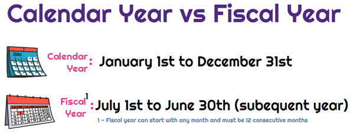

## Table of Contents

## What is a fiscal year?

A fiscal year is a 12-month period that a company, government, or organization uses for accounting purposes and preparing financial statements. It doesn't always start on January 1 and end on December 31 like a calendar year. Instead, it can begin on any date and is often chosen to match the natural business cycle of the organization.

For example, many retail businesses choose to start their fiscal year on February 1, after the busy holiday season. This allows them to better track their financial performance and plan for the next year. Governments might also use a different fiscal year, like starting on October 1, to align with their budgeting and legislative processes.

## What is a calendar year?

A calendar year is a period of 12 months that starts on January 1 and ends on December 31. It follows the Gregorian calendar, which is the most widely used calendar system in the world. People use the calendar year to keep track of time, plan events, and celebrate holidays.

In everyday life, the calendar year helps us know when to go back to school, when to take vacations, and when to celebrate special occasions like birthdays and New Year's Eve. Businesses and governments also use the calendar year for some of their planning and reporting, but they might use a different time period called a fiscal year for their financial accounting.

## How does a fiscal year differ from a calendar year?

A fiscal year is a 12-month period that a company or government uses for its financial accounting and planning. It can start on any date, not just January 1. For example, a business might choose to start its fiscal year on July 1 if that fits better with its business cycle. The main goal of a fiscal year is to help an organization keep track of its money and make plans for the future in a way that makes sense for them.

A calendar year, on the other hand, always starts on January 1 and ends on December 31. It follows the Gregorian calendar, which is used by most people around the world. We use the calendar year to plan our daily lives, like knowing when holidays are or when school starts. While a fiscal year is important for businesses and governments to manage their finances, the calendar year is important for everyone to keep track of time and plan personal events.

## Why do some organizations use a fiscal year instead of a calendar year?

Some organizations use a fiscal year instead of a calendar year because it helps them better manage their money and plan for the future. For example, a retail store might choose to start its fiscal year after the busy holiday season. This way, they can see how much money they made during the holidays and use that information to make better plans for the next year.

Using a fiscal year that matches the natural cycle of the business can also make it easier to compare financial results from one year to the next. If a company's busy time is in the summer, starting the fiscal year in the summer can help them see how they are doing year after year during that important time. This helps businesses make smarter decisions and plan better for the future.

## Can a fiscal year start on any date, or are there specific dates commonly used?

A fiscal year can start on any date, but some dates are more commonly used than others. For example, many businesses choose to start their fiscal year on January 1, just like the calendar year. This makes it easier to compare their financial results with other companies and with the calendar year.

However, other common starting dates for fiscal years include July 1 and October 1. Governments in the United States often start their fiscal year on October 1. Retail companies might start their fiscal year on February 1, after the holiday shopping season. These dates are chosen because they fit better with the natural business cycles of these organizations, making it easier for them to plan and manage their finances.

## How does the choice between fiscal and calendar year affect financial reporting?

The choice between a fiscal year and a calendar year can change how a company reports its money. If a company uses a fiscal year, it might start on a different date than January 1. This can help the company see how much money it makes during its busiest times. For example, a store might start its fiscal year after the holiday season to see how much it made from holiday shopping. This way, the company can compare its money from one year to the next more easily and make better plans.

Using a calendar year, which always starts on January 1, can make it easier for people outside the company to understand the financial reports. Many people are used to thinking in terms of the calendar year, so it can be simpler to compare a company's results with other companies or with what people expect. But if a company's busy time doesn't match the calendar year, using a fiscal year might give a clearer picture of how the business is doing.

## What are the tax implications of using a fiscal year versus a calendar year?

Using a fiscal year or a calendar year can affect how a company pays taxes. If a company uses a fiscal year, it might pay taxes on a different schedule than if it used a calendar year. For example, if a company's fiscal year ends on June 30, it would file its taxes in the summer instead of in April like most companies that use the calendar year. This can help the company manage its cash flow better, especially if its busy time is not in the last part of the calendar year.

The choice between a fiscal year and a calendar year can also affect how much tax a company pays in a given year. If a company's profits are higher at certain times of the year, using a fiscal year that matches those times can help spread out the tax payments more evenly. This can be helpful for planning and budgeting. However, it's important for companies to follow the tax rules in their country, as some places might have specific rules about when a company can use a fiscal year instead of a calendar year.

## How do businesses align their internal operations with their chosen fiscal year?

Businesses align their internal operations with their chosen fiscal year by planning their budgeting and financial reporting around the start and end dates of the fiscal year. For example, if a company's fiscal year starts on July 1, they will set their budget at the beginning of July and review their financial performance at the end of June the following year. This helps the company see how much money they are making during their busiest times and plan for the future based on these numbers.

To make this work, businesses often adjust their internal processes like payroll, inventory management, and sales tracking to match the fiscal year. If a company's busy time is in the summer, they might start their fiscal year in the summer to better track their summer earnings. By doing this, the company can compare their financial results from one year to the next more easily and make better decisions about where to spend money and how to grow the business.

## What are the global variations in fiscal year practices?

Different countries have different ways of setting their fiscal years. In the United States, the federal government's fiscal year starts on October 1 and ends on September 30. Many businesses in the U.S. also choose to start their fiscal year on January 1, which matches the calendar year. But some businesses, like retailers, might start their fiscal year on February 1 to better match their busy holiday season.

In other parts of the world, the practices can be different. For example, in the United Kingdom, the government's fiscal year starts on April 6 and ends on April 5 the following year. In Japan, the fiscal year for both the government and many businesses starts on April 1 and ends on March 31. These different start dates are chosen to fit with the specific needs and traditions of each country, helping them manage their money and plan for the future in a way that makes sense for them.

## How does the use of a fiscal year impact budget planning and financial analysis?

Using a fiscal year helps businesses and governments plan their budgets and analyze their finances better. When a company chooses a fiscal year that matches its busy times, it can see how much money it makes during those times. This helps the company make a budget that fits with its real earnings. For example, a store might start its fiscal year after the holiday season to see how much it made from holiday shopping. This way, the company can plan its spending and saving for the next year based on what it knows about its money.

Financial analysis also becomes easier with a fiscal year that matches the business cycle. Companies can compare their money from one year to the next more easily if their fiscal year starts and ends at the same time every year. This helps them see if they are doing better or worse than before. For example, if a company's busy time is in the summer, starting the fiscal year in the summer can help them see how they are doing year after year during that important time. This makes it easier for the company to make smart decisions about where to spend money and how to grow the business.

## What are the considerations for changing from a calendar year to a fiscal year?

When a business thinks about changing from a calendar year to a fiscal year, it needs to think about how it will affect its money and planning. A fiscal year can help a business see how much money it makes during its busiest times. For example, a store might want to start its fiscal year after the holiday season to see how much it made from holiday shopping. This can help the store plan its budget and spending better. But changing the fiscal year can also make things more complicated. The business will need to change when it files taxes, which might mean paying taxes at a different time of the year. It might also need to change how it keeps track of money and reports its financial results.

Another thing to think about is how the change will affect people inside and outside the business. Employees might need to get used to new dates for budgeting and planning. People who invest in the business or lend it money might find it harder to compare the business's financial results with other businesses that use the calendar year. The business might also need to talk to the tax office to make sure it can change its fiscal year without breaking any rules. So, while a fiscal year can help a business plan better, it's important to think about all these things before making a change.

## How do fiscal years affect international business operations and compliance?

When businesses work in different countries, using different fiscal years can make things tricky. Each country might have its own rules about when a fiscal year should start and end. For example, the U.S. government's fiscal year starts on October 1, while Japan's starts on April 1. A business that works in both places needs to keep track of these different dates. This can make it harder to plan and manage money across the whole company. The business might need to use different fiscal years for different parts of its operations to follow the rules in each country.

Dealing with different fiscal years can also affect how a business reports its money and follows the law. If a company uses one fiscal year in one country and a different one in another, it might need to file taxes at different times in each place. This can make things more complicated and might even lead to mistakes if the company isn't careful. To make sure they are following the rules, businesses might need to hire experts who understand the tax laws in each country. This can help them keep everything in order and avoid any problems with the law.

## References & Further Reading

[1]: ["Advances in Financial Machine Learning"](https://www.amazon.com/Advances-Financial-Machine-Learning-Marcos/dp/1119482089) by Marcos Lopez de Prado

[2]: Aronson, D. [Evidence-Based Technical Analysis: Applying the Scientific Method and Statistical Inference to Trading Signals](https://www.amazon.com/Evidence-Based-Technical-Analysis-Scientific-Statistical/dp/0470008741).

[3]: Jansen, S. [Machine Learning for Algorithmic Trading](https://github.com/stefan-jansen/machine-learning-for-trading).

[4]: Chan, E. P., ["Quantitative Trading: How to Build Your Own Algorithmic Trading Business"](https://github.com/ftvision/quant_trading_echan_book).

[5]: Bergstra, J., Bardenet, R., Bengio, Y., & Kégl, B. (2011). ["Algorithms for Hyper-Parameter Optimization."](https://proceedings.neurips.cc/paper/2011/file/86e8f7ab32cfd12577bc2619bc635690-Paper.pdf) Advances in Neural Information Processing Systems 24.