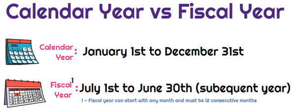

Understanding the significance of financial reporting is crucial for entities aiming to track performance and comply with regulations. Financial reports provide a structured way to assess a company’s financial health, offering insights necessary for effective decision-making and strategic planning. As businesses grow and diversify, traditional methods of reporting, forecasting, and trading evolve, demanding more sophisticated approaches to manage complexities associated with these processes.

The relationship between calendar year-end and fiscal year-end reporting plays a pivotal role in these methods. Both periods act as critical benchmarks for financial assessments. The calendar year is the universally recognized timeframe stretching from January 1 to December 31. In contrast, a fiscal year may vary depending on an organization’s specific operational needs, potentially ending at any quarter. This flexibility allows organizations to align their reporting periods more closely with their unique business cycles, optimizing financial analysis and operational insights.



The convergence of technology and finance has ushered in new dynamics, notably through algorithmic trading. Algorithmic trading employs computer algorithms to conduct trading operations with remarkable precision and speed, leveraging vast datasets to identify market trends. This integration of technology complicates traditional financial strategies, especially around year-end reporting. Financial reports released during these periods often result in increased market volatility, which algorithmic trading can leverage to optimize outcomes.

Modern financial planning now requires understanding how these intertwined elements affect an organization's strategy and operations. By accurately interpreting financial reports and utilizing advanced technological tools, businesses can enhance their financial strategies and maintain competitive advantages in fast-changing market conditions. As technology and finance continue to intersect, developing robust strategic foresight becomes indispensable for capitalizing on emerging opportunities while ensuring compliance and performance tracking.

## Table of Contents

## Calendar Year-End vs. Fiscal Year-End

Calendar year-end is a standardized accounting period used by many organizations, covering January 1 through December 31. This period aligns with the Gregorian calendar, which is globally recognized, simplifying reporting and taxation processes on an international scale. It offers a symmetrical timeline for financial assessment and planning, which is particularly beneficial for entities engaged in comparative analysis with globally oriented peers.

In contrast, fiscal year-end varies across organizations, terminating at a particular quarter that best aligns with their operational calendars. For instance, a company might prefer a fiscal year ending March 31 or September 30 based on industry-specific cycles or strategic planning motives. This flexibility allows companies to conclude their financial reporting in conjunction with internal schedules, such as production cycles in manufacturing or seasonal sales peaks in retail.

Both calendar year-end and fiscal year-end are pivotal reference points for financial activities. They influence budgeting, tax filing, and interactions with stakeholders like investors and regulatory bodies. Choosing the appropriate reporting period is critical as it can affect how a company is perceived in terms of stability and readiness to handle financial obligations.

Differentiating these periods illuminates certain corporate strategies, such as aligning the fiscal year with low operational periods to lessen the burden during busy seasons or exploiting tax benefits available in specific regions. For example, a retail company might end its fiscal year on January 31, post the holiday sales peak, facilitating comprehensive post-holiday performance analysis.

Various renowned companies with different fiscal year-end strategies highlight the flexibility and tactical advantage such periods provide. Apple Inc. concludes its fiscal year at the end of September, allowing the company to integrate major product launch performances into its annual reports. Similarly, the U.S. federal government's fiscal year runs from October 1 to September 30, aligning with Congressional budget processes.

Such strategic decisions can yield operational efficiencies and enhance financial clarity, providing a tailored fit to company-specific operational rhythms and optimizing tax implications tailored to jurisdictional regulations. Understanding the nuances of these periods aids stakeholders in anticipating corporate financial strategies and directives.

## Financial Reporting and Its Importance

Financial reporting plays a vital role in the structured communication of financial data between companies and their stakeholders, ensuring transparency and facilitating informed decision-making. Key financial reports such as balance sheets, income statements, and cash flow statements serve as fundamental tools for organizations to convey their financial health.

The balance sheet provides a snapshot of a company's financial position at a specific point in time, detailing assets, liabilities, and shareholders’ equity. It adheres to the accounting equation:

$$
\text{Assets} = \text{Liabilities} + \text{Shareholders' Equity}
$$

This equation ensures that the balance sheet remains balanced and provides insight into the company's ability to manage its obligations and resources effectively.

The income statement outlines a company’s financial performance over a particular period, showcasing revenue, expenses, and profits. It is essential for assessing profitability and operational efficiency. The core formula used in the income statement is:

$$
\text{Net Income} = \text{Revenue} - \text{Expenses}
$$

Meanwhile, the cash flow statement traces the flow of cash in and out of the business, segmented into operations, investing, and financing activities. This statement is key for understanding the company’s [liquidity](/wiki/liquidity-risk-premium) and long-term solvency. The operating cash flow can be calculated as follows:

$$
\text{Operating Cash Flow} = \text{Net Income} + \text{Non-Cash Expenses} - \text{Increase in Working Capital}
$$

Year-end financial statements, integral to this process, summarize a company's annual performance. These reports provide stakeholders with a comprehensive understanding of the company’s profitability and financial stance over the fiscal year. They serve as a baseline for future business planning and investor evaluations, helping to project trends and forecast future growth.

Accurate and timely financial reporting is fundamental in mitigating risks associated with regulatory non-compliance. Errors or discrepancies in financial reporting can lead to penalties, loss of reputation, and financial losses. Therefore, maintaining precise records reinforces a company's credibility and trustworthiness with investors, regulators, and the market at large.

## Algorithmic Trading: A Game Changer

Algorithmic trading employs sophisticated computer algorithms to execute trading orders with optimal precision and timing. These algorithms can process vast datasets and employ computational power to identify intricate market patterns, significantly enhancing decision-making and efficiency. By implementing complex mathematical models and statistical techniques, [algorithmic trading](/wiki/algorithmic-trading) systems continuously analyze market data to spot opportunities that might be missed by human traders.

The automation inherent in algorithmic trading aligns seamlessly with modern financial strategies, leveraging technology to achieve faster and more accurate trading results. It systematically removes emotional and manual elements from trading decisions, leading to more consistent and reliable outcomes. The computational capabilities of these algorithms allow traders to operate at speeds companies cannot match manually, executing trades in fractions of a second.

Algorithmic trading has transformed traditional trading methods, providing a competitive edge in volatile markets. It facilitates high-frequency trading ([HFT](/wiki/high-frequency-trading-strategies)), where firms can make large volumes of trades every second, capitalizing on minute price discrepancies. Such strategies are impossible without automation, reinforcing the strategic advantage conferred by algorithmic systems.

A basic example of an algorithmic trading strategy could be a simple moving average crossover, where a short-term moving average crosses above a long-term moving average, signalling a buy order, and vice versa for a sell order. In Python, this could be implemented using libraries such as pandas and numpy:

```python
import pandas as pd
import numpy as np

# Generate sample data
np.random.seed(0)
dates = pd.date_range(start='2022-01-01', periods=100)
prices = np.random.normal(loc=100, scale=10, size=len(dates))
df = pd.DataFrame(data={'Date': dates, 'Price': prices})

# Calculate moving averages
df['Short_MA'] = df['Price'].rolling(window=5).mean()
df['Long_MA'] = df['Price'].rolling(window=20).mean()

# Define a simple trading signal
def trading_signal(row):
    if row['Short_MA'] > row['Long_MA']:
        return 'Buy'
    elif row['Short_MA'] < row['Long_MA']:
        return 'Sell'
    else:
        return 'Hold'

# Apply the trading signal
df['Signal'] = df.apply(trading_signal, axis=1)

print(df[['Date', 'Price', 'Short_MA', 'Long_MA', 'Signal']].tail())
```

By implementing these automated techniques, algorithmic trading has made markets more efficient and liquid, fostering tighter spreads and improved price discovery, which benefits all market participants. However, it also necessitates robust risk management strategies to mitigate potential system failures or algorithmic errors. With algorithmic trading, financial markets are rapidly evolving, presenting both opportunities and challenges for traders and institutions.

## Impact of Year-End Financial Reporting on Algo Trading

Year-end financial data has a profound impact on algorithmic trading strategies. The conclusion of a fiscal period prompts companies to release financial reports, serving as key indicators of their annual performance. These reports can include balance sheets, income statements, and cash flow statements, which are pivotal for assessing a company’s financial health. Given that these documents can substantially affect investor sentiment and market dynamics, they often lead to increased market [volatility](/wiki/volatility-trading-strategies).

Algorithmic traders leverage the precise fluctuations that accompany these financial disclosures. By designing algorithms to respond to specific patterns identified in financial reports, traders aim to capitalize on short-term opportunities presented by the volatility. For instance, if a company reports higher-than-expected earnings, this positive indication might trigger an algorithm to buy shares rapidly, anticipating a rise in stock price.

For companies employing fiscal year-end reporting, the strategic alignment of trading algorithms with annual performance insights becomes crucial. A fiscal year-end that diverges from the calendar year can offer unique insights into market periods less influenced by typical year-end market activities. This strategic timing allows for the assimilation of performance data into predictive models, refining trading strategies accordingly.

The ability to interpret financial data and adapt trading strategies has become a cornerstone in algorithmic trading. Python, a commonly used language in this domain, offers libraries such as `pandas` for data manipulation and `numpy` for numerical computations, allowing developers to build sophisticated models that predict potential market movements.

```python
import pandas as pd
import numpy as np

# Example: Loading a dataset of financial reports
data = pd.read_csv('financial_reports.csv')

# Analyzing earnings surprises
data['Earnings Surprise'] = data['Actual Earnings'] - data['Expected Earnings']

# Triggering buy/sell based on earnings surprise
def trading_signal(row):
    if row['Earnings Surprise'] > 0:
        return 'buy'
    else:
        return 'sell'

data['Signal'] = data.apply(trading_signal, axis=1)

# Displaying the first few rows to understand trading decisions
print(data.head())
```

In understanding these dynamics, businesses can tailor their algorithmic models to harness fluctuations and foster more informed trading decisions. By integrating financial reports into algorithmic strategies, companies refine their trading models, enhancing their ability to capitalize on market movements effectively. Hence, the synchronization of financial reporting and algorithmic trading models becomes an advantageous exercise in maximizing market potentials.

## Strategic Considerations for Businesses

Selecting an appropriate fiscal year-end is a key decision for businesses, impacting cash flow optimization and alignment with operational cycles. The fiscal year-end is not just a regulatory necessity but a strategic choice that can provide a company with competitive advantages when carefully considered in the broader context of financial strategy.

Firstly, fiscal decisions must be integrated with broader financial strategies such as tax planning and investor communication. For instance, by choosing a fiscal year-end that coincides with low revenue months, a business might manage its tax liabilities more effectively. Strategies such as deferring income or accelerating expenses near a fiscal year-end can also influence taxable income in favorable ways. Clear and strategic communication with investors is crucial, as it builds confidence and trust. Transparent financial reporting at year-end can significantly enhance investor relations and market reputation.

Furthermore, aligning financial reporting with trading tactics can enhance a business's financial performance and market position. Given the importance of algorithmic trading, understanding the interplay between reporting and trading becomes vital. Algorithms that incorporate year-end data can provide insights into market trends and volatilities that might be unknown otherwise. For example, utilizing key financial indicators from reports, traders can fine-tune their algorithms to respond to typical market behaviors following fiscal year-end disclosures.

Moreover, the role of financial advisors and technology solutions cannot be overstated. Engaging with financial experts can yield valuable insights into optimizing the financial year-end. These professionals can provide advice on regulatory changes, potential tax implications, and market conditions that influence strategic decisions. Leveraging advanced technology solutions, such as financial software and [machine learning](/wiki/machine-learning) algorithms, can further refine these strategies. Technology facilitates the processing of substantial datasets and the simulation of various scenarios, leading to more informed decision-making.

In conclusion, the strategic selection of a fiscal year-end is central to effective financial planning. It requires an amalgamation of insightful tax planning, strategic investor communication, and integration with advanced trading methodologies. By consulting with financial advisors and harnessing technological advancements, businesses can devise nuanced strategies that boost their market positioning and financial robustness.

## The Future of Financial Reporting and Algo Trading

The evolution of technology in finance is significantly enhancing the speed and accuracy of financial reporting and trading mechanisms. With the integration of AI and machine learning, algorithmic trading is expected to undergo substantial transformations, delivering improved efficiency and the generation of insights at unprecedented levels. These technologies allow for the analysis of massive datasets in real time, identifying patterns and forecasting market movements with precision, thus offering competitive advantages in trading operations.

AI-driven algorithms can adapt to changing market conditions, making trading decisions with minimal human intervention. Machine learning models can continuously learn from new data, refining their predictive capabilities to optimize trading strategies. For instance, [reinforcement learning](/wiki/reinforcement-learning), a subset of machine learning, can be employed to develop trading algorithms that maximize expected returns by interacting with dynamic market environments.

As the regulatory landscape continues to evolve, businesses must remain vigilant about compliance requirements while making the most of technological advancements. Regulatory bodies worldwide are starting to address the implications of AI and machine learning in finance, necessitating businesses to adapt their strategies to align with new rules.

Future trends are likely to focus on the integration of sustainable financial practices within advanced trading and reporting frameworks. As environmental, social, and governance ([ESG](/wiki/esg-investing)) considerations gain prominence, financial technologies must incorporate these factors into their analysis. This integration will necessitate the development of new metrics and models to assess ESG performance, influencing trading strategies and financial reporting.

Python, with its extensive libraries such as pandas for data manipulation and scikit-learn for machine learning, provides a robust environment for developing and testing such trading algorithms. Below is a simple example of a Python script that demonstrates the use of machine learning for predicting stock price movements:

```python
import pandas as pd
from sklearn.model_selection import train_test_split
from sklearn.ensemble import RandomForestClassifier
from sklearn.metrics import accuracy_score

# Load dataset
data = pd.read_csv('stock_data.csv')

# Feature selection
features = ['open', 'high', 'low', 'volume']
X = data[features]
y = data['price_movement']

# Split dataset
X_train, X_test, y_train, y_test = train_test_split(X, y, test_size=0.2, random_state=42)

# Train model
clf = RandomForestClassifier(n_estimators=100, random_state=42)
clf.fit(X_train, y_train)

# Predict and evaluate
y_pred = clf.predict(X_test)
accuracy = accuracy_score(y_test, y_pred)
print(f'Accuracy: {accuracy:.2f}')
```

This script trains a Random Forest classifier on historical stock data to predict future price movements, showcasing the potential of machine learning in developing sophisticated trading strategies.

In conclusion, the future of financial reporting and algorithmic trading is set to be shaped by rapid technological advancements and the increasing emphasis on sustainable practices. As businesses navigate these changes, they must strategically balance compliance with innovation to maintain a competitive edge in the financial markets.

## Conclusion

The convergence of fiscal planning, financial reporting, and algorithmic trading emphasizes the need for businesses to exercise comprehensive strategic foresight. Effectively managing the relationship between these elements can substantially enhance financial stability and operational success. Understanding year-end financial cycles is crucial, as it provides the groundwork for making informed decisions that align with market dynamics and investor expectations. The ability to interpret financial data accurately during these cycles enables businesses to anticipate market movements, thereby crafting robust strategies that optimize performance.

Innovation in financial technologies continues to evolve the landscape of fiscal year strategies. The integration of [artificial intelligence](/wiki/ai-artificial-intelligence) and machine learning into financial systems not only fosters efficiency but also provides deeper insights into market behavior and trends. This transformation is crucial for firms looking to stay competitive and responsive in rapidly changing economic environments. For instance, machine learning algorithms can be developed to predict market responses to financial reporting, offering strategic foresight that can guide investment decisions.

```python
import numpy as np
from sklearn.linear_model import LinearRegression

# Example of a simple linear regression model to predict stock market response to financial reporting

# Sample data: x = company earnings, y = stock price change
x = np.array([[2.5], [3.0], [3.5], [4.0], [4.5]])
y = np.array([0.2, 0.4, 0.5, 0.6, 0.8])

# create and train the model
model = LinearRegression().fit(x, y)

# Predict stock price change for a new earnings report
new_earnings = np.array([[5.0]])
predicted_change = model.predict(new_earnings)

print(f"Predicted stock price change: {predicted_change}")
```

Investments in automation can streamline operations, allowing for the strategic alignment of fiscal policies with business objectives. This alignment ensures that companies are not only compliant with regulatory requirements but are also leveraging financial strategies to maximize growth and profitability. As markets become increasingly competitive, the proactive adoption of technology and comprehensive fiscal strategies will be instrumental in enabling businesses to maintain a competitive edge. Such investments can result in significant long-term value creation, positioning companies favorably as they navigate future financial landscapes.

## References & Further Reading

[1]: Bergstra, J., Bardenet, R., Bengio, Y., & Kégl, B. (2011). ["Algorithms for Hyper-Parameter Optimization."](https://dl.acm.org/doi/10.5555/2986459.2986743) Advances in Neural Information Processing Systems 24.

[2]: ["Advances in Financial Machine Learning"](https://www.amazon.com/Advances-Financial-Machine-Learning-Marcos/dp/1119482089) by Marcos Lopez de Prado

[3]: ["Evidence-Based Technical Analysis: Applying the Scientific Method and Statistical Inference to Trading Signals"](https://www.amazon.com/Evidence-Based-Technical-Analysis-Scientific-Statistical/dp/0470008741) by David Aronson

[4]: ["Machine Learning for Algorithmic Trading"](https://github.com/PacktPublishing/Machine-Learning-for-Algorithmic-Trading-Second-Edition) by Stefan Jansen

[5]: ["Quantitative Trading: How to Build Your Own Algorithmic Trading Business"](https://books.google.com/books/about/Quantitative_Trading.html?id=j70yEAAAQBAJ) by Ernest P. Chan