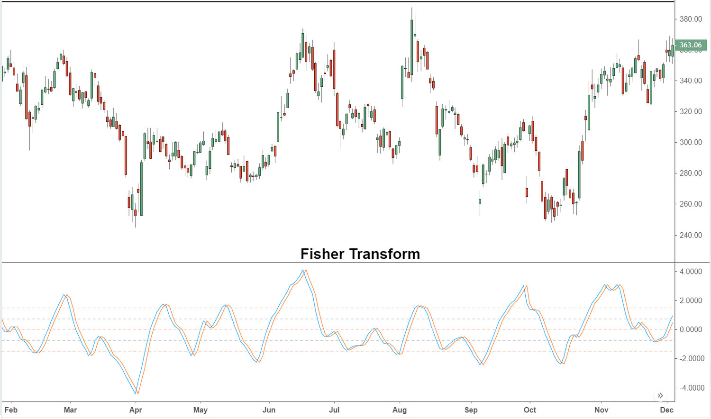

The Fisher Transform Indicator, a creation of John F. Ehlers, stands as a notable tool in the field of technical analysis, serving to transform price data into a Gaussian normal distribution. This transformation is pivotal for traders as it highlights turning points in asset prices, thereby facilitating the identification of trends and reversals. As a result, the Fisher Transform Indicator is not merely a tool for analyzing current market conditions but also a crucial component in constructing algorithmic trading strategies. These strategies benefit from the indicator's ability to provide efficient and effective decision-making capabilities.

The upcoming sections of this article will provide a comprehensive exploration of the Fisher Transform Indicator. This includes an examination of its mathematical formula and calculation methods, which are foundational for its application in various trading scenarios. The benefits of the Fisher Transform, alongside its limitations, will also be discussed. This dual perspective ensures traders are aware of both the strengths and potential pitfalls when utilizing the indicator. Furthermore, a comparison with other technical indicators, such as Bollinger Bands, will be presented to clarify its unique advantages and contexts of application. Through this nuanced overview, readers will gain insights into optimizing their trading strategies using the Fisher Transform Indicator.



## Table of Contents

## Understanding the Fisher Transform Indicator

The Fisher Transform Indicator is a technical analysis tool that transforms asset prices to approximate a Gaussian normal distribution. This transformation is beneficial for traders, as it emphasizes extreme price movements, making potential market reversals more discernible. Unlike many traditional indicators, which tend to lag as they are based on historical data, the Fisher Transform provides leading signals, giving traders a proactive edge in decision-making.

This indicator is particularly valuable in volatile markets, where the identification of turning points is crucial. By highlighting extremes in price movement, traders can better anticipate shifts in market direction, enabling them to execute trades with improved timing.

Originally developed by John F. Ehlers for commodity trading, the Fisher Transform has expanded its utility across a diverse range of trading instruments. Its universal application stems from its ability to enhance the clarity of trends and reversals in a wide array of market conditions.

The Fisher Transform takes raw price data and, through a mathematical transformation, makes price extremes more apparent. This feature is advantageous for traders looking to capitalize on abrupt market shifts. The transformation's focus on leading rather than lagging signals provides a competitive advantage by allowing traders to position themselves ahead of market movements, thereby improving their strategic execution.

## Formula and Calculation

The Fisher Transform indicator employs a mathematical formula to convert asset prices into values that resemble a Gaussian normal distribution. This transformation is crucial as it sharpens the identification of extreme price movements, thereby aiding traders in recognizing potential market reversals ahead of time. The formula for the Fisher Transform is expressed as:

$$
\text{Fisher Transform} = 0.5 \times \ln\left(\frac{1 + X}{1 - X}\right)
$$

In this context, $X$ refers to the normalized price, restricted within the range of -1 to 1. This normalization is essential to ensure that the transformation appropriately scales the price data to match the expected input of the formula.

### Calculation Steps

1. **Select a Lookback Period**: Typically, a period such as 9 days is chosen. This period serves as a window over which the highest and lowest prices are determined for normalization.

2. **Normalize Prices**: For each period, calculate the normalized price $X$ using the formula:

   \[ X = \frac{2 \times (\text{Price} - \text{Low})}{\text{High} - \text{Low}} - 1
$$

   Here, "Price" is the current asset price, "Low" is the lowest price, and "High" is the highest price within the lookback period. This step scales the prices to the range of -1 to 1.

3. **Apply the Fisher Transform Formula**: With the normalized price $X$, compute the Fisher Transform for the current period using the earlier stated formula.

4. **Iterate for Each New Period**: The process of normalization and transformation must be repeated as new prices become available, which ensures that the Fisher Transform indicator remains responsive to real-time market data.

### Continuous Adjustments

This indicator adapts dynamically, recalibrating with each new data point, which helps maintain its effectiveness in capturing market shifts. This means traders and algorithmic systems can swiftly act on emerging price trends and potential reversals.

### Mathematical Foundation

Thorough comprehension of the underlying calculations is imperative when implementing the Fisher Transform in trading algorithms. Proper setup and execution mean the difference between actionable insights and misleading signals. By incorporating the Fisher Transform into algorithmic scripts, traders can automate the detection of extreme price movements, further enhancing their trading strategies. Here is a simple Python example illustrating its implementation:

```python
import numpy as np

def fisher_transform(prices, lookback_period=9):
    fishers = np.zeros(len(prices))
    for i in range(lookback_period, len(prices)):
        high = np.max(prices[i - lookback_period:i])
        low = np.min(prices[i - lookback_period:i])
        x = 0.5 * (prices[i] - low) / (high - low) - 0.5
        x = max(min(x, 0.99), -0.99)  # Prevent domain error in log function
        fishers[i] = 0.5 * np.log((1 + x) / (1 - x))
    return fishers

# Example use:
prices = [100, 102, 104, 103, 101, 105, 107, 110, 108, 107, 109]
fisher_values = fisher_transform(prices)
print(fisher_values)
```

This code calculates the Fisher Transform values over a series of asset prices, allowing traders to monitor the potential reversal points signaled by the indicator.

## How to Apply the Fisher Transform Indicator in Trading

The Fisher Transform Indicator is recognized for its flexibility and applicability across various trading assets and timeframes, making it a valuable tool for traders aiming to identify market reversals. One of its primary uses involves detecting extreme values that often precede potential reversals. This is crucial, as traders look for points where the price may change direction, confirmed by a shift in the indicator's trajectory.

To enhance the reliability of signals generated by the Fisher Transform, it is commonly used in conjunction with a signal line, such as a moving average. This additional layer of analysis helps refine trade signals and provide clearer entry and [exit](/wiki/exit-strategy) points. The combination of these tools reduces the noise and potential false signals often associated with volatile market conditions.

Furthermore, integrating the Fisher Transform with other technical indicators like the Relative Strength Index (RSI) or the Moving Average Convergence Divergence (MACD) can significantly boost prediction accuracy. Both RSI and MACD serve as valuable complements, offering insights into market [momentum](/wiki/momentum) and trend direction, which are essential for verifying the signals provided by the Fisher Transform.

In [algorithmic trading](/wiki/algorithmic-trading), the Fisher Transform's utility is further amplified through its ability to automatically recognize entry and exit points based on historical extremes. This feature is particularly beneficial, as it allows traders to embed the Fisher Transform in trading algorithms that systematically respond to pre-defined signals without human intervention, potentially increasing efficiency and returns.

The integration of the Fisher Transform into a trading strategy may involve the following basic steps in a Python algorithm:

```python
import numpy as np
import pandas as pd

def fisher_transform(data, period=10):
    max_price = data['High'].rolling(window=period).max()
    min_price = data['Low'].rolling(window=period).min()
    price_range = max_price - min_price
    price_range[price_range == 0] = 1   # Avoid division by zero
    normalized_price = 2 * ((data['Close'] - min_price) / price_range - 0.5)

    fish_transform = 0.5 * np.log((1 + normalized_price) / (1 - normalized_price))
    fish_transform = fish_transform.rolling(window=period).mean()  # Optional smoothing

    return fish_transform

# Example usage:
data = pd.DataFrame({
    'High': [120, 125, 130, 128, 127, 132, 131, 129], 
    'Low': [118, 120, 126, 124, 123, 128, 125, 122], 
    'Close': [119, 123, 128, 126, 125, 130, 127, 124]
})

data['Fisher'] = fisher_transform(data)
```

In this Python example, the Fisher Transform is calculated over a specified period using high, low, and closing prices. The resulting values can then guide algorithmic traders in identifying potential market reversal points effectively.

## Comparing Fisher Transform with Bollinger Bands

Both the Fisher Transform and Bollinger Bands are technical indicators that traders use to analyze price distributions, yet they approach the task differently.

Bollinger Bands are a [volatility](/wiki/volatility-trading-strategies) indicator invented by John Bollinger. They consist of a middle band (a simple moving average), and two outer bands which are the standard deviations of the price from the mean. These bands help identify overbought and oversold conditions by indicating when prices are unusually high or low relative to a moving average. By using standard deviations, Bollinger Bands reflect a normal distribution, assuming the price data has this statistical property. The bands expand and contract based on market volatility, providing traders with visual cues about potential price movements.

In contrast, the Fisher Transform is a mathematical method that transforms asset price data to resemble a Gaussian normal distribution. This transformation accentuates extreme price movements, making potential market reversals more apparent. The Fisher Transform focuses on turning price [statistics](/wiki/bayesian-statistics) into a distribution resembling a bell curve, which enhances the detection of turning points. As a result, it acts as a leading indicator, providing signals ahead of potential trend reversals.

While Bollinger Bands are directly overlaid on price charts, visually encapsulating price movements within their bounds, the Fisher Transform operates as a separate chart indicator. Typically, it appears below the main price chart, and its signals are interpreted by observing crossings above or below certain thresholds or assessing directional changes.

The choice between these indicators largely depends on a trader's strategy. Bollinger Bands are preferable for volatility-based tactics because they visually represent price movement relative to standard deviation, providing context for expected price ranges. On the other hand, the Fisher Transform is advantageous for those focusing on trend reversals due to its precision in highlighting extreme price actions.

Ultimately, both indicators can be complementary when used together, as Bollinger Bands can offer a broad view of price movements within expected volatility ranges, while the Fisher Transform can pinpoint potential reversals, allowing for a more nuanced trading strategy. Selecting the right tool requires understanding each indicator's strengths and fitting them to the trader's analysis goals.

## Benefits and Limitations

The Fisher Transform provides traders with a distinctive advantage by enhancing the visualization of turning points in market pricing, which is crucial for making timely trading decisions. This technical indicator effectively highlights significant price reversals and trends, making it particularly valuable in trending markets where capturing price extremes can yield beneficial insights into market dynamics.

One of the primary strengths of the Fisher Transform is its ability to produce leading signals, allowing traders to anticipate potential shifts in market trends before they fully materialize. This predictive capacity is especially useful for traders who seek to optimize entry and exit points in their trading strategies.

Despite its benefits, the Fisher Transform is not without limitations. In markets that exhibit sideways or less volatile behavior, the indicator may produce noisy signals that do not correspond to meaningful market movements. Such noise can lead to false signals, which may result in suboptimal trading decisions if relied upon solely.

To mitigate the risk of false signals, traders are advised to corroborate readings from the Fisher Transform with other complementary technical indicators. This approach can provide a more robust confirmation of potential price reversals, enhancing the overall reliability of trade signals.

An additional limitation of the Fisher Transform arises from its reliance on normalizing price data into a Gaussian distribution. While this transformation makes extreme movements more detectable, misusing this aspect can lead to unreliable signals, especially if the underlying price data deviates significantly from a normal distribution. Thus, traders should exercise caution and ensure proper parameter adjustments and validation against actual market conditions to maximize the utility of the Fisher Transform.

## Conclusion

The Fisher Transform Indicator is a potent tool for algorithmic traders, offering valuable insights into market trends and identifying price extremes. Its strength lies in transforming price data into a Gaussian normal distribution, thus highlighting potential turning points more distinctly than many traditional indicators. However, while the Fisher Transform is a reliable tool, its efficacy is significantly enhanced when used alongside other indicators, such as the Relative Strength Index (RSI) or Moving Average Convergence Divergence (MACD). 

To optimize trading strategies, traders are advised to adjust the parameters of the Fisher Transform to suit the specific characteristics of the market they are analyzing. This customization helps in aligning the indicator's sensitivity and responsiveness with the asset's volatility and trading [volume](/wiki/volume-trading-strategy). Moreover, validating the signals generated by the Fisher Transform against broader market conditions is essential. This practice reduces the likelihood of false signals, especially in sideways or less volatile markets, where the indicator may be prone to noise.

Understanding the intricacies of the Fisher Transform is crucial for maximizing its utility. Traders who dedicate time to mastering its application can significantly enhance their trading systems' ability to predict market movements and maximize returns. By carefully integrating the Fisher Transform with a complementary set of technical tools, traders can construct a robust strategy that capitalizes on emerging market opportunities and responds adeptly to shifting trends.

## References & Further Reading

[1]: Ehlers, J. F. (2002). ["Cybernetic Analysis for Stocks and Futures: Cutting-Edge DSP Technology to Improve Your Trading."](https://archive.org/details/cyberneticanalys0000ehle) John Wiley & Sons.

[2]: Pring, M. J. (1991). ["Technical Analysis Explained: The Successful Investor's Guide to Spotting Investment Trends and Turning Points."](https://archive.org/details/technicalanalysi00prin) McGraw-Hill Education.

[3]: Achelis, S. B. (2000). ["Technical Analysis from A to Z."](https://archive.org/details/technicalanalysi00ache) McGraw-Hill Education.

[4]: Murphy, J. J. (1999). ["Technical Analysis of the Financial Markets: A Comprehensive Guide to Trading Methods and Applications."](https://archive.org/details/technicalanalysi0000murp) New York Institute of Finance.

[5]: Connors, L., & Alvarez, C. (2009). ["Short-Term Trading Strategies That Work."](https://www.amazon.com/Short-Term-Trading-Strategies-That/dp/0981923909) TradingMarkets Publishing Group.