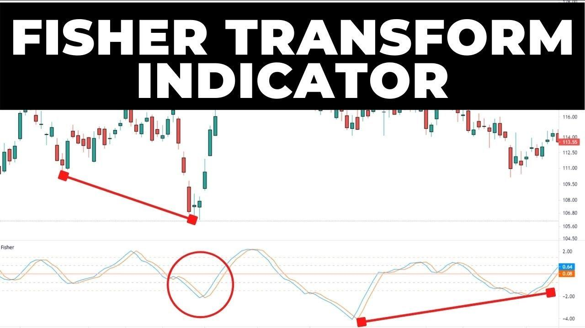

## Table of Contents

## What is the Fisher Transform Indicator?

The Fisher Transform Indicator is a tool used in trading to help predict future price movements. It was created by John F. Ehlers and is based on the idea of transforming prices into a more normal distribution. This helps traders see patterns and trends more clearly. The indicator uses a mathematical formula to convert price data into a value that ranges between -1 and +1. When the value gets close to these limits, it suggests that the price might reverse soon.

Traders use the Fisher Transform Indicator to spot potential buy and sell signals. When the indicator line crosses above the zero line, it can be seen as a buy signal. Conversely, when it crosses below the zero line, it might be a good time to sell. The indicator also helps traders see when the market might be overbought or oversold. This can be useful for making decisions about when to enter or exit trades. Overall, the Fisher Transform Indicator is a helpful tool for traders looking to make more informed decisions.

## How does the Fisher Transform Indicator work?

The Fisher Transform Indicator works by taking the price data of a stock or other asset and turning it into a number that is easier to understand. It uses a special math formula to do this. The formula changes the price data so that it fits into a range between -1 and +1. This makes it easier for traders to see when the price might be about to change direction. When the indicator's value gets very close to -1 or +1, it suggests that the price might soon reverse.

Traders look at the Fisher Transform Indicator to find good times to buy or sell. If the indicator line moves above the zero line, it can be a signal to buy. If it moves below the zero line, it might be a signal to sell. This helps traders make decisions based on clear signals. The indicator also shows when the market might be overbought or oversold. This means it can help traders know when it might be a good time to get in or out of a trade.

## Who developed the Fisher Transform Indicator and when?

The Fisher Transform Indicator was developed by John F. Ehlers. He is known for creating many tools that help traders understand the stock market better. John F. Ehlers wanted to make it easier for people to see when prices might change direction.

He introduced the Fisher Transform Indicator in the early 2000s. This tool uses math to change price data into a simpler form that ranges between -1 and +1. This helps traders spot good times to buy or sell stocks.

## What are the key components of the Fisher Transform Indicator?

The Fisher Transform Indicator has two main parts: the Fisher Transform line and the trigger line. The Fisher Transform line is the main part that traders look at. It uses a special math formula to change the price data into a number between -1 and +1. When this line gets close to -1 or +1, it means the price might be about to change direction. The trigger line is a smoother version of the Fisher Transform line. It helps traders see the overall trend more clearly and can be used to confirm buy or sell signals.

Traders use these lines to make decisions. When the Fisher Transform line crosses above the zero line, it can be a sign to buy. If it goes below the zero line, it might be a good time to sell. The trigger line helps make these signals more reliable. By looking at both lines together, traders can see when the market might be overbought or oversold. This helps them know when to enter or [exit](/wiki/exit-strategy) trades.

## How is the Fisher Transform Indicator calculated?

The Fisher Transform Indicator is calculated using a special math formula that changes price data into a number between -1 and +1. First, you take the price data and find the highest and lowest prices over a certain period. Then, you calculate the midpoint of these high and low prices. Next, you find out how far the current price is from this midpoint. This difference is used to calculate something called the raw Fisher Transform value. You do this by taking the natural logarithm of the ratio of the number of times the price was above the midpoint to the number of times it was below.

After getting the raw Fisher Transform value, you smooth it out using a method called exponential moving average (EMA). This helps make the indicator less jumpy and easier to read. The smoothed value is the Fisher Transform line, which traders use to spot trends and possible price reversals. A trigger line, which is another smoothed version of the Fisher Transform line, is also calculated to help confirm signals. Together, these lines help traders see when the market might be overbought or oversold, making it easier to decide when to buy or sell.

## What are the typical settings used for the Fisher Transform Indicator?

The Fisher Transform Indicator usually comes with some standard settings that traders can change to fit their needs. The most common setting for the period used to calculate the indicator is 10. This means the indicator looks at the last 10 price bars to figure out its value. Traders can make this number bigger or smaller depending on whether they want to see short-term or long-term trends.

Another important setting is the smoothing [factor](/wiki/factor-investing), which is often set to 0.5. This helps make the Fisher Transform line less jumpy and easier to read. Some traders might change this number to make the line smoother or more responsive to price changes. By adjusting these settings, traders can use the Fisher Transform Indicator in a way that works best for them.

## How can the Fisher Transform Indicator be used in trading strategies?

The Fisher Transform Indicator can be used in trading strategies to help traders decide when to buy or sell. Traders look at the Fisher Transform line and the trigger line to spot good times to make trades. When the Fisher Transform line crosses above the zero line, it can be a signal to buy. If it goes below the zero line, it might be a good time to sell. By using these signals, traders can make better decisions about entering or exiting trades.

Another way to use the Fisher Transform Indicator is to see when the market might be overbought or oversold. When the Fisher Transform line gets close to +1, it suggests the market might be overbought and could soon go down. If it gets close to -1, it means the market might be oversold and could go up. Traders can use this information to plan their trades. By combining these signals with other tools and strategies, traders can make more informed decisions and improve their chances of making successful trades.

## What are the advantages of using the Fisher Transform Indicator in trading?

The Fisher Transform Indicator helps traders see when prices might change direction more easily. It turns price data into a number between -1 and +1, which makes it simpler to spot trends. When the indicator line gets close to these limits, it tells traders that the price might soon reverse. This can be very helpful for deciding when to buy or sell. Also, the indicator gives clear buy and sell signals when it crosses the zero line. This makes it easier for traders to make quick decisions without second-guessing.

Another big advantage is that the Fisher Transform Indicator shows when the market might be overbought or oversold. If the line is near +1, it means the market might be overbought and could go down soon. If it's near -1, the market might be oversold and could go up. Knowing this helps traders plan their trades better. By using the Fisher Transform Indicator along with other tools, traders can make more informed decisions and increase their chances of making successful trades.

## What are the limitations or potential pitfalls of using the Fisher Transform Indicator?

Using the Fisher Transform Indicator can have some downsides. It might give false signals, which means it can tell you to buy or sell when it's not a good time. This can happen if the market is moving in a choppy way, with lots of ups and downs. The indicator also needs to be used with other tools to make sure the signals are right. Relying on it alone can lead to mistakes because it doesn't work well in all market conditions.

Another issue is that the settings of the Fisher Transform Indicator can affect how well it works. If you don't set the period and smoothing factor right, you might miss good trading chances or get bad signals. Also, it can be hard to know when the market is really overbought or oversold because the indicator might stay near the limits for a long time. Traders need to be careful and use other ways to check the signals from the Fisher Transform Indicator.

## How does the Fisher Transform Indicator compare to other technical indicators?

The Fisher Transform Indicator is different from other technical indicators because it changes price data into a number between -1 and +1. This makes it easier for traders to see when prices might change direction. Other indicators, like the Relative Strength Index (RSI) or Moving Averages, don't do this. The RSI also shows if a market is overbought or oversold, but it uses a scale from 0 to 100. Moving Averages help traders see trends by smoothing out price data over time. The Fisher Transform Indicator gives clear buy and sell signals when it crosses the zero line, which can be easier to follow than some other indicators.

However, the Fisher Transform Indicator has its own challenges. Like the RSI, it can give false signals in choppy markets. But unlike the RSI, which is widely used and understood, the Fisher Transform Indicator might be less familiar to some traders. Moving Averages are simpler and more common, but they don't show overbought or oversold conditions like the Fisher Transform Indicator does. Traders often use the Fisher Transform Indicator along with other tools to make sure their trading decisions are solid. This way, they can get the best of both worlds by using different indicators to confirm their trades.

## Can the Fisher Transform Indicator be used effectively in different market conditions?

The Fisher Transform Indicator can work well in different market conditions, but it's not perfect for all of them. In markets that move in clear trends, the indicator can be very helpful. It gives clear signals when to buy or sell, which can make trading easier. For example, when the market is going up steadily, the Fisher Transform line crossing above the zero line can be a good sign to buy. But if the market is moving up and down a lot without a clear direction, the indicator might give false signals. This can make it hard to know when to trade.

In very fast-moving or volatile markets, the Fisher Transform Indicator can also be tricky to use. The indicator might jump around a lot, making it hard to see the real trends. Traders need to be careful and might need to use other tools to check the signals from the Fisher Transform Indicator. In slow-moving markets, the indicator can be more reliable because it's easier to spot when the market is overbought or oversold. Overall, while the Fisher Transform Indicator can be useful in many situations, traders should always use it with other indicators to make the best trading decisions.

## What advanced techniques can traders apply to enhance the effectiveness of the Fisher Transform Indicator?

Traders can make the Fisher Transform Indicator work better by using it with other tools. One way to do this is by looking at other indicators like the Moving Average Convergence Divergence (MACD) or the Relative Strength Index (RSI) at the same time. If the Fisher Transform Indicator and these other tools give the same buy or sell signal, it can make traders more sure about their choices. Another technique is to change the settings of the Fisher Transform Indicator. By trying different periods and smoothing factors, traders can find what works best for them in different market conditions.

Another advanced technique is to use the Fisher Transform Indicator for different time frames. For example, traders can look at the indicator on a daily chart and a shorter-term chart like an hourly one. If both time frames show the same signal, it can be a stronger sign to trade. Also, traders can use the Fisher Transform Indicator to find patterns like divergences. If the price is going up but the Fisher Transform line is going down, it might mean the price will soon go down too. By combining these techniques, traders can use the Fisher Transform Indicator more effectively and make better trading decisions.

## What is the formula and how is the calculation done?

The Fisher Transform indicator employs a mathematical formula to convert asset prices into values that resemble a Gaussian normal distribution. This transformation is crucial as it sharpens the identification of extreme price movements, thereby aiding traders in recognizing potential market reversals ahead of time. The formula for the Fisher Transform is expressed as:

$$
\text{Fisher Transform} = 0.5 \times \ln\left(\frac{1 + X}{1 - X}\right)
$$

In this context, $X$ refers to the normalized price, restricted within the range of -1 to 1. This normalization is essential to ensure that the transformation appropriately scales the price data to match the expected input of the formula.

### Calculation Steps

1. **Select a Lookback Period**: Typically, a period such as 9 days is chosen. This period serves as a window over which the highest and lowest prices are determined for normalization.

2. **Normalize Prices**: For each period, calculate the normalized price $X$ using the formula:

   \[ X = \frac{2 \times (\text{Price} - \text{Low})}{\text{High} - \text{Low}} - 1
$$

   Here, "Price" is the current asset price, "Low" is the lowest price, and "High" is the highest price within the lookback period. This step scales the prices to the range of -1 to 1.

3. **Apply the Fisher Transform Formula**: With the normalized price $X$, compute the Fisher Transform for the current period using the earlier stated formula.

4. **Iterate for Each New Period**: The process of normalization and transformation must be repeated as new prices become available, which ensures that the Fisher Transform indicator remains responsive to real-time market data.

### Continuous Adjustments

This indicator adapts dynamically, recalibrating with each new data point, which helps maintain its effectiveness in capturing market shifts. This means traders and algorithmic systems can swiftly act on emerging price trends and potential reversals.

### Mathematical Foundation

Thorough comprehension of the underlying calculations is imperative when implementing the Fisher Transform in trading algorithms. Proper setup and execution mean the difference between actionable insights and misleading signals. By incorporating the Fisher Transform into algorithmic scripts, traders can automate the detection of extreme price movements, further enhancing their trading strategies. Here is a simple Python example illustrating its implementation:

```python
import numpy as np

def fisher_transform(prices, lookback_period=9):
    fishers = np.zeros(len(prices))
    for i in range(lookback_period, len(prices)):
        high = np.max(prices[i - lookback_period:i])
        low = np.min(prices[i - lookback_period:i])
        x = 0.5 * (prices[i] - low) / (high - low) - 0.5
        x = max(min(x, 0.99), -0.99)  # Prevent domain error in log function
        fishers[i] = 0.5 * np.log((1 + x) / (1 - x))
    return fishers

# Example use:
prices = [100, 102, 104, 103, 101, 105, 107, 110, 108, 107, 109]
fisher_values = fisher_transform(prices)
print(fisher_values)
```

This code calculates the Fisher Transform values over a series of asset prices, allowing traders to monitor the potential reversal points signaled by the indicator.

## References & Further Reading

[1]: Ehlers, J. F. (2002). ["Cybernetic Analysis for Stocks and Futures: Cutting-Edge DSP Technology to Improve Your Trading."](https://archive.org/details/cyberneticanalys0000ehle) John Wiley & Sons.

[2]: Pring, M. J. (1991). ["Technical Analysis Explained: The Successful Investor's Guide to Spotting Investment Trends and Turning Points."](https://archive.org/details/technicalanalysi00prin) McGraw-Hill Education.

[3]: Achelis, S. B. (2000). ["Technical Analysis from A to Z."](https://archive.org/details/technicalanalysi00ache) McGraw-Hill Education.

[4]: Murphy, J. J. (1999). ["Technical Analysis of the Financial Markets: A Comprehensive Guide to Trading Methods and Applications."](https://archive.org/details/technicalanalysi0000murp) New York Institute of Finance.

[5]: Connors, L., & Alvarez, C. (2009). ["Short-Term Trading Strategies That Work."](https://www.amazon.com/Short-Term-Trading-Strategies-That/dp/0981923909) TradingMarkets Publishing Group.