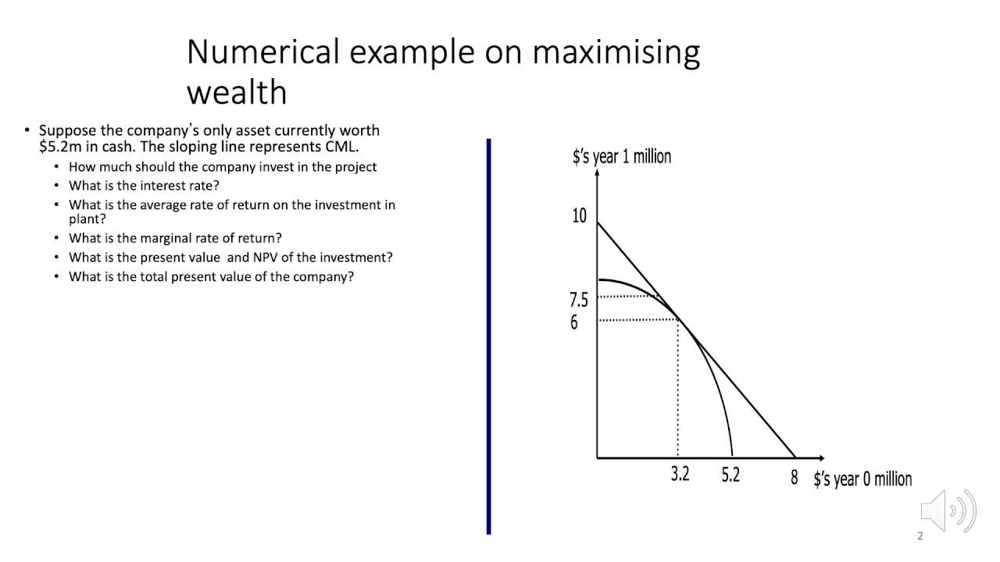

## Table of Contents

## What is Fisher's Separation Theorem?

Fisher's Separation Theorem is an important idea in finance and economics. It says that a company's investment decisions should be separate from its owners' personal investment choices. This means that the best way to invest a company's money should be decided based on what's good for the company, not on what the owners want to do with their own money.

The theorem helps to make things clearer for both the company and its owners. For the company, it means they can focus on making the best investment choices to grow the business. For the owners, it means they can decide what to do with their money separately, like saving it, spending it, or investing it in other places. This separation makes it easier for everyone to make good decisions.

## Who was Irving Fisher and why is he important in economics?

Irving Fisher was a famous American economist who lived from 1867 to 1947. He is important in economics because he came up with many new ideas and theories that people still use today. Fisher worked on things like how money works, how prices change over time, and how people make choices about money. He is especially known for his ideas about interest rates and how they affect the economy.

One of Fisher's big contributions was the idea of the Fisher Effect, which says that interest rates and inflation rates are connected. If inflation goes up, people expect higher interest rates to make up for the loss in the value of money. Fisher also helped develop the theory of intertemporal choice, which looks at how people make decisions about spending and saving over time. His work has had a big impact on how economists think about money and how it moves through the economy.

## What are the main assumptions of Fisher's Separation Theorem?

Fisher's Separation Theorem relies on a few key assumptions to work properly. The first assumption is that markets are perfect. This means that everyone can buy and sell things easily, without any restrictions or costs that get in the way. It also means that everyone has the same information about what's going on in the market. The second assumption is that people can borrow and lend money at the same [interest rate](/wiki/interest-rate-trading-strategies). This helps make sure that everyone can make their investment decisions based on the same financial conditions.

Another important assumption is that people make their choices based on how much money they will have in the future, not just right now. This is called intertemporal choice. It means that people think about how their decisions today will affect them later on. Finally, the theorem assumes that companies always try to make as much money as possible for their owners. This is called the goal of maximizing shareholder value. With these assumptions in place, Fisher's Separation Theorem can explain how companies and their owners can make the best decisions separately.

## How does Fisher's Separation Theorem relate to the separation of investment and consumption decisions?

Fisher's Separation Theorem says that a company's investment choices should be made separately from its owners' decisions about spending their money. The idea is that what's best for the company should be decided based on what will make the company grow and be successful, not on what the owners want to do with their own money. This helps the company focus on good investments that will increase its value over time.

On the other hand, the owners can then decide what to do with their money in a way that fits their own needs and wants. They might choose to save it, spend it, or invest it in other things. By keeping these decisions separate, both the company and its owners can make better choices. The company can work on growing its business, while the owners can plan their own financial future without worrying about the company's investment choices.

## Can you explain the concept of intertemporal choice in the context of Fisher's Separation Theorem?

Intertemporal choice is all about how people make decisions about spending and saving money over time. They think about what they want now and what they might want later. In the context of Fisher's Separation Theorem, intertemporal choice helps explain why it's important for companies and their owners to make separate decisions. The company should focus on investments that will make it more valuable in the future, while the owners can decide if they want to spend their money now or save it for later.

This separation makes sense because people's needs and wants change over time. A company might need to invest in new equipment or expand to grow its business, even if it means not having as much money right now. The owners, on the other hand, might want to use their money to buy things they need today or save for retirement. By keeping these decisions separate, both the company and its owners can plan for the future in a way that works best for them.

## What role does the interest rate play in Fisher's Separation Theorem?

The interest rate is really important in Fisher's Separation Theorem. It helps both the company and its owners make their decisions. For the company, the interest rate is used to figure out which investments are worth making. If the company can make more money from an investment than it would get from the interest rate, then it's a good investment. This helps the company grow and become more valuable over time.

For the owners, the interest rate is important too. It helps them decide what to do with their money. They can choose to save their money and earn interest, or they can spend it now. The interest rate also affects how much they can borrow if they need more money. By knowing the interest rate, the owners can make smart choices about their own money, separate from what the company is doing. This way, everyone can make the best decisions for their own future.

## How does Fisher's Separation Theorem apply to a firm's investment decisions?

Fisher's Separation Theorem says that a company should make its investment choices based on what's best for the company, not on what the owners want to do with their money. This means that the company should look at all its options and choose the investments that will make the business grow and become more valuable over time. The company doesn't need to worry about what the owners are doing with their own money because the investment decisions are made separately.

For example, if a company is thinking about buying new machines to make more products, it should decide based on whether the new machines will make more money than they cost. The company shouldn't care if the owners want to save their money or spend it on something else. By keeping these decisions separate, the company can focus on making the best choices for its future, and the owners can plan their own financial lives without worrying about the company's investments.

## What are the implications of Fisher's Separation Theorem for corporate finance?

Fisher's Separation Theorem has big implications for how companies handle their money. It tells companies to make investment decisions based on what's best for the business, not on what the owners want to do with their money. This means companies should look at all their options and choose the ones that will make the business grow and become more valuable over time. They don't need to worry about what the owners are doing with their money because the decisions are kept separate.

This separation helps companies focus on making smart investment choices. It also makes things easier for the owners because they can plan their own financial future without worrying about the company's investments. The owners can decide to save their money, spend it, or invest it in other things, based on what they need and want. By keeping these decisions separate, both the company and its owners can make the best choices for their future.

## How does Fisher's Separation Theorem influence personal financial planning?

Fisher's Separation Theorem tells people that what a company does with its money should not affect their own financial planning. This means that if you own part of a company, you should think about your own money choices separately from what the company is doing. You can decide to save your money, spend it, or invest it in other things based on what you need and want. The company will make its own choices about growing and investing, so you don't have to worry about that when planning your own finances.

This separation makes it easier for people to plan their future. You can focus on what's important to you, like saving for a house, paying for your kids' education, or retiring comfortably. The company will work on making good investments to grow its business, which might increase the value of your ownership over time. But you don't need to think about the company's decisions when making your own financial plans. This way, both you and the company can make the best choices for your futures.

## What are some criticisms or limitations of Fisher's Separation Theorem?

Fisher's Separation Theorem has some problems that people have pointed out. One big issue is that it assumes markets are perfect. This means everyone can buy and sell things easily and everyone knows the same information. But in real life, markets are not always perfect. There can be costs and rules that make it hard to buy and sell things. Also, not everyone has the same information, which can make it hard for companies and owners to make good decisions.

Another problem is that the theorem assumes people can borrow and lend money at the same interest rate. But in reality, different people and companies often get different interest rates. This can change how they make their investment and spending choices. Also, the theorem doesn't think about other things that can affect decisions, like taxes, rules, and how risky an investment might be. These things can make it hard for companies and owners to keep their decisions separate like the theorem says.

## Can you discuss any empirical evidence supporting or challenging Fisher's Separation Theorem?

There isn't a lot of direct evidence that clearly supports or challenges Fisher's Separation Theorem because it's more of a theoretical idea. But some studies have looked at how companies make investment choices and how owners make their own financial plans. These studies often find that in real life, things like taxes, rules, and how risky an investment is can make it hard for companies and owners to keep their decisions separate. This shows that the perfect market conditions the theorem assumes don't always happen in the real world.

On the other hand, some research has found that companies do often try to make investment choices that will grow their business, without worrying too much about what their owners are doing with their money. This supports the idea of the theorem that companies should focus on what's best for them. But even these studies show that it's not always easy to keep these decisions completely separate because of real-world problems like different interest rates and imperfect information. So while the theorem gives a good way to think about investment and personal finance, real life can make it hard to follow perfectly.

## How has Fisher's Separation Theorem evolved or been adapted in modern economic theory?

Fisher's Separation Theorem has changed a bit over time as economists learned more about how the real world works. Modern economic theories have added new ideas to make the theorem more realistic. For example, they think about things like taxes, rules, and how risky investments can be. These things can make it hard for companies and owners to keep their decisions completely separate. So, newer theories try to explain how these real-life problems can affect the choices companies and owners make.

Even though the perfect market conditions that Fisher's Separation Theorem assumes don't always happen, the basic idea is still important. Economists still use the theorem as a starting point to understand how companies should make investment choices and how owners should plan their own finances. They build on this idea by adding more details about the real world, like different interest rates and imperfect information. This helps them make better models that can explain how companies and owners make decisions in today's economy.

## What is the Legacy of Irving Fisher?

Irving Fisher's impact on the field of finance and economics extends well beyond the boundaries of his separation theorem, marking him as a pivotal figure in the neoclassical school of thought. As a distinguished Yale economist, Fisher's pioneering work in utility theory, capital, and interest rates laid foundational stones for academic and practical financial economics.

Fisher's formulation of utility theory contributed significantly to understanding how individuals make choices under uncertainty, a core concept in consumer behavior analysis. This theory provided a framework for analyzing how consumers maximize their satisfaction given budget constraints, influencing both microeconomic theory and behavioral economics.

His seminal book, "The Theory of Interest," remains a cornerstone in both academic and applied finance. Fisher's insights into interest rates and capital markets helped formalize the relationship between real interest rates, inflation, and nominal interest rates, often referred to as the Fisher Equation:

$$
i = r + \pi^e
$$

where $i$ is the nominal interest rate, $r$ is the real interest rate, and $\pi^e$ is the expected inflation rate. This relationship is crucial for understanding the dynamics of interest rates in response to inflationary expectations.

Beyond his own theories, Fisher's ideas have significantly influenced subsequent economic theories, notably the Modigliani-Miller theorem which extends Fisher's separation principles to capital structure and firm valuation. This theorem underscores the irrelevance of capital structure in perfect markets, aligning closely with Fisher's beliefs regarding market efficiency and capital allocation.

Fisher's extensive writings and theoretical insights not only enriched economic literature but also shaped the methodological approaches of economic analysis. His contributions fostered a better understanding of how economic [agents](/wiki/agents) interact, allocate resources, and respond to uncertainties and economic policy.

Grasping Fisher's contributions offers invaluable insight into the historical progression and depth of economic theory. His innovative work continues to influence contemporary economic and financial strategies, underscoring the timeless relevance of his insights in shaping modern financial thought.

## References & Further Reading

[1]: Fisher, I. (1930). ["The Theory of Interest."](https://oll.libertyfund.org/titles/fisher-the-theory-of-interest) Palgrave Macmillan.

[2]: Modigliani, F., & Miller, M. H. (1958). ["The Cost of Capital, Corporation Finance, and the Theory of Investment."](https://www.semanticscholar.org/paper/The-Cost-of-Capital%2C-Corporation-Finance-and-the-of-Miller/81c84afa78c3445b783db0b9dbec3b70f2cb3a19) The American Economic Review, 48(3), 261-297.

[3]: Jensen, M. C. (1986). ["Agency Costs of Free Cash Flow, Corporate Finance, and Takeovers."](https://www.jstor.org/stable/1818789) The American Economic Review, 76(2), 323-329.

[4]: Graham, B., & Dodd, D. (1934). ["Security Analysis."](https://books.google.com/books/about/Security_Analysis_The_Classic_1934_Editi.html?id=wXlrnZ1uqK0C) McGraw Hill.

[5]: Sharpe, W. F. (1964). ["Capital Asset Prices: A Theory of Market Equilibrium Under Conditions of Risk."](https://onlinelibrary.wiley.com/doi/full/10.1111/j.1540-6261.1964.tb02865.x) The Journal of Finance, 19(3), 425-442.

[6]: Fama, E. F. (1970). ["Efficient Capital Markets: A Review of Theory and Empirical Work."](https://www.jstor.org/stable/2325486) The Journal of Finance, 25(2), 383-417.