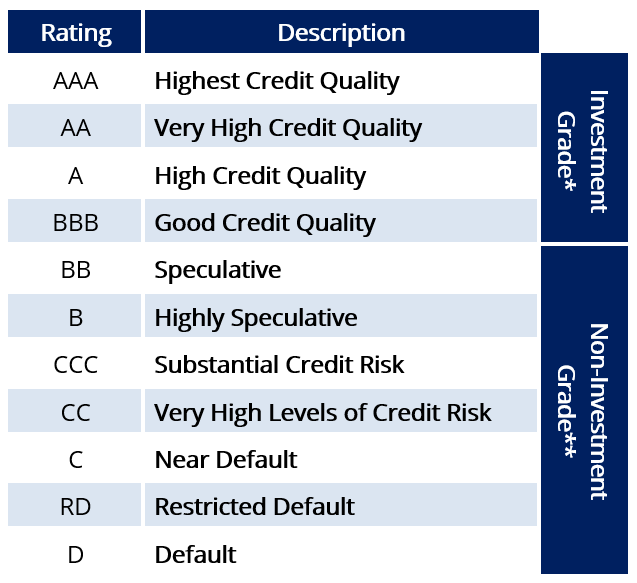

## Table of Contents

## What is Fitch Ratings and what is its purpose?

Fitch Ratings is a company that gives credit ratings to different things like countries, companies, and financial products. They look at how likely these things are to pay back money they borrow. If something gets a good rating from Fitch, it means it's seen as safe and reliable. If it gets a bad rating, it might be seen as risky.

The purpose of Fitch Ratings is to help people make better decisions about where to put their money. For example, if you're thinking about buying a bond from a company, you might check its Fitch rating first. A good rating could make you feel more confident about buying it. This also helps keep the financial markets stable because it gives everyone more information to work with.

## How does Fitch Ratings assess the creditworthiness of entities?

Fitch Ratings looks at a lot of things to figure out if a country, company, or financial product is good at paying back money. They check things like how much money the entity makes, how much debt it has, and what the economy is like where it operates. They also look at the entity's history of paying back loans and how well it is managed. All these pieces of information help Fitch decide if the entity is likely to keep paying back its debts on time.

Once Fitch has all this information, they give the entity a rating. This rating is like a score that tells people how safe it is to lend money to that entity. A high rating means the entity is seen as very likely to pay back its debts, so it's considered safe. A low rating means there's more risk that the entity might not pay back its debts, so it's seen as less safe. This rating helps people decide if they want to invest in or lend money to that entity.

## What are the main sectors that Fitch Ratings covers?

Fitch Ratings looks at many different areas to help people make smart choices about money. They cover things like countries, which means they rate how well a whole country can pay back its debts. They also look at companies, both big and small, to see if they are good at paying back loans. Another area they cover is banks and other financial places, checking how safe it is to keep money there or borrow from them.

They also rate things like bonds, which are a way for companies or governments to borrow money from people. Fitch checks if these bonds are likely to be paid back on time. On top of that, they look at special financial products, like those used by big investors, to see how risky they are. By covering all these different sectors, Fitch helps everyone from regular people to big investors understand where it's safe to put their money.

## What is the basic structure of Fitch Ratings' rating scale?

Fitch Ratings uses a simple way to tell people how safe it is to lend money to a country, company, or financial product. They use letters and numbers to make ratings. The highest rating is 'AAA', which means it's very safe to lend money to that entity. After 'AAA', the ratings go down like this: 'AA', 'A', 'BBB', 'BB', 'B', 'CCC', 'CC', 'C', and the lowest is 'D'. Each of these main ratings can also have a plus (+) or minus (-) to show if it's a bit better or worse within that group. For example, 'AA+' is better than 'AA' but not as good as 'AAA'.

When an entity gets a rating of 'BBB-' or higher, it's called investment grade. This means it's seen as pretty safe to lend money to them. If the rating is 'BB+' or lower, it's called speculative grade or junk, which means it's riskier. The very bottom, 'D', means the entity has not paid back its debts and is in default. This scale helps people quickly understand how risky it is to invest in or lend to different entities.

## What do the different rating categories (e.g., AAA, AA, A) signify?

Fitch Ratings uses letters to show how safe it is to lend money to a country, company, or financial product. The highest rating is 'AAA', which means it's very safe to lend money to that entity. They are seen as having a very strong ability to pay back their debts. Ratings like 'AA' and 'A' are also considered safe, but not as safe as 'AAA'. 'AA' means the entity is very strong but might have a tiny bit more risk than 'AAA'. 'A' means the entity is still strong, but there's a bit more chance they might have trouble paying back their debts.

Ratings from 'BBB' down to 'B' show more risk. 'BBB' is the lowest rating that is still considered investment grade, meaning it's seen as pretty safe to lend money to them. But as you go down to 'BB' and 'B', the risk gets higher, and these are called speculative grade or junk ratings. This means there's a bigger chance the entity might not pay back their debts. The lowest ratings, 'CCC', 'CC', and 'C', show even more risk, with 'C' being right before default. If an entity gets a 'D' rating, it means they have already failed to pay back their debts and are in default.

## How does Fitch Ratings differentiate between long-term and short-term ratings?

Fitch Ratings uses different scales for long-term and short-term ratings to help people understand the safety of lending money over different time periods. Long-term ratings look at how well an entity can pay back money over a long time, usually more than a year. The highest long-term rating is 'AAA', which means the entity is very safe to lend to over the long term. The ratings go down from 'AAA' to 'D', with 'D' meaning the entity has not paid back its debts and is in default. Long-term ratings help people make decisions about big investments that will last a while.

Short-term ratings, on the other hand, focus on how well an entity can pay back money in the short term, usually within a year. The highest short-term rating is 'F1+', which means the entity is very safe to lend to in the short term. The ratings go down from 'F1+' to 'D', with 'D' again meaning the entity is in default. Short-term ratings are useful for people who need to know if it's safe to lend money for a short time, like for quick loans or short-term investments. By having both long-term and short-term ratings, Fitch helps people make better choices based on how long they plan to lend or invest their money.

## What additional symbols or modifiers does Fitch use in its ratings?

Fitch Ratings uses plus (+) and minus (-) signs with their long-term ratings to show if an entity is a bit better or worse within a rating group. For example, 'AA+' is better than 'AA' but not as good as 'AAA'. These signs help give a more exact idea of how safe it is to lend money to that entity. They don't use these signs with the highest rating 'AAA' or the lowest rating 'D' because those ratings are already at the top and bottom of the scale.

For short-term ratings, Fitch uses '+' and '-' signs only with the 'F1' and 'F2' ratings. 'F1+' is the best short-term rating and means the entity is very safe to lend to in the short term. 'F1' is still very good but not quite as safe as 'F1+'. 'F2+' is better than 'F2' but not as good as 'F1'. These signs help people understand small differences in short-term safety.

## How often does Fitch Ratings review and update its ratings?

Fitch Ratings looks at their ratings all the time to make sure they are up to date. They usually check each rating at least once a year. But if something big happens, like a company losing a lot of money or a country having a big change in its economy, Fitch might look at the rating again sooner. This helps keep the ratings as accurate as possible.

Sometimes, Fitch will put out a special report if they think a rating might change soon. They call this a "Rating Watch." It tells people that something important is happening and the rating could go up or down. By doing all these checks and updates, Fitch helps people make better choices about where to put their money.

## What are some of the key factors that can lead to a rating change?

Fitch Ratings looks at many things that can make them change a rating. One big reason is if a company or country makes more or less money than before. If they start making a lot less money, it might be harder for them to pay back their debts, so their rating could go down. Another reason is if they take on a lot more debt. More debt means more money they have to pay back, which can make them riskier. Also, if the economy where they work gets worse, like if there's a big recession, their rating might change because it's harder to make money in a bad economy.

Changes in how well a company or country is run can also affect their rating. If they get new leaders who make better decisions, their rating might go up. But if the leaders make bad choices, the rating could go down. Sometimes, big events like natural disasters or political problems can make Fitch change a rating quickly. They watch all these things closely to make sure their ratings are as accurate as possible and help people make good choices about where to put their money.

## How does Fitch Ratings' methodology compare to other major credit rating agencies?

Fitch Ratings, like other big credit rating agencies such as Moody's and Standard & Poor's (S&P), looks at how likely a country, company, or financial product is to pay back money they borrow. They all use a similar way of giving ratings, with letters and numbers to show how safe it is to lend money. For example, Fitch uses 'AAA' to 'D' for long-term ratings and 'F1+' to 'D' for short-term ratings. Moody's uses 'Aaa' to 'C' for long-term and 'P-1' to 'NP' for short-term. S&P uses 'AAA' to 'D' for long-term and 'A-1' to 'D' for short-term. Even though the letters are a bit different, they all mean the same thing: 'AAA' or 'Aaa' is very safe, and 'D' means the entity didn't pay back its debts.

The main difference between these agencies is in the details of how they decide on their ratings. Each one has its own special way of looking at things like how much money an entity makes, how much debt it has, and what's happening in the economy. Fitch might put more focus on some things than Moody's or S&P. For example, Fitch might look more at how well a company is managed, while Moody's might pay more attention to the economy. But at the end of the day, all these agencies try to give people good information to help them decide where to put their money safely.

## What are the implications of a Fitch rating for investors and issuers?

A Fitch rating tells investors how safe it is to lend money or buy bonds from a country, company, or financial product. If a rating is high, like 'AAA', it means the entity is very likely to pay back the money on time, so it's a safe investment. This can make investors feel more confident about putting their money into that entity. On the other hand, if the rating is low, like 'B' or 'CCC', it means there's more risk that the entity might not pay back the money, so it's seen as a riskier investment. Investors might want a higher return to take on that risk, or they might decide not to invest at all.

For issuers, like companies or countries that want to borrow money, a good Fitch rating can make it easier and cheaper to borrow. When they have a high rating, lenders and investors trust them more, so they might not have to pay as much interest on their loans. But if their rating is low, it can be harder to borrow money, and they might have to pay higher interest rates because lenders see them as riskier. This is why issuers work hard to keep their ratings high, because it affects how much it costs them to borrow money and how easy it is to get it.

## How can one access and interpret detailed Fitch Ratings reports?

To access detailed Fitch Ratings reports, you can visit their official website at fitchratings.com. Once there, you can search for specific ratings by typing in the name of the company, country, or financial product you're interested in. Fitch offers some free access to their ratings, but for more detailed reports and analyses, you might need to subscribe to their services or use a financial database that includes Fitch's data. Libraries and universities often have subscriptions to these databases, so you might be able to access the reports through them if you don't want to pay for a personal subscription.

Interpreting a Fitch Ratings report involves understanding the rating itself and the analysis that comes with it. The rating, like 'AAA' or 'BBB-', tells you how safe it is to lend money to the entity. A high rating means it's very safe, while a low rating means it's riskier. The report will also include a detailed analysis explaining why the entity got that rating. This analysis might talk about things like how much money the entity makes, how much debt it has, and what's happening in the economy where it operates. By reading this, you can get a better idea of what's going on with the entity and why Fitch gave it the rating they did.

## References & Further Reading

[1]: Cantor, R., & Packer, F. (1997). ["Differences in the ratings assigned by Moody's and Standard & Poor’s."](https://www.sciencedirect.com/science/article/pii/S0378426697000241) The Journal of Fixed Income, 7(2), 13-26.

[2]: Hull, J. C. (2018). ["Risk Management and Financial Institutions"](https://books.google.com/books/about/Risk_Management_and_Financial_Institutio.html?id=1J1QDwAAQBAJ). Wiley Finance.

[3]: Lopez de Prado, M. (2018). ["Advances in Financial Machine Learning"](https://www.amazon.com/Advances-Financial-Machine-Learning-Marcos/dp/1119482089). Wiley.

[4]: Young, K. H., & Alford, A. E. (2021). ["Credit Ratings and the BIS Capital Adequacy Rules."](https://www.sciencedirect.com/science/article/pii/S0378426601002692) Journal of Money, Credit, and Banking, 21(4), 447-459.

[5]: White, E. N. (2012). ["Credit Rating Agencies and the Global Financial Crisis: An Historical Perspective."](https://onlinelibrary.wiley.com/doi/full/10.1111/j.1755-053X.2012.01204.x) National Bureau of Economic Research Working Paper Series.

[6]: Caruana, J. (2008). ["The Role of Credit Rating Agencies in the Financial System."](https://papers.ssrn.com/sol3/papers.cfm?abstract_id=3192475) Bank for International Settlements.

[7]: Jansen, S. (2020). ["Machine Learning for Algorithmic Trading: Predictive models to extract signals from market and alternative data for systematic trading strategies with Python."](https://www.amazon.com/Machine-Learning-Algorithmic-Trading-alternative/dp/1839217715) Packt Publishing.