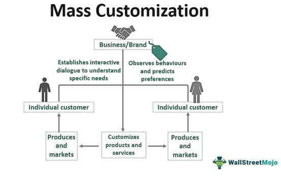

The fusion of exercise, market strategies, and innovative trading techniques has created a unique convergence of the fitness industry and financial market strategies. At first glance, fitness trends and financial trading appear to be disparate domains; yet they share commonality in their reliance on forecasting and adapting to shifting dynamics. Both sectors are governed by the need to anticipate future movements, be it in market demand for fitness programs or in stock prices, and adjust accordingly to maintain competitiveness.

In recent years, the fitness industry has seen a surge in interest and investment, largely fueled by a growing awareness of health and wellness, and the increasing integration of technology in personal fitness routines. On the other hand, the financial markets have been revolutionized by algorithmic trading, which leverages computer algorithms to optimize trading strategies and decision making processes. This has led to a new paradigm where data-driven insights can dictate economic outcomes.

This article explores the intersection of these two fields: examining the current trends shaping the exercise market and how they mirror the strategic adaptations seen in financial trading. By assessing the evolution of the fitness industry alongside advancements in algorithmic trading, we aim to uncover the points of crossover and mutual influence. Through this analysis, we can better understand how methodologies from one sector may enrich practices in the other, revealing potential innovations and investment prospects previously unseen.

## Table of Contents

## Current Trends in the Exercise Market

The exercise market is witnessing substantial growth as increased health awareness and advancements in fitness technology reshape how individuals approach physical fitness. A pivotal aspect of this transformation is the rise in wearable technology, such as smartwatches and fitness trackers. These devices have become integral to the 'quantified self' movement, enabling users to monitor various health metrics, including heart rate, steps taken, and calories burned. This trend not only aids users in tracking their fitness progress but also empowers them with data-driven insights to make informed decisions about their health routines.

The convenience and accessibility offered by home gyms and mobile fitness apps have contributed significantly to the popularity of personalized workout experiences. Home gyms are equipped with versatile machinery and digital connectivity, providing a comprehensive workout environment within the confines of one's residence. Similarly, mobile fitness applications offer customizable workout plans and digital coaching, allowing users to tailor their fitness routines based on personal preferences and specific goals. These platforms often incorporate interactive features, such as virtual classes and community challenges, to engage users and foster a sense of accountability.

Functional fitness and biohacking have emerged as influential components within the modern exercise paradigm. Functional fitness emphasizes exercises that replicate real-world physical activities, enhancing overall strength, coordination, and balance. This approach is particularly favored for its practicality and efficiency, appealing to individuals seeking workouts that improve day-to-day functionality. Biohacking, on the other hand, involves optimizing biological performance through experimental methods and unconventional health strategies. This can include dietary interventions, sleep optimization, and neuro-enhancement techniques aimed at elevating both physical and cognitive capabilities.

Overall, the current trends in the exercise market reflect a broader shift towards personalized, technology-enhanced, and holistic approaches to fitness. These innovations underscore a consumer-driven demand for more efficient and effective workout solutions that align with individual lifestyles and goals.

## Fitness Industry Evolution

Valued at over $100 billion, the fitness industry is undergoing significant transformation, driven by technological advancements and changing consumer expectations. Innovations in tech have opened up new workout possibilities and digital solutions, facilitating the emergence of a more versatile and accessible fitness landscape. For instance, the advent of virtual reality (VR) fitness and [artificial intelligence](/wiki/ai-artificial-intelligence) (AI)-powered personal trainers are reshaping the way people engage with exercise, offering customized workout experiences that can be accessed from anywhere.

The global fitness market is poised for strong growth as digital fitness options continue to expand. This growth is partly fueled by the increasing adoption of fitness apps and online platforms that offer on-demand classes and training programs. These digital solutions are attracting new demographics, including those who may have previously been hesitant to engage in traditional gym settings. Moreover, the COVID-19 pandemic has accelerated the adoption of home fitness solutions, further solidifying their place in the market.

Companies within the fitness industry are capitalizing on emerging demand segments by diversifying their offerings. Boutique fitness studios, which provide specialized classes and personalized attention, are gaining popularity as consumers seek unique and community-driven workout experiences. Additionally, there is a growing emphasis on preventative fitness practices—approaches focused on enhancing long-term health and preventing disease—which appeal to an increasingly health-conscious public.

In summary, the fitness industry's evolution is characterized by a convergence of technology and wellness, catering to a diverse and expanding consumer base. As these trends continue, businesses that can innovate and adapt swiftly will likely thrive in this dynamic market landscape.

## Algorithmic Trading in the Financial Markets

Algorithmic trading has transformed financial markets through the application of computer algorithms, which facilitate the automated execution of trades based on predefined criteria. This approach has significantly enhanced the efficiency and speed of trading processes. Unlike human traders, algorithms can process and analyze vast quantities of market data in real-time, enabling them to make instantaneous decisions. This capability is particularly useful for high-frequency trading, where transactions are executed within microseconds to capitalize on fleeting market opportunities.

Algorithms rely on complex mathematical models and statistical analyses to identify potential trading opportunities. These systems are programmed to follow specific rules based on the algorithm's design, which can include conditions for entering and exiting trades, risk management parameters, and desired return on investment. Advanced algorithms may also incorporate [machine learning](/wiki/machine-learning) techniques to adapt and improve their decision-making processes based on historical and real-time data.

The impact of [algorithmic trading](/wiki/algorithmic-trading) is comparable to advancements seen in other industries, such as the fitness sector, where data-driven techniques are also increasingly utilized. Both financial trading and fitness emphasize the importance of data analytics to drive decision-making and efficiency. In finance, this is exemplified by the integration of market data streams and quantitative analysis tools that provide traders with actionable insights. Similarly, fitness professionals use wearable technology to gather and interpret data, thereby informing training regimens and enhancing performance outcomes.

Market makers play a pivotal role in algorithmic trading, akin to fitness industry influencers who establish trends. Market makers are entities or individuals that provide [liquidity](/wiki/liquidity-risk-premium) to financial markets by continuously buying and selling securities. They utilize algorithms to adjust bid and ask prices dynamically, balancing supply and demand while ensuring market stability. The presence of market makers enhances market efficiency by tightening bid-ask spreads and reducing transaction costs, which are crucial for maintaining a healthy trading ecosystem.

Overall, algorithmic trading represents a paradigmatic shift from traditional trading practices to a technology-driven approach that prioritizes rapid data processing and precision. As both the financial and fitness industries continue to evolve, leveraging technological advancements will be key to maintaining competitiveness and fostering innovation.

## Intersections Between Fitness and Financial Markets

Both the fitness and financial industries are currently navigating a landscape shaped by rapid technological advancements, necessitating constant innovation and adaptation to remain competitive. This convergence is primarily driven by the parallel need for market prediction techniques, the increasing reliance on data-driven strategies, and emerging investment opportunities.

Market prediction is an essential aspect shared by both industries. In the fitness sector, this involves anticipating consumer preferences and workout trends to tailor services and products effectively. This is akin to financial markets where trend forecasting is crucial for strategic trading decisions. The use of predictive analytics enables businesses to identify patterns and shifts in consumer behaviors, thereby aligning their offerings with market demands. A predictive model in finance might analyze historical stock performance to forecast future movements. Similarly, fitness companies use data from consumer purchases and preferences to predict emerging fitness trends.

The data-driven approach integral to algorithmic trading finds parallels in the fitness industry through the application of wearable technology and consumer behavior analytics. In algorithmic trading, sophisticated algorithms process vast datasets to make instantaneous trading decisions. Similarly, wearable fitness devices like smartwatches collect user data, which are then analyzed to personalize fitness experiences and improve overall health outcomes. For example, fitness trackers measure metrics such as heart rate and activity levels to provide personalized workout recommendations, paralleling how trading algorithms dynamically adjust strategies based on real-time market data.

The integration of technology within the fitness sector presents lucrative investment opportunities, driven by its projected growth. As technology becomes more embedded in fitness activities, companies are investing heavily in fitness tech startups, mobile apps, and digital fitness platforms. This trend mirrors how investors seek opportunities in financial technology companies that offer innovative trading solutions. The alignment of technological integration with consumer demand paves the way for investments that promise high returns.

The convergence of these two industries highlights the importance of leveraging technology and data analytics to unlock strategic advantages. For professionals in either field, understanding and embracing these intersections can lead to enhanced decision-making capabilities and greater competitive edge. As both industries continue to evolve, the synergistic application of data and technological insights will be a cornerstone of future growth and innovation.

## Conclusion

The confluence of exercise trends and financial market strategies presents an intriguing landscape for innovation and investment. This parallel growth trajectory offers numerous avenues for leveraging technological advancements to maximize outcomes in both domains. The mutual influence observed in fitness and financial sectors is largely driven by data-centric approaches and predictive analytics.

Understanding the overlap and shared methodologies between these sectors can offer deeper insights into future industry directions. In financial markets, the utilization of algorithms for predictive modeling and efficient trading is increasingly mirrored in the fitness sector through data analytics techniques applied to wearable technology. Just as algorithmic trading utilizes historical and real-time data to forecast market changes, fitness technologies use biometric data to personalize and enhance workout experiences. Recognizing patterns and trends within extensive datasets can thus lead to optimized strategies for both traders and fitness professionals.

As both sectors evolve, keeping abreast of technological advances will be essential for professionals within each field. For instance, the integration of artificial intelligence and machine learning in financial trading has significantly enhanced the ability to react to market fluctuations. Similarly, AI in fitness applications is revolutionizing personalized training programs, injury prevention, and recovery optimization. Sustained engagement with cutting-edge technologies ensures ongoing relevance and competitiveness in rapidly progressing industries.

Anticipating and adapting to new developments can provide significant advantages in both personal fitness management and financial trading. Professionals adept at navigating emerging trends and technologies will be well-positioned to capitalize on new opportunities. For example, investors might find substantial growth prospects within tech-integrated fitness companies, while fitness experts can leverage financial market strategies to optimize business models. Continuous adaptation ensures sustained success and innovation in an interconnected global marketplace.

## References & Further Reading

[1]: "Fitness Technology and Health: An Overview" by Sensor Tower. Available at [Sensor Tower Blog](https://app.sensortower.com/top-charts?category=6013&country=US).

[2]: López de Prado, M. (2018). ["Advances in Financial Machine Learning"](https://www.amazon.com/Advances-Financial-Machine-Learning-Marcos/dp/1119482089). Wiley.

[3]: Fitzpatrick, P. "Wearable Technology: Data Driven Insights for Fitness Industry Growth". Available at [Statista](https://www.researchgate.net/publication/387223620_Mind_and_Machines_The_Psychology_of_Artificial_Intelligence).

[4]: Chan, E. P. (2009). ["Quantitative Trading: How to Build Your Own Algorithmic Trading Business"](https://github.com/ftvision/quant_trading_echan_book). Wiley.

[5]: Jansen, S. (2020). ["Machine Learning for Algorithmic Trading: Second Edition"](https://www.amazon.com/Machine-Learning-Algorithmic-Trading-alternative/dp/1839217715). Packt Publishing.

[6]: "The State of Wearable Fitness Technology in 2023" by GlobalData. Available at [GlobalData Report](https://www.globaldata.com/media/technology/singapore-telecom-pay-tv-services-revenue-decline-0-4-2024-29-forecasts-globaldata/).