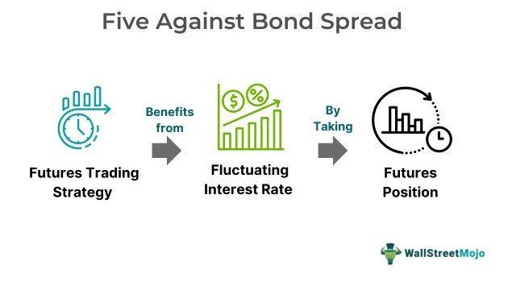

In the rapidly evolving world of finance, strategic investment practices are becoming increasingly essential for optimal portfolio growth. As financial markets grow more complex, investors are focusing on integrating advanced elements like investment bond spreads, financial strategies, and algorithmic trading to navigate and leverage the dynamic environment effectively. 

Investment bond spreads play a pivotal role by revealing the yield differential between various securities that share similar maturities but differ in their credit quality. They serve as key indicators of market sentiment and credit risk, offering insights into the perceived risk levels and creditworthiness of issuers. This understanding allows investors to make informed decisions that align with their risk tolerance and return objectives.



Financial strategies are evolving to exploit these insights, using tools such as the Five Against Bond Spread (FAB) method, which capitalizes on discrepancies in the Treasury yield curve. Successfully leveraging bond spreads requires a thorough grasp of market dynamics and macroeconomic indicators, ensuring strategies are both effective and adaptive to changing conditions.

Algorithmic trading further revolutionizes these strategies by automating decision-making processes, thereby enhancing efficiency in executing trades. By harnessing data analytics and machine learning, algorithms can process vast datasets and adapt to real-time market conditions, optimizing trading strategies and mitigating risks effectively.

This article investigates into the integration of investment bond spreads, financial strategies, and algorithmic trading to enhance financial decision-making and returns, providing insights into how these elements collectively drive modern trading environments.

## Table of Contents

## Understanding Investment Bond Spreads

Investment bond spreads refer to the yield differential observed between securities that share similar maturities but differ in credit quality. These spreads are instrumental in evaluating the prevailing market sentiment and the perceived credit risk associated with various issuers. Investors closely monitor these spreads to assess the compensation required for taking additional risk beyond holding risk-free securities.

Credit spreads are a measure of the difference in yield between a risk-free government bond and a corporate bond of the same maturity. For instance, if a 10-year government bond yields 3% and a corporate bond of the same maturity yields 5%, the credit spread is 2%. This spread reflects the additional yield demanded by investors for the increased credit risk posed by the corporate bond issuer.

Yield spreads can also refer to the difference in yields between bonds of different credit qualities or the difference in yield curves across countries. These spreads provide insights into broader economic conditions, monetary policies, and investor expectations. A widening spread often signals increased risk aversion or deteriorating credit quality, while a narrowing spread may indicate improved economic prospects or reduced perceived risk.

Option-adjusted spreads (OAS) are another form of measurement used in the analysis of bonds with embedded options, such as callable or putable bonds. These spreads adjust the yield differential to account for the value of the embedded options, offering a more accurate picture of the bond's risk-adjusted yield. The OAS is crucial for comparing the yields of securities with and without embedded options, eliminating the distortions caused by optionality.

In summary, investment bond spreads provide essential insights into market dynamics and the risk-reward trade-off in fixed-income securities. By analyzing different types of spreads—credit spreads, yield spreads, and option-adjusted spreads—investors can evaluate issuer creditworthiness and adjust their investment strategies according to the prevailing financial climate.

## Financial Strategies Using Bond Spreads

Leveraging bond spreads within financial strategies necessitates a thorough evaluation of risk, return potential, and prevailing economic conditions. Investment bond spreads are instrumental in identifying and exploiting pricing inefficiencies not only within the bond market but also across diverse financial sectors. By analyzing the differential between yields of securities with similar maturities but differing credit qualities, investors can align their strategies with prevailing market sentiments and economic indicators.

One notable strategy is the "Five Against Bond Spread" (FAB), which targets Treasury yield curve discrepancies. This strategy focuses on mismatches across the yield curve, allowing traders to capitalize on relative value opportunities. The FAB strategy typically involves taking positions in five specific points on the yield curve to exploit anomalies and generate alpha. By identifying yield curve slope differences, investors can leverage these for [arbitrage](/wiki/arbitrage) opportunities. Python can be used to model the FAB strategy, allowing for simulations under various economic conditions and stress-testing the strategy's efficacy.

```python
import numpy as np
import matplotlib.pyplot as plt

# Hypothetical yield curve data
maturities = np.array([1, 2, 5, 10, 30])  # in years
yields = np.array([0.005, 0.007, 0.015, 0.025, 0.035])  # in decimal form

# FAB calculation: finding anomalies in yield spreads
spreads = np.diff(yields)

plt.plot(maturities[1:], spreads, marker='o')
plt.title("Yield Curve Spreads")
plt.xlabel("Maturity (Years)")
plt.ylabel("Yield Spread")
plt.grid(True)
plt.show()
```

Understanding market dynamics is essential when employing bond spread strategies. Traders must monitor macroeconomic indicators such as inflation rates, GDP growth, and central bank policies, as these factors directly impact bond yields and spreads. For instance, inflation expectations can lead to changes in long-term interest rates, altering the yield curve's shape and thus providing opportunities to exploit spread movements.

Additionally, credit risk assessments play a crucial role in bond spread strategies. Understanding the creditworthiness of bond issuers can provide insights into potential spread widening or tightening scenarios. This allows investors to adjust their positions based on anticipated changes, thereby optimizing their portfolios in varying economic climates.

In summary, financial strategies using bond spreads necessitate comprehensive analysis and a keen awareness of both micro and macro-level market indicators. By effectively implementing such strategies, investors can enhance their return potential while mitigating associated risks.

## Algorithmic Trading: Revolutionizing Financial Strategies

Algorithmic trading, often referred to as algo trading, is transforming traditional financial strategies by automating the decision-making processes involved in trading. This method leverages sophisticated algorithms to analyze vast datasets and execute trades with precision and speed that surpass human capabilities. The automation of these processes not only increases efficiency but also significantly reduces the likelihood of human error.

A key advantage of [algorithmic trading](/wiki/algorithmic-trading) is its ability to process large volumes of data and generate trading signals in real-time. This capability enables traders to adapt swiftly to changing market conditions, optimizing the execution of bond spread strategies. For instance, algorithms can identify discrepancies in bond yield spreads, execute trades to exploit these inconsistencies, and adjust positions as market data evolves — all within milliseconds.

One of the most transformative aspects of algorithmic trading is the integration of [machine learning](/wiki/machine-learning) (ML) and advanced data analytics. Machine learning models can be trained to recognize patterns and predict future market movements based on historical and real-time data. This predictive power allows for the development of more sophisticated trading strategies that can dynamically adjust to market [volatility](/wiki/volatility-trading-strategies) and capitalize on emerging opportunities. For example, a machine learning model might use regression algorithms to forecast bond yield spreads based on variables like interest rates, economic indicators, and historical spread data.

Here is a simple example using Python for a machine learning model that predicts bond yield spreads using linear regression from the scikit-learn library:

```python
from sklearn.model_selection import train_test_split
from sklearn.linear_model import LinearRegression
import pandas as pd

# Example data loading
data = pd.read_csv('bond_yield_spreads.csv')

# Select features and target
features = data[['interest_rate', 'economic_indicator']]
target = data['yield_spread']

# Split the dataset
X_train, X_test, y_train, y_test = train_test_split(features, target, test_size=0.2, random_state=42)

# Initialize and train the model
model = LinearRegression()
model.fit(X_train, y_train)

# Predicting spreads
predictions = model.predict(X_test)
```

Beyond predictive analytics, algorithmic trading systems also incorporate risk management protocols to mitigate potential downsides. Algorithms can implement stop-loss orders and other risk control measures automatically, ensuring that positions are adjusted to align with the trader's risk tolerance and market conditions.

While algorithmic trading offers remarkable advantages, it comes with its own set of challenges, such as the need for robust technological infrastructure and the potential for errors in algorithm design or data input. Nonetheless, as technology continues to advance, the capacity for algorithmic trading systems to optimize financial strategies and efficiently manage risks will likely continue to grow, enabling enhanced returns for investors.

## Risks and Challenges in Bond Spread Trading

Bond spread trading presents inherent risks that necessitate careful analysis and strategic planning. Market volatility is one primary concern, as it can cause sudden and unpredictable fluctuations in yield spreads. These fluctuations may result from economic data releases, geopolitical events, or central bank policy changes, making it challenging for traders to predict market movements accurately.

Liquidity risk is another significant challenge. Bond markets can vary in [liquidity](/wiki/liquidity-risk-premium), and certain bonds may be harder to sell without affecting their price. This risk can be particularly acute in periods of market stress when liquidity tends to dry up, potentially leading to unfavorable pricing for traders looking to enter or [exit](/wiki/exit-strategy) positions.

Algorithmic trading, while essential for efficient execution, is not infallible. Inaccurate algorithmic assessments can arise from errors in the underlying models or data inaccuracies. Algorithms rely heavily on data quality and stability; thus, any discrepancies in these inputs can lead to suboptimal trading decisions. Consequently, continuous monitoring and updating of algorithms are necessary to ensure their reliability and accuracy.

To mitigate these risks, traders employ various risk management techniques. Diversification is a common strategy to spread risk across different assets, reducing the impact of adverse movements in any single position. Additionally, stop-loss orders are crucial in managing potential downsides, allowing traders to set predetermined exit points to minimize losses when trades move unfavorably.

In light of these challenges, effective risk management becomes pivotal in bond spread trading. By understanding and preparing for the potential pitfalls associated with market volatility, liquidity issues, and algorithmic inaccuracies, traders can enhance their ability to navigate the complexities of bond markets successfully.

## Conclusion

In today's dynamic financial markets, investment bond spreads, combined with strategic financial planning and algorithmic trading, present significant opportunities for market optimization. The integration of these components provides a comprehensive approach for traders to enhance their returns while effectively managing associated risks.

By utilizing bond spreads, investors can gauge market sentiment and credit risk, enabling informed decision-making. These spreads serve as critical indicators of economic conditions and issuer creditworthiness, allowing traders to exploit discrepancies for potential gains.

Strategic financial planning plays a crucial role in this process. By evaluating risk and return potential, traders can devise robust strategies such as the Five Against Bond Spread, which seeks to capitalize on differences in the Treasury yield curve. This strategic approach is augmented by a deep understanding of market dynamics and macroeconomic indicators.

Algorithmic trading further revolutionizes financial strategies by automating decision-making processes. Algorithms are capable of analyzing vast datasets, adjusting trades based on real-time market conditions, and incorporating machine learning to optimize strategies. This technological advancement enhances precision and efficiency in executing bond spread strategies, granting traders a competitive edge.

Despite the opportunities, bond spread trading is not devoid of challenges. Market volatility, liquidity risks, and potential inaccuracies in algorithmic assessments necessitate robust risk management techniques. Strategies such as diversification and stop-loss orders are essential to mitigate potential downsides and protect investments.

To maintain competitiveness in the financial landscape, continuous learning and adaptation to evolving market conditions are imperative. As market environments change, the ability to adjust strategies and leverage new technologies will determine long-term success. Through the synergy of bond spreads, strategic planning, and algorithmic trading, investors are well-equipped to navigate the complexities of the financial markets and achieve optimal returns.

## References & Further Reading

[1]: Bergstra, J., Bardenet, R., Bengio, Y., & Kégl, B. (2011). ["Algorithms for Hyper-Parameter Optimization."](https://dl.acm.org/doi/10.5555/2986459.2986743) Advances in Neural Information Processing Systems 24.

[2]: ["Advances in Financial Machine Learning"](https://www.amazon.com/Advances-Financial-Machine-Learning-Marcos/dp/1119482089) by Marcos Lopez de Prado

[3]: ["Evidence-Based Technical Analysis: Applying the Scientific Method and Statistical Inference to Trading Signals"](https://www.amazon.com/Evidence-Based-Technical-Analysis-Scientific-Statistical/dp/0470008741) by David Aronson

[4]: ["Machine Learning for Algorithmic Trading"](https://github.com/stefan-jansen/machine-learning-for-trading) by Stefan Jansen

[5]: ["Quantitative Trading: How to Build Your Own Algorithmic Trading Business"](https://www.amazon.com/Quantitative-Trading-Build-Algorithmic-Business/dp/1119800064) by Ernest P. Chan

[6]: ["Credit Risk: Pricing, Measurement, and Management"](https://press.princeton.edu/books/hardcover/9780691090467/credit-risk) by Darrell Duffie and Kenneth J. Singleton

[7]: ["Fixed Income Analysis"](https://en.wikipedia.org/wiki/Fixed_income_analysis) by Barbara S. Petitt, Jerald E. Pinto, and Wendy L. Pirie

[8]: Fabozzi, Frank J., Mann, Steven V., & Choudhry, Moorad. (2005). ["Bond and Money Markets: Strategy, Trading, Analysis."](https://books.google.com/books/about/The_Global_Money_Markets.html?id=wyLQ-ZNK5_wC) 

[9]: ["Algorithmic Trading: Winning Strategies and Their Rationale"](https://books.google.com/books/about/Algorithmic_Trading.html?id=WAlFDwAAQBAJ) by Ernest P. Chan