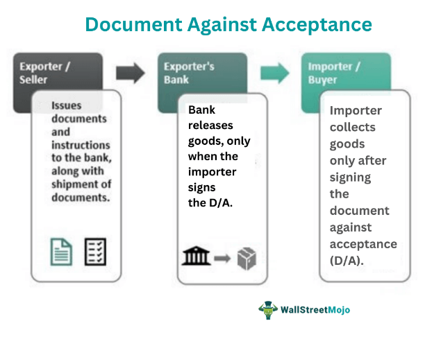

Financial trading strategies form the bedrock of effective investment decisions, with the Five Against Note (FAN) spread strategy standing out due to its unique approach in futures trading. Unlike straightforward buying and selling, the FAN strategy involves the simultaneous purchase and sale of different financial instruments, specifically focusing on Treasury notes with differing maturities. By leveraging the price differentials of these notes, traders aim to capitalize on shifts in interest rates and yield curves, thus optimizing their portfolios.

FAN strategies are pivotal in futures trading. They necessitate the use of both five-year and ten-year Treasury notes, creating a spread that allows traders to profit from the nuanced movements between these two maturities. The core of FAN strategies lies in anticipating changes in the demand and supply dynamics of Treasury notes, which are integral to setting prices. Thus, a deep understanding of these movements is crucial for executing a successful FAN spread.



The execution of FAN strategies benefits immensely from the role of automated or algorithmic trading. In an era where market data is both vast and continuously in flux, manual trading approaches can fall short. Algorithmic trading systems, designed with intricate algorithms, can process large datasets at speeds unattainable by human traders. These algorithms facilitate the execution of FAN trades by predicting market trends, exploiting price inefficiencies, and managing the simultaneous positions of five and ten-year Treasury notes swiftly and accurately. The precision brought by automated systems ensures that traders can respond to market conditions in real-time, enhancing the effectiveness of FAN strategies.

The primary objective of this article is to furnish traders and investors with a thorough understanding of FAN strategies. By elucidating the mechanics, applications, and intricacies of this trading strategy, the article aims to equip market participants with the insights needed to harness the potential of FAN trading. Such knowledge is especially valuable in the evolving landscape of financial markets, where strategic agility and technological integration play crucial roles in achieving investment success.

## Table of Contents

## Understanding the FAN Strategy

A Five Against Note (FAN) spread strategy is a method employed in futures trading that involves simultaneously buying and selling futures contracts to capitalize on the price differentials between them. Specifically, in the context of FAN spreads, traders focus on five-year and ten-year U.S. Treasury notes. This strategy aims to profit from expected fluctuations and price movements between these two different maturity Treasury notes, essentially betting on the difference in their yield curve.

In futures trading, a spread typically involves taking a long position in one futures contract while going short on another. The FAN strategy leverages this by focusing on the Treasury notes with different maturities — the five-year and the ten-year. By doing so, it exploits the relative price movement based on perceived changes in interest rates and economic conditions. The fundamental principle here is the price-yield relationship: as bond prices increase, yields decrease and vice versa. Therefore, understanding the factors influencing Treasury note prices, such as Federal Reserve policies and macroeconomic indicators, is crucial for executing a successful FAN strategy.

Effective execution of a FAN strategy requires a deep understanding of price movements in Treasury notes. Traders analyze historical data, economic outlooks, and [interest rate](/wiki/interest-rate-trading-strategies) trends to make informed predictions about short-term and long-term changes in note demand. For instance, if economic signs suggest rising inflation, investors might expect an increase in interest rates, which usually leads to a decrease in bond prices. Such insights allow traders to anticipate price changes, positioning themselves to benefit from these fluctuations.

Several key takeaways emerge from using FAN strategies. Primarily, they enable traders to make predictions about relative demand changes in five-year versus ten-year Treasury notes. This can be influenced by various factors including inflation expectations, geopolitical events, and monetary policy shifts. Moreover, while FAN strategies can be lucrative, they require keen market awareness and the ability to respond swiftly to new information. The strategy's success hinges not just on forecasting ability, but also on understanding the intricate dynamics of the bond markets and their reactions to broader economic changes.

## Mechanics of FAN in Algorithmic Trading

Algorithmic trading plays a pivotal role in the execution of Five Against Note (FAN) strategies, primarily due to its ability to handle complex computations and large datasets with precision and speed. At its core, [algorithmic trading](/wiki/algorithmic-trading) involves using computer programs to follow a defined set of instructions for placing trades, which helps in maximizing profits and minimizing risks. When applied to FAN strategies, these algorithms are particularly effective in predicting market trends for five-year and 10-year Treasury notes.

### Prediction of Market Trends

The prediction process involves using historical data to recognize patterns and forecast future price movements of both five-year and 10-year Treasury notes. Machine learning models like decision trees or neural networks can be employed to analyze a multitude of variables, such as past price data, interest rate announcements, and inflation reports. These models are trained to identify relationships between these variables and how they influence the price movements of Treasury notes.

Consider a simple linear regression model to predict the price of a Treasury note:

$$
\text{Price\_Tomorrow} = \alpha + \beta_1 \times \text{Price\_Today} + \beta_2 \times \text{Interest\_Rate\_Change} + \ldots + \varepsilon
$$

Here, $\alpha$ is the intercept, $\beta_1, \beta_2, \ldots$ are the coefficients representing the impact of various predictors, and $\varepsilon$ is the error term.

### Managing Simultaneous Positions

FAN strategies involve taking long positions in one set of Treasury notes while simultaneously taking short positions in another to profit from price differentials. Automated trading systems excel in managing these simultaneous positions due to their ability to process information and execute trades with lightning speed. These systems can monitor multiple data sources in real-time, ensuring that positions are adjusted as market conditions fluctuate.

Python's capabilities in handling such tasks can be illustrated with a sample code snippet:

```python
import numpy as np
from sklearn.linear_model import LinearRegression

# Sample historical data
prices_today = np.array([[100, 101, 102]])
interest_rate_changes = np.array([[0.01, 0.02, -0.01]])

# Train a simple linear regression model
model = LinearRegression()
model.fit(np.hstack((prices_today.T, interest_rate_changes.T)), np.array([100.5, 101.5, 103]))

# Predict future prices
future_price_prediction = model.predict(np.array([[102, 0.00]]))
print(f"Predicted future price: {future_price_prediction}")
```

This snippet demonstrates training a linear regression model on historical data and using it to predict future Treasury note prices, automatically adjusting trading positions.

### Precision and Speed

Algorithmic trading systems outperform human traders through their precision and speed. These systems can execute orders in milliseconds, much faster than manual trading, reducing the likelihood of slippage and improving trading outcomes. Additionally, they continuously backtest strategies against historical data, optimizing their parameters to refine predictions and enhance performance.

In the dynamic environment of futures trading, the ability to rapidly adjust to price movements is invaluable. An effective algorithmic trading system integrated into a FAN strategy can react to market dynamics almost instantaneously, placing or adjusting trades as required to sustain profitability.

In conclusion, by leveraging advanced prediction models, automated management of trading positions, and the unmatched speed and precision of algorithmic systems, traders can enhance their execution of FAN strategies, optimizing their outcomes in the ever-evolving financial markets.

## Example of a FAN Strategy Application

A Five Against Note (FAN) strategy leverages the spread between five-year and 10-year U.S. Treasury notes to capitalize on interest rate movements and economic conditions. Here's how a FAN strategy might be implemented:

### Step-by-Step Implementation

1. **Market Analysis and Economic Indicators**: The initial step involves analyzing economic indicators such as inflation rates, employment data, and GDP growth. These indicators influence the Federal Reserve's monetary policy decisions, impacting interest rates and consequently, Treasury note yields.

2. **Position Selection**: Based on the economic analysis, a trader decides on taking long or short positions in the Treasury notes. For example, if the Fed is expected to raise interest rates due to robust economic growth, the price of existing Treasury notes may decrease, leading to the decision of shorting long-term (10-year) notes and longing short-term (5-year) notes.

3. **Establishing the Spread**: A FAN strategy is constructed by establishing a spread through simultaneous buying (or shorting) of five-year Treasury notes and selling (or shorting) of 10-year Treasury notes. Algorithmic platforms can automate this process, ensuring precise timing and execution, which is crucial given the volatile nature of yield changes.

4. **Monitoring Interest Rates and Yield Curves**: The spread's profitability largely depends on changes in the yield curve. An inverted yield curve might signal a recession, prompting adjustments in the long or short positions based on expected future interest rate changes.

### Hypothetical Market Scenario

Consider a scenario where economic data suggests a potential slowdown, leading traders to anticipate that the Federal Reserve might cut interest rates. In response, a trader might adopt the following strategy:

- **Short Five-Year Notes**: Anticipating that their yields will decline more steeply as investors flock to these shorter-term notes for safety.
- **Long 10-Year Notes**: Expecting that while rates may fall, the long-term notes will maintain a premium for longer-term investment stability.

### Outcomes and Predictions

- **Scenario 1**: If the Federal Reserve decreases interest rates due to continued economic decline, the yield curve may steepen. The trader benefits from holding long positions in 10-year notes, which increase in value as their yields drop.

- **Scenario 2**: Alternatively, if the economic conditions stabilize and the rate cuts are less aggressive, the yield spread narrows, potentially resulting in minimal gains or losses. The key is adjusting positions swiftly, relying heavily on algorithmic systems for fast responses.

### Decision-Making Process

Traders must continually assess economic reports and adjust their positions reflecting changes in economic outlooks. Tools like Fibonacci retracements or MACD (Moving Average Convergence Divergence) indicators can assist in identifying optimal entry and [exit](/wiki/exit-strategy) points within the strategy framework. Moreover, programming solutions in Python might resemble:

```python
import numpy as np
import pandas as pd

# Hypothetical data on yield movement
five_year_yield = np.array([1.6, 1.5, 1.4])
ten_year_yield = np.array([2.0, 1.95, 1.90])

# Spread computation
spread = ten_year_yield - five_year_yield

# Decision: Long if spread is expected to widen, Short if expected to narrow
decision = np.where(spread[-1] > spread[-2], 'Long', 'Short')
```

In conclusion, the FAN strategy's effectiveness hinges on precise market predictions, informed decisions on yield movements, and swift execution facilitated by algorithmic trading methods. This strategy allows traders to exploit the discrepancies in interest rates between five-year and 10-year Treasury notes effectively.

## Bond Yields vs. Bond Prices in FAN Strategy

In the Five Against Note (FAN) strategy, a clear understanding of the distinction between bond yields and bond prices is crucial. Bond prices and yields are inversely related; as bond prices increase, yields decrease, and vice versa. This relationship plays a pivotal role in the profitability and execution of FAN strategies, which involve trading futures on five-year and 10-year Treasury notes.

Bond yields indicate the return an investor can expect from holding the bond until maturity. However, in futures trading, such as with the FAN strategy, traders are more concerned with price movements than holding the underlying security. The FAN strategy involves taking offsetting positions in futures contracts of differing maturities—typically, the five-year note against the 10-year note—exploiting their price movements to generate profits.

Interest rates indirectly affect FAN strategies through their influence on bond yields. For instance, a rise in general interest rates typically leads to a fall in bond prices, which increases bond yields. In a FAN strategy, anticipating these movements can help traders decide their positions, whether to go long or short on the respective futures contracts.

The core profitability of the FAN strategy hinges on changes in bond prices over time. The strategy seeks to capitalize on discrepancies in pricing dynamics between the five-year and 10-year Treasury futures. For example, if the expectation is that the price of the five-year note will increase relative to the 10-year note, a trader may go long on the five-year futures and short on the 10-year futures, benefiting from the price convergence.

Understanding the yield curve is fundamental for forecasting bond price movements, which is essential for FAN strategy success. The yield curve, which plots the interest rates of bonds having equal credit quality but differing maturity dates, reflects investor sentiment and forecasts future interest rate changes. A steep yield curve suggests higher future rates, potentially leading to decreased bond prices, while a flat or inverted yield curve might indicate lower future rates with different implications for bond prices.

In summary, recognizing the nuanced relationship between yields, prices, and interest rates in the context of the FAN strategy enables traders to strategically forecast price movements, thus optimizing trading outcomes and profitability.

## Challenges and Considerations

Financial trading strategies, such as the Five Against Note (FAN) spread, offer complex avenues for traders to potentially benefit from movements in Treasury notes. However, there are inherent challenges and considerations that traders must account for to successfully execute these strategies. 

**Risks and Mitigation**  
The FAN strategy is fundamentally about predicting and profiting from the spread between five-year and ten-year Treasury notes. The primary risk lies in the miscalculation of interest rate movements and their impact on Treasury note prices. Market conditions, including economic indicators and Federal Reserve policies, can lead to unexpected shifts in note demand, affecting the FAN spread adversely.

To mitigate such risks, traders can employ robust risk management tools. Leveraging derivatives such as options can provide a hedge against unfavorable movements. Additionally, setting stop-loss orders ensures that losses are capped in adverse market scenarios. It is also critical that traders maintain a diversified portfolio to absorb [volatility](/wiki/volatility-trading-strategies) in specific note spreads.

**Common Misconceptions and Pitfalls**  
A prevalent misconception in executing FAN strategies is the assumption of a linear relationship between bond prices and interest rates. In reality, this relationship can be influenced by a multitude of factors including geopolitical events, changes in inflation expectations, and shifts in global economic outlooks. 

Traders often err by relying solely on historical data without incorporating the current market dynamics. It is essential to combine historical trends with real-time analysis to forecast accurately. Misjudging the [liquidity](/wiki/liquidity-risk-premium) of Treasury notes can also lead to challenges, as low liquidity environments can amplify price movements unfavorably.

**Timing and Market Analysis**  
Success in the FAN strategy heavily hinges on precise timing driven by comprehensive market analysis. The spread between five-year and ten-year notes can be volatile, requiring traders to be adept at predicting interest rate changes. Timely execution is paramount, as delays can result in missed opportunities or losses. 

Utilizing economic indicators such as employment rates, GDP growth, and consumer price index data can offer insights into potential interest rate movements. Technical analysis tools, including moving averages and Bollinger Bands, can aid in identifying optimal entry and exit points.

**Considerations for Automating FAN Strategy Execution**  
Incorporating algorithmic trading systems can enhance the execution of FAN strategies by automating the rapid buying and selling decisions needed to capitalize on small price differences. However, it is critical that these systems are meticulously programmed to adapt to dynamic market conditions.

Traders must ensure that algorithms are not only based on historical data but are also capable of integrating real-time market feeds to adjust for new patterns. It is essential for practitioners to constantly back-test strategies and refine models to reflect the latest market trends and data.

Furthermore, the importance of maintaining robust cybersecurity cannot be understated, as automated systems are vulnerable to hacking and data breaches which could lead to substantial financial loss.

In conclusion, while FAN strategies present lucrative opportunities, a well-rounded approach—incorporating risk management, market analysis, and strategic automation—is indispensable to navigate the inherent challenges associated with this complex financial trading approach.

## Conclusion

The Five Against Note (FAN) spread strategy stands out as a sophisticated approach in futures trading, offering traders an opportunity to capitalize on the price differentials between five-year and 10-year Treasury notes. Its success largely hinges on precise market predictions and the integration of algorithmic trading. This strategy is not merely about taking positions based on gut feelings but involves a thorough analysis of market trends, economic indicators, and Treasury note behaviors.

A key benefit of employing the FAN strategy lies in its ability to leverage concurrent positions in different Treasury notes, thus enabling traders to hedge risks while potentially enhancing returns. Algorithmic trading plays a crucial role in executing FAN strategies by offering the speed and precision necessary to respond to real-time market dynamics. Algorithms analyze vast datasets to predict movements in Treasury note prices, adjusting positions to seize profitable opportunities swiftly.

Investors and traders are encouraged to incorporate FAN strategies into their portfolios, provided they maintain a keen awareness of prevailing market conditions and shifts. This vigilance is crucial, as market volatility can impact the profitability of the FAN strategy significantly. By balancing long and short positions effectively, traders can adapt to varying economic climates, ensuring strategic advantage.

As financial trading continues to evolve, strategies like FAN are expected to gain prominence. Advances in technology, algorithmic models, and data analysis will likely refine these approaches, making them more accessible and efficient. Traders' success will depend on their ability to harness these tools while maintaining a robust understanding of the market's complexities.

## References & Further Reading

[1]: ["Treasury Yield Curve"](https://home.treasury.gov/policy-issues/financing-the-government/interest-rate-statistics) - Federal Reserve Economic Data. 

[2]: Goodhart, C., & Lim, W. B. (2011). ["Interest Rate Models, Asset Pricing, and Risk Management: Market Practice, Treasury Note Futures and Treasury-Cash Basis Spreads."](https://www.jstor.org/stable/26599842) Found in Handbook of Asian Finance: REITs, Trading, and Fund Performance.

[3]: ["Treasury Securities & Programs"](https://home.treasury.gov/services/bonds-and-securities) - United States Department of the Treasury.

[4]: Narang, R. K. (2009). ["Inside the Black Box: The Simple Truth About Quantitative Trading."](https://onlinelibrary.wiley.com/doi/book/10.1002/9781118267738) John Wiley & Sons.

[5]: ["Algorithmic Trading & DMA: An Introduction to Direct Access Trading Strategies"](https://www.amazon.com/Algorithmic-Trading-DMA-introduction-strategies/dp/0956399207) by Barry Johnson.

[6]: Chincarini, L., & Kim, D. (2006). ["Quantitative Equity Portfolio Management: An Active Approach to Portfolio Construction and Management."](https://archive.org/details/quantitativeequi0000chin_c9d6) McGraw-Hill.

[7]: Ait-Sahalia, Y., & Lo, A. W. (2000). ["Nonparametric Risk Management and Implied Risk Aversion."](https://www.nber.org/papers/w6130) National Bureau of Economic Research Working Paper No. 6835.