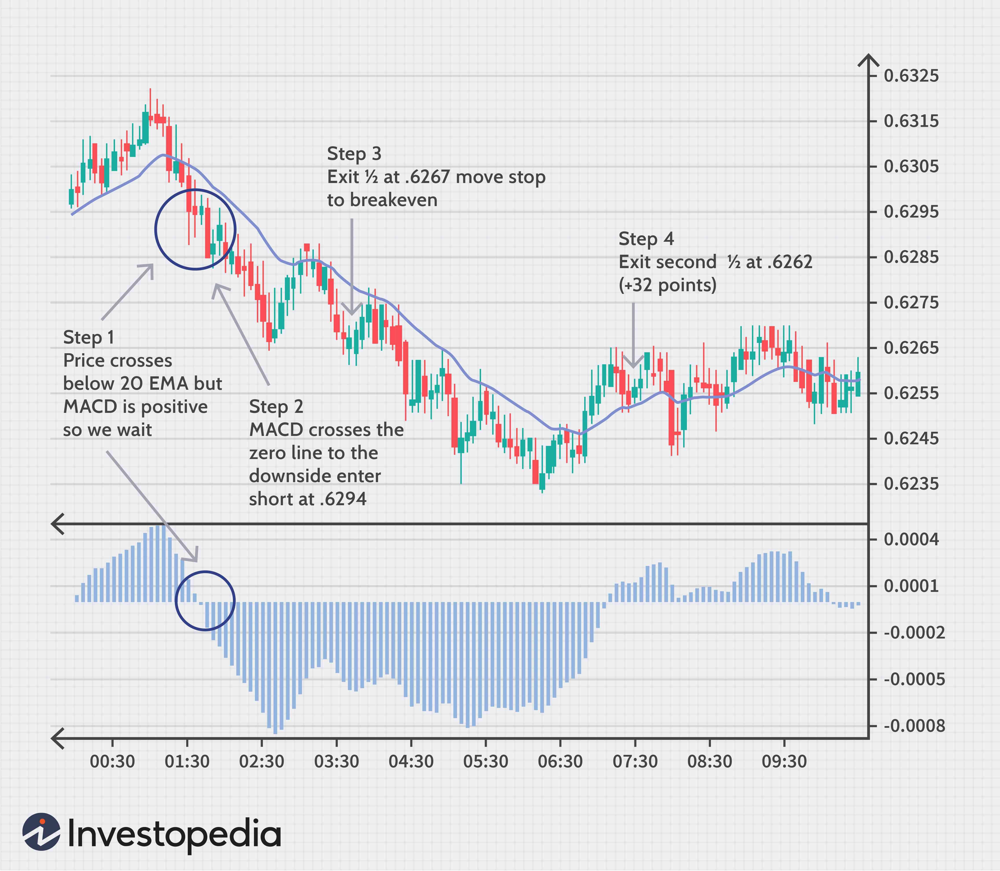

Technical analysis is an essential tool in trading, providing traders with the means to evaluate and make predictions about future price movements based on historical market data. This analytical method employs various charts and indicators, allowing traders to discern trends and patterns that may suggest future movements in asset prices.

One such tool that has gained significant attention is the 5-minute chart, which is increasingly popular among traders seeking to capitalize on short-term price fluctuations. This chart type offers granular insights into price movements, making it particularly useful for traders looking to exploit small, rapid shifts in market conditions. As a result, the 5-minute chart has become a key asset in short-term trading strategies, appealing to day traders and those employing high-frequency trading approaches.



Algorithmic trading, or algo trading, has transformed the financial markets, enabling trades to be executed at speeds and frequencies unimaginable with manual trading. Through the use of complex algorithms, traders can automate the trading process, react swiftly to market conditions, and minimize human error. The incorporation of algorithmic strategies has expanded the capability to process vast amounts of data efficiently, bolstering decision-making processes and risk management.

Combining technical analysis with algorithmic trading can significantly enhance a trader's chances of success. By integrating technical indicators into algorithms, traders can automate the technical analysis process, thereby executing trades based on predefined criteria without manual intervention. This synergy of technical analysis and algo trading enables the execution of strategies with a consistency and precision that is difficult to achieve otherwise. Rapid analysis and response to technical signals can lead to improved trade outcomes.

This article is designed to explore effective strategies for harnessing the power of technical analysis within 5-minute chart algo trading. Through exploring the basics of technical analysis, the nuances of the 5-minute chart, and the complexities of algo trading, the article aims to provide comprehensive insights into constructing strategies that leverage both technical analysis and algorithmic systems. Ultimately, the goal is to equip traders with the knowledge to develop robust, adaptive trading approaches suitable for contemporary financial markets.

## Table of Contents

## Basics of Technical Analysis

Technical analysis is a method used to evaluate and forecast the future price movements of assets by examining historical data, primarily price and volume. Unlike [fundamental analysis](/wiki/fundamental-analysis), which considers the intrinsic value of an asset based on financial statements and external factors, technical analysis focuses on identifying patterns and trends that suggest potential future behaviors of market instruments. It is based on the principle that all current factors are already reflected in the asset's price, and thus, historical price movements can provide insights into future trends.

### Key Principles of Technical Analysis

1. **Market Discounts Everything**: This principle suggests that all available information—economic, political, and psychological factors—is reflected in market prices.
2. **Price Moves in Trends**: Technical analysts believe that prices move in identifiable trends or patterns. Once a trend is established, the future movement of an asset's price is more likely to continue in the direction of the trend than to reverse.
3. **History Tends to Repeat Itself**: Historical market movements often reoccur because participants' collective behavior tends to repeat over time. This repetition can be observed through chart patterns.

### Common Tools and Indicators

Technical analysts use a variety of tools and indicators to predict market movements. Some of the most common include:

- **Moving Averages (MA)**: These smooth out price data to identify trends over a particular period. A simple moving average is calculated by taking the average of an asset's price over a specific number of periods. Mathematically, it is expressed as:
$$
  \text{SMA} = \frac{P_1 + P_2 + ... + P_n}{n}

$$

  where $P$ is the price of the asset and $n$ is the number of periods.

- **Relative Strength Index (RSI)**: This momentum oscillator measures the speed and change of price movements, indicating overbought or oversold conditions. Usually calculated over a 14-day period, RSI values range from 0 to 100, with values above 70 indicating overbought conditions and those below 30 indicating oversold conditions.

- **Moving Average Convergence Divergence (MACD)**: This trend-following momentum indicator shows the relationship between two moving averages. It is calculated by subtracting the 26-period EMA (Exponential Moving Average) from the 12-period EMA. A nine-day EMA of the MACD called the "signal line" is then plotted on top of the MACD, functioning as a trigger for buy and sell signals.

- **Bollinger Bands**: These consist of a set of lines plotted two standard deviations (positively and negatively) away from a simple moving average of the asset's price. Bollinger Bands adjust themselves to the market volatility, indicating overbought or oversold conditions relative to the price.

### Analyzing Market Patterns and Price Movements

Technical analysis relies heavily on the identification of patterns, which can be categorized as either continuation or reversal patterns. Continuation patterns, such as triangles and flags, signal that an existing trend is likely to continue, while reversal patterns, like head and shoulders or double tops, suggest a trend change. Price movements are often analyzed in conjunction with [volume](/wiki/volume-trading-strategy), as volume spikes often accompany significant price movements.

### Advantages of Technical Analysis in Short-Term Trading

Technical analysis is particularly advantageous for short-term trading for several reasons:

- **Speed and Simplicity**: Technical analysis can be performed relatively quickly using charts and indicators, which is crucial for traders dealing with short-term time frames.
- **Market Cycles**: Short-term traders benefit from the repetitive nature of market behavior, utilizing historical patterns to make informed decisions.
- **Adaptability**: Technical analysis can be used across various asset classes, making it a versatile tool for traders.

By focusing on patterns, trends, and technical indicators, traders can develop strategies to exploit short-term market inefficiencies, making technical analysis a valuable tool in the trader's toolkit.

## Understanding the 5-Minute Chart

The 5-minute chart is a crucial tool for traders focusing on short-term market movements. It provides a visual representation of price data where each candlestick or bar encapsulates five minutes of trading activity. This chart is significant due to its ability to offer near real-time insights into market dynamics, allowing traders to quickly identify trends and make prompt decisions.

One of the key advantages of the 5-minute chart is its responsiveness to short-term trends. This granularity is ideal for day traders and scalpers who need to react swiftly to price fluctuations. The chart captures fleeting market movements that might be missed on longer time frames like the 30-minute or hourly charts, enabling traders to exploit minor price changes for potential gains.

When compared to other time frames, the 5-minute chart provides a more detailed view of short-term market activity without the noise that can be associated with even shorter intervals, such as the 1-minute chart. Longer time frames, such as the daily or weekly charts, smooth out these short-term fluctuations, offering a broader perspective at the expense of immediacy. Thus, the choice of time frame depends on the trader's strategy, risk tolerance, and market conditions.

Benefits of the 5-minute chart include its ability to quickly reveal changes in [momentum](/wiki/momentum) and trends, which is essential for executing timely trades. Traders often use this time frame to capitalize on short-lived opportunities and to enter and [exit](/wiki/exit-strategy) positions multiple times within a trading session, potentially increasing profit opportunities. Additionally, it provides a framework for implementing various technical analysis techniques, such as pattern recognition and indicator usage, effectively in a volatile short-term market.

However, the 5-minute chart also presents challenges. The rapid nature of price movements requires traders to maintain vigilance and execute trades promptly to capitalize on favorable conditions. This demands a high level of discipline and expertise in technical analysis to avoid impulsive decisions triggered by the inherent noise and [volatility](/wiki/volatility-trading-strategies) of short-term trading. Moreover, traders must efficiently manage transaction costs, which can accumulate rapidly with frequent trading.

In summary, the 5-minute chart is a powerful instrument for traders aiming to capture short-term market shifts. It offers both opportunities and challenges, requiring a balanced approach that considers the intricacies of rapid market movements while leveraging the advantages of detailed technical analysis.

 to Algo Trading

Algorithmic trading, often referred to as "algo trading," is a method of executing orders using automated and pre-programmed trading instructions to account for variables such as time, price, and volume. This approach leverages the speed and computational power of computers to conduct trades at a rate and frequency that a human trader cannot match. At its core, [algorithmic trading](/wiki/algorithmic-trading) is about setting a series of rules or algorithms which automate the trading process.

### Types of Algorithms Used in Trading

Algo trading employs various types of algorithms, each designed to serve specific purposes:

1. **Trend-Following Algorithms:** Often based on technical indicators such as moving averages, these algorithms aim to capture trends and make trades that align with the prevailing market direction.

2. **Arbitrage Algorithms:** These identify price discrepancies between different markets or assets, executing trades to exploit these margins until the price difference diminishes.

3. **Market-Making Algorithms:** These provide liquidity to markets by simultaneously placing buy and sell orders for a particular asset to capture the spread.

4. **Sentiment-Based Algorithms:** These algorithms utilize natural language processing (NLP) to analyze news or other text sources, trading based on interpreted market sentiment.

5. **Statistical Arbitrage Algorithms:** These employ statistical methods to identify trading opportunities based on the expected statistical relationship between financial instruments.

### Advantages of Algo Trading in Terms of Speed and Efficiency

Algo trading provides significant advantages due to its speed and efficiency:

- **Execution Speed:** Algorithms are capable of processing market data and executing orders at a fraction of a second. This rapid execution is crucial in fast-moving markets.

- **Efficiency:** By automating the trading process, algorithms eliminate human error and emotional biases from trading, ensuring consistent and efficient execution of trades.

- **Backtesting:** Algorithms can be tested on historical data to ensure their viability and effectiveness before being deployed in live markets.

### The Role of Algo Trading in Managing Risks

Algorithmic trading can serve as a powerful tool for risk management. By executing trades based on pre-defined rules, it can help mitigate emotional and cognitive biases that often lead to poor decision-making under pressure. Moreover, many algo trading strategies incorporate risk management features, such as stop-loss orders and position sizing, which help control potential losses.

Additionally, with the ability to analyze large datasets rapidly, algo trading systems can identify and react to risk factors more swiftly than manual trading, allowing traders to adjust their strategies in response to evolving market conditions. Furthermore, diverse algo strategies can be used to hedge existing portfolio positions, thereby reducing overall exposure to market volatility.

In conclusion, algorithmic trading represents a significant shift in how trades are executed and risks are managed, with the benefits of speed, efficiency, and objectivity. Each type of algorithm serves a specific purpose, contributing to a nuanced approach to market engagement.

## Combining Technical Analysis with Algo Trading

Algorithms play a crucial role in enhancing trading strategies by incorporating technical indicators effectively. Technical analysis involves studying price movements and market patterns to forecast future price directions, relying on indicators like moving averages, the relative strength index (RSI), and Bollinger Bands. These indicators can be integrated into algorithmic trading systems to automate the decision-making process for 5-minute chart strategies.

To design an algorithm that incorporates technical indicators, traders first need to define the trading rules based on these indicators. For instance, a simple moving average (SMA) crossover strategy can serve as the foundation: when a short-term SMA crosses above a long-term SMA, it generates a buy signal; conversely, a sell signal is generated when the short-term SMA crosses below the long-term SMA. This logic can be translated into an algorithm using a programming language like Python:

```python
import pandas as pd

# Sample SMA Crossover Strategy
def sma_crossover(data, short_window=5, long_window=20):
    data['Short_SMA'] = data['Close'].rolling(window=short_window, min_periods=1).mean()
    data['Long_SMA'] = data['Close'].rolling(window=long_window, min_periods=1).mean()

    data['Signal'] = 0
    data['Signal'][short_window:] = \
        (data['Short_SMA'][short_window:] > data['Long_SMA'][short_window:]).astype(int)

    data['Position'] = data['Signal'].diff()

    return data

# Example usage
price_data = pd.DataFrame(...)  # Load price data
signals = sma_crossover(price_data)
```

The effectiveness of combining algorithmic trading with technical strategies on a 5-minute chart lies in the ability to respond swiftly to market changes. The short time frame requires strategies that can process market data and execute trades within seconds. Automation is key in this context, as it ensures consistent adherence to trading strategies without the delay associated with human intervention.

Additionally, the rapid execution enabled by algorithmic trading allows traders to capitalize on fleeting opportunities that might be missed manually. For example, high-frequency trading algorithms can handle vast amounts of data and perform numerous trades in microseconds, vastly outperforming manual trading in terms of speed and accuracy.

Popular strategies combining technical analysis with algorithmic trading include trend-following systems and mean-reversion strategies. A trend-following algorithm might buy an asset when its price trends upward beyond a specified threshold, using indicators like the moving average convergence divergence (MACD). Conversely, mean-reversion strategies exploit deviations from the average price, predicting that the price will revert to its mean.

When developing these strategies, [backtesting](/wiki/backtesting) is essential. By evaluating a strategy against historical data, traders can optimize parameters and improve their model’s predictive accuracy. For example, optimizing the lengths of SMA windows in a crossover strategy can significantly impact performance on a 5-minute chart.

Ultimately, combining technical analysis with algorithmic trading requires a sophisticated understanding of both disciplines. By automating entry and exit decisions based on technical signals, traders can enhance performance, reduce emotional bias, and manage trading risks more effectively.

## Popular Technical Indicators for 5-Minute Charts

Technical indicators play a crucial role in 5-minute chart trades, as they help traders quickly analyze and act upon short-term market trends. Among the most effective indicators for this purpose are moving averages, the Relative Strength Index (RSI), the Moving Average Convergence Divergence (MACD), and Bollinger Bands.

### Moving Averages

Moving averages are fundamental to technical analysis and serve as baseline indicators for understanding market trends. The two most common types used in 5-minute chart trading are the Simple Moving Average (SMA) and the Exponential Moving Average (EMA). The SMA calculates the average price over a specific period, while the EMA gives more weight to recent prices, making it more responsive to price changes. 

To implement a simple moving average in Python:

```python
def simple_moving_average(prices, window):
    return [sum(prices[i:i+window])/window for i in range(len(prices)-window+1)]
```

The EMA can be expressed with the formula:

$$
\text{EMA}_{t} = (\text{Price}_{t} \times \frac{2}{N + 1}) + \text{EMA}_{t-1} \times \left(1 - \frac{2}{N + 1}\right)
$$

where $N$ is the number of days in the EMA.

### Relative Strength Index (RSI)

The RSI is a momentum oscillator that measures the speed and change of price movements, often used to identify overbought or oversold conditions. RSI values range from 0 to 100, with levels typically below 30 indicating potential buy signals, and above 70 suggesting sell signals.

The RSI is calculated using the formula:

$$
\text{RSI} = 100 - \left(\frac{100}{1 + \frac{\text{Average Gain}}{\text{Average Loss}}}\right)
$$

For effective calibration, short-term traders often prefer a 9 or 14-period RSI for more responsive signals.

### Moving Average Convergence Divergence (MACD)

MACD is a trend-following momentum indicator that calculates the difference between two EMAs, typically the 12-period and 26-period. A signal line, usually a 9-period EMA of the MACD itself, is plotted alongside to identify buy or sell signals based on crossovers. The MACD histogram, which plots the difference between MACD and the signal line, can provide additional trade insights in short-term scenarios.

### Bollinger Bands

Bollinger Bands consist of a middle band (usually a 20-period SMA) and two outer bands placed two standard deviations away. These bands expand and contract with market volatility, helping traders identify potential breakouts and reversals. In a 5-minute chart, Bollinger Bands can be particularly useful for setting trade entry and exit points within a volatile market.

### Calibration and Selection of Indicators

Calibrating these indicators for optimal performance in algorithmic systems involves fine-tuning parameters to align with market conditions and trading objectives. This can include adjusting periods for moving averages or modifying RSI thresholds. The selection of indicators should be based on their ability to complement each other, providing confirmation across different market scenarios. For instance, combining a moving average crossover strategy with RSI and MACD can help confirm price movements and reduce the likelihood of false signals.

### Tips for Selecting the Right Combination

1. **Backtest Thoroughly:** Test the chosen combination of indicators on historical data to ensure reliability and accuracy in the specific 5-minute timeframe.

2. **Limit Number of Indicators:** Avoid overwhelming the system with too many indicators, which can lead to analysis paralysis. Choose a few that provide complementary insights.

3. **Adapt to Market Conditions:** Regularly review and adjust indicator settings in response to changing market conditions to maintain performance.

These indicators, when correctly calibrated and judiciously selected, can greatly enhance the effectiveness of 5-minute chart algo trading strategies, helping traders seize short-term opportunities with precision.

## Developing a 5-Minute Chart Algo Trading Strategy

Developing a successful 5-minute chart algorithmic trading strategy involves a methodical approach that integrates technical analysis tools with algorithmic precision. The process begins with defining the core elements of the trading strategy, followed by rigorous testing and continuous optimization.

### Steps to Create a Successful 5-Minute Chart Trading Strategy

1. **Define Your Trading Objectives and Parameters**: Clearly specify what you aim to achieve with your 5-minute chart strategy. Objectives might include profit targets, maximum allowable losses, or risk-to-reward ratios. Determine the specific technical indicators and rules for trade entries and exits based on these objectives.

2. **Select Appropriate Technical Indicators**: Choose indicators that are well-suited for short-term analysis, such as moving averages, RSI (Relative Strength Index), MACD (Moving Average Convergence Divergence), and Bollinger Bands. These indicators help identify trends, momentum, and potential reversal points on the 5-minute chart.

3. **Develop the Algorithm**: Translate the trading rules and indicator conditions into an executable algorithm. Leveraging a programming language like Python, traders can utilize libraries like NumPy and pandas to handle data and implement algorithms. Here's a simple example of using a moving average crossover strategy:

    ```python
    import pandas as pd

    # Sample moving average crossover function
    def moving_average_crossover(data, short_window=5, long_window=20):
        data['short_ma'] = data['Close'].rolling(window=short_window, min_periods=1).mean()
        data['long_ma'] = data['Close'].rolling(window=long_window, min_periods=1).mean()
        data['signal'] = 0  # Default to no trade signal
        data['signal'][short_window:] = data['short_ma'][short_window:] > data['long_ma'][short_window:]
        data['positions'] = data['signal'].diff()

        return data
    ```

### Considerations for Backtesting and Optimizing Strategies

Backtesting is crucial to assess the viability of a strategy before risking real capital. It involves applying the trading algorithm to historical market data to evaluate how it would have performed. Key considerations include:

- **Data Quality**: Ensure the historical data used is accurate and granular enough to reflect 5-minute intervals without inconsistencies or gaps.

- **Backtesting Over Sufficient Time Periods**: Analyze multiple market conditions and cycles to fully understand potential performance.

- **Optimization Without Overfitting**: Fine-tune parameters to enhance strategy performance while avoiding overfitting, which occurs when a strategy is too closely tailored to historical data and performs poorly in live conditions.

- **Performance Metrics Evaluation**: Utilize metrics such as Sharpe ratio, drawdowns, and profit factors to compare strategies and refine them.

### The Importance of Risk Management in Short-Term Algo Trading

Risk management is pivotal in algo trading, particularly in short time frames like 5 minutes where market movements can be swift. Implementing risk controls such as stop-loss orders and position-sizing rules helps mitigate significant losses:

- **Stop-Loss Orders**: Pre-set levels at which trades are automatically exited to prevent further losses.

- **Position Sizing**: Calculate the appropriate size of each trade relative to account balance or risk tolerance using the formula:
$$
  \text{Position Size} = \frac{\text{Account Balance} \times \text{Risk per Trade}}{\text{Distance to Stop-Loss}}

$$

### Revising and Adjusting Strategies Based on Market Conditions

Given the dynamic nature of financial markets, continual evaluation and adjustment of trading strategies are imperative:

- **Regular Strategy Evaluation**: Periodically assess strategy performance and make necessary adjustments based on changing market dynamics or new technical advancements.

- **Adaptation to Market Conditions**: Strategies should be flexible enough to adapt to different market environments, recognizing when a previously successful approach may require modification due to emerging market patterns or regimes.

In conclusion, successfully developing a 5-minute chart algo trading strategy requires careful construction, thorough testing, and vigilant management. Traders must remain agile and informed, ensuring their strategies are not only profitable but also resilient to the uncertainties inherent in financial markets.

## Challenges and Risks

5-minute chart trading presents both opportunities and inherent challenges that traders must navigate carefully to be successful. These challenges predominantly revolve around market volatility, the intrinsic risks associated with algorithmic trading, and frequent missteps in applying technical analysis.

5-minute chart trading caters to capturing rapid market movements, but this short timeframe can exacerbate the effects of market volatility. Volatility can lead to erratic price swings, making it difficult for traders to maintain a coherent strategy. During high volatility periods, price movements can be swift and unexpected, often leading to false signals. This unpredictability requires robust risk management strategies, such as setting tight stop-losses to cap potential losses. A stop-loss is an order placed with a broker to buy or sell once the stock reaches a certain price, aimed at limiting an investor’s loss on a security position. 

Algorithmic trading offers efficiency and speed, yet it is not devoid of risks. The primary risks stem from the algorithms themselves, including issues like over-optimization, also known as curve fitting — this occurs when a trading strategy is too closely tailored to past market data, resulting in poor performance in actual trading. To mitigate such risks, backtesting on datasets representing various market conditions is crucial. Furthermore, algorithms should be subjected to stress testing to simulate extreme market scenarios, ensuring the strategy's resilience.

Another significant risk involves the potential for system failures or latency issues. Algorithms are reliant on technological infrastructure, and any glitches can lead to missed trading opportunities or, worse, unintended trades. Traders can mitigate these risks by ensuring robust and redundant systems are in place, along with regular updates and maintenance.

Common mistakes when combining technical analysis with algorithms include relying solely on a single indicator or failing to adapt to changing market conditions. An over-reliance on historical data without considering real-time data analysis tools might result in obsolete strategies. Therefore, it is recommended to use a combination of indicators, such as Moving Averages and the Relative Strength Index (RSI), to corroborate trading signals. Moreover, continuously revising strategies in light of new trends and anomalies can prevent stagnation and loss.

In conclusion, successfully managing the challenges associated with 5-minute chart trading requires a balanced approach to technical analysis, risk management strategies, and technological robustness. As markets continue to evolve, staying vigilant and adaptive is essential for navigating the fast-paced environment of short-term trading.

## Conclusion

Integrating technical analysis with algorithmic trading offers a range of benefits that enhance both the efficiency and effectiveness of trading strategies. Technical analysis provides a framework through which traders can interpret market signals and price patterns, allowing for the identification of potential trading opportunities. When coupled with algorithmic trading, these signals can be processed rapidly and systematically, minimizing human error and enabling the execution of trades within milliseconds. This combination facilitates a robust decision-making process by leveraging data-driven insights and automated trade execution, aligning well with the characteristics of 5-minute chart strategies that require swift and precise actions.

Looking ahead, the future of 5-minute chart trading strategies is poised for continued evolution, driven by advancements in technology and increased data availability. The financial markets are constantly changing, influenced by geopolitical events, economic trends, and technological progress. In this dynamic environment, traders utilizing 5-minute chart strategies will benefit from algorithms that are adaptive and capable of learning from new data. Machine learning and [artificial intelligence](/wiki/ai-artificial-intelligence) will likely play an increasing role in refining these algorithms, making them more responsive and effective in capturing short-term market movements.

Developing a robust and adaptive trading approach requires careful planning, testing, and ongoing refinement. A successful strategy starts with a solid foundation in technical analysis, identifying key indicators and patterns that historically predict price movements. This foundation must be translated into an algorithmic framework, balancing complexity with practicality to ensure real-time effectiveness. Frequent backtesting and optimization are crucial, using historical data to fine-tune the model while accommodating for potential market changes. Moreover, risk management must remain paramount, employing safeguards and stop-loss measures to protect against unforeseen market shifts.

In conclusion, a synergistic approach that combines technical analysis with algorithmic trading presents a formidable toolkit for traders engaged in the fast-paced world of 5-minute chart trading. This integration not only enhances the speed and precision of trade execution but also equips traders with a scalable model that can adapt to the ever-changing trading landscape. By prioritizing continuous improvement and strategic adaptability, traders can harness these tools to achieve sustained success in the market.

## References & Further Reading

[1]: Bergstra, J., Bardenet, R., Bengio, Y., & Kégl, B. (2011). ["Algorithms for Hyper-Parameter Optimization."](https://dl.acm.org/doi/10.5555/2986459.2986743) Advances in Neural Information Processing Systems 24.

[2]: ["Advances in Financial Machine Learning"](https://www.amazon.com/Advances-Financial-Machine-Learning-Marcos/dp/1119482089) by Marcos Lopez de Prado

[3]: ["Evidence-Based Technical Analysis: Applying the Scientific Method and Statistical Inference to Trading Signals"](https://www.amazon.com/Evidence-Based-Technical-Analysis-Scientific-Statistical/dp/0470008741) by David Aronson

[4]: ["Machine Learning for Algorithmic Trading"](https://github.com/PacktPublishing/Machine-Learning-for-Algorithmic-Trading-Second-Edition) by Stefan Jansen

[5]: ["Quantitative Trading: How to Build Your Own Algorithmic Trading Business"](https://books.google.com/books/about/Quantitative_Trading.html?id=j70yEAAAQBAJ) by Ernest P. Chan