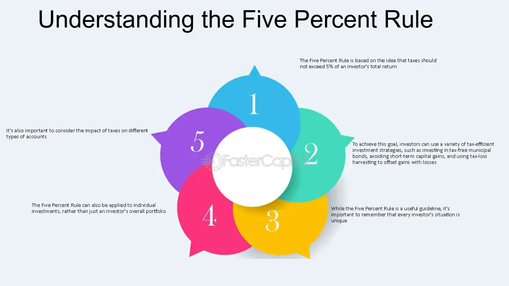

## Table of Contents

## What is the Five Percent Rule?

The Five Percent Rule is a guideline used in chemistry and finance. In chemistry, it helps decide if you can simplify calculations when solving problems about chemical reactions. If the change in concentration of a substance is less than 5% of its original concentration, you can often ignore that change to make calculations easier. This rule is handy when dealing with weak acids or bases, where the change in concentration is usually small.

In finance, the Five Percent Rule is used to manage investment risks. It suggests that no more than 5% of your total investment should be put into one single stock or asset. This helps spread out the risk so that if one investment does poorly, it won't hurt your whole portfolio too much. It's a simple way to keep your investments safe and balanced.

## How does the Five Percent Rule apply to financial planning?

The Five Percent Rule in financial planning is a simple way to keep your investments safe. It says you should not put more than 5% of your total money into one single stock or asset. This helps spread out the risk. If one investment does badly, it won't hurt your whole portfolio too much. By following this rule, you can keep your investments balanced and protect yourself from big losses.

For example, if you have $10,000 to invest, the Five Percent Rule suggests you should not invest more than $500 in any one stock. This way, even if that stock loses all its value, you only lose a small part of your total investment. It's a good strategy for people who want to grow their money without taking too much risk. By diversifying your investments across many different assets, you can have a better chance of steady growth over time.

## Can you explain the Five Percent Rule in the context of retirement savings?

The Five Percent Rule can be really helpful when you're planning for retirement. It says that you shouldn't put more than 5% of your total retirement savings into one single investment. This helps keep your money safe. If one of your investments does badly, it won't hurt your whole retirement plan too much. For example, if you have $100,000 saved for retirement, you should not invest more than $5,000 in any one stock. This way, even if that stock loses all its value, you only lose a small part of your savings.

By following the Five Percent Rule, you can spread your retirement money across many different investments. This is called diversification, and it helps you grow your money safely over time. Instead of betting big on one thing, you're making lots of smaller bets. This means your retirement savings can keep growing steadily, even if some investments don't do well. It's a smart way to make sure you have enough money when you stop working.

## What are the origins of the Five Percent Rule?

The Five Percent Rule in finance comes from the idea of not putting all your eggs in one basket. People started using it to help manage their investments better. The rule says you shouldn't put more than 5% of your total money into one single investment. This helps spread out the risk. If one investment does badly, it won't hurt your whole portfolio too much. The rule became popular because it's a simple way to keep investments safe and balanced.

In chemistry, the Five Percent Rule helps make calculations easier when working with weak acids or bases. It says that if the change in concentration of a substance is less than 5% of its original concentration, you can often ignore that change. This makes solving problems about chemical reactions simpler. The rule came from the need to simplify complex calculations in chemistry. It's useful because it lets scientists focus on the bigger changes in reactions without getting bogged down in small details.

## How can the Five Percent Rule be used in budgeting?

The Five Percent Rule can help you manage your budget by setting a limit on how much you spend on certain things. If you follow this rule, you won't spend more than 5% of your total income on any one expense. For example, if you earn $1,000 a month, you would not spend more than $50 on any single item or bill. This helps you keep your spending under control and makes sure you don't use too much of your money on one thing.

Using the Five Percent Rule in your budget can also help you save more money. By limiting how much you spend on different things, you can put more money into savings or investments. This way, you can build up your savings over time without feeling like you're missing out on anything. It's a simple way to make sure you're spending wisely and saving for the future.

## What are the benefits of following the Five Percent Rule?

Following the Five Percent Rule helps you keep your money safe. It tells you not to put too much of your money into one thing. This way, if something goes wrong with one investment, you won't lose a lot of money. It's like not putting all your eggs in one basket. This rule helps you spread out your money across many different things, so you have a better chance of keeping your money safe and growing it over time.

The Five Percent Rule also makes it easier to manage your spending and saving. If you use this rule in your budget, you won't spend more than a little bit of your money on any one thing. This helps you save more money because you're not spending too much on any single item. It's a simple way to make sure you're spending wisely and saving for the future, whether it's for retirement or just to have some extra money.

## Are there any limitations or criticisms of the Five Percent Rule?

The Five Percent Rule is a simple way to keep your money safe, but it has some limits. One problem is that it might be too strict for some people. If you have a small amount of money to invest, sticking to the 5% rule means you can only buy a few different things. This can make it hard to spread your money out enough to really be safe. Also, the rule doesn't think about how risky an investment is. Some investments might be safer than others, but the rule treats them all the same.

Another criticism is that the Five Percent Rule might stop you from making big gains. If you find a really good investment, the rule says you shouldn't put more than 5% of your money into it. This means you could miss out on a chance to make a lot more money. People who want to grow their money fast might not like this rule because it keeps them from taking bigger risks. In the end, the Five Percent Rule is a good way to keep your money safe, but it might not be the best for everyone.

## How does the Five Percent Rule differ from other financial rules like the 50/30/20 rule?

The Five Percent Rule and the 50/30/20 rule are both ways to help you manage your money, but they work differently. The Five Percent Rule is about investing and says you shouldn't put more than 5% of your total money into one single investment. This helps spread out the risk so that if one investment does badly, it won't hurt your whole portfolio too much. It's a simple way to keep your investments safe and balanced.

The 50/30/20 rule, on the other hand, is about budgeting your income. It says you should spend 50% of your money on things you need, like rent and food, 30% on things you want, like going out or buying new clothes, and save or invest the other 20%. This rule helps you make sure you're spending wisely and saving for the future. While the Five Percent Rule focuses on keeping your investments safe, the 50/30/20 rule helps you manage your day-to-day spending and saving.

## Can the Five Percent Rule be adjusted for inflation or economic changes?

The Five Percent Rule is a simple way to keep your money safe, but it doesn't change with inflation or economic changes. Inflation means prices go up over time, and economic changes can make some investments riskier or safer. The Five Percent Rule stays the same, so it might not be the best way to handle your money when things change a lot. If you want to adjust for inflation or economic changes, you might need to think about other ways to manage your money.

One way to adjust the Five Percent Rule could be to look at how much your money is worth over time. If inflation is high, you might want to put more than 5% into some investments to keep up with rising prices. But this can be risky because it goes against the rule's main idea of spreading out your money to stay safe. Another way is to change the rule based on how the economy is doing. If the economy is doing well, you might feel okay putting a bit more into one investment. But if things are shaky, sticking to the 5% rule might be smarter. It's all about finding a balance that works for you and your money goals.

## What are some real-world examples of the Five Percent Rule in action?

Imagine you have $50,000 saved for retirement. Following the Five Percent Rule, you decide not to put more than $2,500 into any single stock. You choose to invest in 20 different stocks, each worth $2,500. This way, if one of the stocks loses all its value, you only lose $2,500, which is just 5% of your total savings. This helps you keep your retirement money safe and growing over time, even if some investments don't do well.

Another example is with your monthly budget. Let's say you earn $2,000 a month. Using the Five Percent Rule, you make sure not to spend more than $100 on any single expense. So, if you have a big bill like rent, you might spend $800 on that, but you'll keep other expenses like groceries, utilities, and entertainment under $100 each. This helps you control your spending and save more money each month, making sure you're not using too much of your income on one thing.

## How can someone start implementing the Five Percent Rule in their financial strategy?

To start using the Five Percent Rule in your money plan, first, figure out how much money you have to invest. Let's say you have $10,000. The rule says you shouldn't put more than $500 into any one investment. So, you look at different stocks, bonds, or other things to invest in, and you make sure to spread your money out. If you find a stock you like, you only buy $500 worth of it. Then, you find another stock and buy $500 of that one too. You keep doing this until all your money is spread out across many different investments.

Once you've set up your investments using the Five Percent Rule, it's important to keep checking them. Sometimes, the value of your investments can change, and you might need to buy or sell things to keep everything balanced. If one of your investments grows a lot, it might become more than 5% of your total money. In that case, you might want to sell some of it and put that money into other investments to keep following the rule. This way, you can keep your money safe and growing over time, even if some investments don't do well.

## What advanced strategies can be used to optimize the Five Percent Rule for long-term financial growth?

To make the Five Percent Rule work better for growing your money over a long time, you can use a strategy called rebalancing. This means you check your investments every so often and make sure none of them are more than 5% of your total money. If one investment grows a lot and becomes more than 5%, you sell some of it and use that money to buy other things. This keeps your money spread out and safe. Also, you can look at how risky each investment is. If you find a really safe investment, you might be okay putting a bit more than 5% into it. But if it's risky, you should stick to the rule and not put too much money into it.

Another way to make the Five Percent Rule work better is by using something called dollar-cost averaging. This means you put a little bit of money into your investments every month instead of all at once. This way, you buy more when prices are low and less when prices are high. It helps you not worry about when to buy and sell. You can also think about how the economy is doing. If the economy is doing well, you might feel okay putting a bit more into one investment. But if things are shaky, sticking to the 5% rule might be smarter. It's all about finding a balance that works for you and your money goals.

## How can one implement the Five Percent Rule in investment portfolios?

Implementing the Five Percent Rule in investment portfolios involves creating a strategic approach to manage risk and ensure diversified holdings. The Five Percent Rule, when applied as a diversification strategy, aims to restrict individual securities to a maximum of 5% of the total portfolio value. This prevents overexposure to any single investment, thereby mitigating the risk of significant losses due to the poor performance of one security.

### Step-by-step Guide to Incorporating the Five Percent Rule

**1. Portfolio Assessment:**

Begin by assessing your current portfolio structure. This involves a detailed inventory of all securities and their respective values within the portfolio. Calculate the total portfolio value, which will serve as the reference for the 5% threshold.

**2. Security Evaluation:**

For each security, determine its percentage representation of the total portfolio by using the formula:

$$
\text{Percentage of Security} = \left( \frac{\text{Value of Security}}{\text{Total Portfolio Value}} \right) \times 100 \%
$$

Identify any securities that exceed the 5% threshold. These are the securities that need rebalancing to comply with the Five Percent Rule.

**3. Rebalancing:**

To rebalance the portfolio, consider selling portions of the overrepresented securities and redistributing the capital into underrepresented securities or new investments. Rebalancing ensures that no single asset skews the portfolio's risk profile.

**4. Diversification:**

It's essential to select a broad range of asset classes. Options include equities, bonds, mutual funds, and ETFs, among others. Diversification reduces [volatility](/wiki/volatility-trading-strategies) and provides a hedge against market fluctuations, enhancing long-term stability and growth.

### Regular Rebalancing and Monitoring

**Routine Monitoring:**

Regular portfolio monitoring is vital to ensuring compliance with the Five Percent Rule. Market values fluctuate, which may cause the percentage of certain securities to exceed the 5% threshold. Establish a routine review schedule—quarterly or biannually is typically recommended.

**Use of Software Tools:**

Utilize portfolio management software that offers real-time analytics and alerts for percentage changes in asset allocations. Applications like Personal Capital, Morningstar, or even customized Python scripts can aid in managing this aspect efficiently. Here’s a basic example of a Python script snippet to track asset distribution:

```python
portfolio = {'AAPL': 15000, 'GOOGL': 12000, 'AMZN': 18000, 'MSFT': 9000}
total_value = sum(portfolio.values())

exceeded_assets = {asset: value for asset, value in portfolio.items() if (value / total_value) * 100 > 5}

print("Assets exceeding 5% of portfolio:")
for asset, value in exceeded_assets.items():
    print(f"{asset}: {(value / total_value) * 100:.2f}%")
```

This script calculates the percentage of each asset and identifies those that exceed the 5% threshold, aiding in timely rebalancing actions.

### Tools and Technologies

To adhere to the Five Percent Rule, investors often leverage digital platforms and algorithms for precision and efficiency. Here are some tools and technologies that assist in maintaining compliance:

- **Robo-Advisors:** Automated platforms like Betterment or Wealthfront use algorithms to continuously rebalance portfolios according to predefined rules, including the Five Percent Rule.

- **Financial Software:** Platforms like Bloomberg Terminal and FactSet offer comprehensive tools for monitoring and analyzing investment portfolios.

By systematically applying the Five Percent Rule, investors can effectively manage risk, achieve diversification, and enhance their portfolio's long-term stability. This method, supported by technological advancements, offers a robust approach to optimizing financial strategies amidst shifting market dynamics.

## References & Further Reading

[1]: Financial Industry Regulatory Authority (FINRA). ["The Five Percent Markup Policy."](https://www.investopedia.com/terms/f/five-percent-rule.asp)

[2]: Lopez de Prado, M. (2018). ["Advances in Financial Machine Learning."](https://www.amazon.com/Advances-Financial-Machine-Learning-Marcos/dp/1119482089) Wiley.

[3]: Chan, E. (2009). ["Quantitative Trading: How to Build Your Own Algorithmic Trading Business."](https://github.com/ftvision/quant_trading_echan_book) Wiley.

[4]: Jansen, S. (2020). ["Machine Learning for Algorithmic Trading."](https://github.com/stefan-jansen/machine-learning-for-trading) Packt Publishing.

[5]: Aronson, D. R. (2006). ["Evidence-Based Technical Analysis: Applying the Scientific Method and Statistical Inference to Trading Signals."](https://www.amazon.com/Evidence-Based-Technical-Analysis-Scientific-Statistical/dp/0470008741) Wiley.