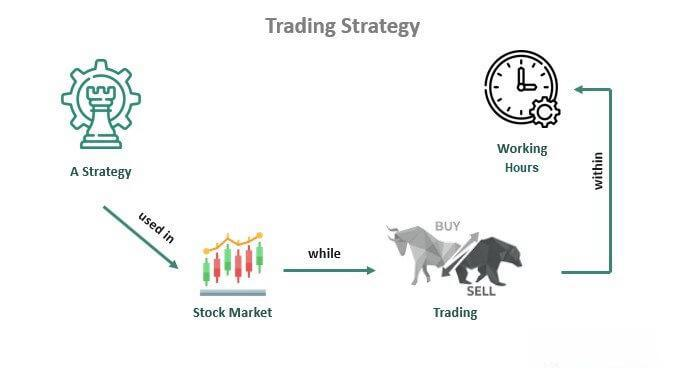

In today's fast-paced financial markets, the ability to effectively evaluate investments, develop robust trading strategies, and make informed decisions is crucial for achieving success. The advent of algorithmic trading has significantly transformed trading practices, offering traders automation and precise execution through technology-driven solutions. Algorithmic trading systems, often powered by advanced computing, are capable of executing trades at speeds and frequencies that human traders cannot match, thereby reducing human errors and emotions typically associated with manual trading.

The purpose of this article is to examine key aspects of successful trading, focusing on strategy formulation, decision-making processes, and the application of algorithmic trading to enhance outcomes in financial markets. A well-structured trading plan is critical and involves a methodical evaluation of trading ideas, risk management techniques, and execution protocols. This plan serves as the foundation for navigating the complexities of trading and achieving investment goals.



Algorithmic trading strategies, which include a variety of quantitative models and analytical techniques, have gained considerable importance. These strategies are often backtested rigorously against historical data to determine their potential effectiveness in current market conditions. By understanding the mechanics behind such trading strategies, investors can enhance their ability to predict market movements and respond swiftly to changing conditions.

Lastly, this article highlights the importance of continuous learning in the ever-evolving landscape of financial markets. Whether you are a seasoned investor or new to the trading world, a well-rounded understanding of investment evaluation, trading strategies, and algorithmic techniques will empower you to enhance your trading success. Through disciplined approaches and the integration of automation, traders can make more rational and data-driven decisions, ultimately leading to better investment outcomes.

## Table of Contents

## Understanding Investment Evaluation

Investment evaluation is a crucial process in the financial markets that involves assessing potential trading opportunities with a focus on profitability and risk. This assessment is vital for traders and investors to make informed decisions that align with their financial goals and risk tolerance. The evaluation process encompasses several key factors such as analyzing historical data, understanding market conditions, and leveraging financial ratios.

Historical data analysis provides insights into past market trends, volatility, and price movements. By studying this data, investors can identify patterns and anomalies that may forecast future behavior. Historical price charts, [volume](/wiki/volume-trading-strategy) data, and other market indicators are often utilized in this analysis. This information can guide the construction of trading strategies that anticipate similar future movements.

Understanding market conditions is equally important in evaluating investments. Market conditions are influenced by economic indicators, geopolitical events, and trading volumes, among other factors. Economic data, including GDP growth rates, unemployment figures, and inflation rates, can heavily impact market dynamics. Traders need to remain aware of such data releases and their potential implications.

Financial ratios are essential tools in assessing the value and financial health of an investment. Ratios such as the Price-to-Earnings (P/E), Debt-to-Equity (D/E), and Return on Equity (ROE) provide insights into an asset's valuation and profitability. These metrics help investors compare potential investments and assess their relative value and risk levels.

Risk-adjusted returns are a key concept in investment evaluation. Tools like the Sharpe Ratio and Maximum Drawdown are commonly used to gauge this. The Sharpe Ratio measures the average return earned in excess of the risk-free rate per unit of [volatility](/wiki/volatility-trading-strategies), or total risk. It is expressed as:

$$
\text{Sharpe Ratio} = \frac{\bar{R} - R_f}{\sigma}
$$

where $\bar{R}$ is the average return of the investment, $R_f$ is the risk-free rate, and $\sigma$ is the standard deviation of the investment's excess return.

Maximum Drawdown, on the other hand, represents the largest peak-to-trough decline in the asset's value, offering insight into potential losses an investor might face. It is calculated as:

$$
\text{Maximum Drawdown} = \frac{\text{Trough Value} - \text{Peak Value}}{\text{Peak Value}}
$$

These tools help investors understand the trade-off between risk and reward for a particular investment, enabling them to align their strategies with their financial goals and risk tolerance.

In conclusion, effective investment evaluation requires a comprehensive approach that balances the analysis of historical data, market conditions, and financial metrics. This allows investors to formulate strategies that are consistent with their objectives while considering potential risks.

## Key Trading Strategies

Trading strategies are systematic approaches designed to capitalize on market movements to generate profits. These strategies can be highly diverse, each requiring a solid grasp of market dynamics and an in-depth understanding of the specific financial instruments involved. Among the most recognized strategies are Trend Following, Mean Reversion, and Statistical Arbitrage.

Trend Following is a strategy that aims to capitalize on the continuance of existing trends in the market. The basic premise is that markets can move in prolonged trends and traders can generate profits by aligning their trades with these trends. For example, if a stock's price is steadily growing, a trend follower might buy the stock, anticipating that the trend will continue. This strategy often uses technical indicators like moving averages or the Average Directional Index (ADX) to identify potential entry and [exit](/wiki/exit-strategy) points.

Mean Reversion is based on the idea that the price of an asset will tend to return to its average over time. This strategy involves identifying assets that have deviated significantly from their historical averages, with the expectation that the price will revert to the mean. Indicators like the Bollinger Bands and the Relative Strength Index (RSI) are commonly used in mean reversion strategies to signal overbought or oversold conditions. 

Statistical Arbitrage involves exploiting price differences between related assets, aiming to profit from short-term inefficiencies in the market. This strategy typically relies on statistical and mathematical models to identify pairs of instruments whose prices have historically moved together but have diverged temporarily. The trader would take a long position on the undervalued asset and a short position on the overvalued asset, anticipating that the prices will converge.

Successful implementation of trading strategies often requires rigorous [backtesting](/wiki/backtesting) using historical data. Backtesting involves applying the trading strategy to past market data to assess how effectively the strategy might have performed. This process helps traders understand the risk and return characteristics of the strategy and make necessary adjustments. Here's a simple example of how backtesting might be implemented in Python for a moving average crossover strategy:

```python
import pandas as pd

def backtest_strategy(prices, short_window=40, long_window=100):
    signals = pd.DataFrame(index=prices.index)
    signals['price'] = prices
    signals['short_mavg'] = prices.rolling(window=short_window, min_periods=1).mean()
    signals['long_mavg'] = prices.rolling(window=long_window, min_periods=1).mean()
    signals['signal'] = 0.0
    signals['signal'][short_window:] = np.where(signals['short_mavg'][short_window:] > signals['long_mavg'][short_window:], 1.0, 0.0)
    signals['positions'] = signals['signal'].diff()

    return signals

# Example prices data
prices = pd.Series([100, 101, 102, 100, 99, 98, 104, 106, 105])

# Backtest the moving average crossover strategy
signals = backtest_strategy(prices)

print(signals)
```

Each of these strategies comes with its own risk and return profiles, requiring traders to carefully select and adapt strategies that align with their financial goals and risk tolerance.

## Trade Decision Making Framework

Making informed trade decisions requires a structured framework that comprehensively addresses entry points, exit strategies, and risk management protocols. Such a framework not only facilitates the alignment of trade setups with strategic goals but also mitigates emotional biases, enhancing trading discipline.

A practical five-step test can serve as a guide for traders to ensure strategic consistency:

1. **Setup Identification**: The initial phase involves recognizing potential market opportunities based on predefined criteria. This might include technical indicators signaling overbought or oversold conditions, chart patterns, or support and resistance levels.

2. **Trigger Events**: Once a setup is identified, specific triggers must be established to initiate a trade. Triggers can be defined by the crossing of moving averages, breakout points, or other technical confirmations. For example, using a simple moving average crossover strategy in Python:
   ```python
   def sma_crossover(prices, short_window=40, long_window=100):
       short_sma = prices.rolling(window=short_window).mean()
       long_sma = prices.rolling(window=long_window).mean()
       signal = (short_sma > long_sma).astype(int)
       return signal
   ```

3. **Stop Loss Placement**: Risk management starts with determining stop loss points to protect against significant losses. Stop loss can be set using a fixed percentage of current price levels or based on technical levels such as recent lows or highs.

4. **Target Profit Determination**: Establishing profit targets ensures that trades are exited at optimal points. This can involve setting price targets based on risk-to-reward ratios or Fibonacci extensions, which help determine realistic price projections based on historical retracements and extensions.

5. **Reward-to-Risk Assessment**: A crucial component of the decision-making framework is evaluating the reward-to-risk ratio of each trade. This ratio should justify the trade's potential return against the risk incurred. A common threshold among traders is a ratio of at least 2:1, where the potential gain is at least twice the potential loss.

By adhering to a structured decision-making framework, traders can systematically approach market opportunities, reducing impulsive decisions driven by emotions. This disciplined methodology not only improves the consistency of trade performance but also assists in achieving long-term financial objectives.

## The Role of Algorithmic Trading

Algorithmic trading employs computer algorithms to automate trade execution, significantly enhancing speed and precision while minimizing human emotion from the decision-making process. These algorithms can handle vast data sets and execute transactions within milliseconds, providing a substantial competitive edge in highly volatile markets [1].

The integration of [machine learning](/wiki/machine-learning) (ML) and [artificial intelligence](/wiki/ai-artificial-intelligence) (AI) into trading algorithms has further advanced the field. These technologies enable traders to detect intricate market patterns through data-driven insights, which traditional methods might miss. For instance, [reinforcement learning](/wiki/reinforcement-learning), a subset of ML, can be employed to optimize trading strategies by simulating numerous market scenarios. 

A simple example of an [algorithmic trading](/wiki/algorithmic-trading) strategy could be a moving average crossover:

```python
import pandas as pd

# Load historical data
data = pd.read_csv('historical_data.csv')

# Calculate moving averages
short_window = 40
long_window = 100

data['Short_MA'] = data['Close'].rolling(window=short_window, min_periods=1).mean()
data['Long_MA'] = data['Close'].rolling(window=long_window, min_periods=1).mean()

# Generate signals
data['Signal'] = 0
data['Signal'][short_window:] = np.where(data['Short_MA'][short_window:] > data['Long_MA'][short_window:], 1, 0)
data['Position'] = data['Signal'].diff()

# Output signals
print(data[['Close', 'Short_MA', 'Long_MA', 'Signal', 'Position']])
```

In this code, a signal to buy (1) or sell (0) is generated based on the crossover of short-term and long-term moving averages. This is a basic demonstration of how algorithmic strategies can be structured and executed.

However, successful algorithmic trading demands ongoing evaluation and adjustment to keep pace with dynamically changing market conditions. Strategies need regular backtesting and recalibration to ensure they remain effective, as past performance does not guarantee future results. Algorithm developers must account for factors such as slippage, market impact, and transaction costs, which might affect predicted outcomes.

In conclusion, the role of algorithmic trading lies in its ability to process and translate enormous quantities of market data into actionable trading opportunities rapidly. While the foundation of these algorithms is rooted in predefined rules, the incorporation of AI and ML enables continuous learning and adaptation. Thus, continuous strategy optimization and adaptation to regulatory and technological developments are essential for maintaining efficacy.

[1] Aldridge, I. (2013). "High-Frequency Trading: A Practical Guide to Algorithmic Strategies and Trading Systems", Wiley.

## Tools for Performance Evaluation

Performance evaluation is a crucial component in the development and refinement of trading strategies. It involves using specific metrics and tools to assess the effectiveness and reliability of a trading approach. This section highlights the essential metrics and technological platforms that help traders gauge their performance.

**Performance Metrics**

1. **Win Rate**: This metric refers to the percentage of trades that result in a profit. It is calculated as the ratio of profitable trades to the total number of trades:
$$
   \text{Win Rate} = \left(\frac{\text{Number of Profit Trades}}{\text{Total Number of Trades}}\right) \times 100

$$

   A higher win rate indicates a greater proportion of successful trades.

2. **Profit Factor**: This is the ratio of the total profit to the total loss, which helps in understanding the risk-reward balance:
$$
   \text{Profit Factor} = \frac{\text{Total Profit}}{\text{Total Loss}}

$$

   A profit [factor](/wiki/factor-investing) greater than one suggests that the strategy is profitable overall.

3. **Average Trade**: This metric provides the average profit or loss per trade, calculated by dividing the net profit by the number of trades:
$$
   \text{Average Trade} = \frac{\text{Net Profit}}{\text{Total Number of Trades}}

$$

   This helps in measuring the expected gain or loss from each trade.

**Backtesting Platforms**

Backtesting platforms are vital for simulating historical market conditions to evaluate the potential efficacy of trading strategies. These platforms replay past market data and apply trading rules to determine how the strategy would have performed over time.

- **Python Libraries**: Libraries such as Backtrader, Zipline, and PyAlgoTrade allow traders to backtest strategies using historical data. They offer functionalities for strategy development, data handling, and performance analytics. Here is a simple example of a backtest using Backtrader:

  ```python
  import backtrader as bt

  class TestStrategy(bt.Strategy):
      def __init__(self):
          self.sma = bt.indicators.SimpleMovingAverage(period=15)

      def next(self):
          if self.sma > self.data.close:
              self.sell(size=100)
          elif self.sma < self.data.close:
              self.buy(size=100)

  cerebro = bt.Cerebro()
  cerebro.addstrategy(TestStrategy)
  data = bt.feeds.YahooFinanceData(dataname='AAPL', fromdate=datetime(2020, 1, 1), todate=datetime(2020, 12, 31))
  cerebro.adddata(data)
  cerebro.run()
  cerebro.plot()
  ```

**Statistical and Visualization Tools**

Statistical analysis and visualization tools help traders process large volumes of trading data, identify trends, and improve decision-making:

- **Pandas and NumPy**: These Python libraries allow for data manipulation and statistical analyses, necessary for understanding complex data patterns.

- **Matplotlib and Seaborn**: Visualization libraries that facilitate creating graphs and plots. They help traders visualize trends and patterns in market data.

Utilizing these tools effectively can provide traders with a comprehensive understanding of their trading strategies, enabling them to make informed modifications for improved performance. Incorporating these metrics and tools is essential for achieving and maintaining trading success.

## Challenges and Considerations

Trading in financial markets involves navigating several significant challenges and considerations that can impact the effectiveness of trading strategies. One common issue is the overfitting of strategies to historical data. Overfitting occurs when a model is excessively complex, capturing noise rather than the underlying pattern of the data. This can lead to strategies that perform well on past data but fail in real-time conditions due to their lack of generalizability. To combat overfitting, traders can employ cross-validation techniques or incorporate regularization methods that penalize model complexity.

In addition, transaction costs are often overlooked but can erode potential profits significantly. These costs include brokerage fees, slippage, and the bid-ask spread, which must be factored into the total cost of trading. Ignoring these can lead to an inaccurate assessment of a strategy’s profitability. Traders can incorporate transaction costs into backtesting and strategy development to ensure a more realistic outcome. Here is an example of how one might account for transaction costs in Python:

```python
def compute_net_profit(gross_profit, transaction_costs):
    return gross_profit - transaction_costs

# Example usage
gross_profit = 1000  # hypothetical gross profit
transaction_costs = 50  # hypothetical transaction costs
net_profit = compute_net_profit(gross_profit, transaction_costs)
print(f"Net Profit: {net_profit}")
```

Rapid shifts in market conditions also pose a challenge, necessitating adaptability by traders. Market volatility can increase unexpectedly due to geopolitical events, economic announcements, or other factors, impacting strategy performance. To address these fluctuations, traders might employ dynamic strategies that adjust parameters in response to market conditions or use diversification to spread risk across various assets.

Regulatory considerations are critical in ensuring that trading practices are ethical and comply with legal standards. Algorithmic trading, in particular, must adhere to guidelines that prevent market manipulation and ensure transparency. Regulatory bodies such as the U.S. Securities and Exchange Commission (SEC) and the Financial Conduct Authority (FCA) provide directives that traders must follow to avoid penalties. Compliance involves maintaining accurate records, reporting trades, and ensuring systems are resilient to errors and disruptions.

In conclusion, while technical and strategic challenges can complicate the trading process, awareness and proactive management can mitigate their impact. By considering the implications of overfitting, transaction costs, market adaptability, and regulatory compliance, traders can enhance the robustness and ethical integrity of their strategies.

## Conclusion

Mastering investment evaluation, trading strategies, and algorithmic trading significantly enhances trading success. By leveraging systematic frameworks and embracing automation, traders can objectively analyze market conditions and execute trades with precision. Algorithmic trading, in particular, removes human emotion, allowing for efficient execution and improved consistency.

Continuous learning and adaptation are paramount as market dynamics evolve. Traders who commit to perpetual education are better equipped to respond to unforeseen changes, optimizing their strategies to align with new trends or data. This adaptive mindset fosters resilience and innovation, which are crucial in volatile markets.

Whether engaging in manual trading or deploying sophisticated algorithms, a disciplined approach is vital. Discipline ensures adherence to well-defined strategies and risk management protocols, reducing impulsive decisions that could lead to unfavorable outcomes. Through dedication to systematic analysis and an openness to evolving techniques, traders can better position themselves for long-term profitability and success.

## References & Further Reading

[1]: Aldridge, I. (2013). ["High-Frequency Trading: A Practical Guide to Algorithmic Strategies and Trading Systems"](https://www.amazon.com/High-Frequency-Trading-Practical-Algorithmic-Strategies/dp/1118343506), Wiley.

[2]: Marcos López de Prado. (2018). ["Advances in Financial Machine Learning"](https://www.amazon.com/Advances-Financial-Machine-Learning-Marcos/dp/1119482089), Wiley.

[3]: Stefan Jansen. (2020). ["Machine Learning for Algorithmic Trading: Predictive Models to Extract Signals from Market and Alternative Data for Systematic Trading Strategies"](https://github.com/stefan-jansen/machine-learning-for-trading), Packt Publishing.

[4]: Chan, Ernest P. (2009). ["Quantitative Trading: How to Build Your Own Algorithmic Trading Business"](https://github.com/ftvision/quant_trading_echan_book), Wiley.

[5]: Aronson, David R. (2006). ["Evidence-Based Technical Analysis: Applying the Scientific Method and Statistical Inference to Trading Signals"](https://onlinelibrary.wiley.com/doi/book/10.1002/9781118268315), Wiley.

