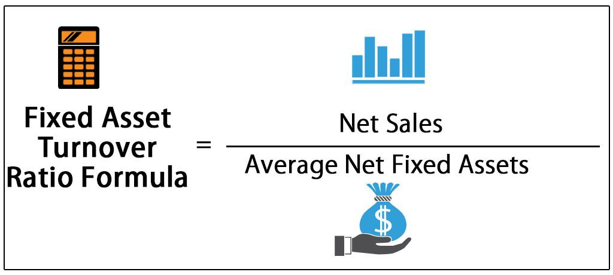

In the world of finance, effectively managing and analyzing fixed assets is vital for business success. Fixed assets, such as machinery, buildings, and equipment, represent significant investments and are crucial in the production process. The ability to generate sales from these assets is measured by the fixed asset turnover ratio, a key financial metric. This ratio provides insights into how well a company utilizes its fixed assets to drive revenue and is calculated by dividing net sales by average fixed assets.

Understanding this ratio's formula and interpretation helps investors and financial analysts evaluate a company's operational efficiency. A high fixed asset turnover ratio suggests efficient use of assets, potentially leading to increased profitability. Conversely, a lower ratio might indicate underutilization, prompting further analysis to identify inefficiencies.



Algorithmic trading, which uses computer algorithms to execute trades based on predefined criteria, has revolutionized financial analysis. Its application offers enhanced precision in processing financial metrics, including the fixed asset turnover ratio. By integrating algorithmic trading with fixed asset analysis, companies can optimize investment strategies and improve asset management.

This article aims to provide a comprehensive understanding of how the fixed asset turnover ratio functions as a tool for evaluating a company's efficiency. It also examines how algorithmic trading can enhance financial strategies, illustrating the intersection of fixed asset analysis and modern trading techniques. By mastering these concepts, businesses can make informed decisions to enhance their asset management and overall financial performance.

## Table of Contents

## Understanding the Fixed Asset Turnover Ratio

The fixed asset turnover ratio measures a company's ability to effectively utilize its fixed assets to drive sales. This financial metric is crucial in evaluating how well a firm leverages its investments in property, plant, and equipment (PPE) to convert its asset base into revenue. The ratio is determined by dividing net sales by the average fixed assets over a certain period, usually one fiscal year. Mathematically, it is expressed as:

$$
\text{Fixed Asset Turnover Ratio} = \frac{\text{Net Sales}}{\text{Average Fixed Assets}}
$$

Net sales can be defined as the total revenue from goods sold or services provided during a particular period, minus returns, allowances, and discounts. Average fixed assets are calculated by taking the opening and closing balance of fixed assets for the period and averaging them:

$$
\text{Average Fixed Assets} = \frac{\text{Beginning Fixed Assets} + \text{Ending Fixed Assets}}{2}
$$

A higher fixed asset turnover ratio is typically indicative of efficient use of fixed assets, as it suggests that the company is generating more revenue per dollar invested in its fixed assets. This can often lead to improved profitability, signaling effective management of investments in infrastructure and machinery, which are significant capital expenditures.

Efficiency in utilizing fixed assets to generate sales is particularly relevant for companies in capital-intensive industries, such as manufacturing and utilities, where substantial investments in machinery and equipment are common. Firms within such sectors aim for a high fixed asset turnover ratio to ensure their capital investments translate to sufficient sales. However, it’s important to consider that while a high ratio generally signifies better performance, it must be interpreted in the context of industry standards and specific business models. 

In summary, the fixed asset turnover ratio provides vital insights into a firm's ability to generate sales from its investments in long-term assets, and companies consistently striving for a higher ratio may be well-positioned for profitability and growth.

## Calculation and Interpretation

The fixed asset turnover ratio is a key metric used to assess how effectively a company utilizes its fixed assets to generate sales. The formula for calculating this ratio is:

$$
\text{Fixed Asset Turnover Ratio} = \frac{\text{Net Sales}}{\text{Average Fixed Assets}}
$$

where "Net Sales" refer to the company's revenue from goods sold or services rendered, minus returns, allowances, and discounts, and "Average Fixed Assets" is calculated by taking the average of the opening and closing balances of fixed assets within a specific period.

This metric holds particular significance in capital-intensive industries, such as manufacturing, utilities, and telecommunications, where substantial investments in fixed assets like property, plant, and equipment are standard. These industries often rely heavily on their fixed assets to maintain production capabilities, making efficient asset utilisation crucial for operational success.

Interpreting the fixed asset turnover ratio requires a comparative analysis. It is beneficial to evaluate a company's current ratio against its historical performance to identify trends in asset efficiency over time. Additionally, benchmarking against industry averages provides insight into how well a company manages its assets in relation to its peers. This comparative approach can reveal potential areas of improvement or highlight a competitive advantage.

Comparisons with competitors are critical, as they can uncover strategic differences in asset utilization. For instance, a company with a lower ratio than its peers might need to investigate whether excessive investment in fixed assets is being underutilized or if there are inefficiencies in operations.

In summary, while the calculation of the fixed asset turnover ratio is straightforward, its interpretation requires a nuanced understanding of historical data, industry norms, and competitive positioning to accurately assess a company's asset efficiency. This enables companies to make informed decisions that align with their strategic financial goals.

## Fixed Asset Turnover vs. Asset Turnover Ratio

The fixed asset turnover ratio specifically evaluates a company's efficiency in utilizing its fixed assets, such as property, plant, and equipment, to generate sales. It is calculated as:

$$
\text{Fixed Asset Turnover Ratio} = \frac{\text{Net Sales}}{\text{Average Fixed Assets}}
$$

In contrast, the asset turnover ratio provides a broader perspective by considering all assets, both current and fixed, thereby offering insight into how effectively a company uses its entire asset base to produce revenue. The formula for the asset turnover ratio is:

$$
\text{Asset Turnover Ratio} = \frac{\text{Net Sales}}{\text{Total Average Assets}}
$$

While the fixed asset turnover ratio gives insights into how well a company leverages its significant fixed investments, the asset turnover ratio captures the overall efficiency of asset utilization, reflecting the company's ability to manage both its short-term and long-term resources.

Comparing both ratios can yield deeper insights into a company's operational effectiveness. For instance, a higher fixed asset turnover ratio might indicate efficient use of physical assets, but if the asset turnover ratio is low, it may suggest inefficiencies in other asset categories such as inventory or receivables. Conversely, a balanced increase in both ratios could highlight improvements in comprehensive asset management. Understanding the nuances between these ratios helps stakeholders assess the effectiveness of a company's strategic allocation of resources and operational planning.

## Impact of Algorithmic Trading on Financial Analysis

Algorithmic trading, often referred to as algo trading, employs computer algorithms to automate trading processes based on predefined parameters. This sophisticated technique offers significant advantages in financial analysis, primarily due to its speed and precision in processing large volumes of data—capabilities that are indispensable in the calculation and interpretation of financial ratios.

One of the key benefits of algo trading is its ability to handle complex datasets quickly. In the context of analyzing financial ratios such as the fixed asset turnover ratio, [algorithmic trading](/wiki/algorithmic-trading) can quickly process financial statements and extract relevant data points necessary for ratio calculations. For example, algorithms can be programmed to automatically retrieve net sales figures and average fixed asset values from digital reports, thus streamlining the calculation process and allowing for near-instantaneous analysis.

Moreover, algorithmic trading enables the identification of trends and patterns within financial data that might be missed by manual analysis. Algorithms can be designed to detect changes in efficiency over time by continuously monitoring fixed asset turnover ratios, comparing these metrics against historical data, industry benchmarks, or competitor ratios. This continuous analysis can help in determining the optimal allocation of resources or identifying underperforming fixed assets that may require management's attention.

Integrating algo trading into fixed asset financial analysis also optimizes investment strategies and asset management. By leveraging algorithms to assess the efficiency of asset utilization in real time, companies can make informed decisions on capital expenditures and asset allocation. For instance, an algorithm could be developed to provide alerts when the fixed asset turnover ratio falls below a certain threshold, prompting strategic reviews or asset reallocations to improve efficiency.

Python, being a powerful programming language for data analysis, can be utilized to implement such algorithms. Below is a simple example of how Python could be used to calculate the fixed asset turnover ratio:

```python
def fixed_asset_turnover(net_sales, avg_fixed_assets):
    return net_sales / avg_fixed_assets

# Example usage
net_sales = 500000
avg_fixed_assets = 250000
turnover_ratio = fixed_asset_turnover(net_sales, avg_fixed_assets)
print(f"Fixed Asset Turnover Ratio: {turnover_ratio}")
```

This function computes the fixed asset turnover ratio by dividing net sales by average fixed assets, demonstrating how straightforward and efficient algorithmic calculations can be.

Overall, the fusion of algorithmic trading techniques with fixed asset analysis provides a robust framework for enhancing financial performance. By ensuring that data-driven insights are accurate and timely, businesses can improve their strategies for asset management and investment decision-making.

## Limitations and Challenges

The fixed asset turnover ratio serves as a measure of how efficiently a company utilizes its fixed assets, such as property, plant, and equipment, to generate sales. However, this metric has certain limitations that must be considered for a balanced analysis of a firm's financial performance. One notable limitation is that the fixed asset turnover ratio does not take into account variable costs or broader company expenses, which can significantly impact overall profitability. Consequently, relying solely on this ratio can provide a skewed picture of a company's financial health.

To derive more meaningful insights, it is essential to use the fixed asset turnover ratio alongside other financial metrics such as [liquidity](/wiki/liquidity-risk-premium) ratios and profitability ratios. Liquidity ratios, like the current ratio and quick ratio, provide information about a company's ability to meet its short-term obligations. Profitability ratios, such as the net profit margin, return on assets (ROA), and return on equity (ROE), offer insights into how efficiently a company is generating profit relative to its revenue, assets, and equity.

In addition to these financial metrics, understanding the specific context of the industry in which a company operates is crucial. Industry-specific factors, such as capital intensity, technological changes, and competitive environment, can significantly influence the fixed asset turnover ratio. For instance, industries with high capital intensity may naturally have lower fixed asset turnover ratios due to substantial investments in fixed assets, which can affect cross-industry comparisons.

In summary, while the fixed asset turnover ratio is a valuable tool for assessing asset utilization efficiency, its limitations necessitate a more comprehensive approach. By incorporating other financial metrics and considering industry-specific factors, analysts can achieve a more nuanced understanding of a company's operational performance.

## Conclusion

The fixed asset turnover ratio serves as a vital metric for evaluating a company's effectiveness in utilizing its fixed assets to generate sales. This ratio, calculated as net sales divided by average fixed assets, highlights the degree to which a business capitalizes on its investments in property, plant, and equipment. A higher ratio suggests more efficient use of assets, potentially leading to better profitability.

Incorporating algorithmic trading techniques with this financial ratio can significantly enhance analytical insights. Algorithmic trading employs sophisticated computer algorithms to swiftly process vast amounts of data, enabling more accurate and timely financial analysis. By integrating these techniques, companies can achieve greater precision in identifying trends and making informed investment decisions.

Understanding the detailed implications of the fixed asset turnover ratio—such as its interaction with market conditions and company-specific factors—provides businesses with a comprehensive perspective on their operational efficiency. This knowledge, when coupled with modern trading strategies, supports more effective asset management and refined investment strategies. Ultimately, leveraging this synergy enables companies to optimize their financial performance and make strategic enhancements to their fixed asset utilization.

## References & Further Reading

[1]: ["Financial Modeling"](https://corporatefinanceinstitute.com/resources/financial-modeling/what-is-financial-modeling/) by Simon Benninga

[2]: ["Advances in Financial Machine Learning"](https://www.amazon.com/Advances-Financial-Machine-Learning-Marcos/dp/1119482089) by Marcos Lopez de Prado

[3]: ["Financial Intelligence, Revised Edition: A Manager's Guide to Knowing What the Numbers Really Mean"](https://www.amazon.com/Financial-Intelligence-Revised-Managers-Knowing/dp/1422144119) by Karen Berman and Joe Knight

[4]: ["Machine Learning for Algorithmic Trading"](https://github.com/PacktPublishing/Machine-Learning-for-Algorithmic-Trading-Second-Edition) by Stefan Jansen

[5]: ["Quantitative Trading: How to Build Your Own Algorithmic Trading Business"](https://www.amazon.com/Quantitative-Trading-Build-Algorithmic-Business/dp/1119800064) by Ernest P. Chan