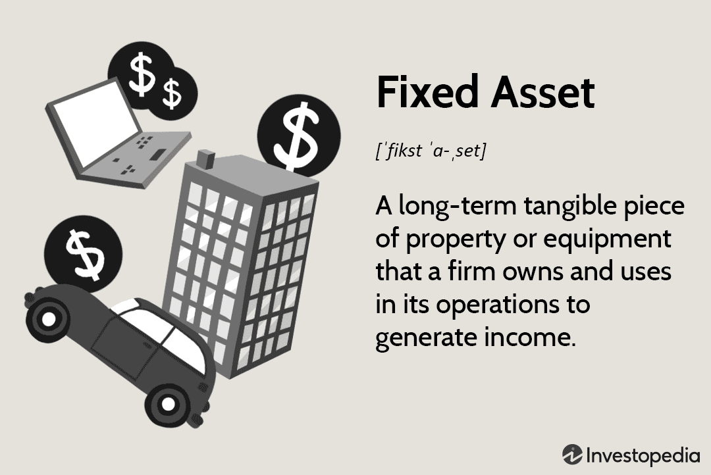

In today's rapidly evolving financial landscape, understanding the various types of assets and trading strategies is crucial for informed investment decisions. Fixed assets, tangible assets, capital assets, and algorithmic trading are key components that collectively shape modern asset management and investment strategies. Fixed assets generally refer to long-term resources, including property, plant, and equipment, that are essential for generating revenue over time. Tangible assets, a subset of fixed assets, include physical items like machinery, buildings, and vehicles, which are key operational components due to their intrinsic value.

Capital assets extend beyond tangible items, encompassing long-term investments that significantly impact a company’s growth and capital structure. The management of these assets is particularly crucial in capital-intensive industries that require substantial financial commitment. Algorithmic trading, a method of executing orders using automated and pre-programmed trading instructions, has increasingly taken center stage in financial markets. It offers the ability to analyze high-frequency data and execute trades with enhanced speed and precision, reducing human bias.



This article explores how these asset types operate within modern financial strategies and the role algorithmic trading has played in transforming asset management. By examining the benefits and challenges of these assets and trading approaches, the article aims to equip readers with a comprehensive understanding of their implications in today’s financial markets. The discussion will provide insights into the advantages and potential risks, enabling readers to navigate and leverage these resources for robust and informed financial strategies.

## Table of Contents

## Understanding Fixed and Tangible Assets

Fixed assets are integral to a company's balance sheet, classified as long-term resources expected to provide economic benefits over an extended period. They primarily include property, plant, and equipment (PP&E), each playing a crucial role in the production of goods and services. By definition, fixed assets are not easily liquidated within a year and require considerable investment, making them vital for sustaining business operations and growth. These assets, due to their enduring nature, are subject to depreciation, reflecting their gradual consumption and the diminishing value over time. Depreciation is accounted for in financial statements and plays a significant role in tax calculations and shareholder disclosures, impacting the overall financial standing and strategic planning of an enterprise.

Tangible assets, a subset of fixed assets, represent the physical embodiment of fixed resources. These include machinery, buildings, and vehicles, all of which possess intrinsic value and are fundamental to daily business functions. As tangible assets contribute directly to operational capacity, their upkeep and functional efficiency are paramount. Like all fixed assets, tangible assets undergo depreciation. This systematic allocation of an asset's cost over its useful life involves methods such as straight-line or declining balance to calculate depreciation expense, which is then recorded on an income statement over the asset's useful lifespan.

For example, if a company purchases a machine for $100,000 with an expected lifespan of 10 years and a salvage value of $10,000, the annual straight-line depreciation would be calculated as:

$$
\text{Depreciation Expense} = \frac{\text{Cost} - \text{Salvage Value}}{\text{Useful Life}} = \frac{100,000 - 10,000}{10} = 9,000
$$

This indicative annual expense impacts a company's net income and can influence investment and management decisions.

The importance of tangible assets transcends mere valuation; they offer substantial collateral value for securing loans and financing. Their physical presence can be appraised and leveraged by lenders to mitigate risk, making them an attractive funding mechanism for businesses seeking capital. However, their valuation and condition directly affect the company's financial health and creditworthiness, necessitating regular assessments and maintenance.

Overall, the strategic acquisition and management of fixed and tangible assets significantly influence a company's operational efficiency and long-term financial success. Their accurate representation and depreciation in financial records provide stakeholders with critical insights into the company's asset utilization and economic position.

## Capital Assets and Their Importance

Capital assets play a fundamental role in a company's growth and capital structure by extending beyond mere tangible items to encompass long-term investments. These assets include not only physical infrastructure but also financial investments, patents, trademarks, and other assets with a useful life exceeding one year. They are pivotal to ensuring the long-term sustainability and profitability of businesses, primarily within capital-intensive industries such as telecommunications, energy, and manufacturing, where substantial investments are needed for operations and revenue generation.

One of the critical aspects of capital assets is their contribution to enhancing a company’s capital structure. They form the backbone of financial stability, providing collateral that can improve creditworthiness and lower the cost of borrowing. These assets often reflect on a balance sheet as either depreciable or non-depreciable, impacting the overall financial health and strategic investment decisions of the organization.

Efficient management of capital assets is crucial for sustaining business growth and optimizing resource usage. This involves strategic planning related to acquisition, utilization, and disposal of these assets. Effective management practices include:

1. **Asset Utilization**: Ensuring that every asset is used to its full potential to maximize returns. This could involve technological upgrades or process improvements to increase efficiency.

2. **Lifecycle Management**: Applying systematic processes for managing the lifecycle of an asset, which includes planning, acquisition, operation, maintenance, and disposal, thereby optimizing performance and minimizing costs.

3. **Valuation and Revaluation**: Periodic assessment of asset value for accurate financial reporting and decision-making. This includes considering depreciation, amortization, and impairment costs.

4. **Risk Management**: Identifying, analyzing, and mitigating risks associated with capital assets, such as obsolescence, technological changes, and market fluctuations.

Proper management leads to enhanced shareholder value, as it results in improved economic profit through optimal asset allocation and cost-efficiency measures. By aligning capital asset strategies with organizational objectives, companies can achieve better financial performance, competitive advantages, and a robust capital structure. Hence, a well-devised capital asset management strategy is integral to a company's enduring success and market competence.

## The Rise of Algorithmic Trading

Algorithmic trading, also referred to as algo trading, leverages complex algorithms to automate and optimize trading tasks, significantly enhancing both speed and precision while minimizing human intervention. This method uses computer programs to analyze vast amounts of market data, executes trades, and manages positions based on pre-defined criteria. The automation of decision-making processes in trading is designed to take advantage of market opportunities at speeds that are beyond human capabilities.

Algorithmic trading is extensively employed by institutional investors and hedge funds for its ability to efficiently parse high-frequency data. This method allows market participants to identify transient price inefficiencies or [arbitrage](/wiki/arbitrage) opportunities that typically vanish within milliseconds. By performing numerous calculations per second, algorithmic systems can react to market changes rapidly, executing multiple trades simultaneously while continuously assessing risk levels and market conditions.

A key aspect of [algorithmic trading](/wiki/algorithmic-trading) is [backtesting](/wiki/backtesting), where strategies are tested against historical market data to evaluate their potential success. This process allows for the refinement of trading strategies before actual capital is deployed, by simulating various trading scenarios and adjustments in algorithmic rules. For instance, a simple [momentum](/wiki/momentum) trading strategy could be tested and optimized to enhance profitability by adjusting parameters such as time frame or asset selection based on historical results. The ability to backtest ensures robust strategy development, mitigating risks associated with untested approaches.

Moreover, algorithmic trading plays a vital role in managing transaction costs, significantly reducing spreads and slippages. The execution of trades in fractions of a second means reduced exposure to market fluctuations which, in turn, translates to lower costs. By automating trades, algorithms improve market [liquidity](/wiki/liquidity-risk-premium), as they often act as liquidity providers and help in tightening bid-ask spreads.

Algorithmic trading systems require sophisticated technology infrastructures and continuous maintenance to accommodate evolving market dynamics. These include advanced computing resources, dedicated exchange connections, and redundant systems to minimize the risk of downtime or data loss. As the financial markets continue to evolve, the reliance on and complexity of algorithmic trading systems are expected to grow, further entwining technology with traditional trading methodologies.

## Intersecting Strategies: Algo Trading with Tangible and Capital Assets

Algorithmic trading, traditionally associated with financial assets, is increasingly being applied to tangible and capital assets as technological advancements make automated investment decisions more feasible. For tangible assets, such as real estate and commodities, algorithms can analyze vast datasets, including market trends and historical prices, to identify optimal trading points. This method enhances decision-making precision and supports timely investment strategies.

Real estate and commodities present unique challenges for algorithmic trading due to inherent complexities in asset valuation and data interpretation. The intrinsic value of these assets depends on various factors, including location, physical condition, supply-demand dynamics, and economic conditions. The challenge lies in developing algorithms that can digest and interpret such multifaceted data efficiently. Machine learning and advanced analytics play pivotal roles in refining these algorithms, enabling them to accommodate the complexities and nuances of tangible asset markets.

The integration of algorithmic trading with tangible and capital assets also provides substantial benefits. Algorithms can increase market liquidity by enabling rapid transactions based on real-time data analyses. For instance, in the real estate market, algorithms can predict price movements based on macroeconomic indicators and property-specific characteristics, leading to more informed investment decisions. Similarly, in commodity trading, algorithms can quickly respond to geopolitical developments, weather patterns, and other influencing factors, optimizing the trading process.

Despite these advantages, challenges persist. Accurately valuing tangible assets requires a multi-dimensional approach that incorporates qualitative and quantitative aspects. Moreover, data interpretation must account for irregularities and discrepancies typical in non-financial markets. These hurdles necessitate continual algorithm refinement and innovative risk management strategies.

To implement these strategies effectively, firms might employ [machine learning](/wiki/machine-learning) models that can learn and adapt over time. Here's a simple Python concept illustrating how an algorithm might evaluate real estate investment opportunities based on selected input parameters:

```python
import numpy as np
from sklearn.linear_model import LinearRegression

# Example data: historical price per square foot and interest rates
X = np.array([[150, 3.5], [200, 4.0], [250, 3.8], [300, 4.5]])
y = np.array([400000, 500000, 600000, 700000])  # Asset price predictions

# Initialize and fit the model
model = LinearRegression()
model.fit(X, y)

# Define a new data point
new_data = np.array([[225, 3.9]])

# Predict potential asset price
predicted_price = model.predict(new_data)
print(f"Predicted Asset Price: ${predicted_price[0]:,.2f}")
```

This code illustrates how historical data, such as price per square foot and interest rates, can be leveraged to predict potential asset prices. By extending this basic concept to integrate more comprehensive datasets and sophisticated models, the potential for algorithmic trading in tangible and capital assets becomes significant.

Overall, while algorithmic trading with tangible and capital assets presents specific challenges in asset valuation and data interpretation, the benefits, including enhanced market liquidity and informed decision-making, offer considerable promise. As technology continues to evolve, these practices will likely become an integral part of modern asset management strategies.

## Benefits and Risks of Algorithmic Trading

Algorithmic trading has become a cornerstone of modern financial strategies, primarily due to its unparalleled efficiency and precision. By using sophisticated algorithms to automate trading, it significantly reduces transaction costs and enhances market liquidity. This automation allows market participants to execute large volumes of trades at speeds and prices that would be impossible to match manually. As a result, algorithmic trading improves price discovery and reduces bid-ask spreads, benefiting both traders and the overall market.

Despite these advantages, algorithmic trading is not without its risks. The heavy reliance on technology introduces vulnerabilities to technical failures, such as software bugs or network outages, which can disrupt trading activities and potentially lead to substantial financial losses. Furthermore, the algorithms can sometimes react unpredictably to extreme market conditions, exacerbating market [volatility](/wiki/volatility-trading-strategies) or causing flash crashes—incidents where asset prices plummet and recover within minutes.

To mitigate these risks, traders must implement robust risk management systems and operate within stringent regulatory frameworks. This involves setting up automated controls to manage exposure and ensuring compliance with trading regulations. For instance, pre-trade risk checks can assess the validity of trades before execution, and automated kill switches can halt trading in case of sudden market abnormalities.

In addition to technical risks, there is also the concern of over-reliance on historical data. Algorithms are typically trained on past market data to identify patterns and predict future movements. However, markets are inherently dynamic, and patterns from historical data may not always provide reliable guidance under new or unforeseen market conditions. This necessitates continuous monitoring and adjustment of trading algorithms to adapt to the evolving market landscape.

Traders must therefore balance the potential for increased returns with the need for caution, ensuring that algorithms are regularly updated and subjected to rigorous testing with current market data. Incorporating adaptive machine learning techniques can enhance the ability of algorithms to adjust to market changes effectively, but vigilance remains paramount. 

In summary, while algorithmic trading offers significant benefits in terms of speed, cost-efficiency, and liquidity, its success hinges on meticulous risk management and adaptability to maintain stability and effectiveness in unpredictable financial markets.

## Conclusion

Fixed, tangible, and capital assets are integral to a robust financial strategy, each bringing unique advantages and challenges. Fixed assets, composed of long-term resources such as property and equipment, provide stability and revenue generation capacity. Tangible assets contribute intrinsic value essential for operational efficiency, while capital assets underpin growth by comprising both physical and financial investments crucial for long-term strategic objectives.

Algorithmic trading marks a transformative shift in trading dynamics by delivering precision and efficiency vital for managing extensive asset portfolios. This innovation automates trading processes and optimizes decision-making by employing sophisticated algorithms to analyze market data and execute trades with minimal human intervention. The capability to process high-frequency data and backtest strategies enhances the potential for higher returns while mitigating human biases and errors.

The future of financial markets hinges on effectively integrating these components by embracing both technological advancements in trading platforms and traditional asset management strategies. Continual adaptability and learning are essential for navigating the complexities of modern markets, requiring investors and institutions to leverage both traditional financial wisdom and cutting-edge technological tools. This holistic approach promises greater resilience and strategic advantage in the ever-evolving financial landscape.

## References & Further Reading

Aldridge, I. (2013). *High-Frequency Trading: A Practical Guide to Algorithmic Strategies and Trading Systems,* 2nd Edition. Wiley Finance. This book provides a detailed exploration of algorithmic trading strategies and systems, offering insights into the practical applications of high-frequency trading in today's markets.

Engle, R., & Russell, J. R. (2010). *Analysis of High-Frequency Data.* Review of Economic Studies. This study examines the methodologies of analyzing high-frequency financial data, crucial for understanding and developing effective trading strategies.

Papageorgiou, G., & Haas, R. (2015). *Machine Learning in Asset Management.* Springer. This book discusses the integration of machine learning techniques into asset management, highlighting the advancements and applications of AI in managing financial resources.

Narang, R. K. (2009). *Inside the Black Box: The Simple Truth About Quantitative Trading.* Wiley. Narang offers an in-depth look at [quantitative trading](/wiki/quantitative-trading) strategies, explaining how these techniques are implemented and the potential they hold for traders looking to optimize their performance in the financial markets.

