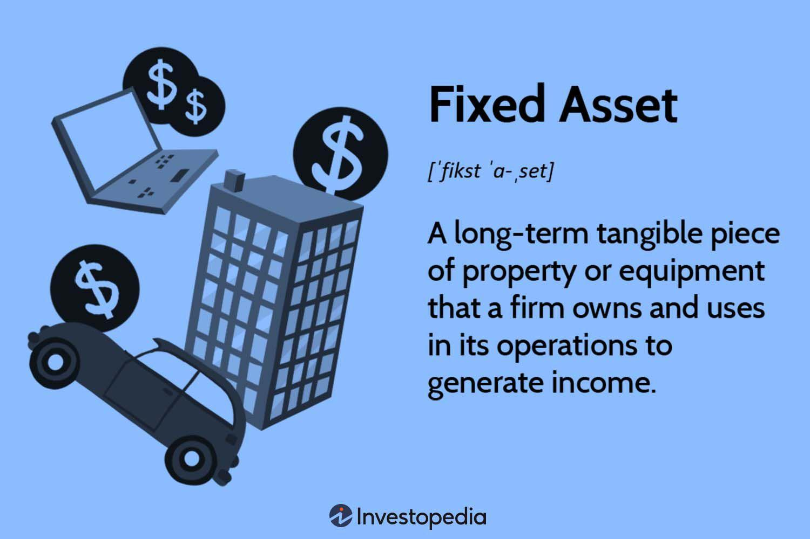

## Table of Contents

## What is a fixed asset?

A fixed asset is something a business owns that helps it make money over a long time. These are things like buildings, machines, or vehicles that the business uses every day. They are not things that a business buys and sells quickly, like products in a store. Instead, fixed assets are used to help the business run and make more products or services.

Fixed assets are important because they help a business grow and keep working well. For example, a delivery company needs trucks to move things from one place to another. These trucks are fixed assets because they are used for a long time and help the company do its job. When a business buys a fixed asset, it usually spreads the cost over many years, which is called depreciation. This way, the business can match the cost of the asset with the income it helps to earn over time.

## What are some examples of fixed assets?

Fixed assets are things a business owns and uses for a long time to help it make money. Some common examples are buildings, like offices or factories where people work. Another example is land, which a business might use for its operations or to build on later. Machinery is also a fixed asset, like the big machines in a factory that make products. Vehicles, such as delivery trucks or company cars, are fixed assets too because they help the business move things or people.

Other examples include computers and office equipment, like desks and chairs, that employees use every day. Furniture in an office or store is another fixed asset. Even things like tools or heavy equipment used in construction or farming count as fixed assets. These items are not sold quickly like regular products but are used over many years to help the business run smoothly.

Sometimes, fixed assets can be a bit different, like patents or copyrights. These are special rights that a business owns and uses to make money, like a unique way to make a product or a special design. Even though they are not physical things, they are still considered fixed assets because they help the business earn money over a long period.

## How are fixed assets different from current assets?

Fixed assets and current assets are both important for a business, but they are used in different ways. Fixed assets are things a business owns that it uses for a long time to help make money. These can be things like buildings, machines, or vehicles. They are not meant to be sold quickly but are used over many years to help the business run and grow. For example, a factory uses machines to make products, and these machines are fixed assets because they help the factory work every day.

Current assets, on the other hand, are things that a business can turn into cash quickly, usually within a year. These include things like money in the bank, products ready to sell, and money that customers owe the business. Current assets are important because they help the business pay for day-to-day costs and keep running smoothly. For example, a store's current assets might include the clothes it has on the shelves, which it can sell to customers right away.

The main difference between fixed and current assets is how long they are used and how quickly they can be turned into cash. Fixed assets are used over many years and are not meant to be sold quickly, while current assets are used up or sold within a short time. Understanding the difference helps a business manage its money and plan for the future.

## Why are fixed assets important for a business?

Fixed assets are important for a business because they help it work and make money over a long time. Things like buildings, machines, and vehicles are fixed assets. They are not sold quickly but are used every day to help the business run. For example, a factory needs machines to make products, and these machines help the factory earn money for many years.

Having fixed assets also helps a business grow and plan for the future. When a business buys a fixed asset, like a new office building, it can use it for a long time. This helps the business expand and do more work. Also, fixed assets can be used to get loans because banks see them as valuable. So, fixed assets are key for a business to keep running well and grow bigger.

## How do you record a fixed asset on the balance sheet?

When you record a fixed asset on the balance sheet, you list it under the section called "Property, Plant, and Equipment." This section shows all the big things a business owns that it uses for a long time, like buildings, machines, and vehicles. You write down how much the fixed asset cost when the business bought it. This is called the "historical cost." For example, if a business bought a machine for $50,000, that's the number you put on the balance sheet.

Over time, fixed assets lose value because they get old or wear out. This is called depreciation. To show this on the balance sheet, you take away a bit of the asset's value each year. You do this by subtracting the total depreciation from the historical cost. So, if that $50,000 machine has been used for a few years and has depreciated by $10,000, you would show it on the balance sheet as $40,000. This way, the balance sheet shows a more accurate value of what the asset is worth now.

## What is depreciation and how does it relate to fixed assets?

Depreciation is how a business shows that its fixed assets, like machines or buildings, are getting older and losing value over time. When a business buys a fixed asset, it doesn't use up all the money right away. Instead, it spreads the cost over the years the asset will be used. This way, the business matches the cost of the asset with the money it makes from using it. For example, if a company buys a machine for $50,000 and expects to use it for 10 years, it might say the machine loses $5,000 in value each year.

Depreciation is important because it helps show a more accurate picture of a business's value. On the balance sheet, the business shows the original cost of the fixed asset and then subtracts the total depreciation so far. This gives a better idea of what the asset is worth now. For instance, if that $50,000 machine has been used for 5 years, and the business has been depreciating it by $5,000 each year, the balance sheet would show the machine's value as $25,000. This way, everyone can see how much the asset is worth today, not just what it cost when it was new.

## What are the different methods of depreciation for fixed assets?

There are a few common ways to figure out depreciation for fixed assets. One way is called the straight-line method. This is the simplest way. You take the cost of the asset and subtract how much you think it will be worth at the end, which is called the salvage value. Then, you divide that number by how many years you expect to use the asset. For example, if a machine costs $50,000 and will be worth $10,000 after 10 years, you would depreciate it by $4,000 each year. This method spreads the cost evenly over time.

Another way is the declining balance method. This method says that assets lose more value at the start and less as time goes on. You start with a big depreciation amount and then make it smaller each year. A common way to do this is the double-declining balance method. You take twice the straight-line rate and apply it to the asset's book value each year. So, if the straight-line rate is 10%, you would use 20% each year. This method is good for things like computers that lose value quickly at first.

There's also the units of production method. This way looks at how much the asset is used, not just time. You figure out how many units the asset can make or how many hours it can work over its life. Then, you divide the cost minus the salvage value by that total to find the cost per unit or hour. Each year, you multiply the number of units made or hours worked by the cost per unit or hour to find the depreciation. This method is good for machines that might be used a lot one year and less the next.

## How do you calculate the depreciation expense of a fixed asset?

To calculate the depreciation expense of a fixed asset, you can use the straight-line method. This method is simple and spreads the cost of the asset evenly over its useful life. First, you find out the cost of the asset and subtract its salvage value, which is what you think the asset will be worth at the end of its life. Then, you divide this number by the number of years you expect to use the asset. For example, if a machine costs $50,000 and you think it will be worth $10,000 after 10 years, the depreciation expense each year would be $4,000. This is because $50,000 minus $10,000 is $40,000, and $40,000 divided by 10 years is $4,000.

Another way to calculate depreciation is the declining balance method. This method says that assets lose more value at the beginning and less as time goes on. A common way to do this is the double-declining balance method. You start with a big depreciation amount and then make it smaller each year. To do this, you take twice the straight-line rate and apply it to the asset's book value each year. For example, if the straight-line rate is 10%, you would use 20% each year. This method is good for things like computers that lose value quickly at first.

There's also the units of production method, which looks at how much the asset is used. First, you figure out how many units the asset can make or how many hours it can work over its life. Then, you divide the cost of the asset minus the salvage value by that total to find the cost per unit or hour. Each year, you multiply the number of units made or hours worked by the cost per unit or hour to find the depreciation. This method is good for machines that might be used a lot one year and less the next.

## What is the impact of fixed asset disposal on financial statements?

When a business gets rid of a fixed asset, like selling a machine or a building, it affects the financial statements. The first thing that happens is the asset is taken off the balance sheet. The business subtracts the asset's book value, which is what it's worth on the [books](/wiki/algo-trading-books) after depreciation, from the total fixed assets. If the business sells the asset for more than its book value, it makes a profit. This profit is recorded on the income statement as a gain on disposal. If the business sells it for less, it loses money, and that loss is shown as a loss on disposal on the income statement.

The money from selling the fixed asset also affects the cash flow statement. If the business gets cash from selling the asset, that money is added to the cash flow from investing activities section. This shows how the business is using or getting money from its investments. If the business trades the asset for something else, like another machine, it might not affect the cash flow statement right away, but it will still change the balance sheet by removing the old asset and adding the new one. So, disposing of a fixed asset changes the balance sheet, income statement, and cash flow statement in different ways.

## How do you handle revaluation of fixed assets?

When a business revalues its fixed assets, it means they are changing the value of the asset on their books to match what it's worth now. This can happen if the market value of the asset goes up or down a lot. To do this, the business gets a new, fair value for the asset, usually from an expert. If the new value is higher than what's on the books, the business adds the difference to the asset's value on the balance sheet. They also put this increase in a special account called "revaluation surplus" under equity. If the new value is lower, the business takes away the difference from the asset's value and shows it as a loss on the income statement.

Revaluation can affect the financial statements in different ways. If the value goes up, the balance sheet shows a higher value for the asset and a higher total equity because of the revaluation surplus. This can make the business look more valuable. But if the value goes down, the balance sheet shows a lower asset value, and the income statement shows a loss. This can make the business look less valuable. It's important for businesses to revalue their fixed assets sometimes to make sure their financial statements show the right picture of what they own and are worth.

## What are the tax implications of fixed assets and depreciation?

When a business buys a fixed asset, like a machine or a building, it can't take all the money it spent as a tax deduction right away. Instead, the business uses depreciation to spread out the cost over the years it uses the asset. This means the business can take a smaller tax deduction each year for the asset's depreciation. This helps lower the business's taxable income each year, which can reduce the amount of taxes it has to pay. The way depreciation is calculated for taxes might be different from how it's done for the business's books, so it's important to keep track of both.

Different countries have different rules about how to depreciate fixed assets for tax purposes. In some places, the government lets businesses take bigger deductions in the early years of an asset's life, which can help them save on taxes sooner. This is called accelerated depreciation. When a business sells a fixed asset, it might have to pay taxes on any profit it makes from the sale. This profit is called a capital gain. If the business sells the asset for less than its book value, it might be able to take a tax deduction for the loss, which is called a capital loss. Understanding these tax rules can help a business plan better and save money on taxes.

## How do advanced accounting standards like IFRS and GAAP treat fixed assets?

Both the International Financial Reporting Standards (IFRS) and Generally Accepted Accounting Principles (GAAP) have rules about how businesses should handle fixed assets. Under IFRS, businesses can choose to show fixed assets at their original cost minus depreciation, or they can revalue them to show what they're worth now. If they choose to revalue, any increase in value goes into a special account called "revaluation surplus" in the equity section of the balance sheet. If the value goes down, the business records a loss on the income statement. IFRS also allows businesses to use different methods for calculating depreciation, like straight-line, declining balance, or units of production, based on what makes the most sense for the asset.

GAAP, on the other hand, usually requires businesses to show fixed assets at their original cost minus depreciation. Unlike IFRS, GAAP doesn't allow businesses to revalue their fixed assets to show current market value. If the value of an asset goes down a lot, GAAP lets businesses write down the value to what it's worth now, but they can't write it back up if the value goes up later. GAAP also has rules about how to calculate depreciation, but it's a bit stricter than IFRS. Businesses can use methods like straight-line or declining balance, but they have to stick to the method they choose and can't change it without a good reason. Both standards aim to make sure businesses show the right value of their fixed assets on their financial statements, but they do it in slightly different ways.

## What is the understanding of fixed and tangible assets?

Fixed assets are integral to a company's balance sheet, classified as long-term resources expected to provide economic benefits over an extended period. They primarily include property, plant, and equipment (PP&E), each playing a crucial role in the production of goods and services. By definition, fixed assets are not easily liquidated within a year and require considerable investment, making them vital for sustaining business operations and growth. These assets, due to their enduring nature, are subject to depreciation, reflecting their gradual consumption and the diminishing value over time. Depreciation is accounted for in financial statements and plays a significant role in tax calculations and shareholder disclosures, impacting the overall financial standing and strategic planning of an enterprise.

Tangible assets, a subset of fixed assets, represent the physical embodiment of fixed resources. These include machinery, buildings, and vehicles, all of which possess intrinsic value and are fundamental to daily business functions. As tangible assets contribute directly to operational capacity, their upkeep and functional efficiency are paramount. Like all fixed assets, tangible assets undergo depreciation. This systematic allocation of an asset's cost over its useful life involves methods such as straight-line or declining balance to calculate depreciation expense, which is then recorded on an income statement over the asset's useful lifespan.

For example, if a company purchases a machine for $100,000 with an expected lifespan of 10 years and a salvage value of $10,000, the annual straight-line depreciation would be calculated as:

$$
\text{Depreciation Expense} = \frac{\text{Cost} - \text{Salvage Value}}{\text{Useful Life}} = \frac{100,000 - 10,000}{10} = 9,000
$$

This indicative annual expense impacts a company's net income and can influence investment and management decisions.

The importance of tangible assets transcends mere valuation; they offer substantial collateral value for securing loans and financing. Their physical presence can be appraised and leveraged by lenders to mitigate risk, making them an attractive funding mechanism for businesses seeking capital. However, their valuation and condition directly affect the company's financial health and creditworthiness, necessitating regular assessments and maintenance.

Overall, the strategic acquisition and management of fixed and tangible assets significantly influence a company's operational efficiency and long-term financial success. Their accurate representation and depreciation in financial records provide stakeholders with critical insights into the company's asset utilization and economic position.

## References & Further Reading

Aldridge, I. (2013). *High-Frequency Trading: A Practical Guide to Algorithmic Strategies and Trading Systems,* 2nd Edition. Wiley Finance. This book provides a detailed exploration of [algorithmic trading](/wiki/algorithmic-trading) strategies and systems, offering insights into the practical applications of high-frequency trading in today's markets.

Engle, R., & Russell, J. R. (2010). *Analysis of High-Frequency Data.* Review of Economic Studies. This study examines the methodologies of analyzing high-frequency financial data, crucial for understanding and developing effective trading strategies.

Papageorgiou, G., & Haas, R. (2015). *Machine Learning in Asset Management.* Springer. This book discusses the integration of [machine learning](/wiki/machine-learning) techniques into asset management, highlighting the advancements and applications of AI in managing financial resources.

Narang, R. K. (2009). *Inside the Black Box: The Simple Truth About Quantitative Trading.* Wiley. Narang offers an in-depth look at [quantitative trading](/wiki/quantitative-trading) strategies, explaining how these techniques are implemented and the potential they hold for traders looking to optimize their performance in the financial markets.

