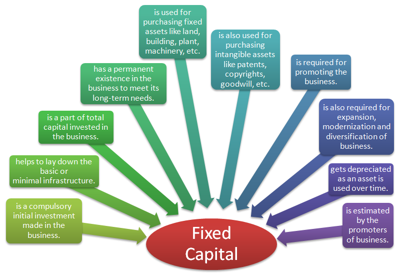

In the rapidly evolving world of finance, understanding the interplay between fixed capital, capital assets, financial requirements, and algorithmic trading is crucial for businesses aiming to enhance their strategic capabilities and efficiency. Fixed capital, often represented by long-term assets like machinery, buildings, and technology infrastructure, forms the backbone of a company's productive capacity. The role of capital assets extends beyond mere ownership; they are pivotal in sustaining and executing day-to-day business operations, fueling growth, and ensuring competitiveness in the marketplace.

Financial requirements associated with these assets, including acquisition costs, maintenance, and depreciation, dictate the financial planning and investment strategies businesses must adopt. These strategies ensure the optimization of resources while maintaining fiscal responsibility and aligning with broader business objectives.



Algorithmic trading, a domain characterized by the use of algorithms to execute trading orders at high speeds, relies heavily on this interplay. Advanced trading platforms, reliant on cutting-edge technology and robust infrastructure—components of fixed capital—are indispensable. The precision and efficiency of algorithmic trading systems are contingent upon well-structured financial strategies that consider the rapid depreciation of technology and the need for continual investment in updated resources.

This article explores how the synergy of these elements—fixed capital, capital assets, financial requirements, and algorithmic trading—affects business strategies and trading efficiency. Understanding these components provides a comprehensive view of their applications and implications, especially crucial for companies operating in algorithmic trading environments.

## Table of Contents

## Understanding Fixed Capital

Fixed capital refers to the portion of a company's total capital that is invested in physical assets that provide value over the long term. These assets often include property, plant, and equipment, essential components for maintaining and enhancing a firm’s productive capabilities. Understanding fixed capital is crucial for effective business finance management as it directly affects a company’s operational efficiency and capacity for growth.

The concept of fixed capital has evolved over time. Historically, it was viewed as the backbone of industrial enterprises, driving the large-scale production capabilities that fueled economic growth during the Industrial Revolution. As businesses expanded, so did the need for substantial investments in machinery, infrastructure, and real estate, giving fixed capital a central role in industrial finance. Over the years, the scope of fixed capital has broadened to include intangible assets like patents and trademarks, reflecting the increasing significance of intellectual property in modern economies.

Types of fixed assets typically classified under fixed capital encompass a range of tangible and intangible assets. Tangible assets primarily consist of long-term investments in physical resources such as property (land and buildings), plants (manufacturing facilities and assembly lines), and equipment (machinery and tools). These are essential for the production process and are characterized by their ability to provide ongoing economic benefits over several years.

In terms of their significance within business finance, fixed capital assets represent long-term investments that entail considerable initial expenditure but are vital for the generation of revenue over time. The procurement of these assets often requires strategic financial planning, given their substantial cost and the time needed to realize a return on investment. Businesses must manage these investments carefully to ensure they support operational objectives and deliver expected productivity gains.

One of the primary considerations when investing in fixed capital is the risk of obsolescence and depreciation, which can erode asset value over time and affect profitability. Companies must [factor](/wiki/factor-investing) in the depreciation schedules and maintenance costs of physical assets to sustain their functionality and market competitiveness. Additionally, efficient management of fixed capital is crucial for optimizing production efficiency and maximizing economies of scale.

In summary, fixed capital is integral to business finance, playing a pivotal role in enabling companies to maintain continuous operation and capacity for expansion. Investments in fixed assets such as property, plant, and equipment provide the necessary infrastructure to support ongoing production activities, driving long-term profitability and sustainability. As the economic landscape continues to evolve, so too does the strategic management of fixed capital, adapting to technological advancements and shifting market demands.

## Capital Assets and Their Financial Requirements

Capital assets are integral components of businesses, representing long-term assets that a company holds for generating revenue. These are tangible or intangible resources that play vital roles in business operations, including property, machinery, patents, and trademarks. Their primary function is to facilitate production and service delivery, thereby contributing to the organization's long-term economic value.

**Financial Requirements for Capital Assets**

Acquiring and maintaining capital assets involve significant financial commitments. The initial purchase costs can be substantial, often requiring careful financial planning and allocation of resources. Besides the upfront investment, companies must also consider ongoing expenses such as maintenance, upgrades, and depreciation management. The financial strategy for acquiring capital assets typically involves:

1. **Capital Budgeting:** This process involves evaluating potential large investments or expenses, assessing their expected benefits, and determining their alignment with business goals. It ensures that resources are allocated efficiently.

2. **Financing Options:** Businesses can finance capital assets through various means, including equity financing, debt financing, or leasing. Each option has its financial implications, influencing liquidity and financial stability.

3. **Depreciation Accounting:** Over time, capital assets decrease in value due to wear and tear. Businesses must account for this depreciation in their financial reports, which impacts tax obligations and profitability assessments.

**Differences and Relationships Between Fixed Capital and Working Capital**

Understanding the distinctions and connections between fixed capital and working capital is crucial for effective financial management. Fixed capital refers to the investments in long-term assets like capital assets, which are used to produce goods and services. These are not easily liquidated and require significant initial investment.

In contrast, working capital represents the funds needed for day-to-day operations, encompassing current assets such as cash, inventory, and receivables, minus current liabilities. It ensures that a company can maintain its operational [liquidity](/wiki/liquidity-risk-premium) and meet short-term obligations.

The relationship between fixed and working capital is vital for strategic financial planning. While fixed capital contributes to the operational infrastructure, adequate working capital ensures that the business can sustain operations without financial strain. A well-balanced approach between these two types of capital allows a company to invest in growth opportunities while maintaining financial stability.

**Conclusion**

Capital assets are essential for driving long-term business growth, while their acquisition and maintenance require careful financial planning. Distinguishing between fixed and working capital aids in crafting effective strategies that leverage both for achieving organizational objectives. Understanding these concepts helps businesses sustain operations, maximize productivity, and adapt to evolving financial landscapes.

## Role of Fixed Capital in Algorithmic Trading

In [algorithmic trading](/wiki/algorithmic-trading), fixed capital is essential for establishing and maintaining a robust trading infrastructure. This capital is primarily invested in acquiring and maintaining high-performance computers, advanced software, and network capabilities necessary for executing complex trading algorithms swiftly and efficiently. 

High-end computers, equipped with cutting-edge processors and substantial memory, are crucial for performing extensive data analyses and executing thousands of trades per second. These machines require significant fixed capital investment not only for initial acquisition but also for regular upgrades and maintenance. Similarly, sophisticated software packages, essential for developing and [backtesting](/wiki/backtesting) trading algorithms, represent a substantial portion of fixed capital. This software, often customized, needs regular updates that align with market changes and improvements in algorithmic strategies.

The financial requirements to acquire and maintain these capital assets are significant. A well-capitalized infrastructure enhances scalability, allowing trading systems to handle larger trading volumes and more intricate algorithmic strategies. Insufficient fixed capital can lead to bottlenecks in computational capacity, ultimately compromising trading speed and efficiency. Such limitations can result in missed market opportunities and reduced competitive edge.

Moreover, access to dedicated high-speed internet connections and secure data storage solutions are critical components requiring fixed capital investments. These elements ensure that trading strategies operate without interruption and data integrity is maintained. 

The scalability of an algorithmic trading system is heavily influenced by the financial strategies employed to manage these fixed capital resources. Adequate funding enables firms to expand their trading operations effectively, integrating new algorithms and expanding market coverage without compromising existing performance standards. In contrast, inadequate financial planning can impede growth, as limited resources may force firms to prioritize certain operations over others or delay expansion plans.

To quantify the required capital, consider a simple Python example for estimating computation power needs for algorithm execution:

```python
# Estimate computational power required for executing trading algorithms
num_algorithms = 100  # number of algorithms to execute
trades_per_second = 1000  # number of trades executed per second

# Estimate the total computational cycles needed
cycles_per_trade = 10000  # arbitrary number of computation cycles per trade
total_cycles = num_algorithms * trades_per_second * cycles_per_trade

# Conversion to gigaflops (billion floating point operations per second)
gigaflops_required = total_cycles / 1e9

print(f"Estimated Gigaflops Required: {gigaflops_required:.2f}")
```

This script offers a rudimentary approach to calculating the computational power required, serving as a guide for scaling trading systems efficiently. Ultimately, effective management of fixed capital in algorithmic trading involves strategic investments that support both current operational needs and future growth ambitions, ensuring operational integrity and competitive market positioning.

## Depreciation and Liquidity Concerns

Depreciation is a critical factor in fixed capital management, especially in trading environments where technology evolves rapidly. Depreciation refers to the reduction in value of capital assets over time due to wear and tear, obsolescence, or technological advancements. In the context of algorithmic trading, where high-performance computing equipment and sophisticated software are essential, depreciation can significantly affect the valuation and efficiency of these assets. For example, as technology advances, hardware and software may quickly become outdated, necessitating frequent upgrades to maintain competitive trading capabilities. This can lead to increased costs and complicate financial planning.

The impact of depreciation on fixed capital valuation is often measured through accounting methods such as straight-line or declining balance depreciation. In the straight-line method, an asset's cost is evenly spread over its useful life. Conversely, the declining balance method accelerates depreciation expenses early in the asset's life, which can be advantageous for tax purposes but may lead to higher apparent [volatility](/wiki/volatility-trading-strategies) in financial statements.

Liquidity concerns arise when capital assets are not easily convertible to cash. This can be problematic in a trading environment that may require rapid capital reallocation to seize market opportunities. Fixed assets like servers, data centers, and proprietary software purchases are often illiquid, which could hinder swift response to trading dynamics. Maintaining liquidity is crucial to ensure that sufficient funds are available to cover operational needs and invest in emergent technologies without incurring substantial debt.

To manage depreciation, companies can adopt strategies such as periodic upgrades and adopting leasing options instead of outright purchases. Leasing can offer flexibility and prevent significant upfront costs while keeping technology updated. Tax incentives can also be leveraged to offset some of the depreciation-associated financial burdens, potentially freeing up resources for investment in more liquid assets.

Improving liquidity can involve diversifying asset portfolios and incorporating more liquid instruments alongside fixed capital investments. This could involve balancing between long-term fixed assets and short-term assets that can be readily converted to cash. Utilizing advanced asset management software to predict and model market conditions can support more effective financial decision-making, ensuring that businesses neither suffer from excessive illiquidity nor overcommit to declining assets.

In summary, effectively managing depreciation and enhancing liquidity require strategic foresight in capital asset management, particularly in the highly dynamic environment of algorithmic trading. Balancing technological investments with financial flexibility ensures sustained operational efficiency and capital accessibility.

## Financial Strategy for Capital Asset Acquisition

When considering the acquisition of fixed capital assets, businesses must develop robust financial strategies that ensure both efficiency in funding and alignment with their long-term trading objectives. The importance of aligning asset acquisition with strategic goals cannot be overstated, as capital assets are not only essential for operational capabilities but also play a key role in a firm's competitive positioning.

### Strategies for Financing Fixed Capital Assets

1. **Leasing and Renting**: One approach to acquiring capital assets without a significant upfront investment is through leasing or renting. This strategy allows businesses to use high-cost assets, such as advanced computing systems necessary for algorithmic trading, without the burden of immediate full purchase costs. Leasing also offers flexibility, allowing firms to upgrade technology more frequently without incurring the full depreciation costs.

2. **Debt Financing**: By securing loans or issuing bonds, companies can finance their capital asset acquisitions while spreading the payment obligations over time. Debt financing can be particularly beneficial for acquiring assets that generate revenue, enabling the repayment of borrowed funds through the returns generated by these assets.

3. **Equity Financing**: Issuing stock is another method for raising funds needed for fixed capital investments. While this dilutes ownership, it does not encumber the company with regular debt repayments. Equity financing is particularly advantageous for firms that anticipate substantial future growth and returns from their investments.

4. **Government and Grant Programs**: In some industries, especially those involving technological innovation or infrastructure development, government grants and subsidy programs can provide significant financial support for capital asset acquisitions. These programs can offset costs and facilitate access to cutting-edge technologies required for sophisticated trading strategies.

### Aligning Asset Acquisition with Long-Term Trading Strategies

Aligning asset acquisition with long-term trading strategies involves assessing how new assets will enhance competitiveness, operational efficiency, and profitability. For algorithmic trading, this means ensuring that the high-performance computing systems and software solutions acquired are scalable and robust enough to process large volumes of transactions swiftly and accurately.

Businesses should evaluate whether their acquisitions support anticipated future trading volumes, regulatory changes, and market shifts. For instance, investing in scalable cloud infrastructure might align well with a trading strategy that anticipates rapid growth or increased data processing needs.

### Industry Variations in Financial Strategies

Different industries adopt varying financial strategies based on their unique environments and capital needs. In technology-intensive sectors like financial services, rapid obsolescence of technology influences shorter asset lifecycles, often favoring leasing over outright purchases for certain types of equipment.

In contrast, manufacturing industries may favor long-term investments in machinery and facilities, prioritizing debt financing to capitalize on lower interest rates. These sectors often have a longer asset depreciation period, which can be aligned with their stable production and revenue-generating timelines.

Each industry’s strategy for acquiring fixed capital assets reflects its operational requirements, technological evolution, and economic conditions. For instance, the healthcare industry, which relies heavily on state-of-the-art medical equipment, often employs a combination of leasing and government grants to optimize both cost and technological currency.

In conclusion, efficient financial strategies for capital asset acquisition require careful consideration of the acquisition method, alignment with strategic goals, and sector-specific practices. The chosen approach should not only facilitate immediate operational needs but also support sustainable growth and adaptability to future market demands.

## Common Mistakes in Managing Fixed Capital in Algo Trading

Managing fixed capital in algorithmic trading involves various challenges that, if not handled correctly, can lead to inefficiencies and financial losses. One significant pitfall is over-optimization of trading algorithms. Over-optimization, or curve-fitting, occurs when a trading algorithm is excessively fine-tuned to historical data, leading to models that perform well in simulations but fail in live markets. This happens because the model captures noise instead of legitimate market patterns. For example, an algorithm that consistently performed well during backtesting might fail when exposed to new market conditions or when transaction costs and slippage are not accurately accounted for.

Another common error is inadequate monitoring of trading systems. Once a system is deployed, continuous observation and adjustment are crucial. Neglecting system performance and not adapting to evolving market conditions can result in significant financial setbacks. For instance, a trading algorithm might initially generate profits but could turn unprofitable if market dynamics shift and the algorithm criteria remain unchanged.

Real-world cases illustrate these issues vividly. Several hedge funds and trading firms have reported losses due to rigid adherence to outdated models or failure to update systems in response to technological and market innovations. Mismanagement of fixed capital often underpins such inefficiencies, as insufficient investment in infrastructure can lead to slower processing times and increased error rates, undermining competitive advantage.

To mitigate these pitfalls, traders should adopt certain best practices. Regular model validation is crucial; algorithms should be tested periodically with out-of-sample data to ensure adaptability to current market conditions. Investment in robust monitoring systems is essential to catch and correct deviations quickly. Moreover, incorporating transaction costs and slippage into modeling helps create algorithms that are not merely theoretical but viable for actual trading conditions.

Furthermore, diversification of algorithmic strategies can reduce the risk associated with over-dependence on a single model. This might involve deploying multiple algorithms that capitalize on different market inefficiencies. Another preventative measure is ensuring that there is a dedicated team or automated system to track and update algorithms as market conditions evolve.

Implementing these strategies can assist in maintaining the efficacy of algorithmic trading systems and ensuring that fixed capital investments boost rather than hinder performance.

## The Future of Fixed Capital in Algorithmic Trading

Algorithmic trading continues to evolve, with emerging trends changing the landscape of fixed capital investments. The ongoing integration of advanced technologies is reshaping capital asset requirements, leading to significant changes in financial strategies associated with both fixed and working capital.

One prominent trend influencing fixed capital investment is the rise of [machine learning](/wiki/machine-learning) and [artificial intelligence](/wiki/ai-artificial-intelligence). These technologies necessitate investments in high-performance computing infrastructure, including GPUs and TPUs, which offer enhanced processing capabilities for complex algorithms. Consequently, traditional fixed capital assets such as standard server setups are being supplemented or replaced by more specialized, high-tech equipment. As a result, firms involved in algorithmic trading are reallocating resources towards these high-end computational assets to maintain competitive edges.

Cloud computing is another trend reshaping fixed capital requirements. It is increasingly being adopted to mitigate the high upfront costs associated with purchasing and maintaining physical infrastructure. The flexibility offered by cloud-based solutions, such as scalability and reduced downtime, aligns well with the dynamic nature of trading environments. Companies are transitioning from fixed capital investments in on-premises equipment to scalable, operational expenses associated with cloud services.

Furthermore, the advancement of blockchain technology and [cryptocurrency](/wiki/cryptocurrency) markets necessitates new types of capital assets. Trading platforms are being upgraded to handle these digital assets, requiring robust, secure, and flexible infrastructures capable of supporting novel trading algorithms. This shift further emphasizes the need for updated technological investments in existing fixed capital frameworks.

Predicting future shifts in financial strategies, there will likely be a continuous blending of fixed and working capital allocations. As technology continues to advance, the line between these two types of capital may blur. For example, the adoption of Software as a Service (SaaS) models for trading platforms allows firms to convert what was traditionally a fixed capital expense into a more flexible, operational expenditure. This transition offers liquidity advantages and reduces the financial burden associated with large, upfront capital outlays.

Finally, the sustainability movement is impacting future capital asset strategies. There is a growing emphasis on energy-efficient technologies and green computing, as firms strive to reduce their carbon footprints. Investments in sustainable solutions not only contribute to environmental goals but also result in long-term financial benefits through reduced energy costs.

In conclusion, the future of fixed capital in algorithmic trading will be shaped by technological advancements and evolving market demands. Companies must remain adaptable, leveraging new technologies to optimize capital investments while aligning with financial strategies that offer flexibility and sustainability.

## Conclusion

Fixed capital and capital assets play a crucial role in the financial planning of algorithmic trading. These components provide the necessary infrastructure and tools required for the execution of sophisticated trading algorithms. Fixed capital, encompassing physical assets like computers and networks, is indispensable for setting up and maintaining the high-speed, reliable environments needed for efficient trading. Capital assets, including software and proprietary trading algorithms, serve as the backbone for executing complex strategies and require continuous financial investment and maintenance.

A balanced approach in managing financial requirements and capital investments is essential for sustaining competitive advantage in algorithmic trading. Striking the right balance ensures that resources are efficiently allocated between fixed capital and other financial needs, fostering both operational capability and strategic flexibility. This involves not only acquiring the right mix of capital assets but also ensuring their effective utilization over time. 

Moreover, the dynamic nature of financial markets necessitates ongoing education and strategic adjustments. As technology evolves and market conditions fluctuate, businesses must remain agile, adapting their financial strategies to keep pace with changes. This requires a proactive stance towards learning and innovation, as well as regular reassessment of asset allocations and financial commitments. Embracing these principles will help businesses optimize their use of fixed capital and capital assets, ultimately enhancing trading performance and profitability.

## References & Further Reading

[1]: Dacorogna, M. M., Gencay, R., Muller, U. A., Pictet, O. V., & Olsen, R. B. (2001). ["An Introduction to High-Frequency Finance"](https://archive.org/details/an-introduction-to-high-frequency-finance). 

[2]: Hasbrouck, J. (2007). ["Empirical Market Microstructure: The Institutions, Economics, and Econometrics of Securities Trading"](https://academic.oup.com/book/52241). 

[3]: Narang, R. K. (2009). ["Inside the Black Box: The Simple Truth About Quantitative Trading"](https://onlinelibrary.wiley.com/doi/book/10.1002/9781118267738). 

[4]: Kissell, R. (2013). ["The Science of Algorithmic Trading and Portfolio Management"](https://www.sciencedirect.com/book/9780124016897/the-science-of-algorithmic-trading-and-portfolio-management). 

[5]: Aldridge, I. (2010). ["High-Frequency Trading: A Practical Guide to Algorithmic Strategies and Trading Systems"](https://www.amazon.com/High-Frequency-Trading-Practical-Algorithmic-Strategies/dp/1118343506).