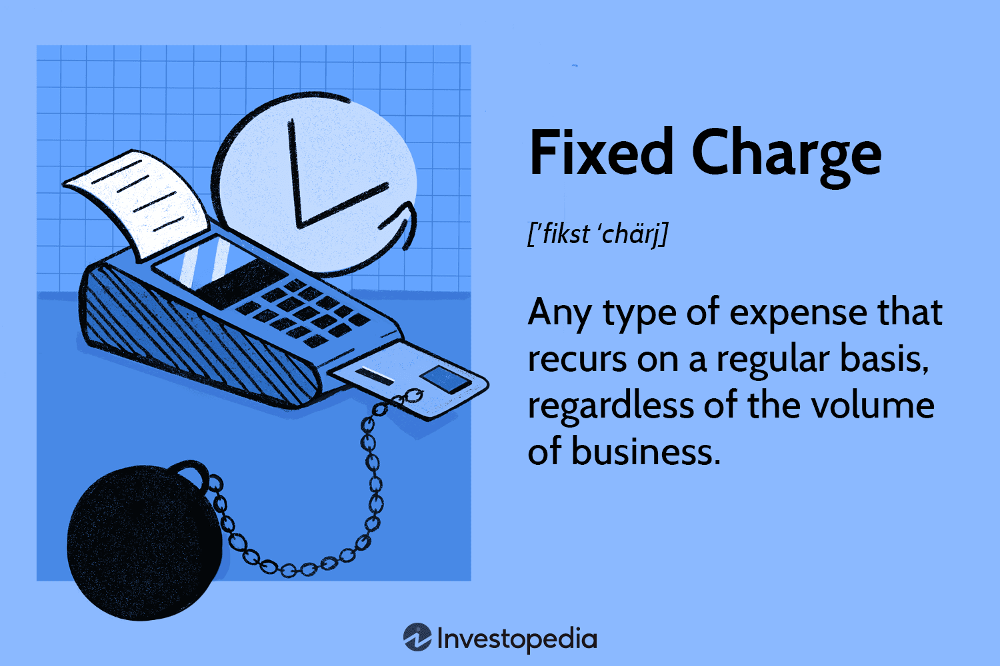

Fixed charges are a fundamental concept in corporate finance, denoting recurring expenses a company incurs regardless of business volume. These charges are pivotal in understanding a company's financial obligations and overall health, especially when assessed through financial ratios like the Fixed Charge Coverage Ratio (FCCR). In the context of algorithmic trading, understanding and evaluating fixed charges through FCCR can provide critical insights for investors and traders, helping analyze the stability and risk profile of potential investments.

Financial ratios such as FCCR are instrumental in assessing a company's capability to meet its fixed financial obligations without compromising operational activities. The FCCR is calculated using the formula:

$$
\text{FCCR} = \frac{\text{EBIT} + \text{Fixed Charges Before Tax}}{\text{Fixed Charges Before Tax} + \text{Interest Expenses}}
$$

where EBIT stands for Earnings Before Interest and Taxes. This ratio is crucial for evaluating whether a company generates sufficient earnings to cover its fixed charges and interest expenses.

From an investor's perspective, a robust FCCR can enhance confidence, signaling that a company is well-positioned to manage its financial responsibilities even during periods of fiscal adversity. Similarly, lenders utilize FCCR as a key metric in assessing creditworthiness, influencing their willingness to offer favorable terms and interest rates. A company with a high FCCR is generally viewed as a lower risk, potentially paving the way for smoother financial operations and strategic initiatives.

In the high-frequency environment of algorithmic trading, the FCCR plays a significant role in constructing trading models that factor in company stability and risk assessment. Traders and analysts leverage this ratio to identify firms that are more likely to sustain financial shocks, ensuring that their trading strategies remain grounded and adjusted for risk. This underscores the FCCR's importance not just as a static measure of financial health but as a dynamic instrument in enhancing decision-making processes concerning investment and resource allocation.

## Table of Contents

## Understanding Fixed Charges in Corporate Finance

Fixed charges are recurring expenses that a firm must meet regardless of its business [volume](/wiki/volume-trading-strategy). These expenses are obligatory and must be paid regardless of the level of income generated by the company. This consistent financial obligation makes fixed charges a critical component of a company's financial structure and strategic planning. 

Examples of fixed charges include:

- **Loans and Interest Payments**: These are the costs associated with borrowing funds, including regular interest payments. Regardless of the company's profit levels or market conditions, these payments are due on their specified terms.
- **Lease Payments**: Many companies enter into leasing agreements for property, equipment, or vehicles. Lease payments, whether for real estate or machinery, represent a recurring expense that is fixed over the term of the lease.
- **Insurance Premiums**: Companies typically need to carry various types of insurance (e.g., property, liability, health) as a part of risk management strategies. These premiums must be paid regularly to maintain coverage.
- **Utility Bills**: Essential services such as electricity, water, and gas are necessary for the operation of any business and often billed periodically, presenting another fixed charge.

The impact of fixed charges on a company's financial planning and stability is significant. Fixed charges necessitate careful cash flow management to ensure that these obligations are met promptly. Failing to meet fixed charge obligations can lead to legal complications, loss of assets, or credibility issues with lenders and investors.

In strategic planning, companies must assess their capability to manage fixed charges across various economic cycles. High fixed charges relative to income can pose a risk, especially when revenues are volatile or declining. Therefore, maintaining a balance between fixed and variable costs is crucial for sustaining financial health. Companies often calculate their Fixed Charge Coverage Ratio (FCCR) to evaluate their ability to cover these obligations and to plan for future financial strategy.

## Fixed Charge Coverage Ratio (FCCR)

The Fixed Charge Coverage Ratio (FCCR) is an essential financial metric used to evaluate a company's ability to meet its fixed financial obligations with its earnings. The formula for calculating FCCR is given by:

$$
\text{FCCR} = \frac{\text{EBIT} + \text{Fixed Charges Before Tax}}{\text{Fixed Charges Before Tax} + \text{Interest Expenses}}
$$

### Components of FCCR

1. **EBIT (Earnings Before Interest and Taxes):** This is a measure of a company's profitability that excludes interest and income tax expenses. It represents the earnings generated from regular business operations before deducting interest payments and tax liabilities. EBIT is a crucial component in the FCCR calculation as it reflects the company's core operational performance and its ability to generate sufficient earnings to cover fixed charges and interest expenses.

2. **Fixed Charges Before Tax:** These are recurring financial commitments that a company is obligated to pay, regardless of its revenue levels. They typically include lease payments, insurance premiums, and other similar obligations that are incurred in the normal course of business. They represent the part of the expenses that do not vary with the volume of business operations, making them key determinants in assessing financial risk.

3. **Interest Expenses:** This component consists of all interest payments a company is required to make on its outstanding debts. Since interest is a direct cost of borrowing, it needs to be considered alongside other fixed charges to provide a comprehensive picture of the financial commitments a company faces.

### Importance of FCCR

The FCCR is a critical measure for assessing a company's financial strength and stability. It indicates how well a company can cover its fixed financial obligations using its earnings before interest and taxes. A higher FCCR suggests that a company generates sufficient earnings relative to its fixed charges and interest expenses, demonstrating financial resilience.

Investors and lenders frequently use FCCR as a benchmark to evaluate the creditworthiness and investment potential of a business. A robust FCCR points towards a lower risk of default, thereby maintaining investor confidence and lender trust. For companies, maintaining a healthy FCCR is vital for achieving beneficial terms with creditors and upholding a favorable credit rating. 

By providing insight into a company's capacity to manage its financial obligations, the FCCR is an invaluable tool in the assessment of long-term financial health and operational efficiency.

## Calculating FCCR: A Step-by-Step Guide

To calculate the Fixed Charge Coverage Ratio (FCCR), a detailed understanding of the components involved is essential. This financial metric assesses a company's ability to cover its fixed financial obligations, which are crucial for maintaining financial stability and achieving strategic goals. Here is a step-by-step guide on how to calculate FCCR using financial data typically found in a company's income statement.

### Step-by-Step Guide to Calculating FCCR

1. **Identify the Necessary Financial Data**: 
   - **EBIT (Earnings Before Interest and Taxes)**: This is a measure of a firm's profit that includes all incomes and expenses except interest and income tax expenses.
   - **Fixed Charges Before Tax**: These include all recurring fixed financial obligations such as lease payments and principal repayments that do not change with the company's activity level. 
   - **Interest Expenses**: The cost incurred by an entity for borrowed funds.

2. **Use the FCCR Formula**:
   The Fixed Charge Coverage Ratio is calculated using the following formula:
$$
   \text{FCCR} = \frac{\text{EBIT} + \text{Fixed Charges Before Tax}}{\text{Fixed Charges Before Tax} + \text{Interest Expenses}}

$$

3. **Example Calculation**:
   Suppose a company has the following financial statement data:
   - **EBIT**: $500,000
   - **Fixed Charges Before Tax**: $100,000
   - **Interest Expenses**: $50,000

   Plug these values into the FCCR formula:
$$
   \text{FCCR} = \frac{500,000 + 100,000}{100,000 + 50,000} = \frac{600,000}{150,000} = 4.0

$$

   This means the company can cover its fixed charges 4 times with its available earnings before interest and taxes.

### Common Pitfalls and How to Avoid Them

- **Exclusion of Relevant Fixed Charges**: Ensure that all fixed charges, excluding variable costs, are accurately included in the calculation. Missing these can overestimate the company's coverage capability.

- **Using Incorrect EBIT Data**: Ensure EBIT is correctly calculated and does not include non-recurring gains or losses that do not reflect the company's regular operational earnings potential. 

- **Neglecting Timeliness of Data**: Financial data should be current. Outdated data can lead to misleading FCCR calculations, especially in volatile or rapidly changing markets.

- **Misinterpretation of the Ratio**: An FCCR below 1 indicates that the company’s earnings are not sufficient to fully cover its fixed charges and interest, suggesting financial strain. A higher FCCR indicates stronger coverage, but it's important to compare this ratio with industry benchmarks for an accurate assessment.

By following these steps and being mindful of potential errors, financial analysts and corporate finance professionals can derive meaningful insights from the FCCR, enabling better financial decision-making.

## Significance of FCCR in Algorithmic Trading

Fixed Charge Coverage Ratio (FCCR) plays a crucial role in [algorithmic trading](/wiki/algorithmic-trading) by serving as a key indicator of a company's financial stability. FCCR quantifies a firm's ability to meet its fixed financial obligations such as loans and leases, providing insight into its long-term viability. In algorithmic trading, a higher FCCR suggests a stronger capacity to sustain financial commitments, making it a valuable tool for identifying companies that can endure economic fluctuations.

Algorithmic models integrate FCCR to systematically evaluate and select stocks or other financial instruments. By processing FCCR alongside other financial metrics, these models can automatically execute trades based on predefined stability criteria. For instance, during periods of market [volatility](/wiki/volatility-trading-strategies), companies with higher FCCRs are often considered safer investments due to their proven ability to cover fixed obligations, even when cash flow is under pressure.

The application of FCCR in risk management is another key advantage. By incorporating FCCR as a screening criterion, trading algorithms can minimize exposure to firms with poor financial health, thereby reducing the risk of losses. This criterion aids in the construction of a robust portfolio by favoring entities that exhibit financial prudence and resilience.

Furthermore, FCCR contributes to optimizing trading strategies by providing a quantitative basis for decision-making. Algorithms can be programmed to [factor](/wiki/factor-investing) in FCCR with other trends and data points to enhance predictive accuracy and improve the timing of trades. For example, a trading strategy might prioritize companies with an FCCR above a certain threshold, ensuring that only financially sound entities are included in the trading portfolio.

In summary, FCCR is a vital metric in algorithmic trading, offering traders an efficient method to gauge financial stability and incorporate that analysis into automated trading strategies. Its integration into trading models enhances decision-making and risk management, ultimately leading to more informed and potentially profitable trading activities.

## Real-World Applications and Examples

Fixed Charge Coverage Ratio (FCCR) serves as a vital tool in corporate finance, especially when evaluating the financial health and creditworthiness of companies. Companies across various sectors use FCCR to assess their ability to meet fixed financial obligations, guiding both corporate decision-making and investment strategies.

A prominent example is the use of FCCR by retail giants to manage their extensive lease liabilities. Retail companies often operate numerous outlets, consequently bearing significant lease expenses classified as fixed charges. By maintaining a healthy FCCR, these companies ensure their capability to sustain lease payments even amidst fluctuating revenues. For instance, companies like Walmart and Target analyze their FCCR regularly to maintain operational stability and engage in strategic expansion without overleveraging.

Financial institutions also leverage FCCR to gauge the risk associated with corporate clients. Before extending loans, banks scrutinize a company's FCCR to ascertain its capacity to service debt under different economic conditions. A higher FCCR signifies lower risk, rendering the company a more attractive candidate for lending. This scrutiny aids banks in minimizing default risks and optimizing their loan portfolios.

Additionally, real estate firms heavily rely on FCCR for evaluating the feasibility of new property acquisitions. With substantial financial commitments tied to property purchases and developments, real estate firms use this ratio to ensure sufficient cash flow to cover mortgage payments, property taxes, and insurance premiums. A robust FCCR offers confidence to investors and potential partners regarding the firm's financial health and prudence.

Case studies exemplify the strategic significance of FCCR. For instance, during the 2008 financial crisis, companies with strong FCCRs were better positioned to weather economic downturns, as they maintained enough [liquidity](/wiki/liquidity-risk-premium) to meet fixed obligations despite diminished revenues. On the contrary, entities with weaker ratios often struggled, leading to renegotiations with creditors or even bankruptcy.

Lenders and investors use FCCR to assess investment opportunities by measuring a firm's financial robustness over time. A consistent FCCR indicates a stable earnings pattern and effective financial management, attracting investors seeking reliable returns. This ratio's predictive insight helps investors differentiate between fundamentally sound companies and those prone to financial distress, particularly in volatile market environments.

The FCCR proves indispensable not only in evaluating a company's current financial standing but also in anticipating future financial challenges. By integrating FCCR into financial assessments, companies across industries enhance strategic planning, ensure operational continuity, and maintain investor trust.

## Limitations of FCCR

The Fixed Charge Coverage Ratio (FCCR) is a valuable tool for assessing a company's ability to fulfill its fixed financial obligations. However, it has certain limitations that analysts and traders must be mindful of. One main limitation is its focus on fixed charges while excluding variable costs. Fixed charges include expenses such as lease payments and interest expenses, which remain constant regardless of business activity levels. In contrast, variable costs fluctuate with production volumes or sales, and excluding these can provide an incomplete picture of a company’s financial health.

A significant concern when using FCCR is its reliance on historical data, which may not always be indicative of future performance. Historical financial data can sometimes fail to capture recent or upcoming changes in market conditions, cost structures, or revenue patterns that could impact a company's ability to meet its fixed charges. Consequently, this reliance could result in less accurate predictions of a firm’s financial stability.

To gain a more comprehensive view of a company's financial standing, FCCR should be used alongside other financial ratios and metrics. Measures like the Debt Service Coverage Ratio (DSCR) and the Current Ratio can provide additional insights into a company's liquidity and ability to service debt. The DSCR, for instance, considers the cash available to meet all debt obligations, both principal and interest, offering a broader perspective on a company's debt management capabilities. The Current Ratio, which assesses a company's ability to pay short-term obligations with short-term assets, can signal potential liquidity issues not captured by FCCR.

By combining FCCR with these complementary ratios, financial analysts can achieve a more nuanced and accurate assessment of a firm's financial strength, facilitating better-informed decision-making regarding investments or lending.

## Conclusion

Fixed charges and the Fixed Charge Coverage Ratio (FCCR) play crucial roles in corporate finance and algorithmic trading by providing a framework for evaluating a company's financial health and operational stability. Understanding fixed charges, which are recurring expenses like loans, lease payments, insurance, and utility bills, is fundamental for assessing a company's financial obligations regardless of its business volume. The FCCR offers further insights by quantifying the company's ability to meet these fixed obligations, calculated using the formula:

$$
\text{FCCR} = \frac{\text{EBIT} + \text{Fixed Charges Before Tax}}{\text{Fixed Charges Before Tax} + \text{Interest Expenses}}
$$

For financial analysts and traders, an effective application of FCCR involves thoroughly examining the components like Earnings Before Interest and Taxes (EBIT) and fixed charges to determine a company's financial resilience. Recognizing the significance of FCCR in algorithmic trading, strategies can be optimized by integrating this ratio to identify financially sound companies during market shifts and manage risks effectively. FCCR's ability to indicate the financial robustness of a company can help traders and investors make informed decisions, even in volatile market conditions.

Encouraging further analysis of FCCR alongside other financial metrics enriches the comprehensive understanding needed for nuanced financial strategies. While FCCR provides invaluable insights, adding complementary ratios and metrics allows analysts to overcome its limitations, such as the exclusion of variable costs and reliance on historical data. This integrated approach ensures a balanced evaluation, facilitating robust investment and trading decisions. Engaging with FCCR in this multifaceted manner enhances its utility, making it a vital tool in the toolkit of financial analysis and strategic planning.

## References & Further Reading

1. Higgins, Robert C. "Analysis for Financial Management." This book provides an in-depth exploration of key financial concepts, including fixed charges and ratios used for assessing financial health.

2. Ross, Stephen A., Randolph W. Westerfield, and Bradford D. Jordan. "Fundamentals of Corporate Finance." A comprehensive textbook covering various aspects of corporate finance, including the significance of fixed charges.

3. Bragg, Steven M. "Business Ratios and Formulas: A Comprehensive Guide." This book offers detailed explanations and formulas for numerous financial ratios, including the Fixed Charge Coverage Ratio (FCCR).

4. DePamphilis, Donald. "Mergers, Acquisitions, and Other Restructuring Activities." A useful resource for understanding the role of financial metrics such as FCCR in strategic financial decision-making.

5. Rappaport, Alfred. "Creating Shareholder Value: A Guide for Managers and Investors." This text discusses methods and strategies for evaluating and enhancing a company's financial health using various financial measures.

6. "Financial Ratios: A Guide to Calculations and Their Uses" - Harvard Business Review. This online resource provides an understanding of essential financial ratios, including FCCR, and their applications in assessing company performance.

7. "Fixed Charge Coverage Ratio" - Investopedia. An online resource offering a clear explanation of FCCR, its calculation, and implications for financial analysis.

8. Malliaris, A.G., and William A. Brock. "Stochastic Methods in Economics and Finance." This academic paper explores quantitative methods in finance, including the integration of various financial ratios into algorithmic trading models.

9. "Algorithmic Trading and the Fixed Charge Coverage Ratio" – An academic paper featuring case studies and theoretical applications of FCCR in algorithmic trading strategies.

These resources provide a solid foundation for further understanding fixed charges, the Fixed Charge Coverage Ratio, and their application in financial analysis and strategy.

